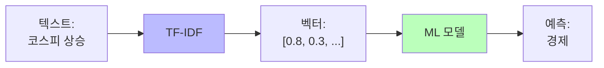
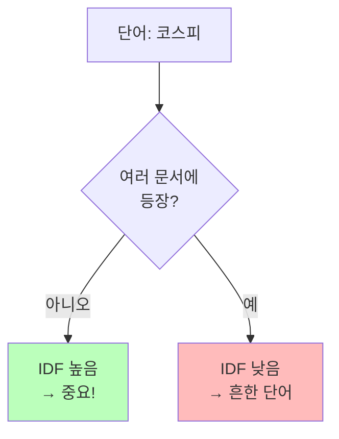
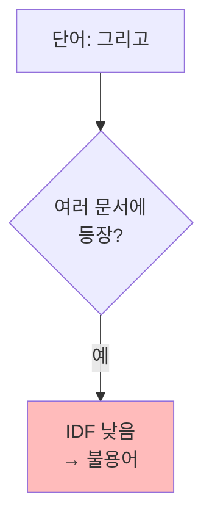
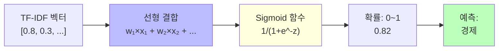
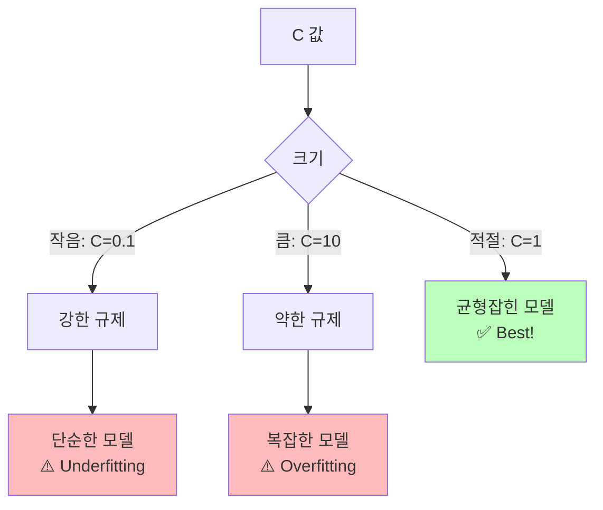
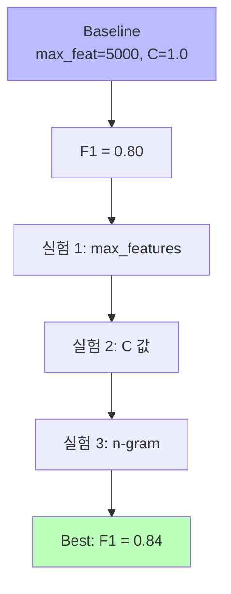
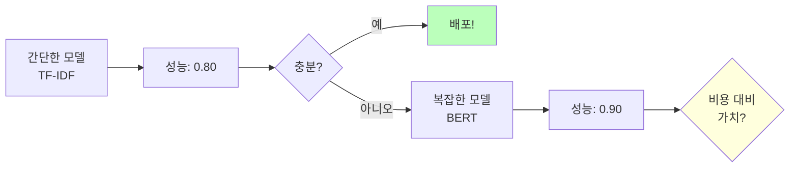

# Day 1-2: TF-IDF와 텍스트 분류

딥러닝 부트캠프 - 텍스트를 숫자로 변환하기

<div class="pt-12">
  <span @click="$slidev.nav.next" class="px-2 py-1 rounded cursor-pointer" hover="bg-white bg-opacity-10">
    시작하기 <carbon:arrow-right class="inline"/>
  </span>
</div>

---
layout: default
---

# 학습 목표

<v-clicks>

- 🔢 **텍스트를 숫자로**: TF-IDF 벡터화 이해
- 🤖 **머신러닝 분류기**: Logistic Regression 학습
- 📊 **평가 지표**: F1-Score의 중요성
- ⚙️ **하이퍼파라미터**: max_features, C, n-gram 조정
- 🔬 **체계적 실험**: MLflow로 실험 관리

</v-clicks>

<div class="abs-br m-6 flex gap-2">
  <span>시간: 1.5시간</span>
</div>

---
layout: two-cols
---

# 왜 텍스트를 숫자로?

컴퓨터는 텍스트를 직접 이해하지 못합니다

```python
# 컴퓨터가 보는 것
text = "코스피 상승"
# → 그냥 문자열

# 머신러닝 모델이 필요한 것
vector = [0.8, 0.3, 0.1, ...]
# → 숫자 배열
```

::right::

<div class="mt-20">



</div>

---

# Bag-of-Words (BoW)

가장 단순한 방법: 단어 등장 횟수 세기

<div class="grid grid-cols-2 gap-4">

<div>

**문장들**
```
1. "코스피 상승"
2. "코스피 하락"
3. "환율 상승"
```

**단어 사전**
```
[코스피, 상승, 하락, 환율]
```

</div>

<div>

**벡터 표현**
```python
문장 1: [1, 1, 0, 0]
        # 코스피 1번, 상승 1번

문장 2: [1, 0, 1, 0]
        # 코스피 1번, 하락 1번

문장 3: [0, 1, 0, 1]
        # 상승 1번, 환율 1번
```

</div>

</div>

<v-click>

<div class="text-red-500 mt-4">
❌ 문제점: 모든 단어를 동등하게 취급
</div>

</v-click>

---
layout: center
class: text-center
---

# TF-IDF
## Term Frequency - Inverse Document Frequency

중요한 단어에 가중치를 부여하자!

---

# TF-IDF 수식

<div class="grid grid-cols-2 gap-8 mt-10">

<div>

### TF (Term Frequency)
문서 내 단어 빈도

$$
TF = \frac{\text{단어 등장 횟수}}{\text{문서의 전체 단어 수}}
$$

<v-click>

### IDF (Inverse Document Frequency)
단어의 희귀성

$$
IDF = \log\left(\frac{\text{전체 문서 수}}{\text{단어가 등장한 문서 수}}\right)
$$

</v-click>

</div>

<div>

<v-click>

### TF-IDF
두 값의 곱

$$
\text{TF-IDF} = TF \times IDF
$$

</v-click>

<v-click>

### 💡 직관적 이해
- **문서 내에서 자주** 등장 (TF ↑)
- **다른 문서에는 잘 안** 나타남 (IDF ↑)
- → **중요한 단어!**

</v-click>

</div>

</div>

---

# TF-IDF 예시

<div class="grid grid-cols-2 gap-4">

<div>



</div>

<div>



</div>

</div>

<v-clicks>

**예시 계산**:
- "코스피" : 경제 뉴스에만 등장 → **높은 TF-IDF**
- "그리고" : 모든 뉴스에 등장 → **낮은 TF-IDF**

</v-clicks>

---

# Character n-gram: 한국어의 비밀 무기

<div class="grid grid-cols-2 gap-4">

<div>

### 문제: 한국어는 교착어

```
"경제가"
"경제는"  
"경제의"
```

<v-click>

→ Word-level에서는 **모두 다른 단어**

</v-click>

</div>

<div>

<v-click>

### 해결책: Character n-gram

```python
"코스피" → [
  "코",      # 1-gram
  "스",
  "피",
  "코스",    # 2-gram
  "스피",
  "코스피"   # 3-gram
]
```

</v-click>

</div>

</div>

<v-clicks>

### ✅ 장점
- 띄어쓰기 오류에 **강건**
- 미등록 단어(OOV) 문제 **완화**
- 형태소 분석기 **불필요**

</v-clicks>

---
layout: center
class: text-center
---

# Logistic Regression
## 확률 기반 분류 모델

---

# Logistic Regression 원리



<v-clicks>

**Multi-class (7개 토픽)**:
- 각 토픽마다 **별도의 가중치**
- **Softmax** 함수로 확률 변환
- **가장 높은** 확률의 토픽 선택

</v-clicks>

---

# Regularization: C 파라미터

<div class="text-center mt-10">



</div>

---

# 실험 전략

<v-clicks>

1. **Baseline**: C=1.0으로 시작
2. **실험 1**: C=0.1 시도 → Underfitting 확인
3. **실험 2**: C=10.0 시도 → Overfitting 확인
4. **최적값 탐색**: 성능이 가장 좋은 값 찾기

</v-clicks>

<v-click>

<div class="mt-8 p-4 bg-blue-100 rounded">

💡 **핵심**: 한 번에 하나씩 변경하며 체계적으로 실험!

</div>

</v-click>

---
layout: center
class: text-center
---

# 평가 지표
## Accuracy는 충분하지 않다

---

# Accuracy의 함정

<div class="grid grid-cols-2 gap-8">

<div>

### 예시 상황

```
데이터:
- 정치: 90%
- 경제: 10%

모델 전략:
무조건 "정치"라고 예측
```

<v-click>

**결과**:
```
Accuracy = 90%
```

**하지만...**
- 경제 뉴스는 **전혀 못 맞춤** 😱
- 쓸모없는 모델!

</v-click>

</div>

<div>

<v-click>

### 해결책: F1-Score

Precision과 Recall의 조화 평균

$$
F1 = 2 \times \frac{P \times R}{P + R}
$$

- **Precision**: 예측한 것 중 맞춘 비율
- **Recall**: 실제 것 중 찾아낸 비율

</v-click>

</div>

</div>

---

# Precision, Recall, F1-Score

### 예시: "경제" 토픽 분류

<div class="grid grid-cols-2 gap-4 mt-4">

<div>

```
실제 경제: 100개
모델이 경제라고 예측: 120개
실제로 경제가 맞는 것: 80개
```

<v-click>

**Precision (정밀도)**
$$
P = \frac{80}{120} = 0.67
$$
예측한 것 중 맞춘 비율

</v-click>

</div>

<div>

<v-click>

**Recall (재현율)**
$$
R = \frac{80}{100} = 0.80
$$
실제 것 중 찾아낸 비율

</v-click>

<v-click>

**F1-Score**
$$
F1 = 2 \times \frac{0.67 \times 0.80}{0.67 + 0.80} = 0.73
$$

</v-click>

</div>

</div>

---

# Macro F1 vs Weighted F1

<div class="grid grid-cols-2 gap-8 mt-8">

<div>

### Macro F1
각 클래스의 F1을 **단순 평균**

$$
\frac{F1_0 + F1_1 + ... + F1_6}{7}
$$

<v-click>

**특징**:
- 모든 토픽을 **동등하게** 평가
- 소수 클래스 성능도 **중요**

</v-click>

</div>

<div>

<v-click>

### Weighted F1
클래스 개수에 비례하여 **가중평균**

$$
\frac{n_0 \times F1_0 + ... + n_6 \times F1_6}{n_0 + ... + n_6}
$$

**특징**:
- 많은 데이터 가진 클래스에 **큰 비중**

</v-click>

</div>

</div>

<v-click>

<div class="mt-8 p-4 bg-green-100 rounded">

✅ **이 과제**: Macro F1 사용 → 모든 토픽 공평하게 평가

</div>

</v-click>

---
layout: center
class: text-center
---

# 체계적 실험 관리
## MLflow의 필요성

---

# 실험 관리가 없다면?

<div class="text-red-500 text-xl mt-10">

```
실험 1: F1 = 0.82 (어떤 설정이었지...? 🤔)
실험 2: F1 = 0.85 (뭘 바꿨더라...? 😰)
실험 3: F1 = 0.79 (왜 떨어졌지...? 😱)
```

</div>

<v-click>

<div class="mt-10 p-4 bg-blue-100 rounded">

### 문제점
- 어떤 설정이 좋았는지 **기억 안 남**
- 재현 **불가능**
- 팀원과 **공유 어려움**

</div>

</v-click>

---

# MLflow: 모든 실험을 기록하자

```python {all|2-3|4-5|6|all}
with mlflow.start_run(run_name="exp1-maxfeat5000-C1.0"):
    # 파라미터 기록
    mlflow.log_param('max_features', 5000)
    mlflow.log_param('C', 1.0)
    mlflow.log_param('ngram_range', '(1,1)')
    
    # 성능 지표 기록
    mlflow.log_metric('val_f1_macro', 0.85)
    mlflow.log_metric('val_accuracy', 0.87)
    
    # 파일 기록 (혼동 행렬 등)
    mlflow.log_artifact('confusion_matrix.png')
```

<v-click>

### ✅ 장점
- 모든 실험이 **Dagshub**에 자동 저장
- **재현 가능**
- **비교 용이** (UI 제공)

</v-click>

---

# 하이퍼파라미터 탐색 전략



---

# 실험 전략: 체계적 접근

<v-clicks>

### 💡 핵심 원칙
**한 번에 하나씩** 변경!

### 📋 실험 순서

1. **Baseline**: 기본 설정 (max_feat=5000, C=1.0) → F1 = 0.80
2. **실험 1**: max_features만 변경 (3000, 10000)
3. **실험 2**: C 값만 변경 (0.1, 10.0)
4. **실험 3**: n-gram 변경 ((1,2), (2,3))
5. **결합**: 최적 조합 찾기 → F1 = 0.84

</v-clicks>

---
layout: two-cols
---

# 베이스라인의 중요성



::right::

<v-clicks>

### 베이스라인의 역할

1. **빠른 검증**
   - 문제 해결 가능성 확인

2. **비교 기준**
   - BERT 성능 측정

3. **디버깅 도구**
   - 데이터 문제 조기 발견

4. **실용성**
   - 때로는 충분!

</v-clicks>

---

# TF-IDF vs BERT 비교

| 특성 | TF-IDF | BERT |
|------|--------|------|
| 학습 시간 | ~1분 ⚡ | ~10분 🐢 |
| 추론 속도 | 매우 빠름 ⚡⚡ | 느림 🐢 |
| GPU 필요 | ❌ | ✅ |
| 성능 (F1) | ~0.80 | ~0.90 |
| 해석 가능성 | 높음 👍 | 낮음 👎 |
| 메모리 | 적음 💾 | 많음 💾💾💾 |

<v-click>

<div class="mt-8 p-4 bg-yellow-100 rounded">

💡 **TF-IDF를 쓸 때**: 실시간 처리, 리소스 제약, 간단한 분류

</div>

</v-click>

---

# 실습 포인트

<v-clicks>

### 1. TF-IDF 변환 후 확인
```python
print(f"Feature 개수: {X_train_tfidf.shape[1]:,}")
# → 5,000개의 feature가 생성됨
```

### 2. 모델 학습 후 비교
```python
print(f"Train F1: {train_f1:.4f}")
print(f"Val F1: {val_f1:.4f}")
# → 차이가 크면 Overfitting 의심!
```

### 3. Confusion Matrix 해석
- 어떤 토픽끼리 혼동?
- 왜 그럴까? (단어 유사성? 주제 중복?)

</v-clicks>

---

# 실험 결과 분석 예시

<div class="grid grid-cols-2 gap-4">

<div>

### Dagshub에서 확인할 것

<v-clicks>

1. **max_features** ↑ → F1 ↑ (일정 수준까지)

2. **C 값**의 최적점 찾기

3. **bigram 추가** → 약간의 성능 향상

</v-clicks>

</div>

<div>

<v-click>

### 예상 결과

```
Baseline:        F1 = 0.800
max_feat=3000:   F1 = 0.795
max_feat=10000:  F1 = 0.820 ⭐
C=0.1:           F1 = 0.785
C=10.0:          F1 = 0.815
bigram:          F1 = 0.825 ⭐⭐
```

</v-click>

</div>

</div>

---
layout: center
class: text-center
---

# 체크리스트

<div class="text-left max-w-2xl mx-auto">

<v-clicks>

- [ ] TF-IDF가 텍스트를 숫자로 변환하는 원리
- [ ] Character n-gram이 한국어에 적합한 이유
- [ ] Logistic Regression의 작동 방식
- [ ] F1-Score가 Accuracy보다 나은 점
- [ ] Regularization (C 파라미터)의 역할
- [ ] MLflow로 실험을 기록하는 이유
- [ ] 베이스라인 모델의 중요성

</v-clicks>

</div>

---
layout: center
class: text-center
---

# 실습 시작! 🚀

### Day 1-2 베이스라인 노트북

<div class="mt-8">

**목표**: TF-IDF + Logistic Regression으로 **F1 ≥ 0.80** 달성

</div>

<div class="mt-8">

**다음**: Day 1-3에서 BERT로 **F1 ≥ 0.90** 도전!

</div>

---
layout: end
---

# 감사합니다! 🎉

질문이 있으신가요?
