# Day 1-3: BERT와 Transformer

딥러닝 부트캠프 - 사전학습 모델로 성능 극대화

<div class="pt-12">
  <span @click="$slidev.nav.next" class="px-2 py-1 rounded cursor-pointer" hover="bg-white bg-opacity-10">
    시작하기 <carbon:arrow-right class="inline"/>
  </span>
</div>

---
layout: default
---

# 학습 목표

<v-clicks>

- 🧠 **Transformer**: Attention 메커니즘 이해
- 🎓 **BERT**: 사전학습 + Fine-tuning 원리
- ⚙️ **하이퍼파라미터**: LR, Epochs, Batch Size 조정
- 🤖 **한국어 모델**: klue/bert, roberta, kcbert 비교
- 📊 **성능 개선**: TF-IDF 대비 +8~10% 향상

</v-clicks>

<div class="abs-br m-6 flex gap-2">
  <span>시간: 1.5시간</span>
</div>

---
layout: center
class: text-center
---

# TF-IDF의 한계
## 왜 딥러닝인가?

---

# TF-IDF가 놓치는 것들

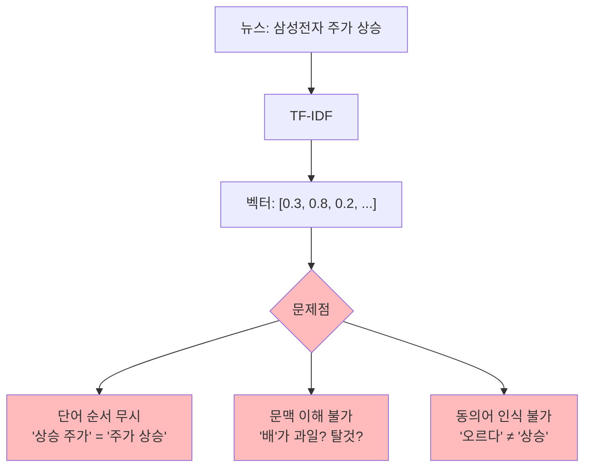

---

# 딥러닝의 접근: 의미 벡터

<div class="grid grid-cols-2 gap-8">

<div>

### TF-IDF
단어 = 하나의 숫자

```python
"경제" → 0.82
```

<v-click>

**문제**:
- 모든 "경제"가 동일
- 문맥 무시

</v-click>

</div>

<div>

<v-click>

### BERT
단어 = 의미 벡터 (768차원)

```python
"경제" → [0.23, -0.45, 0.67, ..., 0.12]
```

**장점**:
- 문맥에 따라 다른 벡터
- 의미 유사도 계산 가능

</v-click>

</div>

</div>

<v-click>

<div class="mt-8 p-4 bg-blue-100 rounded">

💡 **핵심**: BERT는 단어의 **의미**를 학습한다!

</div>

</v-click>

---

# 문맥 고려 예시

<div class="text-2xl mt-10">

<v-click>

**문장 1**: "사과를 먹었다"
```
"사과" → 과일 벡터 🍎
```

</v-click>

<v-click>

**문장 2**: "잘못을 사과했다"
```
"사과" → 사죄 벡터 🙇
```

</v-click>

</div>

<v-click>

<div class="mt-10 p-4 bg-green-100 rounded text-xl">

✅ 같은 단어라도 **문맥에 따라 다른 의미**를 학습!

</div>

</v-click>

---
layout: center
class: text-center
---

# Transformer 아키텍처
## RNN을 넘어서

---

# RNN/LSTM의 문제점

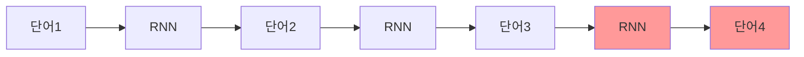

<v-clicks>

### ❌ 문제
1. **순차 처리**: 병렬화 불가 → 느림
2. **긴 문장**: 앞부분 정보 손실 (Long-term dependency)

</v-clicks>

---
layout: center
class: text-center
---

# Attention 메커니즘
## "중요한 것에 집중하자!"

---

# Attention: 핵심 아이디어

<div class="text-center">

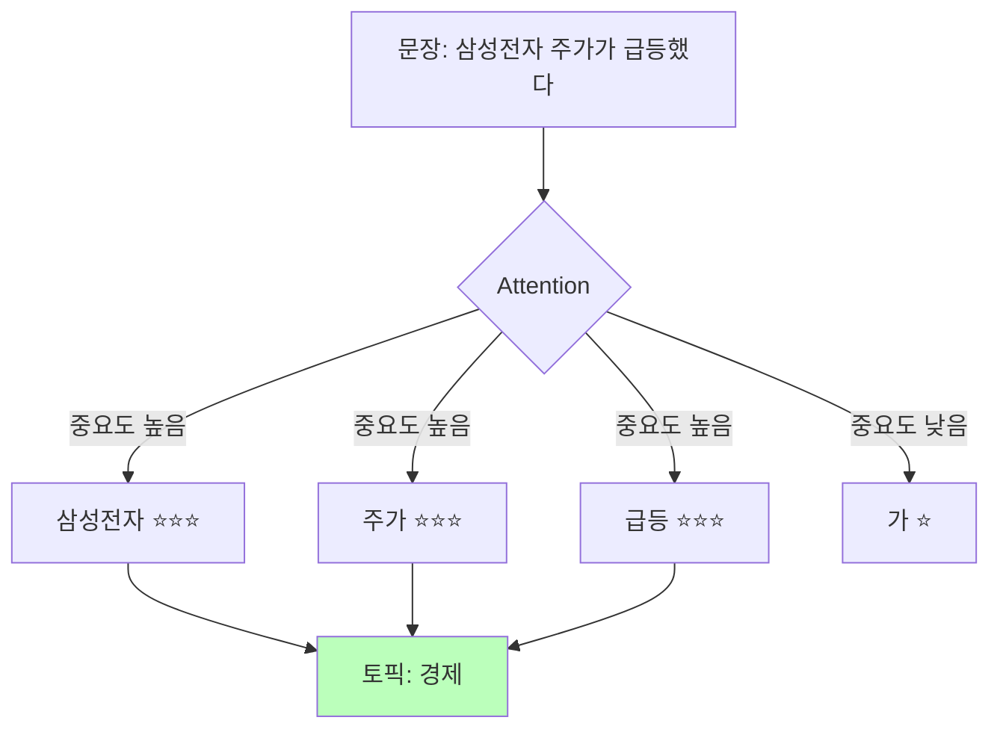

</div>

<v-click>

**모든 단어를 동시에 보면서** 중요한 것에 가중치 부여!

</v-click>

---

# Attention 작동 방식

<div class="grid grid-cols-2 gap-4">

<div>

### Query, Key, Value

```python
# Query: "이 문장의 주제는?"
# Key: 각 단어의 특성
# Value: 각 단어의 의미
```

<v-click>

### Attention Score 계산

$$
\text{Attention}(Q, K, V) = \text{softmax}\left(\frac{QK^T}{\sqrt{d_k}}\right)V
$$

</v-click>

</div>

<div>

<v-click>

### 예시: "주가"에 대한 Attention

```python
{
  "삼성전자": 0.45,  # 높음: 관련있음
  "주가":     0.40,  # 높음: 핵심 단어
  "가":       0.01,  # 낮음: 조사
  "급등":     0.14   # 중간: 부가 정보
}
```

</v-click>

</div>

</div>

---

# Transformer 전체 구조

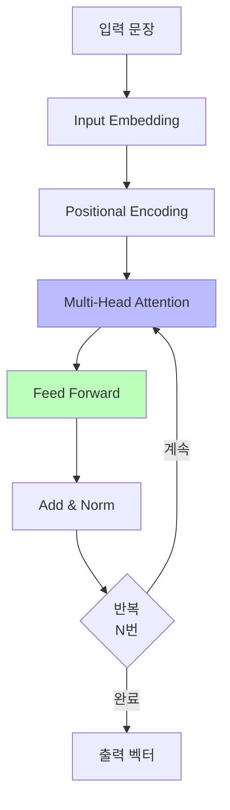

<v-click>

**Multi-Head Attention**: 여러 관점에서 동시에!
- Head 1: 문법적 관계 (주어-동사)
- Head 2: 의미적 관계 (원인-결과)  
- Head 3: 주제 관련성

</v-click>

---
layout: center
class: text-center
---

# BERT
## Bidirectional Encoder Representations from Transformers

사전학습 + Fine-tuning

---

# BERT 사전학습

<div class="text-center">

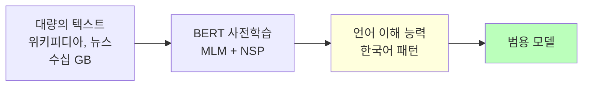

</div>

<v-clicks>

### 학습 방법 1: Masked Language Model (MLM)
```
원본:   "삼성전자가 신제품을 출시했다"
마스킹: "삼성전자가 [MASK] 출시했다"
학습:   [MASK]에 "신제품을" 예측
```

### 학습 방법 2: Next Sentence Prediction (NSP)
```
문장 A: "애플이 아이폰을 출시했다"
문장 B: "주가가 상승했다"
학습:   B가 A 다음에 올 수 있는가? → Yes
```

</v-clicks>

---

# Fine-tuning: 우리 문제에 적용

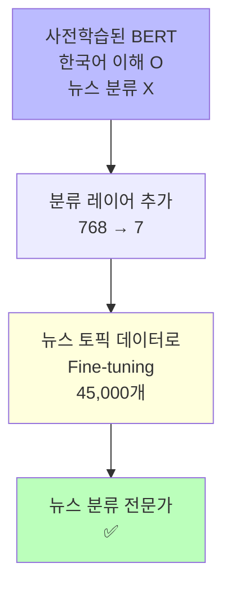

<v-clicks>

**비유**:
- 사전학습 = **대학교 교육** (일반 지식)
- Fine-tuning = **직무 교육** (특화 지식)

</v-clicks>

---

# 전이학습 (Transfer Learning)

<div class="grid grid-cols-2 gap-4">

<div>

### ❌ 처음부터 학습

```python
모델 = 랜덤 초기화
데이터 = 뉴스 45,000개

결과 = F1 ~0.75
```

**문제**:
- 데이터 부족
- 학습 오래 걸림
- 성능 낮음

</div>

<div>

<v-click>

### ✅ 전이학습

```python
모델 = BERT (한국어 학습됨!)
데이터 = 뉴스 45,000개

결과 = F1 ~0.90
```

**장점**:
- 사전지식 활용
- 빠른 수렴
- 높은 성능

</v-click>

</div>

</div>

---
layout: center
class: text-center
---

# Fine-tuning 하이퍼파라미터
## 성능을 좌우하는 핵심 설정

---

# Learning Rate (학습률)

<div class="text-center">

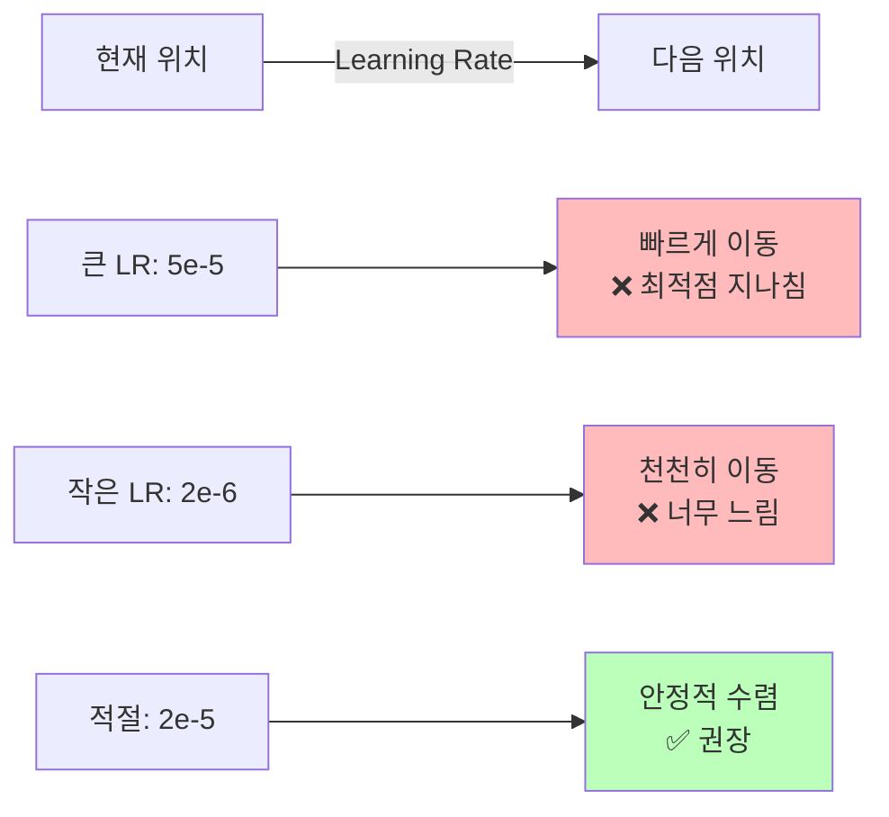

</div>

<v-click>

**BERT Fine-tuning 권장값**: `2e-5` ~ `5e-5`

</v-click>

---

# Learning Rate 실험 결과 예시

```
Learning Rate = 2e-5:  F1 = 0.901
Learning Rate = 3e-5:  F1 = 0.905  ⭐ Best!
Learning Rate = 5e-5:  F1 = 0.897
Learning Rate = 1e-4:  F1 = 0.850  ❌ 너무 큼
```

<v-click>

<div class="mt-8 p-4 bg-yellow-100 rounded">

⚠️ **주의**: Learning Rate는 **매우 민감한 파라미터!**

</div>

</v-click>

---

# Epochs (에포크)

<div class="text-center">

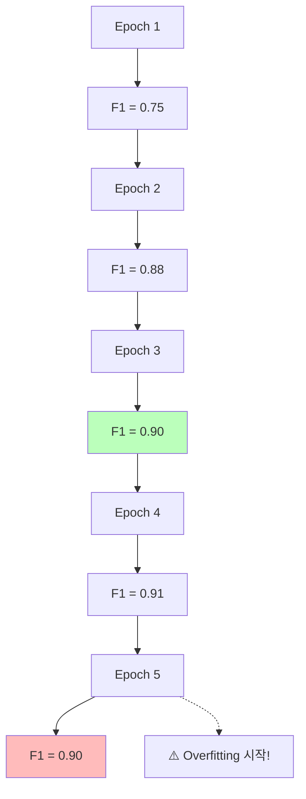

</div>

---

# Epoch 전략

<v-clicks>

### 너무 적으면?
- **Underfitting**: 덜 학습됨
- 성능 낮음

### 너무 많으면?
- **Overfitting**: 훈련 데이터 암기
- Validation 성능 하락

### 해결책
```python
TrainingArguments(
    load_best_model_at_end=True,        # ✅
    metric_for_best_model="f1",         # ✅
    # Validation F1이 가장 높은 모델 자동 선택
)
```

</v-clicks>

---

# Batch Size (배치 크기)

<div class="grid grid-cols-2 gap-4">

<div>

### 큰 배치 (32, 64)

<v-clicks>

**장점**:
- ✅ 안정적 학습
- ✅ GPU 활용도 ↑

**단점**:
- ❌ GPU 메모리 많이 필요

</v-clicks>

</div>

<div>

<v-click>

### 작은 배치 (8, 16)

**장점**:
- ✅ GPU 메모리 적게 사용

**단점**:
- ❌ 학습 불안정
- ❌ 느림

</v-click>

</div>

</div>

<v-click>

<div class="mt-8 p-4 bg-green-100 rounded">

✅ **권장**: Colab T4 GPU → `batch_size=16`

</div>

</v-click>

---

# Warmup Steps

<div class="text-center">

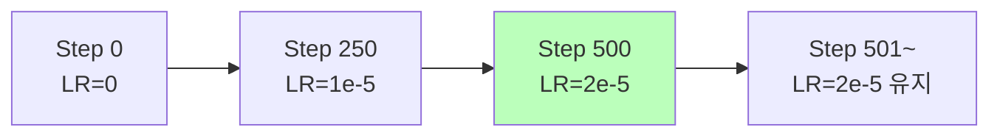

</div>

<v-clicks>

**문제**: 처음부터 큰 LR → 불안정

**해결**: 작은 LR로 시작, 점진적으로 증가

**설정**: `warmup_steps=500` (일반적)

</v-clicks>

---

# Weight Decay (가중치 감쇠)

<v-clicks>

**정의**: L2 Regularization

```python
weight_decay = 0.01
```

**효과**:
- 가중치가 너무 커지는 것 방지
- **Overfitting 방지**

**권장값**: `0.01` (일반적)

</v-clicks>

---
layout: center
class: text-center
---

# 한국어 BERT 모델
## 어떤 모델을 선택할까?

---

# 한국어 BERT 모델 비교

| 모델 | 개발 | 특징 | 학습 데이터 |
|------|------|------|------------|
| **klue/bert-base** | KLUE | 범용 성능 좋음 | 뉴스, 위키 |
| **klue/roberta-base** | KLUE | BERT 개선 버전 | 뉴스, 위키 |
| **beomi/kcbert-base** | 이기창 | 댓글/구어체 특화 | 뉴스 댓글, SNS |

<v-click>

<div class="mt-8">

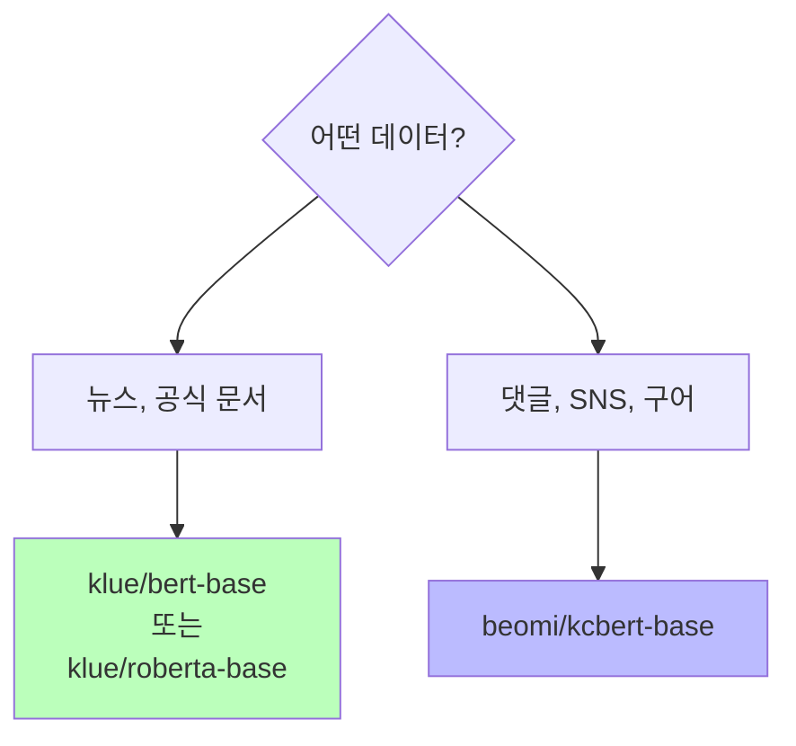

</div>

</v-click>

---

# 커스텀 vs 사전학습 모델

<div class="grid grid-cols-2 gap-4">

<div>

### ❌ 커스텀 모델
처음부터 구축

**필요한 것**:
- 대량 데이터 (수백만 문장)
- 막대한 컴퓨팅 (GPU × 수일)
- 딥러닝 전문 지식

**비용**: 💰💰💰💰💰

</div>

<div>

<v-click>

### ✅ 사전학습 모델
HuggingFace

**필요한 것**:
- 소량 데이터 (수천 문장)
- 적은 컴퓨팅 (Colab GPU)
- 기본 사용법만

**비용**: 💰 (거의 무료!)

</v-click>

</div>

</div>

<v-click>

<div class="mt-8 p-4 bg-green-100 rounded text-center text-xl">

✅ **현실적 선택**: HuggingFace 사전학습 모델!

</div>

</v-click>

---
layout: center
class: text-center
---

# BERT Fine-tuning 전체 과정
## 11단계 워크플로우

---

# BERT Fine-tuning 워크플로우

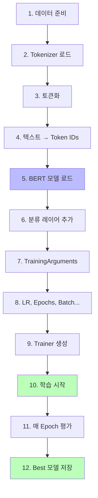

---

# 토큰화 (Tokenization)

```python
# 1. 텍스트 입력
text = "삼성전자 주가 상승"

# 2. Tokenizer 처리
tokens = ["[CLS]", "삼성", "##전자", "주가", "상승", "[SEP]"]

# 3. Token ID 변환
token_ids = [2, 4532, 7821, 3421, 9876, 3]

# 4. Padding (길이 통일)
padded = [2, 4532, 7821, 3421, 9876, 3, 0, 0, ..., 0]  # 128개
```

<v-click>

**특수 토큰**:
- `[CLS]`: 분류 토큰 (문장 전체 의미)
- `[SEP]`: 문장 구분
- `[PAD]`: 패딩 (길이 맞추기)

</v-click>

---

# BERT의 출력

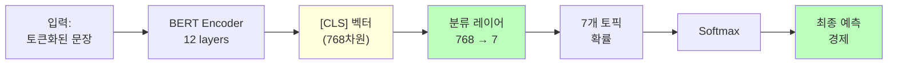

---

# 학습 과정 (의사 코드)

```python {all|2-4|6-7|9-10|12-13|15-16|all}
for epoch in range(num_epochs):
    for batch in train_data:
        # Forward: 예측
        predictions = model(batch)
        
        # Loss 계산
        loss = cross_entropy(predictions, true_labels)
        
        # Backward: 그래디언트 계산
        loss.backward()
        
        # Update: 가중치 업데이트
        optimizer.step()
    
    # Epoch마다 Validation 평가
    val_f1 = evaluate(model, val_data)
    
    # Best 모델 저장
    if val_f1 > best_f1:
        save_model(model)
```

---
layout: center
class: text-center
---

# 실험 결과 해석
## 무엇을 배울 수 있을까?

---

# Learning Rate 실험

```
실험 1-1 (LR=3e-5):  F1 = 0.905  ⭐ Best!
실험 1-2 (LR=5e-5):  F1 = 0.897
Baseline (LR=2e-5):   F1 = 0.901
```

<v-click>

**해석**:
- `3e-5`가 이 데이터에 최적
- `5e-5`는 너무 커서 불안정
- Learning Rate는 **민감한 파라미터**

</v-click>

---

# Epoch 실험

```
실험 2-1 (Epoch=5):   F1 = 0.910  ⭐ Best!
실험 2-2 (Epoch=10):  F1 = 0.905  ⚠️ Overfitting
Baseline (Epoch=3):   F1 = 0.901
```

<v-click>

**해석**:
- 5 Epoch에서 최고 성능
- 10 Epoch는 Overfitting 시작
- **Early stopping 중요!**

</v-click>

---

# 모델 비교 실험

```
klue/bert-base:     F1 = 0.901
klue/roberta-base:  F1 = 0.915  ⭐ Best!
beomi/kcbert-base:  F1 = 0.895
```

<v-click>

**해석**:
- **RoBERTa**가 뉴스 데이터에 가장 적합
- KcBERT는 구어체가 아니라 성능 낮음
- **데이터 특성에 맞는 모델 선택 중요!**

</v-click>

---

# TF-IDF vs BERT 성능 비교

<div class="grid grid-cols-2 gap-8">

<div>

### TF-IDF + Logistic Regression

```
Val F1:     0.820
학습 시간:   ~1분
```

</div>

<div>

<v-click>

### BERT Fine-tuning

```
Val F1:     0.901
학습 시간:   ~10분
```

</v-click>

</div>

</div>

<v-click>

<div class="mt-8 p-4 bg-green-100 rounded text-center text-2xl">

📈 **성능 향상**: +8.1% (절대값) / +9.9% (상대값)

</div>

</v-click>

---

# 언제 BERT를 쓸까?

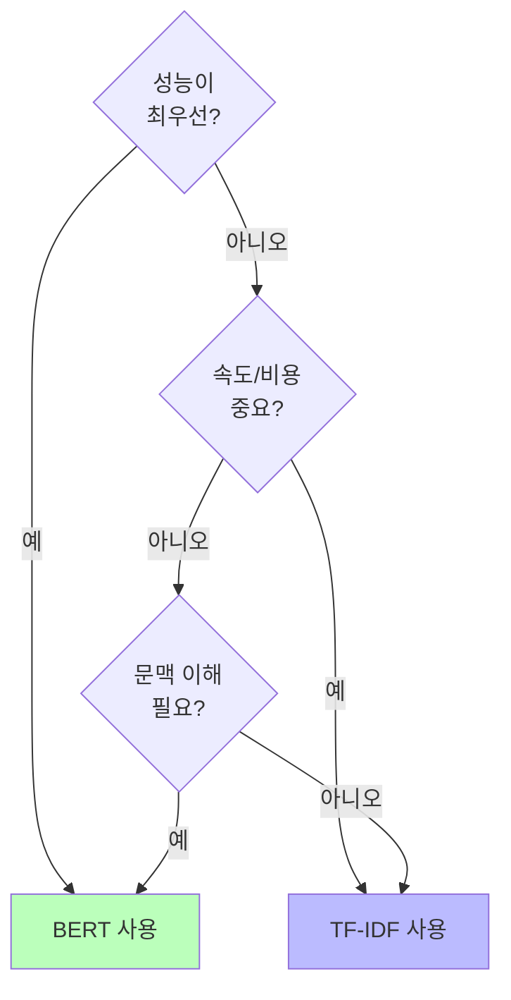

---

# BERT vs TF-IDF 선택 가이드

<div class="grid grid-cols-2 gap-4">

<div>

### ✅ BERT 추천
- 성능이 최우선
- 문맥 이해 필요
- 긴 문장, 복잡한 의미
- GPU 사용 가능
- F1 1%도 중요한 경우

</div>

<div>

<v-click>

### ✅ TF-IDF 추천
- 실시간 처리 필요
- 리소스 제한 (CPU만)
- 적은 메모리
- 간단한 키워드 분류
- 빠른 프로토타이핑

</v-click>

</div>

</div>

---

# 실습 포인트

<v-clicks>

### 1. 토큰화 후 확인
```python
print(f"Max Length: {max(lens)}")
# → 대부분 128 이내인지 확인
```

### 2. 학습 중 모니터링
```python
Epoch 1: train_loss=0.234 val_loss=0.189 val_f1=0.881
Epoch 2: train_loss=0.098 val_loss=0.156 val_f1=0.901
Epoch 3: train_loss=0.045 val_loss=0.178 val_f1=0.895
#         ↓ 감소      ↑ 증가 → Overfitting!
```

### 3. Confusion Matrix 비교
- BERT가 TF-IDF보다 혼동 적음!

</v-clicks>

---

# Confusion Matrix 비교

<div class="grid grid-cols-2 gap-4">

<div>

### TF-IDF
```
실제\예측  IT  경제  사회
IT         42   5    3
경제        4   44   2
사회        8   2   40
```

<v-click>

혼동이 많음 😰

</v-click>

</div>

<div>

<v-click>

### BERT
```
실제\예측  IT  경제  사회
IT         95   3    2
경제        1   98   1
사회        2   1   97
```

정확도 높음! 🎉

</v-click>

</div>

</div>

---
layout: center
class: text-center
---

# 체크리스트

<div class="text-left max-w-2xl mx-auto">

<v-clicks>

- [ ] Attention 메커니즘이 RNN보다 나은 이유
- [ ] BERT 사전학습 방법 (MLM, NSP)
- [ ] Fine-tuning vs 처음부터 학습
- [ ] Learning Rate가 학습에 미치는 영향
- [ ] Overfitting 방지 방법
- [ ] 토큰화 과정 ([CLS], [SEP], [PAD])
- [ ] 한국어 BERT 모델 종류와 선택 기준
- [ ] TF-IDF 대비 BERT의 장단점

</v-clicks>

</div>

---

# 더 나아가기

<v-clicks>

### 고급 주제 (선택)

1. **LoRA (Low-Rank Adaptation)**
   - 전체 모델 대신 일부만 Fine-tuning
   - 메모리 효율적

2. **Prompt Engineering**
   - Few-shot Learning
   - Zero-shot Classification

3. **Ensemble**
   - 여러 모델 조합
   - 성능 안정화

</v-clicks>

---

# 추천 학습 자료

<v-clicks>

- **HuggingFace Course**
  - https://huggingface.co/learn

- **BERT 원논문**
  - https://arxiv.org/abs/1810.04805

- **Attention Is All You Need**
  - https://arxiv.org/abs/1706.03762

- **한국어 NLP 리소스**
  - https://github.com/ko-nlp/Korpora

</v-clicks>

---
layout: center
class: text-center
---

# 실습 시작! 🚀

### Day 1-3 BERT Fine-tuning 노트북

<div class="mt-8">

**목표**: BERT로 **F1 ≥ 0.90** 달성!

</div>

<div class="mt-8 text-2xl">

**TF-IDF 대비 +8~10% 향상** 체감하기

</div>

---
layout: center
class: text-center
---

# 🎉 Day 1 완료!

### 배운 것

<div class="text-left max-w-2xl mx-auto mt-8">

<v-clicks>

- ✅ 전통적 머신러닝 (TF-IDF)
- ✅ 최신 딥러닝 (BERT)
- ✅ 체계적 실험 관리 (MLflow)
- ✅ 14개 실험 수행 (7 + 7)
- ✅ 성능 향상 경험 (0.80 → 0.90)

</v-clicks>

</div>

---
layout: center
class: text-center
---

# 다음 단계 🚀

<div class="text-left max-w-2xl mx-auto mt-8">

<v-clicks>

- **Day 2**: NLP 생성 모델 (기계 번역)
- **Day 3**: Computer Vision (이미지 분류)
- **Day 4**: CV 심화 1 (의료 이미지)
- **Day 5**: CV 심화 2 (제스처 인식)

</v-clicks>

</div>

<div class="mt-8 text-xl">
계속해서 멋진 AI 프로젝트를 만들어보세요!
</div>

---
layout: end
---

# 감사합니다! 🎉

질문이 있으신가요?
