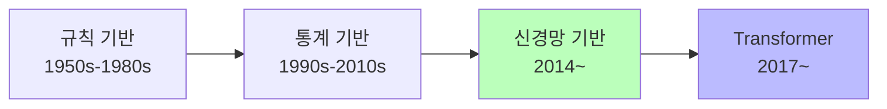
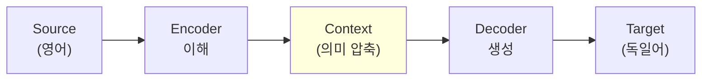
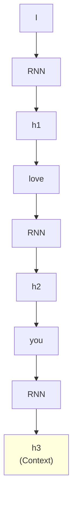
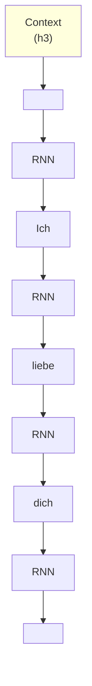
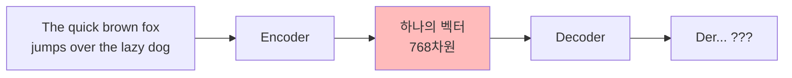
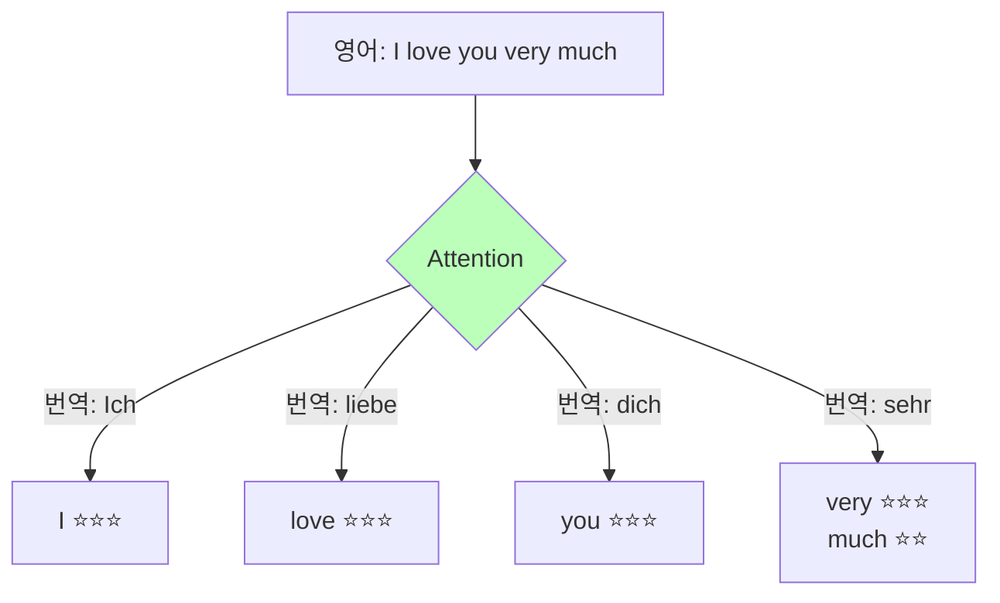

# Day 2-1: Seq2Seq 기초

딥러닝 부트캠프 - 기계번역의 기본 원리

<div class="pt-12">
  <span @click="$slidev.nav.next" class="px-2 py-1 rounded cursor-pointer" hover="bg-white bg-opacity-10">
    시작하기 <carbon:arrow-right class="inline"/>
  </span>
</div>

---
layout: default
---

# 학습 목표

<v-clicks>

- 🌍 **기계번역**: 역사와 어려움 이해
- 🔄 **Encoder-Decoder**: 구조와 작동 원리
- 🎯 **Attention**: 왜 필요하고 어떻게 작동하는가
- 📊 **BLEU Score**: 번역 품질 평가 지표
- 🛠️ **전처리**: 병렬 코퍼스, 토큰화, Vocabulary

</v-clicks>

<div class="abs-br m-6 flex gap-2">
  <span>시간: 1시간</span>
</div>

---
layout: center
class: text-center
---

# 기계번역의 역사
## 어떻게 여기까지 왔을까?

---

# 기계번역 발전 과정



<v-clicks>

### 규칙 기반 (Rule-based)
- 단어 사전 + 문법 규칙
- ❌ 예외 처리 불가, 수작업

### 통계 기반 (SMT)
- 병렬 코퍼스에서 확률 계산
- ❌ 긴 문장 처리 어려움

</v-clicks>

---

# 신경망 기계번역 (NMT)

<v-clicks>

### Seq2Seq (2014~)
```
End-to-end 학습
입력 문장 → 신경망 → 출력 문장
```
❌ 긴 문장에서 정보 손실

### Attention (2015~)
```
필요한 부분에 집중!
```
✅ 긴 문장도 처리 가능

### Transformer (2017~)
```
Attention만으로!
```
✅ 병렬 처리 + 최고 성능

</v-clicks>

---

# 기계번역이 어려운 이유

<div class="grid grid-cols-2 gap-8">

<div>

### 1. 단어 중의성

<v-click>

```
영어: "I saw a bat"

Case 1: 야구 방망이
독일어: "Ich sah einen Schläger"

Case 2: 박쥐
독일어: "Ich sah eine Fledermaus"
```

문맥 없이는 번역 불가!

</v-click>

</div>

<div>

<v-click>

### 2. 관용 표현

```
영어: "It's raining cats and dogs"

직역: "고양이와 개가 비처럼..." ❌

의역: "비가 억수같이 온다" ✅
```

전체 문장 이해 필요!

</v-click>

</div>

</div>

---

# 더 많은 어려움

<v-clicks>

### 3. 문화적 차이
```
한국어: "밥 먹었어?"
영어: "Have you eaten?" vs "How are you?"
```

### 4. 단어 순서
```
영어: Subject - Verb - Object
한국어: Subject - Object - Verb

영어: "I love you"
한국어: "나는 너를 사랑해" (순서 변경!)
```

</v-clicks>

---
layout: center
class: text-center
---

# Encoder-Decoder 구조
## 이해하고 생성하기

---

# Encoder-Decoder: 핵심 아이디어

**"번역 = 이해 + 생성"**



<v-click>

**비유**:
- **Encoder** = 통역사가 영어를 듣고 이해
- **Context Vector** = 통역사의 머릿속 기억
- **Decoder** = 통역사가 독일어로 말하기

</v-click>

---

# Encoder의 역할

<div class="grid grid-cols-2 gap-8">



<v-clicks>

```python
# Encoder: 입력 문장을 벡터로 압축

h1 = RNN("I", h0)       # "I" 처리
h2 = RNN("love", h1)    # "love" 처리
h3 = RNN("you", h2)     # "you" 처리

context = h3  # 전체 문장의 의미!
```

</v-clicks>

</div>

---

# Decoder의 역할

<div class="grid grid-cols-2 gap-8">



<v-clicks>

```python
# Decoder: Context로부터 타겟 문장 생성

out1 = RNN("<START>", context) → "Ich"
out2 = RNN("Ich", s1)          → "liebe"
out3 = RNN("liebe", s2)        → "dich"
out4 = RNN("dich", s3)         → "<END>"
```

</v-clicks>

</div>

---

# 학습 vs 추론

<div class="grid grid-cols-2 gap-8">

<div>

### 학습 (Teacher Forcing)

<v-click>

```python
# 정답을 보고 다음 단어 예측

Target: "Ich liebe dich"

Step 1: 입력="<START>"
        정답="Ich"

Step 2: 입력="Ich"
        정답="liebe"

Step 3: 입력="liebe"
        정답="dich"
```

정답 보고 학습!

</v-click>

</div>

<div>

<v-click>

### 추론 (Inference)

```python
# 이전 예측을 다음 입력으로

Step 1: 입력="<START>"
        예측="Ich"

Step 2: 입력="Ich"
        예측="liebe"

Step 3: 입력="liebe"
        예측="dich"
```

자기 예측 사용!

</v-click>

</div>

</div>

---
layout: center
class: text-center
---

# Seq2Seq의 문제점
## 왜 Attention이 필요한가?

---

# 긴 문장에서의 정보 손실



<v-clicks>

**문제**:
- 긴 문장 → 하나의 고정 크기 벡터로 압축
- 앞부분 정보가 뒤로 갈수록 희미해짐
- 문장이 길수록 번역 품질 저하

</v-clicks>

---

# 실험 결과: 문장 길이 vs 성능

```
문장 길이 vs BLEU Score
(Seq2Seq without Attention)

 5단어: BLEU = 0.45  ✅
10단어: BLEU = 0.38  ⚠️
20단어: BLEU = 0.25  ❌ 급격히 감소!
30단어: BLEU = 0.15  ❌❌
```

<v-click>

<div class="mt-8 p-4 bg-red-100 rounded text-center">

💥 **긴 문장은 처리 못함!**

</div>

</v-click>

---

# 병목 현상 (Bottleneck)

```python
# Context Vector: 768차원 벡터 하나
context = [0.2, -0.5, 0.3, ..., 0.1]

# 이 벡터 하나에 모든 정보를 담아야!
- 주어가 뭔지
- 동사가 뭔지
- 목적어가 뭔지
- 시제는?
- 부정/긍정?
- 감정?
```

<v-click>

<div class="mt-8 p-4 bg-yellow-100 rounded text-center">

⚠️ **정보 손실 불가피!**

</div>

</v-click>

---
layout: center
class: text-center
---

# Attention 메커니즘
## "어디를 봐야 할까?"

---

# Attention: 핵심 아이디어

**"번역할 때 원문의 어느 부분을 봐야 할까?"**

<div class="grid grid-cols-2 gap-8">



<v-click>

**각 단어 번역 시 필요한 부분만 집중!**

</v-click>

</div>

---

# Attention 계산 과정

<v-clicks>

### 1. Encoder 출력 저장
```python
encoder_outputs = [h1, h2, h3, h4, h5]
# "I love you very much" → 5개 벡터
```

### 2. Attention Score 계산
```python
# 현재 디코더 state: s1 (번역: "liebe")
score(s1, h1) = 0.05  # "I"
score(s1, h2) = 0.85  # "love" ← 높음!
score(s1, h3) = 0.05  # "you"
score(s1, h4) = 0.03  # "very"
score(s1, h5) = 0.02  # "much"
```

</v-clicks>

---

# Attention 계산 (계속)

<v-clicks>

### 3. Softmax 정규화
```python
attention = softmax([0.05, 0.85, 0.05, 0.03, 0.02])
# 합계 = 1.0
```

### 4. Context Vector 계산
```python
context = 0.05*h1 + 0.85*h2 + 0.05*h3 + ...
# "love"의 정보가 85% 반영!
```

### 5. 단어 생성
```python
output = f(context, s1) → "liebe"
```

</v-clicks>

---

# Attention 시각화

```
Source:  I      love    you     very    much
Target:
Ich      [⭐⭐⭐  0.05    0.05    0.05    0.05]
liebe    [0.05   ⭐⭐⭐  0.05    0.05    0.05]
dich     [0.05   0.05    ⭐⭐⭐  0.05    0.05]
sehr     [0.05   0.05    0.05    ⭐⭐⭐  ⭐⭐]
```

<v-click>

<div class="mt-8 p-4 bg-blue-100 rounded text-center">

💡 **Heatmap으로 시각화 가능!**

</div>

</v-click>

---

# Attention의 효과

```
Seq2Seq without Attention:
  짧은 문장 (10단어): BLEU = 0.38
  긴 문장 (30단어): BLEU = 0.15

Seq2Seq with Attention:
  짧은 문장 (10단어): BLEU = 0.48 (+26%)
  긴 문장 (30단어): BLEU = 0.35 (+133%!)
```

<v-click>

<div class="mt-8 p-4 bg-green-100 rounded text-center text-xl">

🚀 **특히 긴 문장에서 엄청난 개선!**

</div>

</v-click>

---
layout: center
class: text-center
---

# BLEU Score
## 번역 품질 평가

---

# BLEU란?

**BLEU (Bilingual Evaluation Understudy)**

<v-clicks>

- 기계번역 품질 자동 평가
- 0.0 ~ 1.0 사이 값 (또는 0 ~ 100)
- 높을수록 좋음

**핵심 아이디어**:
```
정답 번역과 얼마나 비슷한
단어(n-gram)를 사용했는가?
```

**장점**:
- 빠름 (즉시 계산)
- 객관적
- 대규모 테스트 가능

</v-clicks>

---

# n-gram이란?

**n-gram**: 연속된 n개의 단어

```python
문장: "I love you"

1-gram (unigram):
  ["I", "love", "you"]

2-gram (bigram):
  ["I love", "love you"]

3-gram (trigram):
  ["I love you"]
```

<v-click>

💡 **BLEU는 1~4-gram을 모두 사용!**

</v-click>

---

# BLEU 계산 예시

```python
ref = "The cat is on the mat"
```

<v-clicks>

```python
cand1 = "The cat is on the mat"
BLEU = 1.0  # 완벽!
```

```python
# 앞부분 일치, 뒷부분 다름
cand2 = "The cat is on a rug"
# 1-gram: 4/6=67%  2-gram: 3/5=60%
# 3-gram: 2/4=50%  4-gram: 1/3=33%
BLEU ≈ 0.51  # 점진적 감소
```

```python
# 단어는 맞지만 순서 엉망
cand3 = "Cat mat on the"
# 3-gram: 0/2=0%  4-gram: 0/1=0%
BLEU = 0.0  # 4-gram이 0이면 전체 0!
```

</v-clicks>

---

# Modified Precision

```python
ref  = "The cat is on the mat"       # "the/The" 2번
cand = "the the the the the the the"  # "the" 7번 반복
```

<v-clicks>

### Naive Precision
```python
naive = 7/7 = 100%  ← 잘못됨!
# "the"가 ref에 있는 단어이므로 7개 모두 인정?
```

### Modified Precision
```python
# Count_clip = min(Count_cand, MaxCount_ref)
#            = min(7, 2) = 2만 인정
modified = 2/7 ≈ 28.6%  ✅

# 공식: Σ Count_clip / Σ Count_cand
```

</v-clicks>

---

# BLEU Score 해석

```
0.00 - 0.10: 매우 낮음
  거의 일치 없음

0.10 - 0.20: 낮음
  일부 단어만 일치

0.20 - 0.30: 보통
  의미는 어느 정도 전달

0.30 - 0.40: 괜찮음
  실용적 사용 가능

0.40 - 0.50: 좋음
  높은 품질

0.50 - 0.60: 매우 좋음
  전문가 수준 근접

0.60+: 전문가 수준
```

---

# BLEU의 한계

<v-clicks>

### 1. 여러 정답 가능
```
Source: "Thank you"

정답 1: "Danke"
정답 2: "Danke schön"
정답 3: "Vielen Dank"

모델: "Danke schön"
Reference: "Vielen Dank"
→ BLEU = 0.0 (불일치!)
```

해결: 여러 Reference 사용

</v-clicks>

---

# BLEU의 한계

<v-clicks>

### 2. 문법 체크 불가
```
cand = "Cat on mat the is"
# 단어는 있지만 문법 엉망
```

### 3. 의미 유사성 체크 불가
```
ref = "I love you"
cand = "I adore you"
# "adore" = "love" 유사하지만 다른 단어로 인식
```

</v-clicks>

---
layout: center
class: text-center
---

# 데이터 전처리
## 병렬 코퍼스 준비

---

# 병렬 코퍼스 (Parallel Corpus)

```python
# Tatoeba 데이터셋
english = [
    "I love you",
    "The cat is black",
    "Hello world"
]

german = [
    "Ich liebe dich",
    "Die Katze ist schwarz",
    "Hallo Welt"
]

# Parallel corpus
dataset = [
    {"en": "I love you", "de": "Ich liebe dich"},
    {"en": "The cat is black", "de": "Die Katze ist schwarz"},
    ...
]
```

---

# 토큰화 (Tokenization)

<div class="grid grid-cols-2 gap-8">

<div>

### 단어 수준

<v-click>

```python
text = "I love you"
tokens = ["I", "love", "you"]
```

간단하지만 모르는 단어 처리 어려움

</v-click>

</div>

<div>

<v-click>

### Subword 수준

```python
text = "unbelievable"
tokens = ["un", "believe", "able"]
```

**장점**:
- 모르는 단어도 처리 가능
- Vocabulary 크기 감소

</v-click>

</div>

</div>

---

# Vocabulary (어휘 사전)

```python
# Source (영어)
src_vocab = {
    "<PAD>": 0,   # Padding
    "<UNK>": 1,   # Unknown
    "<SOS>": 2,   # Start of Sequence
    "<EOS>": 3,   # End of Sequence
    "I": 4,
    "love": 5,
    "you": 6,
    ...
}

# Target (독일어)
tgt_vocab = {
    "<PAD>": 0,
    "<UNK>": 1,
    "<SOS>": 2,
    "<EOS>": 3,
    "Ich": 4,
    "liebe": 5,
    "dich": 6,
    ...
}
```

---

# 숫자 변환 & 패딩

<v-clicks>

### 텍스트 → 숫자
```python
src_text = "I love you"
src_ids = [2, 4, 5, 6, 3]
# <SOS> I love you <EOS>
```

### 패딩 (Padding)
```python
# 문장 길이 통일
sent1 = [2, 4, 5, 6, 3]           # 길이 5
sent2 = [2, 4, 5, 6, 7, 8, 9, 3]  # 길이 8

# max_len=10으로 통일
sent1_padded = [2, 4, 5, 6, 3, 0, 0, 0, 0, 0]
sent2_padded = [2, 4, 5, 6, 7, 8, 9, 3, 0, 0]
```

</v-clicks>

---
layout: center
class: text-center
---

# 실습 포인트

---

# 주목해야 할 것

<v-clicks>

### 1. 문장 길이 분포
```python
lengths = [len(sent.split()) for sent in english]
print(f"평균: {np.mean(lengths)}")
print(f"최대: {np.max(lengths)}")
print(f"90%: {np.percentile(lengths, 90)}")

# 적절한 max_length 설정 (90~95%ile)
```

### 2. Vocabulary 크기
```python
print(f"영어: {len(src_vocab)}")
print(f"독일어: {len(tgt_vocab)}")

# 너무 크면 → 메모리 부족
# 너무 작으면 → <UNK> 많아짐
```

</v-clicks>

---

# 학습 곡선 모니터링

```python
Epoch 1: train_loss=4.23 val_loss=3.89 val_bleu=0.05
Epoch 2: train_loss=2.45 val_loss=2.32 val_bleu=0.18
Epoch 3: train_loss=1.67 val_loss=1.89 val_bleu=0.25
Epoch 5: train_loss=0.98 val_loss=1.45 val_bleu=0.32
#        ↓ 감소                       ↑ 증가 (좋음!)
```

<v-click>

### MLflow 로깅
```python
mlflow.log_param("hidden_size", 256)
mlflow.log_param("learning_rate", 0.001)
mlflow.log_metric("val_bleu", 0.32, step=5)
mlflow.log_artifact("sample_translations.txt")
```

</v-click>

---
layout: center
class: text-center
---

# 체크리스트

<div class="text-left max-w-2xl mx-auto">

<v-clicks>

- [ ] 기계번역의 역사와 발전
- [ ] Encoder-Decoder 구조의 원리
- [ ] Context Vector의 역할
- [ ] Attention이 왜 필요한가
- [ ] Attention Score 계산 과정
- [ ] BLEU Score 계산 방법
- [ ] n-gram Precision의 의미
- [ ] 병렬 코퍼스 전처리 과정

</v-clicks>

</div>

---

# 다음 단계

<v-clicks>

### Day 2-2 (1.5시간)
- LSTM 기반 Seq2Seq 직접 구현
- Attention 메커니즘 추가
- BLEU Score 계산 실습
- MLflow로 실험 로깅

### 준비물
- PyTorch 기본 사용법
- RNN/LSTM 개념 이해
- 열정! 🔥

</v-clicks>

---
layout: end
---

# 감사합니다! 🎉

질문이 있으신가요?

<div class="mt-8">

**Day 2-1 완료**

다음: Day 2-2 Seq2Seq 모델 구현

</div>
