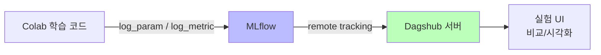

# Day 1-1: 환경 설정 & MLflow 세팅

딥러닝 부트캠프 - 실험 환경 구축하기

---
layout: default
---

# 학습 목표

- 🖥️ **Google Colab Pro**에서 GPU를 확인하고 환경을 구성한다
- 🌐 **Dagshub** 계정을 생성하고 MLflow와 연동한다
- 📊 **체계적인 실험 관리**의 중요성을 이해한다
- 📁 **Dacon 데이터**를 다운로드하고 Colab에 로드한다

---
layout: center
class: text-center
---

# 1. Google Colab 환경 확인

GPU 할당 확인 & Drive 연동 (선택)

---
layout: two-cols-header
---

# 1.1 GPU 확인

### 확인 방법
가장 먼저 GPU가 제대로 할당되어 있는지 확인합니다.

::left::

**실행할 코드**

```python
import torch

if torch.cuda.is_available():
    print(f"GPU 이름: {torch.cuda.get_device_name(0)}")
    print(f"GPU 메모리: {torch.cuda.get_device_properties(0).total_memory / 1e9:.2f} GB")
else:
    print("❌ GPU 사용 불가")
```

::right::

**GPU가 없다면**

**런타임 > 런타임 유형 변경 > GPU(T4)** 선택 후 재연결

<div class="mt-4 p-4 bg-yellow-100 rounded">

실습 노트북에서 

이어서 진행하세요.

</div>

---
layout: default
---

# 1.2 Google Drive 연동 (선택사항)

### 참고
- 데이터를 Drive에 보관하면 런타임이 초기화되어도 재다운로드가 필요 없습니다.
- 이번 실습에서는 **직접 업로드 방식**을 기본으로 합니다.

---
layout: center
class: text-center
---

# 2. Dagshub & MLflow 설정

실험을 체계적으로 관리하는 플랫폼

---
layout: default
---

# 2.1 Dagshub란?

### 요약
ML 실험을 체계적으로 관리할 수 있는 플랫폼입니다.

- MLflow UI를 제공하여 실험 결과를 **시각적으로 비교**
- **GitHub 계정**으로 간편하게 가입 가능

---
layout: default
---

# 왜 실험을 기록해야 할까?

### 딥러닝 연구에서 흔히 겪는 문제

```
실험 1: F1 = 0.82  → 어떤 설정이었지...?
실험 2: F1 = 0.85  → 뭘 바꿨더라...?
실험 3: F1 = 0.79  → 왜 떨어졌지...?
```

MLflow로 모든 실험의 **하이퍼파라미터와 결과**를 자동으로 기록하면 이런 혼란을 방지할 수 있습니다.

---
layout: top_img-bottom_text
---

# MLflow + Dagshub 연동 구조

::top::



::bottom::

Colab에서 로깅 → Dagshub 서버에 저장 → UI에서 비교

---
layout: default
---

# 2.2 Dagshub 계정 생성

### 절차
1. [https://dagshub.com](https://dagshub.com/) 접속
2. **GitHub** 또는 **Google** 계정으로 가입/로그인
3. `Create +` > `New Repository` > `Create blank repository` 클릭
4. **Repository name**: `deeplearning-bootcamp` (원하는 이름 가능)
5. **Visibility**: Public 권장
6. `Create Repository` 클릭 후 **repo_owner**(username)와 **repo_name** 기억해두기

---
layout: two-cols-header
---

# 2.3 라이브러리 설치 및 연동

::left::

**1. 설치**

```python
%pip install -q dagshub 'mlflow>=2,<3'
```

**2. 연동 (🔥 본인 정보로 수정!)**

```python
import dagshub

repo_owner = 'your_username'   # Dagshub username
repo_name  = 'deeplearning-bootcamp'

dagshub.init(repo_owner=repo_owner, repo_name=repo_name, mlflow=True)
```

::right::

**실습 노트북**에서 `repo_owner`, `repo_name`을 채운 뒤 실행하세요.

<div class="mt-4 p-4 bg-amber-100 rounded">

🔥 이 부분은 수정이 필요합니다.

</div>

---
layout: center
class: text-center
---

# 3. MLflow 첫 실험 로깅

기본 로깅 & 여러 실험 시뮬레이션

---
layout: default
---

# 3.1 기본 로깅

### 🔥 이 부분을 같이 테스트해봅시다
실습 노트북에서 `run_name`과 `log_param`, `log_metric`에 넣을 **키/값을 비워두었습니다.**

원하는 run 이름과 로깅할 파라미터·메트릭을 입력한 뒤 실행해보고, 

Dagshub UI에서 이름과 값이 잘 반영되는지 확인해보세요.

```python
with mlflow.start_run(run_name=""):  # 원하는 run 이름 입력
    mlflow.log_param("", )   # (키, 값) 입력
    mlflow.log_metric("", ) # (키, 값) 입력
```

---
layout: default
---

# 3.2 여러 실험 시뮬레이션

### 🔥 이 부분을 같이 테스트해봅시다
여러 run을 **랜덤** 하이퍼파라미터로 기록하는 흐름은 그대로 두고, 

`run_name` 패턴과 `log_param`, `log_metric` 부분만 비워두었습니다.

원하는 대로 채운 뒤 실행해보고, Dagshub에서 여러 실험을 비교해보세요.

- `learning_rate`, `batch_size` 등을 랜덤 선택 → 그대로 유지
- **run 이름 패턴**과 **로깅할 파라미터/메트릭** → 노트북에서 직접 채우기
- 5개 가상 실험 실행 후 Dagshub UI에서 확인

---
layout: default
---

# 3.3 Dagshub UI에서 결과 확인

### 확인 절차
1. Dagshub 프로젝트 페이지 이동
2. 좌측 메뉴 **"Experiments"** 클릭
3. 6개 실험 (test_connection + experiment_1~5) 확인
4. 각 실험의 **Parameters**, **Metrics** 비교

**핵심**: 여러 실험 체크박스 선택 → "Compare" → Parallel Coordinates로 최적 하이퍼파라미터 시각화

---
layout: center
class: text-center
---

# 4. Dacon 데이터 다운로드

대회 데이터 준비 & Colab 업로드

---
layout: default
---

# 4.1 Dacon 계정 및 데이터 다운로드

### 절차
1. [https://dacon.io](https://dacon.io/) 접속 후 회원가입
2. 대회 페이지: [월간 데이콘 뉴스 토픽 분류](https://dacon.io/competitions/official/235747)
3. **데이터 탭** > 아래 4개 파일 다운로드:
   - `train_data.csv`, `test_data.csv`, `topic_dict.csv`, `sample_submission.csv`
4. 4개 파일을 **ZIP으로 압축**

---
layout: default
---

# 4.2 Colab에 데이터 업로드

### 실습 노트북에서

- `files.upload()`로 ZIP 파일 선택
- 지정 경로에 압축 해제 후 `train_data.csv`, `test_data.csv` 등 로드

---
layout: default
---

# 4.3 데이터 확인

### 코드 예시
```python
import pandas as pd

train_df = pd.read_csv(os.path.join(data_path, 'train_data.csv'))
test_df  = pd.read_csv(os.path.join(data_path, 'test_data.csv'))

print(f"Train: {len(train_df):,}개 / Test: {len(test_df):,}개")
```

---
layout: center
class: text-center
---

# 5. 정리

---
layout: two-cols-header
---

# 오늘 배운 것

::left::

| **내용**     | **도구**   |
| ------------ | ---------- |
| GPU 환경 확인 | PyTorch    |
| 실험 기록 플랫폼 | Dagshub   |
| 실험 추적 라이브러리 | MLflow  |
| 데이터 로드   | Pandas     |

::right::

### 체계적 실험 관리가 중요한 이유
- **재현성**: 어떤 설정으로 좋은 결과를 냈는지 정확히 알 수 있음
- **비교**: 수십, 수백 개의 실험을 체계적으로 비교 가능
- **협업**: 팀원들과 실험 결과를 쉽게 공유 가능

---
layout: default
---

# ✅ 체크리스트

### 확인 항목
- [ ] GPU 사용 가능 확인 (T4 또는 다른 GPU)
- [ ] Dagshub 계정 생성 및 Repository 생성
- [ ] Colab에서 Dagshub MLflow 연동 성공
- [ ] 첫 실험 로깅 및 Dagshub UI에서 확인
- [ ] Dacon 계정 생성 및 데이터 다운로드
- [ ] 데이터 Colab 업로드 및 로드 확인

---
layout: default
---

# 🔧 트러블슈팅

### 자주 묻는 질문
- **Q. GPU가 할당되지 않았어요**  
  - → 런타임 > 런타임 유형 변경 > GPU(T4) 선택. Colab Pro 활성화 확인.

- **Q. `dagshub.init()` 실행 시 에러**  
  - → `repo_owner`, `repo_name` 대소문자 정확히 입력. Dagshub 프로필 URL에서 username 복사 권장.

- **Q. MLflow UI에 실험이 안 보여요**  
  - → 10~30초 기다리거나 새로고침. 동기화에 시간이 걸릴 수 있음.
