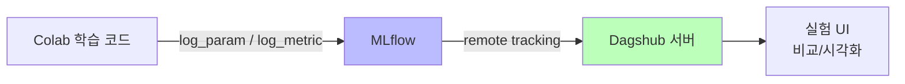

# Day 1-1: 환경 설정 & MLflow 세팅

딥러닝 부트캠프 - 실험 환경 구축하기

---
layout: default
---

# 학습 목표

- 🖥️ **Google Colab Pro**에서 GPU를 확인하고 환경을 구성한다
- 🌐 **Dagshub** 계정을 생성하고 MLflow와 연동한다
- 📊 **체계적인 실험 관리**의 중요성을 이해한다
- 📁 **Dacon 데이터**를 다운로드하고 Colab에 로드한다

---
layout: default
---

# 🔧 노트북: 1️⃣ Google Colab 환경 확인

### 이 구간에서 할 일
- GPU가 제대로 할당되어 있는지 확인 (`torch.cuda.is_available()`)
- GPU가 없다면: **런타임 > 런타임 유형 변경 > GPU(T4)** 선택 후 재연결

### 참고
Google Drive 연동은 선택사항입니다. 이번 실습에서는 **직접 업로드 방식**을 기본으로 합니다.

---
layout: center
class: text-center
---

# Dagshub & MLflow 설정

---
layout: default
---

# Dagshub란?

### ML 실험을 체계적으로 관리할 수 있는 플랫폼

- MLflow UI를 제공하여 실험 결과를 **시각적으로 비교**
- **GitHub 계정**으로 간편하게 가입 가능
- 실험 기록이 **Dagshub 서버에 저장** → 런타임이 끊겨도 유지

---
layout: default
---

# 왜 실험을 기록해야 할까?

### 딥러닝 연구에서 흔히 겪는 문제

```
실험 1: F1 = 0.82  → 어떤 설정이었지...?
실험 2: F1 = 0.85  → 뭘 바꿨더라...?
실험 3: F1 = 0.79  → 왜 떨어졌지...?
```

MLflow로 모든 실험의 **하이퍼파라미터와 결과**를 자동으로 기록하면 이런 혼란을 방지할 수 있습니다.

### 체계적 실험 관리의 효과
- **재현성**: 어떤 설정으로 좋은 결과를 냈는지 정확히 알 수 있음
- **비교**: 수십, 수백 개의 실험을 체계적으로 비교 가능
- **협업**: 팀원들과 실험 결과를 쉽게 공유 가능

---
layout: top_img-bottom_text
---

# MLflow + Dagshub 연동 구조

::top::



::bottom::

Colab에서 로깅 → Dagshub 서버에 저장 → UI에서 비교

---
layout: default
---

# Dagshub 계정 생성

### 절차
1. [https://dagshub.com](https://dagshub.com/) 접속
2. **GitHub** 또는 **Google** 계정으로 가입/로그인
3. `Create +` > `New Repository` > `Create blank repository` 클릭
4. **Repository name**: `deeplearning-bootcamp` (원하는 이름 가능)
5. **Visibility**: Public 권장
6. `Create Repository` 클릭
7. **repo_owner**(username)와 **repo_name** 기억해두기

---
layout: default
---

# 🔧 노트북: 2️⃣ Dagshub & MLflow 설정

### 🔥 함께 작성해볼 부분
- **repo_owner**: 본인의 Dagshub username
- **repo_name**: 생성한 repository 이름

```python
repo_owner = # 🔥 직접 작성이 필요합니다.
repo_name  = # 🔥 직접 작성이 필요합니다.
dagshub.init(repo_owner=repo_owner, repo_name=repo_name, mlflow=True)
```

---
layout: center
class: text-center
---

# MLflow 첫 실험 로깅

---
layout: default
---

# MLflow 기본 로깅 구조

MLflow 실험은 세 가지 핵심 요소로 구성됩니다.

### `mlflow.start_run(run_name=...)`
실험 하나를 시작합니다. `run_name`으로 나중에 구분할 이름을 붙입니다.

### `mlflow.log_param(key, value)`
학습에 사용한 **설정값**을 기록합니다. (예: learning_rate, batch_size)

### `mlflow.log_metric(key, value)`
학습 결과 **수치**를 기록합니다. (예: accuracy, f1_score)

---
layout: default
---

# 🔧 노트북: 3️⃣ MLflow 첫 실험 로깅 테스트

### 🔥 함께 작성해볼 부분

**기본 로깅**: run_name, log_param, log_metric에 원하는 이름·키·값을 채워보세요.

```python
with mlflow.start_run(run_name=""):  # 🔥 직접 작성이 필요합니다.
    mlflow.log_param("", )   # 🔥 직접 작성이 필요합니다.
    mlflow.log_metric("", )  # 🔥 직접 작성이 필요합니다.
```

**여러 실험 시뮬레이션**: learning_rate, batch_size를 랜덤으로 선택하는 5개 실험을 실행합니다.

---
layout: default
---

# Dagshub UI에서 결과 확인

### 확인 절차
1. Dagshub 프로젝트 페이지 이동
2. 좌측 메뉴 **"Experiments"** 클릭
3. 기록한 실험 목록 확인 → 각 실험의 **Parameters**, **Metrics** 비교

### 핵심 기능
여러 실험을 체크박스로 선택 → **"Compare"** → Parallel Coordinates로 최적 하이퍼파라미터 시각화

---
layout: center
class: text-center
---

# Dacon 데이터 다운로드

---
layout: default
---

# Dacon 데이터 소개

### 대회: 월간 데이콘 뉴스 토픽 분류

| 파일 | 내용 |
|:---|:---|
| `train_data.csv` | 학습용 뉴스 헤드라인 + 토픽 레이블 |
| `test_data.csv` | 평가용 뉴스 헤드라인 |
| `topic_dict.csv` | 7개 토픽 번호 ↔ 이름 매핑 |
| `sample_submission.csv` | 제출 양식 |

**7개 토픽**: 정치, 경제, 사회, 생활/문화, 세계, IT/과학, 스포츠

---
layout: default
---

# 🔧 노트북: 4️⃣ Dacon 데이터 다운로드

### 이 구간에서 할 일
1. [dacon.io](https://dacon.io/) > 뉴스 토픽 분류 대회 > **데이터 탭**에서 4개 파일 다운로드
2. 4개 파일을 **ZIP으로 압축**
3. 노트북에서 `files.upload()`로 업로드 → 자동 압축 해제
4. `train_data.csv`, `test_data.csv` 로드 확인

---
layout: two-cols-header
---

# 오늘 배운 것

::left::

| **내용** | **도구** |
|:---|:---|
| GPU 환경 확인 | PyTorch |
| 실험 기록 플랫폼 | Dagshub |
| 실험 추적 라이브러리 | MLflow |
| 데이터 로드 | Pandas |

::right::

### 다음 시간
- 오늘 구축한 환경 위에서 **뉴스 토픽 분류 베이스라인** 구현
- TF-IDF + Logistic Regression으로 첫 번째 모델 학습

---
layout: default
---

# ✅ 체크리스트

- [ ] GPU 사용 가능 확인 (T4 또는 다른 GPU)
- [ ] Dagshub 계정 생성 및 Repository 생성
- [ ] Colab에서 Dagshub MLflow 연동 성공
- [ ] 첫 실험 로깅 및 Dagshub UI에서 확인
- [ ] Dacon 계정 생성 및 데이터 다운로드
- [ ] 데이터 Colab 업로드 및 로드 확인

---
layout: default
---

# 🔧 트러블슈팅

### GPU가 할당되지 않았어요
→ 런타임 > 런타임 유형 변경 > GPU(T4) 선택. Colab Pro 활성화 확인.

### `dagshub.init()` 실행 시 에러
→ `repo_owner`, `repo_name` 대소문자를 정확히 입력. Dagshub 프로필 URL에서 username 복사 권장.

### MLflow UI에 실험이 안 보여요
→ 10~30초 기다리거나 새로고침. 동기화에 시간이 걸릴 수 있음.

### 런타임이 끊어지면 기록이 사라지나요?
→ MLflow 기록은 Dagshub 서버에 저장되므로 런타임이 끊겨도 유지됨.
