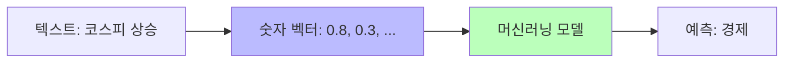
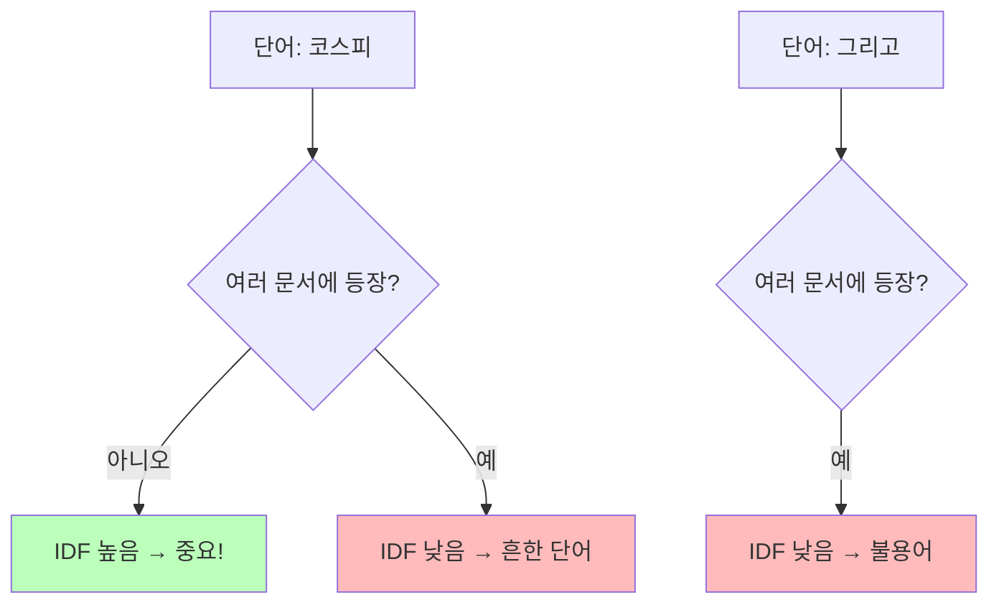
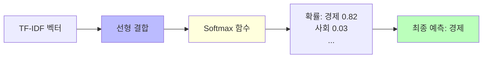
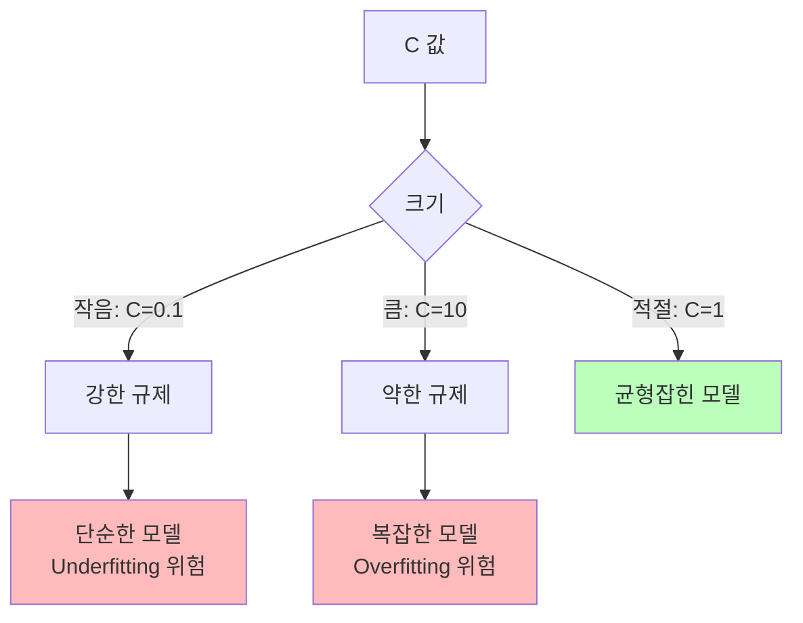
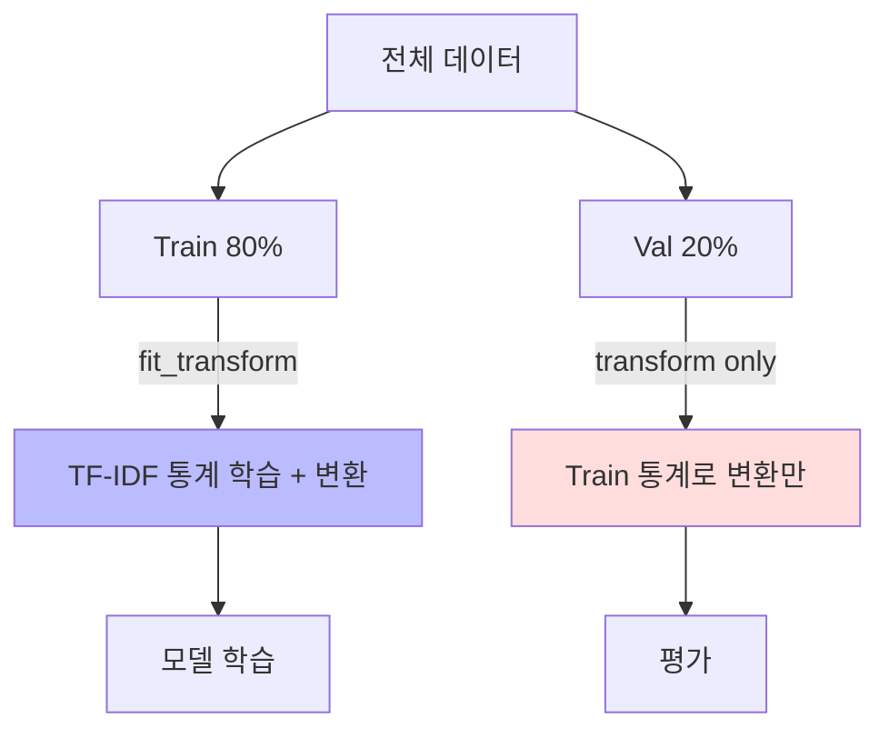
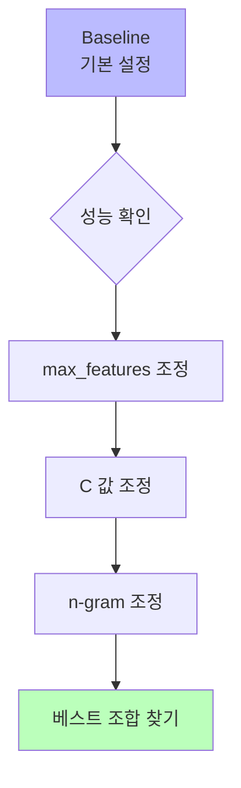
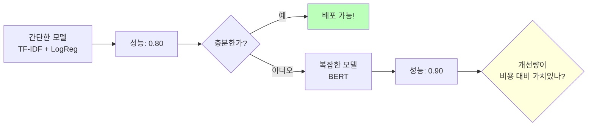

# Day 1-2: 문제 이해와 베이스라인

뉴스 토픽 분류 문제 이해 & TF-IDF + LogReg 베이스라인 구축

---
layout: default
---

# 학습 목표

- 📰 **뉴스 토픽 분류** 문제의 특성 이해 (7개 토픽, Macro F1)
- 📊 **EDA**를 통한 데이터 인사이트 도출
- 🔢 **TF-IDF + Logistic Regression** 베이스라인 구축
- 📈 **MLflow**로 첫 실전 실험 기록

---
layout: default
---

# 🔧 노트북: 0. 환경 재설정

### 이 구간에서 할 일
- Day 1-1에서 사용한 Dagshub & MLflow 재연동
- 라이브러리 임포트 확인

---
layout: center
class: text-center
---

# 문제 정의

---
layout: default
---

# 문제 정의

### 이번 과제
뉴스 **헤드라인**을 읽고 **7개 토픽** 중 하나로 분류하는 **멀티클래스 분류** 문제입니다.

### 평가 지표
**Macro F1-Score** — 모든 토픽을 동등하게 평가

---
layout: default
---

# 문제 정의: 7개 토픽

| **토픽 인덱스** | **토픽 이름** |
|:---:|:---|
| 0 | 정치 |
| 1 | 경제 |
| 2 | 사회 |
| 3 | 생활/문화 |
| 4 | 세계 |
| 5 | IT/과학 |
| 6 | 스포츠 |

---
layout: default
---

# 탐색적 데이터 분석 (EDA)

### 데이터 로드 후 확인할 것들

- **토픽별 분포**: 클래스 불균형이 있는가?
- **텍스트 길이**: 뉴스 헤드라인의 평균 길이는?
- **샘플 확인**: 각 토픽의 실제 헤드라인 예시

### 주목할 점
뉴스 헤드라인은 대부분 짧고 키워드 중심 → TF-IDF가 의외로 잘 동작할 수 있음

---
layout: default
---

# 🔧 노트북: 1. 데이터 로드

### 이 구간에서 할 일
- `train_data.csv`, `test_data.csv` 로드
- 데이터 크기(shape), 컬럼, 샘플 확인

---
layout: default
---

# 🔧 노트북: 2. 탐색적 데이터 분석 (EDA)

### 이 구간에서 할 일
- 토픽별 분포 시각화
- 헤드라인 텍스트 길이 분포 확인
- 토픽별 샘플 헤드라인 출력

---
layout: center
class: text-center
---

# 텍스트를 숫자로: TF-IDF

---
layout: top_img-bottom_text
---

# 왜 텍스트를 숫자로 바꾸나?

머신러닝 모델은 숫자만 이해합니다.

::top::



::bottom::

텍스트를 수치 벡터로 변환해야 합니다.

---
layout: two-cols-header
---

# Bag-of-Words (BoW)

### 가장 단순한 방법
각 단어의 등장 횟수를 세는 것

::left::

**단어 사전**: [코스피, 상승, 하락, 환율]

**벡터 예시**:
- "코스피 상승" → [1, 1, 0, 0]
- "코스피 하락" → [1, 0, 1, 0]
- "환율 상승" → [0, 1, 0, 1]

::right::

<div class="text-red-500 mt-4">

❌ **문제점**: 모든 단어를 동등하게 취급.  
"코스피"와 "그리고"를 같은 비중으로 취급.

</div>

---
layout: default
---

# TF-IDF: 중요한 단어에 가중치

### 수식과 직관
- **TF (Term Frequency)**: 문서 내 단어 빈도  
  `TF = (단어 등장 횟수) / (문서 전체 단어 수)`
- **IDF (Inverse Document Frequency)**: 단어의 희귀성  
  `IDF = log((전체 문서 수) / (단어가 등장한 문서 수))`
- **TF-IDF = TF × IDF**

**직관**: 이 문서에서 자주 나오면서 (TF↑), 다른 문서에는 잘 안 나오는 단어 (IDF↑) → **중요한 단어**

---
layout: top_img-bottom_text
---

# TF-IDF: IDF 직관

::top::



::bottom::

- **코스피**: 경제 뉴스에만 등장 → IDF 높음 → ⭐ 중요  
- **그리고**: 모든 뉴스에 등장 → IDF 낮음 → 불용어

---
layout: default
---

# 한국어: Character n-gram

### 한국어 교착어 문제
"경제가", "경제는", "경제의" → TF-IDF는 모두 **다른 단어**로 취급

### 해결책: `analyzer='char'` (문자 단위 분석)

```python
"코스피" → ["코", "스", "피", "코스", "스피", "코스피"]
```

- 형태소 분석기 없이도 한국어 처리 가능
- 띄어쓰기 오류에 강건

→ 이번 실습에서 **`analyzer='char'`** 사용

---
layout: center
class: text-center
---

# Logistic Regression

---
layout: top_img-bottom_text
---

# Logistic Regression 원리

::top::



::bottom::

- **점수** = w₁×특성₁ + w₂×특성₂ + ... + b  
- **확률** = Softmax(점수) → 7개 토픽 각각의 확률  
- **예측** = 가장 높은 확률의 토픽

---
layout: img_caption
---

# C 파라미터 (Regularization)

::img-fit-width::



::caption::

과적합을 방지하는 **규제 강도**를 조절합니다.  
C=1.0으로 시작 → 0.1, 10.0 비교 → 최적값 탐색

---
layout: center
class: text-center
---

# 평가 지표: Accuracy vs F1

---
layout: two-cols-header
---

# Accuracy의 함정

::left::

### 예시
- 데이터: 정치 90%, 나머지 10%
- 모델: 무조건 "정치" 예측  
→ **Accuracy = 90%**

**하지만** 소수 클래스(경제 등)는 전혀 못 맞춤 → 쓸모없는 모델!

::right::

### 해결: F1-Score
Precision과 Recall의 조화 평균

**Macro F1**: 각 클래스 F1의 **단순 평균** → 모든 토픽을 동등하게 평가  
→ **이 대회에서 사용**

---
layout: center
class: text-center
---

# 베이스라인 구현 전 주의사항

---
layout: img_caption
---

# Train/Val 분리: 데이터 누수 주의

::img-fit-width::



::caption::

**Train에만** `fit_transform`, **Val에는** `transform`만 → 데이터 누수 방지

---
layout: default
---

# 🔧 노트북: 3. 베이스라인 모델

### 🔥 함께 작성해볼 부분
- **train_test_split**: Train/Validation 분리 (80/20, stratify)
- **TfidfVectorizer**: `analyzer='char'` 등 파라미터 설정
- **fit_transform** (train) / **transform** (val)
- **LogisticRegression** 모델 생성
- 예측·평가 지표 계산 (accuracy_score, f1_score)

---
layout: center
class: text-center
---

# MLflow 실험 기록

---
layout: default
---

# MLflow 실험 기록

### 기록할 내용
- **파라미터**: max_features, C, analyzer, ngram_range 등
- **메트릭**: val_f1_macro, val_accuracy

### run_name 규칙
설정을 이름에 명시해두면 나중에 구분이 쉽습니다.

```python
with mlflow.start_run(run_name="tfidf-maxfeat5000-C1.0-unigram"):
    mlflow.log_param('max_features', 5000)
    mlflow.log_param('C', 1.0)
    mlflow.log_metric('val_f1_macro', val_f1)
```

---
layout: default
---

# 🔧 노트북: 4. MLflow 실험 로깅

### 🔥 함께 작성해볼 부분
- **run_name**: 실험을 구분하기 쉬운 이름으로 채우기

```python
with mlflow.start_run(run_name=""):  # 🔥 직접 작성이 필요합니다.
    mlflow.log_param('max_features', 5000)
    mlflow.log_param('C', 1.0)
    mlflow.log_metric('val_f1_macro', val_f1)
```

---
layout: center
class: text-center
---

# 성능 개선 실험

---
layout: img_caption
---

# 실험 설계 원칙

::img-fit-width::



한 번에 하나의 파라미터만 변경!

---
layout: default
---

# 실험 설계 목록

### 실험 순서
1. **max_features** 조정 (3000 / 5000 / 10000)
2. **C** 값 조정 (0.1 / 1.0 / 10.0)
3. **ngram_range** 조정 ((1,1) / (1,2) / (2,3))

### 예상 결과 패턴
- **max_features ↑** → F1 ↑ (일정 수준까지)
- **C = 0.1** → 규제 강함, Underfitting 가능
- **C = 10.0** → 규제 약함, Overfitting 가능
- **ngram (1,2)** → 약간의 성능 향상 기대

---
layout: default
---

# 🔧 노트북: 5. 성능 개선 실험

### 이 구간에서 할 일
- max_features, C, ngram_range 조합을 바꿔가며 실험
- 각 실험마다 MLflow run_name에 설정을 명시해 기록

---
layout: default
---

# 🔧 노트북: 6. 실험 결과 비교

### 이 구간에서 할 일
- Dagshub UI에서 실험 목록 확인
- 체크박스로 실험 선택 → **Compare** → Parallel Coordinates
- 최고 성능 설정 확인

---
layout: top_img-bottom_text
---

# 베이스라인의 의미

::top::



::bottom::

### 베이스라인의 역할
1. **빠른 검증**: 데이터에 문제가 없는지 빠르게 확인
2. **비교 기준**: BERT가 얼마나 더 나은지 측정
3. **실용성**: 때로는 TF-IDF만으로도 충분

---
layout: default
---

# TF-IDF vs BERT 비교

| **특성** | **TF-IDF + LogReg** | **BERT** |
|:---|:---|:---|
| 학습 시간 | ~1분 | ~10분 |
| GPU 필요 | ❌ | ✅ |
| 예상 F1 | ~0.80 | ~0.90 |
| 해석 가능성 | 높음 | 낮음 |
| 메모리 | 적음 | 많음 |

---
layout: default
---

# ✅ 체크리스트

- [ ] 데이터 로드 및 기본 정보 확인 (shape, columns)
- [ ] EDA 완료 (토픽 분포, 텍스트 길이, 샘플 확인)
- [ ] Train/Validation 분리 (80/20, stratify)
- [ ] TF-IDF 변환 완료 (`analyzer='char'` 이유 이해)
- [ ] 베이스라인 F1-Score 확인
- [ ] Confusion Matrix 해석 (어느 토픽끼리 혼동?)
- [ ] 최소 3개 이상 실험 + MLflow 기록
- [ ] Dagshub에서 실험 비교 확인
