# Day 1-3: Transformer 모델 (BERT)

BERT의 핵심 개념 & Hugging Face로 뉴스 토픽 분류 Fine-tuning

---
layout: default
---

# 학습 목표

- 📖 **BERT**의 핵심 개념 이해 (Attention, 사전학습, Fine-tuning)
- 🔧 **Hugging Face Transformers** 라이브러리 사용
- 🇰🇷 **KoBERT** Fine-tuning으로 성능 향상 (F1 ~0.90)
- 📊 **MLflow**로 BERT 실험 기록 및 베이스라인과 비교

---
layout: default
---

# 🔧 노트북: 0. 환경 재설정

### 이 구간에서 할 일
- Transformers·datasets 설치, 라이브러리 임포트
- Dagshub & MLflow 재연동 (**repo_owner**, **repo_name** 작성)

노트북 **0. 환경 재설정**과 **1. 데이터 준비**까지 진행한 뒤, 다음 슬라이드로 넘어갑니다.

---
layout: default
---

# 📂 노트북: 1. 데이터 준비

### 이 구간에서 할 일

데이터 로드, Train/Val 분리, 토픽 분포 확인까지 진행해 주세요.

---
layout: center
class: text-center
---

# 2. BERT 모델 및 Tokenizer (이론)

---
layout: center
class: text-center
---

# 2-1. TF-IDF의 한계와 딥러닝의 접근

---
layout: default
---

# 2-1. TF-IDF가 못하는 것

### 예시
- "배가 고프다" → TF-IDF: "배" = 숫자 하나  
- "배로 떠났다" → TF-IDF: "배" = **같은 숫자** (의미 구분 불가!)

<div class="mt-8" />

### TF-IDF의 근본적 한계
- **단어 순서 무시**: "주가 상승"과 "상승 주가" 동일 취급  
- **문맥 이해 불가**: 동음이의어 구분 불가  
- **동의어 인식 불가**: "오르다"와 "상승"을 별개 단어로 처리

---
layout: img_caption
---

# 2-1. TF-IDF의 한계 (다이어그램)

::img-fit-width::

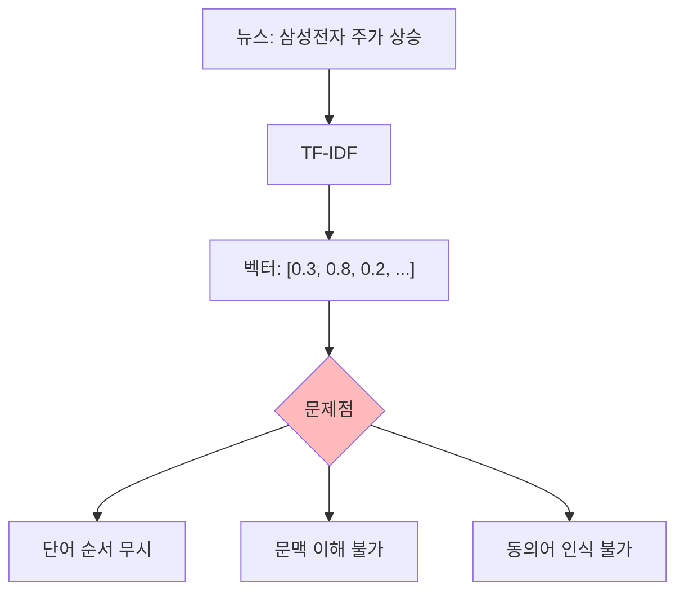

---
layout: default
---

# 2-1. 딥러닝의 접근: 의미 벡터

### TF-IDF vs BERT
- **TF-IDF**: 단어 = 숫자 하나 → "경제" → 0.82  
- **BERT**: 단어 = **768차원 의미 벡터** → 문맥에 따라 다른 벡터

같은 단어라도 문맥에 따라 다른 벡터로 표현됩니다.

---
layout: center
class: text-center
---

# 2-2. Transformer 아키텍처

---
layout: default
---

# 2-2. RNN/LSTM의 문제점

- **순차적 처리** → 병렬화 불가 → 느림  
- **긴 문장** → 앞부분 정보 손실 (Vanishing Gradient)

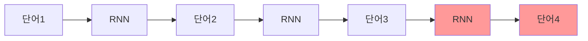

---
layout: default
---

# 2-2. Attention 메커니즘

### 핵심 아이디어
모든 단어를 **동시에** 보면서, 현재 단어와 **관련 있는 단어에 집중**하자!

**Query(현재 단어) × Key(각 단어 특성) → Attention 가중치 → Value(각 단어 정보) 가중합**

---
layout: img_caption
---

# 2-2. Attention 예시

::img-fit-width::

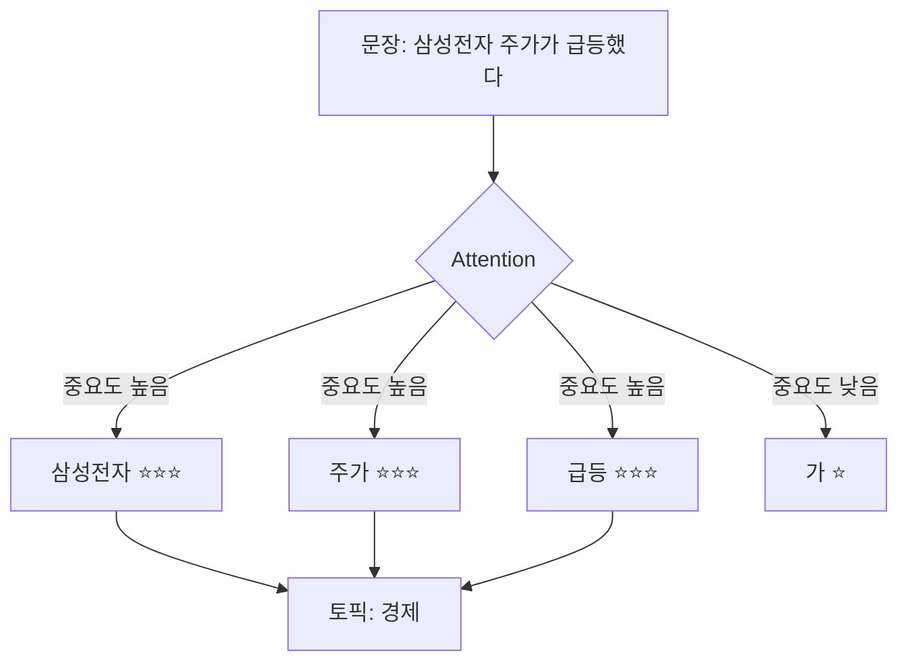

::bottom::

---
layout: img_caption
---

# 2-2. Multi-Head Attention

::img-fit-width::

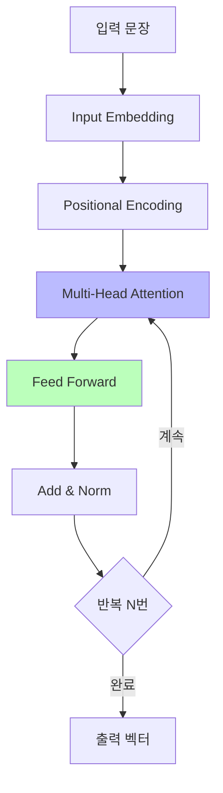

::caption::

여러 **Head**가 서로 다른 관점에서 동시에 Attention을 계산합니다. 
(문법·의미·주제 등) → **풍부한 문맥 표현** 생성

---
layout: center
class: text-center
---

# 2-3. BERT: 사전학습 + Fine-tuning

---
layout: default
---

# 2-3. 사전학습 (Pre-training)

대량의 텍스트로 두 가지 태스크를 학습합니다.

### Masked Language Model (MLM)
- 원본: "삼성전자가 신제품을 출시했다"  
- 마스킹: "삼성전자가 [MASK]을 출시했다"  
- 학습: [MASK]에 "신제품" 예측

### Next Sentence Prediction (NSP)
- 문장 A, B가 이어지는지 예측

---
layout: top_img-bottom_text
---

# 2-3. Fine-tuning (미세조정)

::top::


::bottom::

**비유**: 사전학습 = 대학 교육, Fine-tuning = 직무 교육

---
layout: default
---

# 2-3. 한국어 BERT 모델 선택

| **모델** | **특징** | **추천 상황** |
|:---|:---|:---|
| `klue/bert-base` | 범용, 안정적 | 뉴스, 공식 문서 |
| `klue/roberta-base` | BERT 개선, 성능 ↑ | 성능 우선 |
| `beomi/kcbert-base` | 댓글/구어체 특화 | SNS, 댓글 |

**이번 실습**: 뉴스 헤드라인 → `klue/bert-base`부터 시작

---
layout: top_img-bottom_text
---

# 2-3. 커스텀 vs 사전학습 모델

::top::

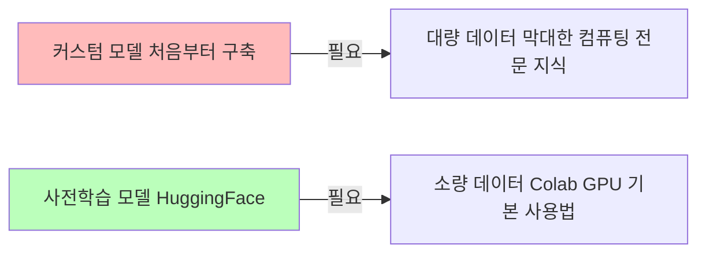

::bottom::

**현실적 선택**: HuggingFace 사전학습 모델 활용 — 이미 검증됨, 시간과 비용 절약

---
layout: top_img-bottom_text
---

# 2-4. Tokenization

BERT는 텍스트를 토큰으로 분해합니다.

::top::

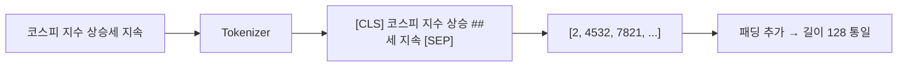

::bottom::

### 특수 토큰
- **`[CLS]`**: 문장 전체의 의미 (분류에 사용)  
- **`[SEP]`**: 문장 구분  
- **`[PAD]`**: 길이 맞추기  

---
layout: top_img-bottom_text
---

# 2-4. BERT 출력 → 분류

::top::

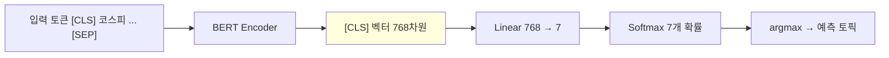

::bottom::

`[CLS]` 벡터가 문장 전체 의미를 담고, 분류 레이어를 거쳐 최종 토픽을 예측합니다.

---
layout: default
---

# 🤖 노트북: 2. BERT 모델 및 Tokenizer 로드

### 이 구간에서 할 일
- **model_name** & **tokenizer** (예: `klue/bert-base`)
- **model**: `AutoModelForSequenceClassification.from_pretrained(..., num_labels=7)`
- 토큰화 함수 정의 및 `train_tokenized`, `val_tokenized` 생성

노트북 **2. BERT 모델 및 Tokenizer 로드**를 진행한 뒤, 다음 슬라이드로 넘어갑니다.

---
layout: default
---

# 3. BERT Fine-tuning

### Fine-tuning이란
우리 태스크(**뉴스 7-class 분류**)에 맞게, 이미 한국어를 이해하는 BERT를 **추가로 학습**하는 단계입니다.

### Hugging Face에서의 역할
- **TrainingArguments**: 에포크 수, 배치 크기, 학습률, warmup, 저장 주기 등 한 번에 설정  
- **Trainer**: 학습 루프(에포크 반복, 배치 단위 학습, 검증, 체크포인트 저장)를 대신 처리

---
layout: default
---

# 3.1 모델 로드 & Fine-tuning 설정

### 실습 노트북에서 할 일
- **TrainingArguments**: num_train_epochs, batch_size, learning_rate, warmup_steps, weight_decay 등  
- **compute_metrics**: accuracy_score, f1_score로 acc·f1_macro 계산 후 반환  
- **Trainer** 생성 (model, args, train_dataset, eval_dataset, compute_metrics)  
- `trainer.train()` 실행

---
layout: top_img-bottom_text
---

# 3.2.1 Learning Rate

한 번에 얼마나 많이 가중치를 업데이트할지 결정합니다.

::top::

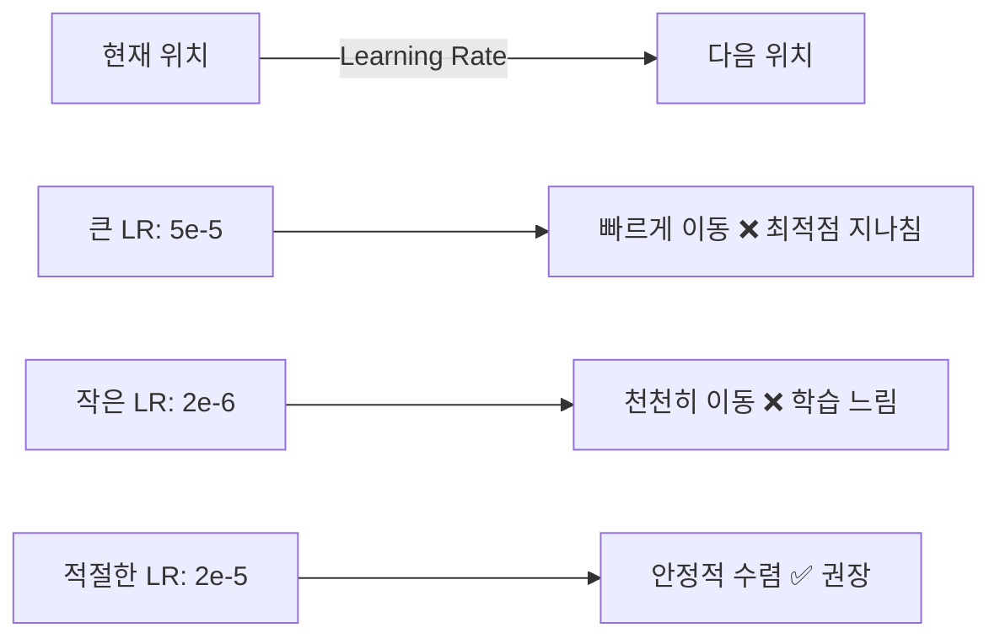

::bottom::

**2e-5**: BERT Fine-tuning 권장값

---
layout: img_caption
---

# 3.2.2 Epochs

전체 데이터를 몇 번 반복 학습할지 결정합니다.

::img-fit-width::

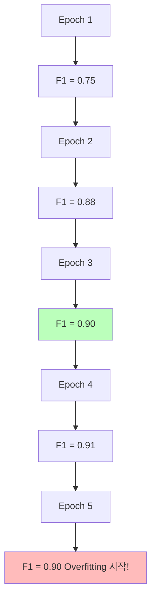

::caption::

`load_best_model_at_end=True`로 Validation F1 최고 시점 모델 자동 사용

---
layout: default
---

# 3.2.3 Warmup Steps

학습 초반에 LR을 작은 값부터 점진적으로 증가시킵니다.  
처음부터 큰 LR을 쓰면 **사전학습된 가중치가 무너질 수** 있기 때문입니다.

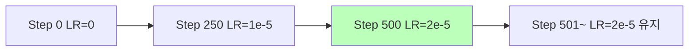

---
layout: default
---

# 🔥 실습에서 함께 작성해볼 부분 (3번 구간)

- **TrainingArguments**: num_train_epochs, per_device_train_batch_size, per_device_eval_batch_size, learning_rate, warmup_steps, weight_decay  
- **compute_metrics**: accuracy_score, f1_score → `{'accuracy', 'f1'}` 반환  
- **Trainer** 생성: model, args, train_dataset, eval_dataset, compute_metrics  

(평가·MLflow 작성 구간은 4, 5번에서 진행)

---
layout: default
---

# 🏋️ 노트북: 3. BERT Fine-tuning

### 이 구간에서 할 일
- TrainingArguments, compute_metrics, Trainer 작성  
- `trainer.train()` 실행 (GPU에 따라 5~15분)

노트북 **3. BERT Fine-tuning**을 마치면 → 다음 슬라이드 안내 후 **4. 모델 평가**를 진행합니다.

---
layout: default
---

# 📊 노트북: 4. 모델 평가

### 이 구간에서 할 일
- **eval_result**: `trainer.evaluate()`
- **predictions**, **y_pred**, **y_true**: `trainer.predict(val_tokenized)` 후 argmax·label  
- Classification Report, Confusion Matrix 확인

노트북 **4. 모델 평가**를 진행한 뒤, **5. MLflow** 슬라이드로 넘어갑니다.

---
layout: default
---

# 5. MLflow 실험 기록

### 🔥 이 부분은 수정이 필요합니다
실습 노트북에서 **run_name**을 비워두었습니다.  
BERT 실험을 구분하기 쉬운 이름으로 채운 뒤 Dagshub UI에서 확인해보세요.

```python
with mlflow.start_run(run_name=""):  # 원하는 실험 이름 입력
    mlflow.log_param('model_name', 'klue/bert-base')
    mlflow.log_param('learning_rate', 2e-5)
    mlflow.log_metric('val_f1_macro', eval_result['eval_f1'])
```

---
layout: default
---

# 🔬 노트북: 5. MLflow 실험 로깅

### 이 구간에서 할 일
- **run_name** 채우기  
- BERT 실험 파라미터·메트릭 로깅  
- (선택) 6. 성능 개선 실험 (LR, epochs, 다른 모델)

노트북 **5. MLflow 실험 로깅**까지 마치면 → 마지막 정리 슬라이드로 넘어갑니다.

---
layout: default
---

# 6. TF-IDF vs BERT 비교

| **항목** | **TF-IDF + LogReg** | **BERT Fine-tuning** |
|:---|:---|:---|
| Val F1 | ~0.82 | ~0.90+ |
| 학습 시간 | ~1분 | ~10분 |
| GPU | ❌ | ✅ |

**성능 향상**: +8~10% (F1 절댓값)

---
layout: img_caption
---

# 6. 언제 어떤 모델을?

::img-fit-width::

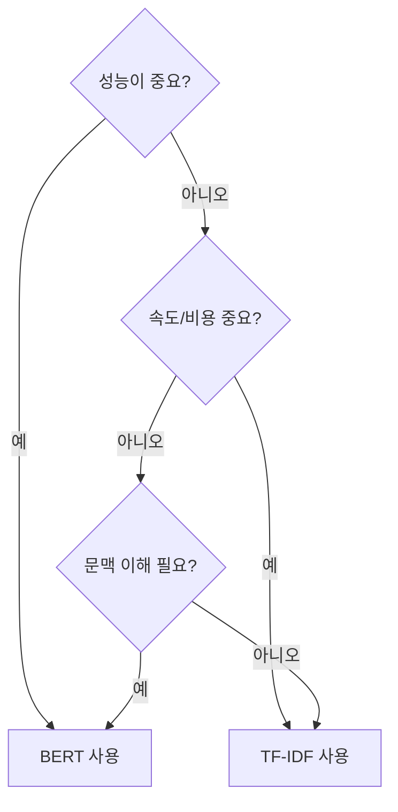

---
layout: default
---

# ✅ 체크리스트

- [ ] BERT가 RNN보다 나은 이유 (Attention) 이해  
- [ ] 사전학습 (MLM, NSP) 이해  
- [ ] Fine-tuning vs 처음부터 학습 차이 이해  
- [ ] Tokenizer 로드 및 토큰화 완료  
- [ ] `[CLS]`, `[SEP]`, `[PAD]` 역할 이해  
- [ ] BERT 학습 완료 및 MLflow 기록  
- [ ] TF-IDF 대비 BERT 성능 향상 확인  

---
layout: default
---

# 🔧 트러블슈팅

### GPU Out of Memory
- `per_device_train_batch_size` 16 → 8  
- 또는 `fp16=False`

### 학습이 너무 느려요
- GPU 확인: `torch.cuda.is_available()`  
- `fp16=True` 활성화

### F1이 낮아요
- Learning rate 낮추기 (1e-5)  
- Epochs 늘리기  
- 데이터 label 매핑 확인
