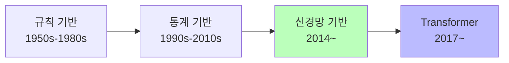
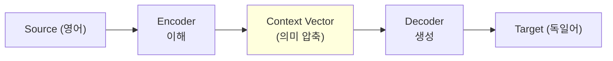
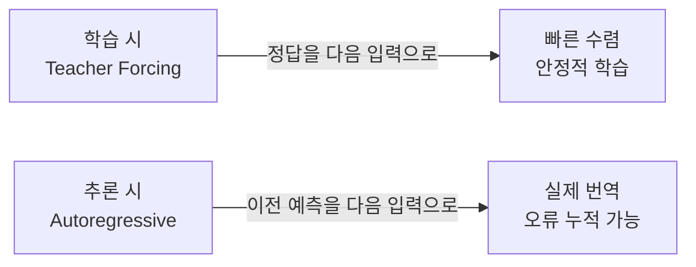
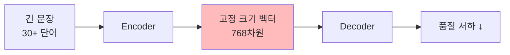
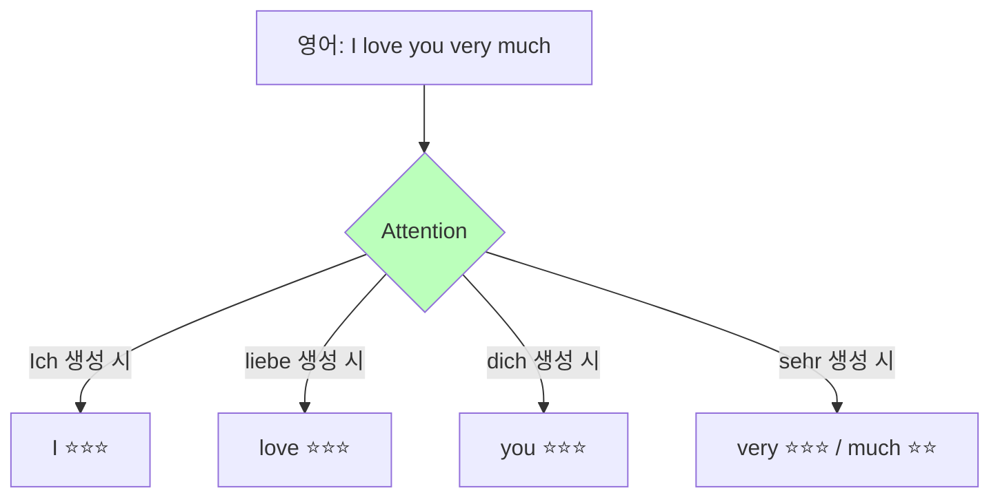
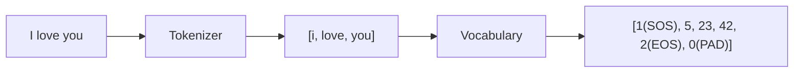
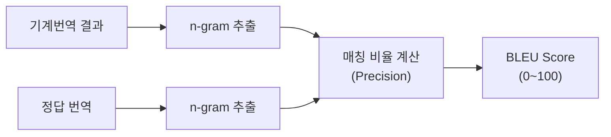
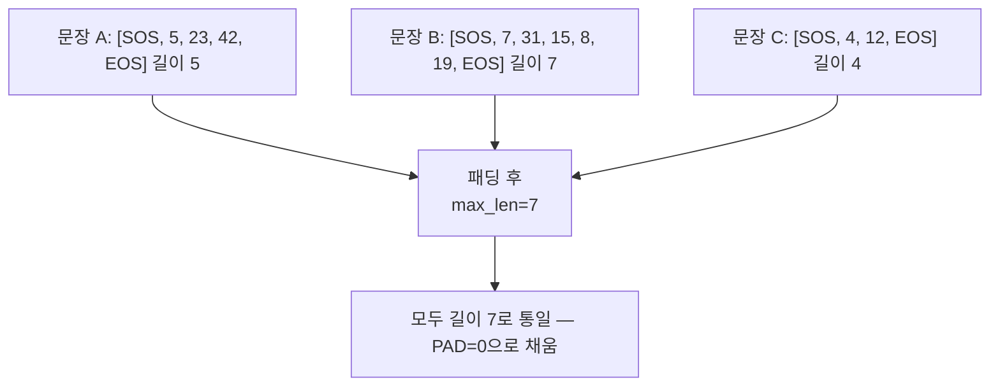

# Day 2-1: Seq2Seq 기초

데이터 탐색 & BLEU Score — EN→DE 기계번역 첫걸음

---
layout: default
---

# 학습 목표

- 🌍 **병렬 코퍼스**의 구조와 특성 이해
- 🔤 **토큰화·Vocabulary** 구축 원리 습득
- 📊 **BLEU Score** 직접 계산하며 직관 쌓기
- ⚙️ **Seq2Seq 입력 형식**으로 데이터 전처리 (패딩 / SOS / EOS)
- 📈 **MLflow**로 데이터 탐색 실험 기록

---
layout: default
---

# 🔧 노트북: 0. 환경 설정

### 🔥 함께 작성해볼 부분

- **repo_owner**, **repo_name**을 본인의 Dagshub 정보로 채우기

```python
repo_owner = # 🔥 직접 작성이 필요합니다.
repo_name  = # 🔥 직접 작성이 필요합니다.
dagshub.init(repo_owner=repo_owner, repo_name=repo_name, mlflow=True)
```

---
layout: center
class: text-center
---

# 기계번역이란?

---
layout: top_img-bottom_text
---

# 기계번역의 역사

::top::



::bottom::

- **규칙 기반**: 단어 사전 + 문법 규칙. 예외 처리·확장성 문제  
- **통계 기반**: 병렬 코퍼스에서 확률 학습. 긴 문장 품질 저하  
- **신경망 기반**: End-to-end 학습으로 해결 → Transformer가 현재 표준

---
layout: default
---

# 기계번역의 어려움

### 단어 중의성·어순 차이

```
영어:   Subject - Verb - Object  →  "I love you"
한국어: Subject - Object - Verb  →  "나는 너를 사랑해"
독일어: "Ich liebe dich" (동사 위치가 맥락에 따라 달라짐)
```

### 번역을 어렵게 만드는 요소

- **단어 중의성**: "bank" = 은행? 강둑?
- **관용 표현**: 직역이 의미를 잃는 경우
- **문화적 차이**: 언어마다 다른 표현 방식
- **어순 차이**: 언어마다 문법 구조가 다름

---
layout: center
class: text-center
---

# Encoder-Decoder 구조

---
layout: top_img-bottom_text
---

# Encoder-Decoder 핵심 아이디어

### "번역 = 이해(Encoder) + 생성(Decoder)"

::top::



::bottom::

- Encoder: 입력 문장을 고정 크기 **Context Vector**로 압축  
- Decoder: 이 벡터로부터 타겟 언어 단어를 하나씩 생성

---
layout: top_img-bottom_text
---

# 학습 방식: Teacher Forcing

::top::



::bottom::

Teacher Forcing Ratio = 0.5 이면 학습 중 50% 확률로 정답을, 50%는 예측값을 다음 입력으로 사용

---
layout: top_img-bottom_text
---

# Context Vector의 한계

::top::



::bottom::

모든 정보를 **하나의 벡터**에 담아야 하므로, 문장이 길어질수록 앞부분 정보가 손실됩니다.  
→ 이를 해결한 것이 **Attention 메커니즘**

---
layout: center
class: text-center
---

# Attention 메커니즘

---
layout: top_img-bottom_text
---

# Attention 핵심 아이디어

::top::



::bottom::

Encoder의 **모든 시점 hidden state를 저장**해두고,  
Decoder가 각 단어를 생성할 때 가장 관련 있는 부분에 **집중**합니다.

---
layout: default
---

# Attention 계산 과정

```
1. Encoder: 각 단어의 hidden state 저장
   h1("I"), h2("love"), h3("you"), h4("very"), h5("much")

2. Score: 현재 Decoder state와 각 Encoder state의 유사도
   score(s_dec, h2) = 0.85  ← "love"와 관련!

3. Softmax → Attention Weights (합 = 1.0)

4. Weighted Sum → Context Vector
   context = 0.85 × h2 + ...

5. Context + Decoder state → 다음 단어 생성
```

---
layout: default
---

# Attention의 효과

| | 짧은 문장 | 긴 문장 |
|:---|:---|:---|
| without Attention | BLEU ~0.38 | BLEU ~0.15 |
| with Attention | BLEU ~0.48 | BLEU ~0.35 |

---
layout: default
---

# 🔧 노트북: 1. 데이터 로드 & EDA

### 이 구간에서 할 일

- Tatoeba EN-DE 데이터 다운로드 (KaggleHub)
- 교육용 서브셋 필터링 (단어 수 3~12개, 5,000개 샘플)
- 문장 길이 분포 시각화
- 어휘 분포 확인 (Zipf's Law)

---
layout: center
class: text-center
---

# 토큰화 & Vocabulary

---
layout: top_img-bottom_text
---

# 왜 토큰화가 중요한가?

신경망은 숫자만 처리할 수 있습니다. 문자 → 숫자 변환 과정이 **토큰화**입니다.

::top::



::bottom::

---
layout: default
---

# 특수 토큰의 역할

| **토큰** | **인덱스** | **역할** |
|:---:|:---:|:---|
| `<PAD>` | 0 | 배치 처리를 위한 길이 통일 |
| `<SOS>` | 1 | Decoder 생성 시작 신호 |
| `<EOS>` | 2 | 생성 종료 신호 |
| `<UNK>` | 3 | 사전에 없는 단어 대체 |

### freq_threshold

`freq_threshold=2`의 의미: **2회 미만** 등장한 단어는 `<UNK>`으로 처리  
→ 모델 일반화 성능 향상, 사전 크기 축소

---
layout: default
---

# Vocabulary 구축 주의사항

### 데이터 누수 방지

Vocabulary는 **Train 데이터만**으로 구축해야 합니다.

Validation/Test 데이터의 단어를 미리 알면 → **데이터 누수(Data Leakage)** 발생

### Zipf's Law

빈도 순위 r인 단어의 빈도 ∝ 1/r  
→ 상위 소수 단어가 전체 빈도 대부분을 차지  
→ `freq_threshold=2`로 희귀 단어를 `<UNK>` 처리해도 큰 정보 손실 없음

---
layout: default
---

# 🔧 노트북: Vocabulary 구축

### 🔥 함께 작성해볼 부분

**Vocabulary** 클래스의 `build()` 메서드와 `encode()` 메서드 핵심 부분

```python
def build(self, token_lists):
    freq = # 🔥 직접 작성이 필요합니다. (Counter로 전체 토큰 빈도 계산)
    idx = 4
    for word, count in sorted(freq.items()):
        if count >= self.freq_threshold:
            self.stoi[word] = idx
            self.itos[idx] = word
            idx += 1

def encode(self, tokens):
    return # 🔥 직접 작성이 필요합니다. (self.stoi.get으로 UNK 처리)
```

---
layout: center
class: text-center
---

# BLEU Score

---
layout: top_img-bottom_text
---

# BLEU란?

**BLEU (Bilingual Evaluation Understudy)**: 기계번역 품질을 n-gram 매칭으로 자동 평가

::top::



::bottom::

- **BLEU** 및 **품질 수준**
    - < 10 : 거의 쓸 수 없는 번역
    - 10–29 : 이해는 가능, 오류 많음
    - 30–49 : 충분히 이해 가능
    - 50+ : 전문가 수준

---
layout: default
---

# n-gram이란?

```
문장: "I love you"

1-gram: ["I", "love", "you"]          → 3개
2-gram: ["I love", "love you"]        → 2개
3-gram: ["I love you"]                → 1개
```

n이 커질수록 단어 **순서와 문맥**까지 요구 → 더 엄격한 평가

### Modified Precision — 반복 부풀리기 방지

```
ref  = "The cat"       →  "the/The" 최대 2번까지만 인정
cand = "the the the"   →  Count_clip = min(3, 2) = 2만 인정
```

---
layout: default
---

# BLEU 계산 예시

```
Reference: "The cat is sitting on the mat"

번역 유형              번역문                              BLEU
──────────────────────────────────────────────────────────────
완벽한 번역            The cat is sitting on the mat      100.0
단어 1개 삭제          The cat is on the mat               43.0
관사 변경              A cat is sitting on a mat           43.5
핵심 단어 오류          The dog is sitting on the mat       64.3
순서 뒤섞임            Cat mat sitting the on is           10.3
매우 짧은 번역          The cat                              8.2
```

---
layout: default
---

# BLEU의 한계

### 주요 단점

- **동의어 인식 불가**: "adore"와 "love"는 의미가 같지만 다른 단어로 취급
- **정답이 하나일 때 불리**: 다양한 번역이 가능하지만 하나만 정답으로 설정
- **문법 체크 불가**: 단어는 맞지만 순서가 틀려도 일정 점수

### 결론

BLEU는 **참고용 지표**이며, 최근에는 BERTScore 등 의미론적 지표와 함께 사용합니다.

---
layout: default
---

# 🔧 노트북: 5. BLEU Score

### 이 구간에서 할 일

- `sacrebleu`로 sentence_bleu, corpus_bleu 계산
- n-gram precision 직접 계산 (1-gram ~ 4-gram)
- 다양한 번역 품질 예시로 직관 쌓기

---
layout: center
class: text-center
---

# Seq2Seq 입력 데이터 준비

---
layout: top_img-bottom_text
---

# 패딩(Padding)이 필요한 이유

GPU는 **배치 단위**로 병렬 처리합니다.  
문장마다 길이가 다르면 행렬을 만들 수 없습니다.

::top::



::bottom::

⚠️ `<PAD>` 토큰은 Loss 계산에서 무시해야 합니다.  
`CrossEntropyLoss(ignore_index=0)` 설정 필수

---
layout: default
---

# 🔧 노트북: 6. Seq2Seq 입력 데이터 준비

### 🔥 함께 작성해볼 부분

**encode_sentence()** 함수에서 `max_len`에 맞게 자르고 PAD로 채우는 부분

```python
def encode_sentence(tokens, vocab, max_len, add_sos_eos=True):
    ids = vocab.encode(tokens)
    if add_sos_eos:
        ids = [vocab.SOS] + ids + [vocab.EOS]

    # truncate
    ids = # 🔥 직접 작성이 필요합니다.
    # pad
    ids = # 🔥 직접 작성이 필요합니다.
    return ids
```

---
layout: center
class: text-center
---

# MLflow 실험 기록

---
layout: default
---

# MLflow 기록 내용

### 기록할 파라미터

- `vocab_freq_threshold`, `max_len`, `train_size`, `val_size`

### 기록할 메트릭

- `en_vocab_size`, `de_vocab_size`
- `en_vocab_coverage`, `de_vocab_coverage`

### Vocab Coverage

Train 단어 중 사전에 등록된 비율 — **90% 이상**이 적정 수준

---
layout: default
---

# 🔧 노트북: 7. MLflow 실험 기록

### 🔥 함께 작성해볼 부분

**run_name**을 실험을 구분하기 쉬운 이름으로 채우기

```python
with mlflow.start_run(run_name=''):  # 🔥 직접 작성이 필요합니다.
    mlflow.log_params({
        'vocab_freq_threshold': 2,
        'max_len': 25,
        ...
    })
    mlflow.log_metrics({
        'en_vocab_size': len(en_vocab),
        'de_vocab_size': len(de_vocab),
        ...
    })
```

---
layout: default
---

# 오늘 배운 것

| **개념** | **핵심** |
|:---|:---|
| 병렬 코퍼스 | 동일 내용의 두 언어 문장 쌍 모음 |
| Encoder-Decoder | 이해(압축) + 생성 |
| Attention | 각 단어 생성 시 관련 부분에 집중 |
| 토큰화·Vocabulary | 문자 → 정수 매핑 (`stoi` / `itos`) |
| 특수 토큰 | PAD=0, SOS=1, EOS=2, UNK=3 |
| BLEU Score | n-gram precision 기반 번역 평가 |
| 패딩 | 배치 처리를 위한 max_len 통일 |

---
layout: default
---

# 다음 단계 (Day 2-2)

오늘 준비한 `train_src`, `train_tgt`, `en_vocab`, `de_vocab`을 그대로 사용해  
**GRU 기반 Encoder-Decoder Seq2Seq 모델**을 직접 구현하고 학습합니다!

```
Encoder:
  Embedding → GRU → context vector

Decoder:
  Embedding → GRU (초기 hidden = context) → Linear → Softmax
              ↑ Teacher Forcing으로 학습 안정화
```

---
layout: default
---

# ✅ 체크리스트

- [ ] Tatoeba EN-DE 데이터 다운로드 및 로드
- [ ] 샘플링 필터 (단어 수 3~12개, 5,000개) 설정 완료
- [ ] EDA 완료 (문장 길이 분포, Zipf's Law)
- [ ] 토큰화 함수 구현 (소문자 변환, 구두점 분리)
- [ ] Vocabulary 클래스 구현 (build / encode / decode)
- [ ] 특수 토큰 역할 이해 (`<PAD>`, `<SOS>`, `<EOS>`, `<UNK>`)
- [ ] Train/Validation 분리 (80/20)
- [ ] 패딩 완료 (max_len 설정 이유 이해)
- [ ] BLEU Score 계산 방법 이해
- [ ] MLflow에 데이터 준비 결과 기록
