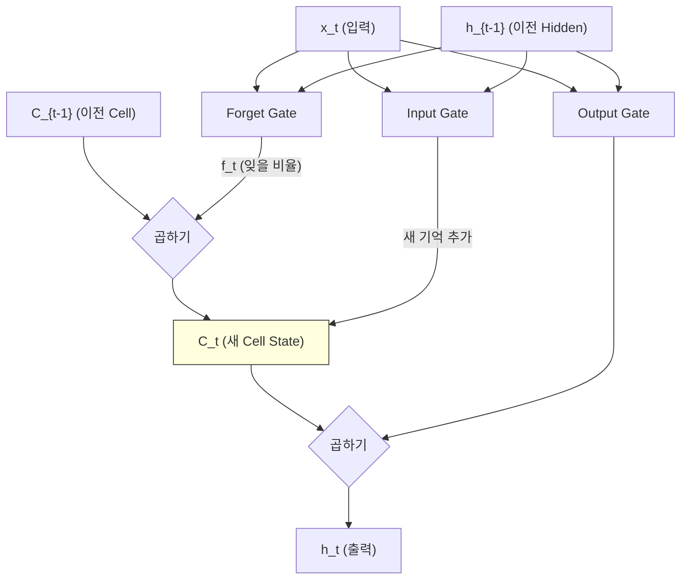
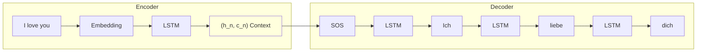
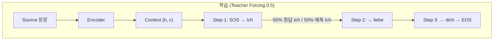
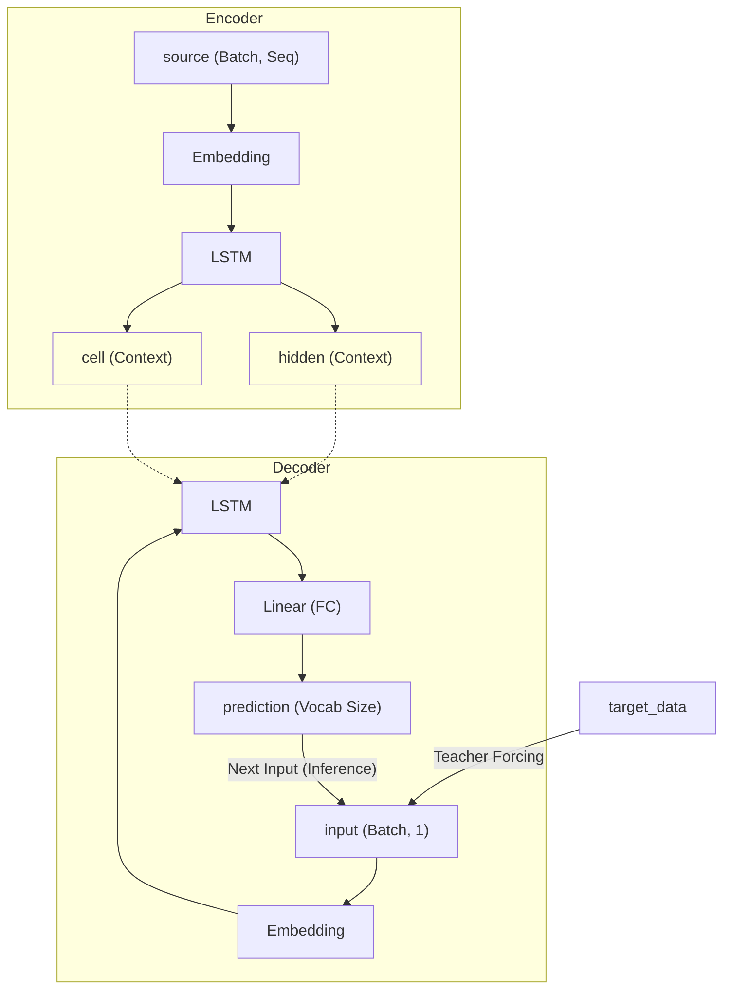
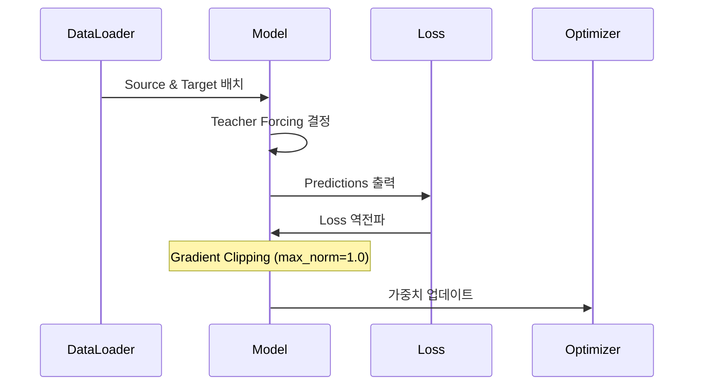
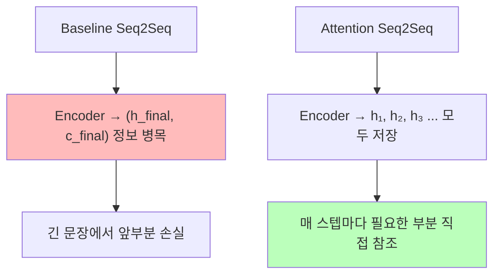
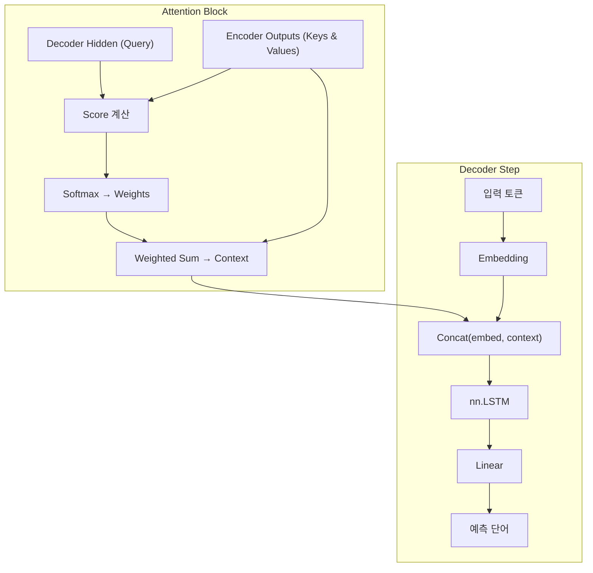

# Day 2-2: LSTM Seq2Seq 모델

직접 구현하는 EN→DE 번역 모델 & Attention 메커니즘

---
layout: default
---

# 학습 목표

- 🧠 **LSTM** 구조와 게이트 역할 이해
- 🏗️ **Encoder-Decoder** 클래스를 직접 구현
- 🎓 **Teacher Forcing** 원리 이해 및 적용
- 📊 **MLflow**로 학습 곡선 기록
- ⭐ (선택) **Attention** 메커니즘으로 성능 향상 체험

---
layout: default
---

# 🔧 노트북: 1. 환경 설정

### 🔥 함께 작성해볼 부분

- **repo_owner**, **repo_name**을 본인의 Dagshub 정보로 채우기

```python
repo_owner = # 🔥 직접 작성이 필요합니다.
repo_name  = # 🔥 직접 작성이 필요합니다.
dagshub.init(repo_owner=repo_owner, repo_name=repo_name, mlflow=True)
```

---
layout: center
class: text-center
---

# LSTM이란?

---
layout: default
---

# 왜 LSTM인가?

### 기본 RNN의 문제

```
문장: "The cat, which was very hungry and tired, ate the food"

RNN: h₁ → h₂ → h₃ → ... → h₁₀
     (cat)         (hungry)       (ate)

문제: h₁₀에서 "cat"의 정보가 희미함! (Vanishing Gradient)
```

### LSTM의 해결책

**Cell State**라는 별도 경로로 장기 기억을 유지합니다.

```
LSTM:
  C₁ → C₂ → C₃ → C₄ → C₅  (Cell State: 장기 기억 경로)
  h₁ → h₂ → h₃ → h₄ → h₅  (Hidden State: 단기 출력)
```

Cell State는 **컨베이어 벨트**처럼 정보를 보존하며 전달합니다.

---
layout: img_caption
---

# LSTM의 4개 게이트

::img-fit-width::



::caption::

- **Forget Gate** : 이전 Cell State에서 무엇을 잊을까?
- **Input Gate** : 무엇을 새로 기억할까?
- **Cell Update** : 새 Cell State 계산
- **Output Gate** : 무엇을 출력할까?

---
layout: center
class: text-center
---

# LSTM Seq2Seq 구조

---
layout: top_img-bottom_text
---

# 전체 흐름

::top::



::bottom::

Encoder가 문장 전체를 읽어 `(hidden, cell)` Context로 압축 → Decoder가 단어를 하나씩 생성

---
layout: default
---

# Encoder

### 역할

입력 문장 전체를 읽고 `(hidden, cell)` Context를 생성합니다.

```python
class Encoder(nn.Module):
    def forward(self, x):
        # 1. Embedding
        embedded = self.dropout(self.embedding(x))   # (batch, seq, embed)

        # 2. LSTM
        outputs, (hidden, cell) = self.lstm(embedded)

        return outputs, hidden, cell  # Context = (hidden, cell)
```

### 포인트

- `outputs`: 모든 시점의 hidden state (Attention에서 사용)
- `hidden`, `cell`: 마지막 상태 → Decoder 초기값

---
layout: default
---

# Decoder

### 역할

Context를 초기 상태로 받아 단어를 **한 번에 1개씩** 생성합니다.

```python
class Decoder(nn.Module):
    def forward(self, x, hidden, cell):
        # x: (batch, 1) — 이전 시점의 단어 1개
        embedded = self.dropout(self.embedding(x))        # (batch, 1, embed)
        output, (hidden, cell) = self.lstm(embedded, (hidden, cell))
        prediction = self.fc(output.squeeze(1))           # (batch, vocab_size)
        return prediction, hidden, cell
```

---
layout: top_img-bottom_text
---

# Seq2Seq: Teacher Forcing

Decoder 루프 안에서 다음 입력을 **정답으로 줄지, 예측값으로 줄지** 결정합니다.

::top::



::bottom::

- Ratio 및 특성
    - 1.0 : 빠른 수렴, Exposure Bias 위험
    - 0.0 : 느린 수렴, 실제 추론에 가까움
    - **0.5** : **절충안 (권장)**

---
layout: img_caption
---

# Seq2Seq 전체 구조도

::img-fit-width::



::caption::

---
layout: default
---

# 🔧 노트북: 2. Day 2-1 데이터 로드

### 이 구간에서 할 일

- Tatoeba EN-DE 데이터 및 Vocabulary 재구성 (Day 2-1 코드 재사용)
- `train_src`, `train_tgt`, `en_vocab`, `de_vocab` 준비

---
layout: default
---

# 🔧 노트북: 3. PyTorch Dataset & DataLoader

### 이 구간에서 할 일
- `TranslationDataset` 클래스 확인
- `DataLoader` 설정 (batch_size=64, shuffle=True)

---
layout: center
class: text-center
---

# 학습 루프 핵심

---
layout: default
---

# Loss & Gradient Clipping

### Loss Function

```python
# PAD 토큰(index=0)은 Loss 계산에서 제외
criterion = nn.CrossEntropyLoss(ignore_index=0)
```

### Gradient Clipping

LSTM은 **Gradient Exploding** 문제가 발생할 수 있습니다.

```python
loss.backward()
torch.nn.utils.clip_grad_norm_(model.parameters(), max_norm=1.0)
optimizer.step()
```

```
Without clipping: gradient = 1000 → 파라미터 폭발 → 학습 불안정
With clipping:    gradient = 1000 → 1.0으로 제한  → 안정적 학습
```

---
layout: img_caption
---

# 학습 루프 흐름

::img-fit-width::



::caption::

---
layout: default
---

# 🔧 노트북: 4. LSTM Seq2Seq 모델 구현

### 🔥 함께 작성해볼 부분

**Encoder.forward**: Embedding → LSTM → 결과 반환

```python
def forward(self, x):
    embedded = # 🔥 직접 작성이 필요합니다.
    outputs, (hidden, cell) = # 🔥 직접 작성이 필요합니다.
    return outputs, hidden, cell
```

**Decoder.forward**: Embedding → LSTM → FC 예측

```python
def forward(self, x, hidden, cell):
    embedded = # 🔥 직접 작성이 필요합니다.
    output, (hidden, cell) = # 🔥 직접 작성이 필요합니다.
    prediction = # 🔥 직접 작성이 필요합니다.
    return prediction, hidden, cell
```

**Seq2Seq.forward**: Decoder 루프에서 self.decoder 호출

```python
prediction, hidden, cell = # 🔥 직접 작성이 필요합니다.
```

---
layout: default
---

# 🔧 노트북: 5. 학습 준비 & 6. 학습 루프

### 이 구간에서 할 일

- 하이퍼파라미터 설정 (EMBEDDING_SIZE=256, HIDDEN_SIZE=512, LEARNING_RATE=0.001)
- Encoder / Decoder / Seq2Seq 모델 생성
- `train_epoch`, `translate_sentence` 함수 확인

---
layout: default
---

# 🔧 노트북: 7. 실험 1: Baseline

### 🔥 함께 작성해볼 부분

**run_name**을 실험을 구분하기 쉬운 이름으로 채우기

```python
with mlflow.start_run(run_name=""):  # 🔥 직접 작성이 필요합니다.
    mlflow.log_params({
        'hidden_size': 512, 'num_layers': 2,
        'learning_rate': 0.001, 'teacher_forcing_ratio': 0.5
    })
    # 학습 루프 (15 epochs, GPU에 따라 10~30분)
```

### 예상 결과

```
Epoch  1: train_loss ~4.2  val_bleu ~3
Epoch  5: train_loss ~2.8  val_bleu ~8
Epoch 15: train_loss ~1.8  val_bleu ~13
```

---
layout: default
---

# 🔧 노트북: 8. 학습 곡선 시각화

### 이 구간에서 할 일

- Loss 곡선 & BLEU 곡선 그리기
- Dagshub UI에서 MLflow 실험 확인

---
layout: center
class: text-center
---

# Attention 메커니즘 추가 (선택)

---
layout: top_img-bottom_text
---

# Attention의 필요성

::top::



::bottom::

| **구분** | **Baseline** | **Attention** |
|:---|:---|:---|
| 인코더 정보 전달 | 마지막 hidden만 | 모든 시점 hidden |
| 긴 문장 성능 | 급격히 저하 | 유지됨 |

---
layout: default
---

# Bahdanau Attention 계산

```python
# 1. Score: Decoder 현재 상태 vs 각 Encoder 출력 유사도
energy = tanh(W · [h_dec, h_enc_i])        # Alignment score

# 2. Weights: Softmax 정규화
attn_weights = softmax(V · energy)          # (batch, src_len)

# 3. Context: 가중 합산
context = bmm(attn_weights, encoder_outputs)   # (batch, 1, hidden)

# 4. Decoder 입력 = embedding + context 결합
lstm_input = cat([embedded, context], dim=2)
```

---
layout: img_caption
---

# Attention Decoder 구조

::img-fit-width::



::caption::

---
layout: default
---

# 🔧 노트북: 9. Attention 구현 & 실험 2 (선택)

### 이 구간에서 할 일

- `Attention`, `DecoderWithAttention`, `Seq2SeqWithAttention` 클래스 확인
- MLflow run_name 채우고 학습 실행

### 예상 성능 향상

```
Baseline BLEU:  ~8–15
Attention BLEU: ~12–22  (+40% 향상)
```

Attention의 효과는 특히 **15단어 이상 긴 문장**에서 두드러집니다.

---
layout: default
---

# Greedy Decoding (추론)

### 추론 방식

```python
def translate_sentence(model, sentence_ids, ...):
    model.eval()
    with torch.no_grad():
        hidden, cell = model.encoder(src_tensor)
        input = torch.LongTensor([tgt_vocab.SOS])

        translation = []
        for _ in range(max_len):
            output, hidden, cell = model.decoder(input, hidden, cell)
            pred = output.argmax(1).item()
            if pred == tgt_vocab.EOS:
                break
            translation.append(tgt_vocab.itos[pred])
            input = torch.LongTensor([pred])
    return ' '.join(translation)
```

매 스텝 가장 높은 확률의 단어 하나를 선택 → 빠르지만 최적 번역이 아닐 수 있음  
**(Day 2-3의 Beam Search와 비교 예정)**

---
layout: default
---

# 오늘 배운 것

| **개념** | **핵심** |
|:---|:---|
| LSTM | Cell State로 장기 기억 유지 (4개 게이트) |
| Encoder | 문장 전체 → (hidden, cell) Context 압축 |
| Decoder | Context 초기값 → 단어 1개씩 생성 |
| Teacher Forcing | 학습 시 정답/예측 혼합 (ratio=0.5) |
| Gradient Clipping | Exploding 방지 (max_norm=1.0) |
| Attention | 모든 Encoder hidden 참조 → 긴 문장 성능 ↑ |

---
layout: default
---

# ✅ 체크리스트

- [ ] LSTM의 4개 게이트 역할 이해
- [ ] Cell State vs Hidden State 차이 이해
- [ ] Encoder 클래스 구현 (Embedding → LSTM → context)
- [ ] Decoder 클래스 구현 (한 단어씩 생성)
- [ ] Seq2Seq 통합 모델 구현 (Teacher Forcing 포함)
- [ ] `CrossEntropyLoss(ignore_index=0)` 적용 이유 이해
- [ ] Gradient Clipping 적용 (`max_norm=1.0`)
- [ ] 실험 1: Baseline 학습 완료 (BLEU ~8–15)
- [ ] MLflow로 실험 기록, Dagshub UI에서 확인
- [ ] (선택) Attention 메커니즘 구현
- [ ] (선택) 실험 2: Attention 모델 학습 (BLEU ~12–22)
