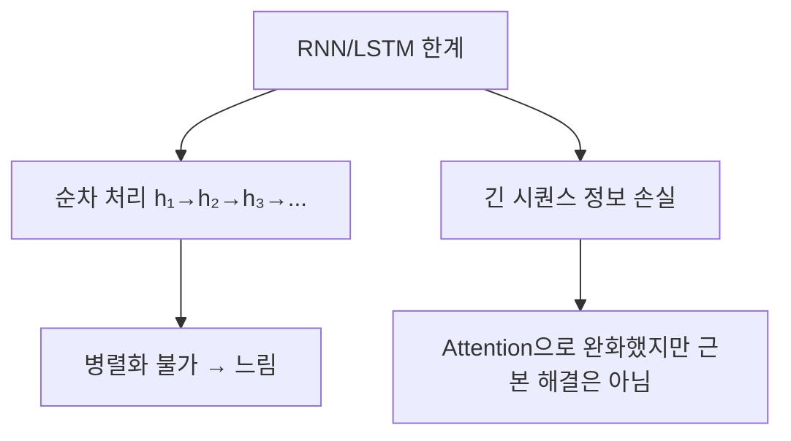
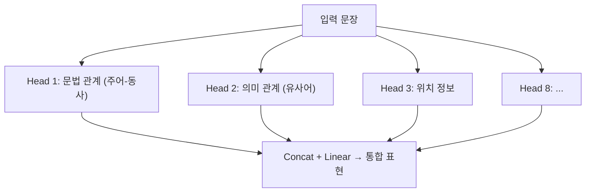
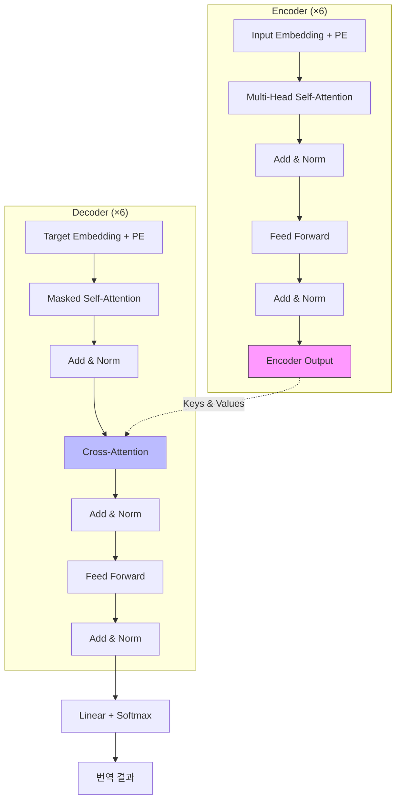
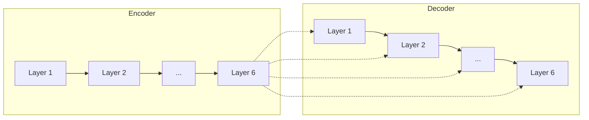
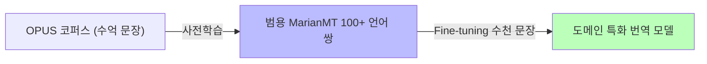
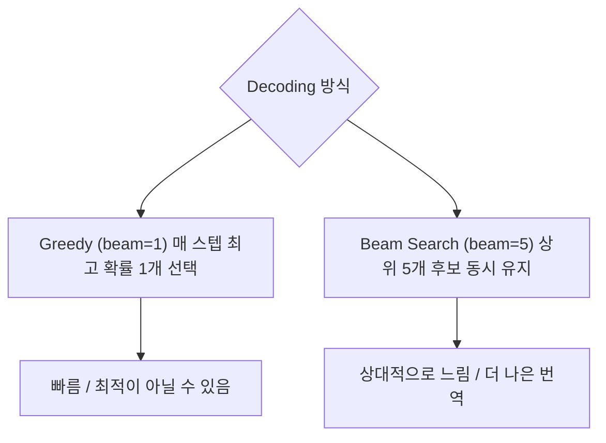
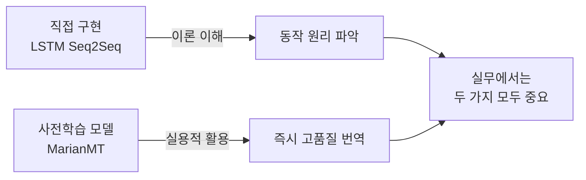

# Day 2-3: Transformer와 MarianMT

사전학습 모델로 BLEU 60+ 달성하기

---
layout: default
---

# 학습 목표

- 🏗️ **Transformer** 아키텍처 이해 (Self-Attention, Multi-Head, Positional Encoding)
- 📦 **MarianMT** 사전학습 모델을 HuggingFace로 바로 활용
- 🔍 **Beam Search** 원리 이해 및 실험
- 📊 **Day 2 전체** LSTM → LSTM+Attention → MarianMT 성능 비교

---
layout: default
---

# 🔧 노트북: 1. 환경 설정

### 🔥 함께 작성해볼 부분

- **repo_owner**, **repo_name**을 본인의 Dagshub 정보로 채우기

```python
repo_owner = # 🔥 직접 작성이 필요합니다.
repo_name  = # 🔥 직접 작성이 필요합니다.
dagshub.init(repo_owner=repo_owner, repo_name=repo_name, mlflow=True)
```

---
layout: center
class: text-center
---

# Transformer: Attention Is All You Need

---
layout: top_img-bottom_text
---

# RNN/LSTM의 근본적 한계

::top::



::bottom::

Transformer는 RNN을 **완전히 제거**하고, Attention만으로 모든 단어 관계를 **병렬로** 처리합니다.

---
layout: default
---

# Self-Attention

### 핵심 아이디어

문장 내 **모든 단어가 서로를 직접 참조**합니다.

```
문장: "The cat sat on the mat"

"sat"에 대한 Self-Attention 가중치:
  The: 0.05  cat: 0.40 ← 주어   sat: 0.20
  on: 0.10   the: 0.05  mat: 0.20 ← 장소
```

### 수식

**`Attention(Q, K, V) = softmax(QK^T / √d_k) × V`**

- **Query (Q)**: 현재 단어 — "무엇을 찾고 있는가?"
- **Key (K)**: 각 단어의 특성 — "나는 이런 정보를 가지고 있다"
- **Value (V)**: 실제로 가져올 정보

---
layout: img_caption
---

# Multi-Head Attention

::img-fit-width::



::caption::

각 Head는 독립적으로 Q, K, V를 계산하고, 결과를 합쳐 **풍부한 문맥 표현**을 만듭니다.

---
layout: default
---

# Positional Encoding

### 문제

Self-Attention은 단어 **순서 정보가 없습니다**.

```
"The cat ate the mouse" ≈ "The mouse ate the cat"  (Attention 입장에서 동일!)
```

### 해결

위치 정보를 Embedding에 **더해줍니다**.

```
PE(pos, 2i)   = sin(pos / 10000^(2i/d_model))
PE(pos, 2i+1) = cos(pos / 10000^(2i/d_model))

Final Input = Token Embedding + Positional Encoding
```

---
layout: center
class: text-center
---

# Transformer 전체 구조

---
layout: img_caption
---

# Encoder-Decoder 구조

::img-fit-width::



::caption::

---
layout: default
---

# Encoder Layer

```python
class EncoderLayer(nn.Module):
    def forward(self, x):
        # 1. Multi-Head Self-Attention + Residual
        x = self.norm1(x + self.multi_head_attention(x, x, x))
        # 2. Feed Forward + Residual
        x = self.norm2(x + self.feed_forward(x))
        return x
```

### Residual Connection

각 서브레이어의 입력을 출력에 더함 → **Gradient Vanishing 방지**

---
layout: default
---

# Decoder Layer의 특징

### Masked Self-Attention

미래 단어를 볼 수 없도록 마스킹

```
"Ich"를 생성할 때 "liebe", "dich"를 미리 보면 안 됨!
```

### Cross-Attention

Decoder Query가 **Encoder 전체 출력**을 참조  
→ LSTM Seq2Seq의 Attention과 동일한 역할

---
layout: img_caption
---

# Encoder가 모든 Decoder Layer에 연결

::img-fit-width::



::caption::

Encoder 최종 출력이 **Decoder의 모든 층** Cross-Attention으로 연결됩니다.

---
layout: center
class: text-center
---

# MarianMT: 사전학습 번역 모델

---
layout: top_img-bottom_text
---

# MarianMT란?

Helsinki-NLP가 공개한 오픈소스 번역 모델. HuggingFace에서 간편하게 사용 가능합니다.

::top::



::bottom::

- 바닐라 Transformer 구조 (Encoder 6층, Decoder 6층)
- **공유 임베딩**: Source/Target 임베딩 레이어를 공유 → 언어 간 의미 공간 통일
- **BPE 토큰화**: 미등록 단어(OOV)도 subword 단위로 처리

---
layout: default
---

# 왜 MarianMT를 쓰나?

|  | **처음부터 학습** | **MarianMT Fine-tuning** |
|:---|:---|:---|
| 필요 데이터 | 수백만 문장 | 수천 문장 |
| 학습 시간 | 수일~수주 | 수시간 |
| 예상 BLEU | ~25 | ~40+ |

### Zero-Shot 번역 (학습 없이 바로 사용)

```python
from transformers import MarianMTModel, MarianTokenizer

model_name = "Helsinki-NLP/opus-mt-en-de"
tokenizer = MarianTokenizer.from_pretrained(model_name)
model = MarianMTModel.from_pretrained(model_name)

translate("I love machine learning")
# → "Ich liebe maschinelles Lernen"
```

---
layout: default
---

# 🔧 노트북: 2. 데이터 준비

### 이 구간에서 할 일

- Tatoeba EN-DE 데이터 로드 (Day 2-1 코드 재사용)
- 번역 샘플 확인

---
layout: default
---

# 🔧 노트북: 3. MarianMT 모델 로드

### 🔥 함께 작성해볼 부분

**model_name**을 채워보세요.

```python
model_name = # 🔥 직접 작성이 필요합니다. (예: 'Helsinki-NLP/opus-mt-en-de')

tokenizer = MarianTokenizer.from_pretrained(model_name)
model = MarianMTModel.from_pretrained(model_name).to(device)
```

---
layout: center
class: text-center
---

# Beam Search

---
layout: top_img-bottom_text
---

# Greedy vs Beam Search

::top::



::bottom::

---
layout: default
---

# Beam Search 예시 (beam_size=3)

```
Input: "I love you"

Step 1: <SOS> →
  Beam 1: "Ich"  (0.60)
  Beam 2: "I"    (0.30)
  Beam 3: "Ik"   (0.10)

Step 2: (누적 확률)
  "Ich"  → "liebe" (0.60×0.50 = 0.30) ← 선두
  "Ich"  → "mag"   (0.60×0.40 = 0.24)
  "I"    → "love"  (0.30×0.60 = 0.18)

Step 3:
  "Ich liebe" → "dich" (0.30×0.70 = 0.21) ← Best!
```

### 왜 Beam Search가 더 나은가?

- **Greedy**: "나는(0.9) 학교(0.1) 간다(0.2)" → 0.9×0.1×0.2 = **0.018**
- **Beam**: "나(0.4)는 학교(0.8)에 간다(0.9)" → 0.4×0.8×0.9 = **0.288**

---
layout: default
---

# 🔧 노트북: 4. Zero-Shot 번역

### 🔥 함께 작성해볼 부분

**translate()** 함수에서 model.generate와 tokenizer.batch_decode 채우기

```python
def translate(text, beam_size=5, max_length=128):
    inputs = tokenizer(texts, return_tensors='pt', ...).to(device)

    with torch.no_grad():
        outputs = # 🔥 직접 작성이 필요합니다.
                  # (model.generate(**inputs, num_beams=beam_size, ...))

    translations = # 🔥 직접 작성이 필요합니다.
                   # (tokenizer.batch_decode(outputs, skip_special_tokens=True))
    return translations[0] if is_single else translations
```

---
layout: default
---

# 🔧 노트북: 5. Beam Search 실험

### 이 구간에서 할 일

- beam_size 1, 3, 5, 10으로 번역 품질·속도 비교

### 예상 결과

```
Beam Size  1 (Greedy): BLEU ~58, 속도 가장 빠름
Beam Size  3:          BLEU ~62
Beam Size  5:          BLEU ~64  ← 최적 (품질/속도 균형)
Beam Size 10:          BLEU ~64  (개선 미미, 시간 ↑)
```

---
layout: default
---

# 🔧 노트북: 6. BLEU Score 평가

### 이 구간에서 할 일

- `calculate_bleu_marianmt(model, df, beam_size=5)` 실행
- Zero-Shot 성능 확인 (BLEU 50+)

---
layout: default
---

# MLflow 실험 기록

### 기록할 내용

- **파라미터**: model_name, architecture, encoder/decoder_layers, beam_size
- **메트릭**: val_bleu (beam_size별)

### 이번 실험의 의미

Day 2 전체 실험을 MLflow에 쌓으면 

→ Dagshub UI에서  

**LSTM Baseline → LSTM+Attention → MarianMT** 성능 진화를 한눈에 비교할 수 있습니다.

---
layout: default
---

# 🔧 노트북: 7. MLflow 실험 기록

### 🔥 함께 작성해볼 부분

**run_name**을 실험을 구분하기 쉬운 이름으로 채우기

```python
with mlflow.start_run(run_name=""):  # 🔥 직접 작성이 필요합니다.
    mlflow.log_params({
        'model_name': model_name,
        'beam_size': 5,
        'pretrained': True,
    })
    mlflow.log_metric('val_bleu', bleu_score)
```

---
layout: default
---

# 🔧 노트북: 8. Day 2 전체 모델 성능 비교

### 이 구간에서 할 일

- LSTM Baseline / LSTM+Attention / MarianMT BLEU 비교 시각화

---
layout: default
---

# Day 2 전체 비교


---
layout: default
---

# 결과 해석

```
LSTM Baseline:     BLEU ~10.5  (~2M  파라미터, 직접 구현)
LSTM + Attention:  BLEU ~14.2  (~2.5M 파라미터, +73% 향상)
MarianMT Zero-Shot:BLEU ~60+   (~74M  파라미터, 사전학습, +382%)
```

---
layout: top_img-bottom_text
---

# 핵심 교훈

::top::



::bottom::

직접 구현으로 **원리를 이해**하고, 실제 서비스에서는 **사전학습 모델을 활용**하는 것이 현실적입니다.

---
layout: default
---

# 오늘 배운 것

| **개념** | **핵심** |
|:---|:---|
| Self-Attention | 모든 단어가 서로를 직접 참조 (Q·K·V) |
| Multi-Head Attention | 여러 관점에서 동시 Attention 계산 |
| Positional Encoding | 순서 정보를 Embedding에 추가 |
| Encoder Layer | Self-Attention + FFN + Residual |
| Decoder Layer | Masked SA + Cross-Attention + FFN |
| MarianMT | 사전학습 Transformer 번역 모델 |
| Beam Search | 상위 k개 후보를 동시에 유지 |

---
layout: default
---

# ✅ 체크리스트

- [ ] Self-Attention 계산 과정 이해 (Q, K, V)
- [ ] Multi-Head Attention의 역할 파악
- [ ] Positional Encoding의 필요성 이해
- [ ] Encoder Layer 구조 (Self-Attention + FFN + Residual)
- [ ] Decoder Layer 구조 (Masked SA + Cross-Attention + FFN)
- [ ] Encoder가 Decoder 모든 층에 연결되는 이유 이해
- [ ] MarianMT 모델 로드 및 Zero-Shot 번역 완료
- [ ] Beam Search 원리 이해
- [ ] Beam Size 실험 완료
- [ ] BLEU Score 계산 및 MLflow 기록
- [ ] Day 2 전체 모델 성능 비교

---
layout: default
---

# 🎉 Day 2 완료!

| **Day** | **내용** | **핵심 기술** | **예상 BLEU** |
|:---|:---|:---|:---|
| Day 2-1 | 데이터 탐색 & BLEU | Tatoeba, Vocabulary, BLEU | — |
| Day 2-2 | LSTM Seq2Seq | Encoder-Decoder, Teacher Forcing | ~10–22 |
| Day 2-3 | Transformer & MarianMT | Self-Attention, Beam Search | ~60+ |

### 다음 단계

Day 3에서는 **이미지 분류** 실전 프로젝트로 이어집니다.
