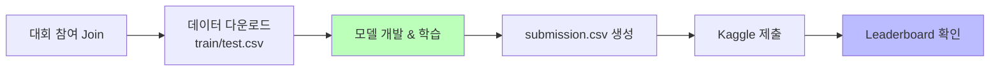
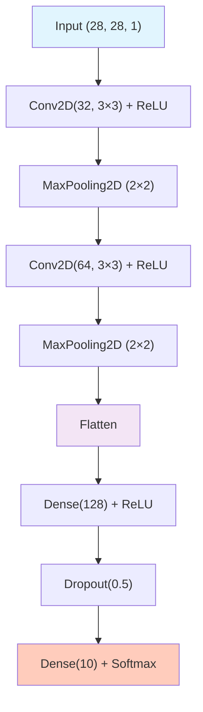

# Day 3-1: MNIST 데이터 탐색 &<br/>베이스라인

Kaggle Digit Recognizer 첫 제출 — Simple CNN으로 98%+

---
layout: default
---

# 학습 목표

- 🏆 **Kaggle** 플랫폼 이해 및 Digit Recognizer 대회 참여
- 🔍 **EDA**: 클래스 분포, 샘플 이미지, 픽셀 분포, 혼동 숫자 쌍 분석
- ⚙️ **데이터 전처리**: 정규화 / Reshape / Train·Val Split
- 🏗️ **Simple CNN** 베이스라인 직접 구현
- 📈 **MLflow**로 학습 실험 기록

---
layout: default
---

# 🔧 노트북: 1. 환경 설정

### 🔥 함께 작성해볼 부분

- **repo_owner**, **repo_name**을 본인의 Dagshub 정보로 채우기

```python
repo_owner = # 🔥 직접 작성이 필요합니다.
repo_name  = # 🔥 직접 작성이 필요합니다.
dagshub.init(repo_owner=repo_owner, repo_name=repo_name, mlflow=True)
```

---
layout: center
class: text-center
---

# Kaggle 플랫폼

---
layout: default
---

# Kaggle이란?

### 전 세계 1,000만+ 데이터 과학자가 활동하는 ML 경진대회 플랫폼

```
✅ 실전 경험: 실제 데이터로 End-to-End 모델 개발
✅ 벤치마킹:  리더보드로 객관적 성능 비교
✅ 커뮤니티: 최신 기법 공유 (Notebooks, Discussions)
✅ 포트폴리오: 취업/대학원 지원에 활용
```

2010년 설립, 2017년 Google 인수

---
layout: top_img-bottom_text
---

# Digit Recognizer 대회

::top::



::bottom::

- **평가 지표**: Accuracy
- **데이터**: MNIST 기반 (Train 42,000개 / Test 28,000개)
- **특징**: 무제한 제출, 초보자 입문 대회

---
layout: default
---

# Public vs Private Leaderboard

### 두 단계 평가 방식

```
Public Leaderboard:  제출 즉시 확인, Test의 30%로 계산
Private Leaderboard: 대회 종료 후 공개, Test의 70%로 계산 (최종 순위)
```

### 주의

Public에서 **과적합**되지 않도록 주의해야 합니다.  
Public Score가 높더라도 Private에서 순위가 떨어지는 경우가 있습니다.

---
layout: center
class: text-center
---

# MNIST 데이터셋

---
layout: default
---

# MNIST 데이터 개요

- 1998년 Yann LeCun이 공개한 딥러닝 **"Hello World"** 데이터셋
- 미국 우체국 **손글씨 숫자**에서 유래
- **28×28 픽셀, Grayscale (1채널), 10개 클래스 (0~9)**
- Kaggle 버전: Train 42,000개 / Test 28,000개

### 데이터 구조

```python
train = pd.read_csv('train.csv')  # (42000, 785) = label + 784 pixels
test  = pd.read_csv('test.csv')   # (28000, 784)

y_train = train['label'].values
X_train = train.drop('label', axis=1).values  # (42000, 784)
```

---
layout: default
---

# 🔧 노트북: 2. 데이터 로드 & 3. EDA

### 이 구간에서 할 일

- Kaggle에서 `train.csv`, `test.csv` 다운로드 후 업로드
- 클래스 분포, 샘플 이미지, 픽셀 분포, 혼동 숫자 쌍 확인

---
layout: center
class: text-center
---

# 탐색적 데이터 분석 (EDA)

---
layout: default
---

# 클래스 분포


### 주요 관찰

클래스 분포는 비교적 **균형** 잡혀 있습니다 (각 ~4,200개).  
→ 클래스 불균형 보정 없이 학습 가능

---
layout: default
---

# 샘플 이미지 (클래스별 5개)


---
layout: default
---

# 픽셀 값 분포


### 주요 관찰

- 픽셀 값이 **0 (배경)** 에 집중 + 일부 **높은 값 (획)** 으로 이중 분포
- 정규화 (`/255.0`) 후 **0.0~1.0** 범위로 변환 필요

---
layout: default
---

# 혼동하기 쉬운 숫자 쌍


```
7 vs 1: 가로획이 짧으면 구분 어려움
4 vs 9: 윗부분이 닫히면 혼동
3 vs 8: 중간 부분이 겹치면 혼동
5 vs 6: 회전되어 있으면 혼동
```

이 혼동 쌍은 Day 3-4의 Error Analysis에서 다시 확인합니다.

---
layout: center
class: text-center
---

# 데이터 전처리

---
layout: default
---

# 정규화 & Reshape

### 정규화

```python
X_train = X_train / 255.0   # 0~255 → 0.0~1.0
```

값을 0~1로 줄이면 **Gradient 폭발 방지** + 학습 안정성 향상

### Reshape (CNN 입력 형식)

CNN은 `(N, H, W, C)` 형태의 입력을 요구합니다.

```python
X_train = X_train.reshape(-1, 28, 28, 1)   # (42000, 784) → (42000, 28, 28, 1)
```

### Train/Validation Split

```python
X_train_sub, X_val, y_train_sub, y_val = train_test_split(
    X_train, y_train, test_size=0.1, stratify=y_train, random_state=42
)
# Train: 37,800개 / Val: 4,200개
```

`stratify` 로 클래스 비율을 유지하며 분리합니다.

---
layout: default
---

# 🔧 노트북: 4. 데이터 전처리

### 🔥 함께 작성해볼 부분

**정규화**

```python
X_train = # 🔥 직접 작성이 필요합니다.
X_test  = # 🔥 직접 작성이 필요합니다.
```

**Reshape**

```python
X_train = # 🔥 직접 작성이 필요합니다. (reshape(-1, 28, 28, 1))
X_test  = # 🔥 직접 작성이 필요합니다.
```

**Train/Val Split**

```python
X_train_sub, X_val, y_train_sub, y_val = # 🔥 직접 작성이 필요합니다.
```

---
layout: center
class: text-center
---

# Simple CNN 베이스라인

---
layout: img_caption
---

# CNN 아키텍처

::img-fit-width::



::caption::

파라미터 수: ~225K — 가볍고 빠름

---
layout: default
---

# CNN이 이미지를 처리하는 방식

### Conv2D: 특징 추출

- 작은 필터(3×3)가 이미지를 **슬라이딩**하며 특징 추출
- 첫 번째 층: 엣지, 모서리 등 **저수준 특징**
- 두 번째 층: 곡선, 패턴 등 **고수준 특징**

### MaxPooling: 크기 축소

- 2×2 영역의 **최댓값만** 선택 → 해상도 절반
- 위치 불변성(translation invariance) 확보

### Dropout(0.5)

- 학습 중 50% 뉴런을 무작위로 비활성화 → **과적합 방지**

---
layout: default
---

# 🔧 노트북: 5. Simple CNN 베이스라인 구현

### 🔥 함께 작성해볼 부분

```python
def build_simple_cnn():
    model = Sequential([
        # Conv Block 1
        # 🔥 직접 작성이 필요합니다. (Conv2D(32, ...) + MaxPooling2D)

        # Conv Block 2
        # 🔥 직접 작성이 필요합니다. (Conv2D(64, ...) + MaxPooling2D)

        # Classifier
        # 🔥 직접 작성이 필요합니다. (Flatten + Dense(128) + Dropout(0.5) + Dense(10, softmax))
    ])
    return model
```

---
layout: default
---

# 🔧 노트북: 6. 모델 학습

### 🔥 함께 작성해볼 부분

**run_name**을 실험을 구분하기 쉬운 이름으로 채우기

```python
with mlflow.start_run(run_name=''):  # 🔥 직접 작성이 필요합니다.
    mlflow.log_params({
        'model': 'Simple_CNN',
        'conv_filters': '32,64',
        'batch_size': 128,
        'epochs': 10,
    })
    history = model.fit(X_train_sub, y_train_sub, batch_size=128, epochs=10,
                        validation_data=(X_val, y_val))
```

⏱️ GPU에 따라 **2~5분** 소요

---
layout: default
---

# 🔧 노트북: 7. 결과 분석

### 이 구간에서 할 일

- 학습 곡선 (Loss & Accuracy) 시각화
- Val Accuracy 최종 확인
- Dagshub UI에서 MLflow 실험 확인

---
layout: default
---

# 학습 결과


### 예상 결과

**Val Accuracy ~98.0%**

베이스라인임에도 이미 98%+ 달성!  
→ Day 3-2에서 5가지 아키텍처로 **99%+** 달성을 목표로 합니다.

---
layout: default
---

# 오늘 배운 것

| **개념** | **핵심** |
|:---|:---|
| Kaggle | ML 경진대회 플랫폼 — 실전 경험·포트폴리오 |
| MNIST | 28×28 Grayscale, 10 클래스, 딥러닝 Hello World |
| 정규화 | /255.0 → 0~1 범위, Gradient 안정화 |
| CNN | Conv2D(특징 추출) + MaxPooling(크기 축소) |
| Dropout | 과적합 방지 (학습 중 뉴런 랜덤 비활성화) |
| MLflow | 학습 파라미터·메트릭 기록 → Dagshub UI |

---
layout: default
---

# ✅ 체크리스트

- [ ] Kaggle 계정 생성 및 Digit Recognizer 대회 참여
- [ ] train.csv, test.csv 다운로드
- [ ] EDA: 클래스 분포, 샘플 이미지, 픽셀 분포, 혼동 쌍 확인
- [ ] 전처리: 정규화 / Reshape / Train·Val Split
- [ ] Simple CNN 구현 및 학습 완료
- [ ] MLflow 실험 기록 (params, metrics)
- [ ] Val Accuracy ~98% 달성
