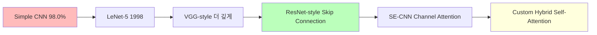
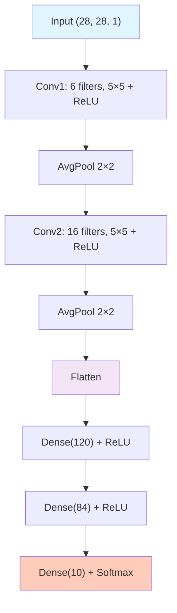
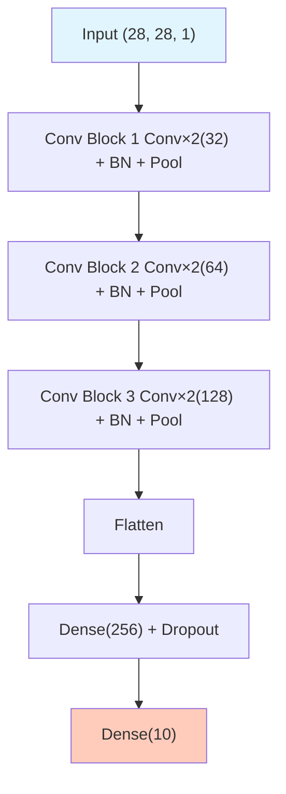
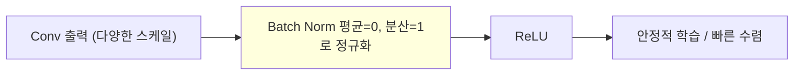
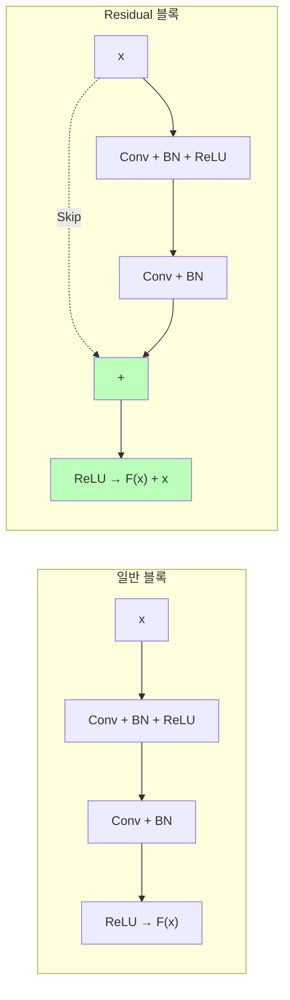
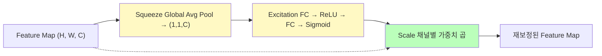
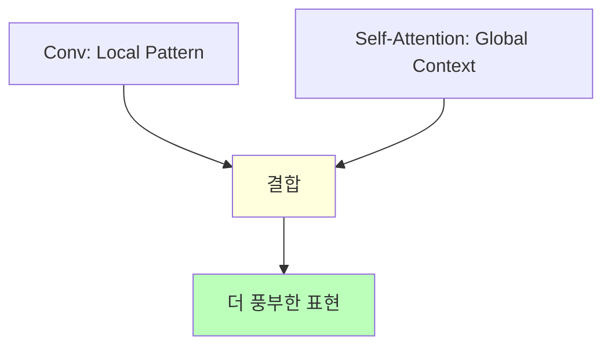
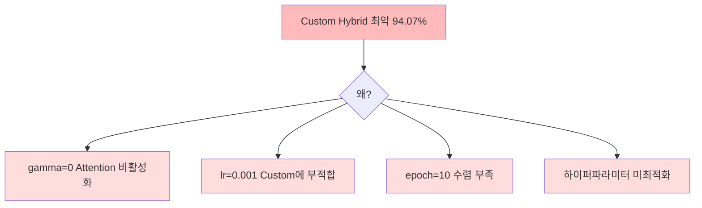

# Day 3-2: 다양한 CNN 아키텍처 비교

5가지 아키텍처 직접 구현 — Simple CNN 98% → 99%+ 도전

---
layout: default
---

# 학습 목표

- 🏛️ **LeNet-5**: CNN의 역사적 시작점 이해
- 🏗️ **VGG-style**: 깊이 + Batch Normalization
- 🔗 **ResNet-style**: Skip Connection으로 Gradient Vanishing 해결
- 👁️ **SE-CNN**: Channel Attention (Squeeze-and-Excitation)
- 🎨 **Custom Hybrid**: CNN + Self-Attention 결합
- 📈 5개 모델을 **MLflow**로 비교하며 인사이트 도출

---
layout: default
---

# 🔧 노트북: 1. 환경 설정

### 🔥 함께 작성해볼 부분

- **repo_owner**, **repo_name**을 본인의 Dagshub 정보로 채우기

```python
repo_owner = # 🔥 직접 작성이 필요합니다.
repo_name  = # 🔥 직접 작성이 필요합니다.
```

---
layout: center
class: text-center
---

# CNN 아키텍처 진화

---
layout: default
---

# Simple CNN의 한계

```
Simple CNN (Day 3-1):
  얕은 구조 (Conv 2개) → 복잡한 패턴 학습 한계
  고정 구조             → 최적화 여지 없음
  Val Accuracy: ~98.0%
```

오늘은 이 베이스라인을 **5가지 방법**으로 개선하며, 각 아키텍처의 핵심 아이디어를 이해합니다.

---
layout: top_img-bottom_text
---

# 오늘의 아키텍처 로드맵

::top::



::bottom::

---
layout: default
---

# 핵심 기법 미리 보기

| **기법** | **역할** | **적용 모델** |
|:---|:---|:---|
| **Batch Normalization** | 학습 안정화, 수렴 가속 | VGG, ResNet, SE |
| **Skip Connection** | Gradient Vanishing 방지 | ResNet |
| **Channel Attention** | 중요한 채널 강조 | SE-CNN |
| **Self-Attention** | Global context 포착 | Custom Hybrid |

---
layout: default
---

# 🔧 노트북: 2. 데이터 로드

### 이 구간에서 할 일

- Day 3-1에서 사용한 MNIST 데이터 재로드
- 정규화 / Reshape / Train·Val Split (이미 완성된 코드 실행)

---
layout: center
class: text-center
---

# 아키텍처 1: LeNet-5 (1998)

---
layout: default
---

# LeNet-5의 역사적 의미

### 최초의 성공적인 CNN

Yann LeCun이 1998년 발표. 미국 우체국 **우편번호 자동 인식**에 사용.  
현대 CNN의 **원형(Prototype)** 입니다.

### 현대와의 차이점

- 5×5 커널 (현대는 3×3 선호)
- Average Pooling (현대는 Max Pooling 선호)
- Tanh 활성화 (현대는 ReLU)

---
layout: img_caption
---

# LeNet-5 구조

::img-fit-width::



::caption::

파라미터 ~60K — 현대 기준 작지만 당시로서는 혁신적

---
layout: default
---

# 🔧 노트북: 3. LeNet-5 구현 & 학습

### 🔥 함께 작성해볼 부분

```python
def build_lenet5():
    model = Sequential([
        # Conv Block 1
        # 🔥 직접 작성이 필요합니다. (Conv2D(6, 5×5) + AveragePooling2D)

        # Conv Block 2
        # 🔥 직접 작성이 필요합니다. (Conv2D(16, 5×5) + AveragePooling2D)

        # Classifier
        # 🔥 직접 작성이 필요합니다. (Flatten + Dense(120) + Dense(84) + Dense(10, softmax))
    ])
    return model
```

---
layout: center
class: text-center
---

# 아키텍처 2: VGG-style

---
layout: default
---

# VGG의 철학: "Deeper is Better + Small Kernels"

### 왜 3×3 커널 여러 개?

```
5×5 커널 1개: receptive field 25, 파라미터 25C²
3×3 커널 2개: receptive field 25, 파라미터 18C²

→ 같은 receptive field, 더 적은 파라미터 + 더 많은 비선형성
```

---
layout: img_caption
---

# VGG-style 구조

::img-fit-width::



::caption::

---
layout: top_img-bottom_text
---

# 핵심: Batch Normalization

각 미니배치마다 활성화를 정규화해 **내부 공변량 변화**를 줄입니다.

::top::



::bottom::

Learning Rate를 높여도 안정적으로 학습할 수 있게 해줍니다.

---
layout: default
---

# 🔧 노트북: 4. VGG-style 구현 & 학습

### 🔥 함께 작성해볼 부분

각 Conv Block 뒤에 **BatchNormalization()** 위치를 채워보세요.

```python
def build_vgg_style():
    model = Sequential([
        # Conv Block 1
        Conv2D(32, (3, 3), activation='relu', padding='same', ...),
        Conv2D(32, (3, 3), activation='relu', padding='same'),
        # 🔥 직접 작성이 필요합니다. (BatchNormalization())
        MaxPooling2D((2, 2)),
        Dropout(0.25),
        ...
    ])
```

---
layout: center
class: text-center
---

# 아키텍처 3: ResNet-style

---
layout: default
---

# Skip Connection의 힘

깊은 네트워크는 Gradient Vanishing 문제로 오히려 성능이 떨어지는 **역설**이 있습니다.

ResNet은 **Skip Connection**으로 이를 해결합니다.

### 핵심 아이디어

모델이 `F(x)` (잔차)만 학습하면 됩니다.  
아무것도 학습하지 않아도 `F(x)=0`이면 입력을 **그대로 통과** → 깊게 쌓아도 성능 유지

---
layout: img_caption
---

# Residual Block

::img-fit-width::



::caption::

`Add()([fx, x])` 한 줄이 핵심 — 입력과 출력의 채널 수가 같아야 함

---
layout: default
---

# 🔧 노트북: 5. ResNet-style 구현 & 학습

### 🔥 함께 작성해볼 부분

**residual_block** 에서 Skip Connection의 핵심인 **Add([fx, x])** 를 완성해 보세요.

```python
def residual_block(x, filters, kernel_size=(3, 3)):
    # Main path
    fx = Conv2D(filters, kernel_size, padding='same')(x)
    fx = BatchNormalization()(fx)
    fx = Activation('relu')(fx)
    fx = Conv2D(filters, kernel_size, padding='same')(fx)
    fx = BatchNormalization()(fx)

    # Skip connection
    if x.shape[-1] != filters:
        x = Conv2D(filters, (1, 1), padding='same')(x)

    out = # 🔥 직접 작성이 필요합니다. (Add()([fx, x]))
    return Activation('relu')(out)
```

---
layout: center
class: text-center
---

# 아키텍처 4: SE-CNN

---
layout: top_img-bottom_text
---

# Squeeze-and-Excitation Block

### "어떤 채널이 중요한가?" 에 집중

::top::



::bottom::

중요한 채널은 **증폭**, 불필요한 채널은 **억제**

---
layout: default
---

# 🔧 노트북: 6. SE-CNN 구현 & 학습

### 🔥 함께 작성해볼 부분

**se_block** 에서 Excitation과 Scale 부분을 완성해 보세요.

```python
def se_block(input_tensor, ratio=16):
    channels = input_tensor.shape[-1]

    # Squeeze
    se = GlobalAveragePooling2D()(input_tensor)

    # Excitation
    # 🔥 직접 작성이 필요합니다. (Dense → ReLU → Dense → Sigmoid → Reshape)

    # Scale
    output = # 🔥 직접 작성이 필요합니다. (Multiply()([input_tensor, se]))
    return output
```

---
layout: center
class: text-center
---

# 아키텍처 5: Custom Hybrid

---
layout: top_img-bottom_text
---

# 설계 철학: CNN + Self-Attention

::top::



::bottom::

CNN은 커널 크기 내의 **지역 패턴**만 보지만, Self-Attention은 이미지 **전체 위치를 동시에 참조**합니다.  
예: 숫자 "8"의 위쪽 원과 아래쪽 원의 관계를 직접 연결

---
layout: default
---

# SelfAttention: gamma의 역할

```python
class SelfAttention(Layer):
    def build(self, input_shape):
        self.gamma = self.add_weight(
            name='gamma', shape=(1,),
            initializer='zeros',  # 초기값 0!
            trainable=True
        )

    def call(self, x):
        # Q, K, V 계산 후 Attention map...
        return self.gamma * out + x  # 🔥 Residual
```

`gamma=0`으로 초기화 → 처음에는 Attention 무시하고 점차 활성화  
→ Day 3-3 튜닝의 핵심 포인트!

---
layout: default
---

# 🔧 노트북: 7. Custom Hybrid 구현 & 학습

### 🔥 함께 작성해볼 부분

**SelfAttention.call()** 에서 Attention 결과에 **gamma를 곱하고 x를 더하는** Residual 연산을 완성해 보세요.

```python
def call(self, x):
    Q = self.query(x)
    K = self.key(x)
    V = self.value(x)
    # Attention map 계산...
    out = tf.matmul(attn, tf.reshape(V, ...))
    out = tf.reshape(out, tf.shape(x))

    return # 🔥 직접 작성이 필요합니다. (self.gamma * out + x)
```

---
layout: default
---

# 🔧 노트북: 8. 모델 성능 비교

### 이 구간에서 할 일

- MLflow에서 5개 실험 결과 조회
- Accuracy 비교 시각화

---
layout: default
---

# 실험 결과


```
ResNet_style : 99.12% ✅ 최고
Simple_CNN   : 99.07%
VGG_style    : 98.67%
LeNet5       : 98.50%
SE_CNN       : 96.45%
Custom_Hybrid: 94.07% ❌ 최악!
```

---
layout: top_img-bottom_text
---

# 예상 밖의 결과: Custom Hybrid 최악

::top::



::bottom::

**핵심 교훈**: 복잡한 모델 ≠ 좋은 성능  
하이퍼파라미터 최적화 없이는 복잡한 모델이 **오히려 역효과**를 냄  
→ Day 3-3에서 **94% → 99%+** 로 끌어올리는 과정 체험!

---
layout: default
---

# 오늘 배운 것

| **아키텍처** | **핵심 기법** | **예상 Acc** |
|:---|:---|:---|
| LeNet-5 (1998) | 5×5 Conv + AvgPool | ~98.5% |
| VGG-style | Conv×2 + **BatchNorm** + Dropout | ~98.7% |
| ResNet-style | **Skip Connection** `Add([fx,x])` | ~99.1% |
| SE-CNN | **Channel Attention** (Squeeze-Excitation) | ~96.5% |
| Custom Hybrid | **Self-Attention** + CNN | ~94.0% |

---
layout: default
---

# ✅ 체크리스트

- [ ] LeNet-5 구현 및 학습 완료 (~98.5%)
- [ ] VGG-style 구현 (BatchNorm + Dropout 패턴)
- [ ] ResNet-style 구현 (residual_block 함수)
- [ ] SE-CNN 구현 (se_block 함수)
- [ ] Custom Hybrid 구현 (SelfAttention 클래스)
- [ ] 5개 모델 모두 MLflow에 기록
- [ ] ResNet_style 최고 성능 확인 (~99.1%)
- [ ] Custom_Hybrid 최저 성능 이유 분석
- [ ] Dagshub UI에서 실험 비교 확인
