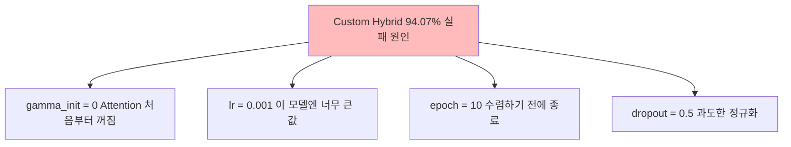
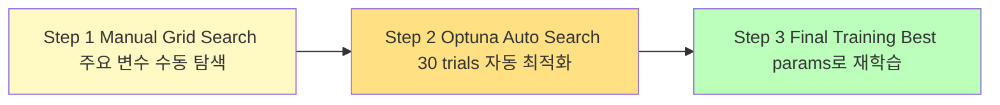
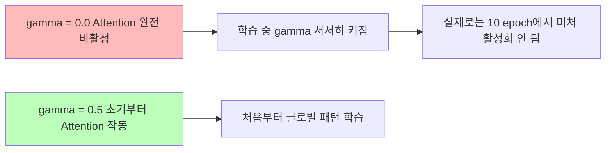
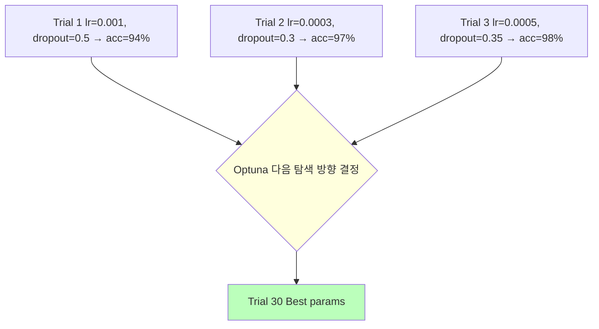
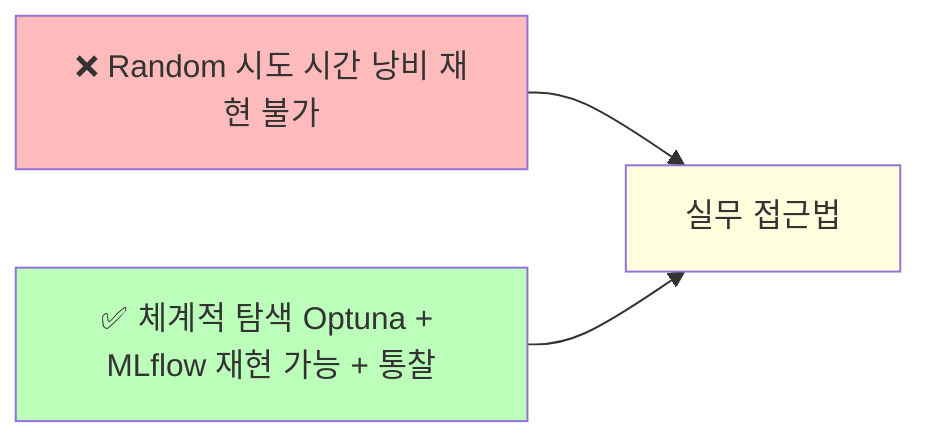

# Day 3-3: 하이퍼파라미터 튜닝

Optuna & MLflow — Custom Hybrid 94% → 99%+

---
layout: default
---

# 학습 목표

- 🔍 **Manual Grid Search**로 핵심 하이퍼파라미터 파악
- 🤖 **Optuna** 자동 탐색 — 30 trials Bayesian Optimization
- 📊 **탐색 결과 시각화** (History, Importance, Parallel Coordinate)
- 🏆 **Best params**로 최종 모델 재학습 → Val Acc 98%+
- 📈 **MLflow**로 모든 시도를 기록하고 비교

---
layout: default
---

# 🔧 노트북: 1. 환경 설정

### 🔥 함께 작성해볼 부분

- **repo_owner**, **repo_name**을 본인의 Dagshub 정보로 채우기

```python
repo_owner = # 🔥 직접 작성이 필요합니다.
repo_name  = # 🔥 직접 작성이 필요합니다.
```

---
layout: center
class: text-center
---

# 왜 하이퍼파라미터 튜닝인가?

---
layout: default
---

# Day 3-2의 교훈

```
Day 3-2 실험 결과:
  ResNet_style  : 99.12% ✅
  Simple_CNN    : 99.07%
  VGG_style     : 98.67%
  LeNet5        : 98.50%
  SE_CNN        : 96.45%
  Custom_Hybrid : 94.07% ❌
```

Custom Hybrid는 이론적으로 **가장 강력한 구조**(Conv + Self-Attention)인데 왜 최악일까요?

---
layout: img_caption
---

# Custom Hybrid 실패 원인 분석

::img-fit-width::



::caption::

---
layout: default
---

# 왜 ResNet이 아닌 Custom Hybrid를 튜닝하는가?

```
ResNet (99.12%):
  ✅ 이미 좋은 성능
  ❌ 개선 여지 적음 (0.3% 미만)

Custom Hybrid (94.07%):
  ✅ 개선 여지 큼 (94% → 99%+ 극적 변화 가능)
  ✅ 실패 원인 분석 경험
  ✅ 튜닝의 위력을 몸으로 느낄 수 있음
```

실무에서도 "가장 성능 좋은 모델"보다 **"이 모델의 잠재력을 끌어내는 과정"** 이 더 중요한 경우가 많습니다.

---
layout: top_img-bottom_text
---

# 튜닝 전략: 3단계

::top::



::bottom::

---
layout: default
---

# 🔧 노트북: 2. 데이터 로드 & 3. Custom Hybrid 모델

### 이 구간에서 할 일

- MNIST 데이터 재로드 (Day 3-1 코드 재사용)
- 파라미터화된 `build_custom_hybrid(dropout, gamma_init, conv_filters)` 확인

---
layout: center
class: text-center
---

# Manual Grid Search

---
layout: default
---

# Learning Rate 탐색

### gamma=0이 문제였다면, lr도 문제?

```python
lr_candidates = [0.0001, 0.0005, 0.001, 0.002]

for lr in lr_candidates:
    with mlflow.start_run(run_name=f'Manual_LR_{lr}'):
        mlflow.log_param('lr', lr)
        history = model.fit(...)
        mlflow.log_metric('val_acc', max(history.history['val_accuracy']))
```

### 예상 결과

```
lr = 0.0001: ~95% (너무 느림, 미수렴)
lr = 0.0005: ~97%  ← Good
lr = 0.001:  94%  (원래 값, 너무 빠름)
lr = 0.002:  ~92% (발산)
```

---
layout: default
---

# Learning Rate Grid Search 결과


### 결론

`lr = 0.002`가 10 epoch 기준 최고 → 탐색 범위를 높은 쪽으로 확장

---
layout: top_img-bottom_text
---

# Gamma 초기화 탐색

`gamma=0`이면 Self-Attention이 **완전히 꺼진** 상태로 시작합니다.

::top::



::bottom::

---
layout: default
---

# Gamma Grid Search 결과


### 예상 결과

```
gamma = 0.0: 94%  (원래 값)
gamma = 0.3: ~96%
gamma = 0.5: ~97% ← Good
gamma = 1.0: ~96% (너무 강한 Attention)
```

---
layout: default
---

# 🔧 노트북: 4. Manual Grid Search

### 🔥 함께 작성해볼 부분

**탐색 후보 목록** 직접 정하기

```python
lr_candidates    = # 🔥 직접 작성이 필요합니다. (예: [0.0001, 0.0005, 0.001, 0.002])
gamma_candidates = # 🔥 직접 작성이 필요합니다. (예: [0.0, 0.3, 0.5, 0.7, 1.0])
```

---
layout: center
class: text-center
---

# Optuna 자동 하이퍼파라미터 탐색

---
layout: top_img-bottom_text
---

# Optuna란?

이전 trial 결과를 바탕으로 다음 탐색 방향을 결정하는 **베이지안 최적화** 기반 AutoML 도구

::top::



::bottom::

Random Search와 달리 이전 trial 결과를 **학습**해 더 효율적으로 탐색

---
layout: default
---

# 탐색 공간 정의

| **파라미터** | **탐색 방법** | **탐색 범위** |
|:---|:---|:---|
| Learning Rate | `suggest_loguniform` | 1e-5 ~ 1e-2 |
| Dropout | `suggest_uniform` | 0.2 ~ 0.6 |
| Gamma Init | `suggest_uniform` | 0.3 ~ 1.0 |
| Batch Size | `suggest_categorical` | 64, 128, 256 |
| Epochs | `suggest_int` | 15 ~ 25 |
| Conv Filters | `suggest_categorical` | 3가지 조합 |

`loguniform`은 로그 스케일로 샘플링 → 넓은 범위(1e-5 ~ 1e-2)를 **효율적**으로 탐색

---
layout: default
---

# Optuna + MLflow 통합

```python
from optuna_integration import MLflowCallback

mlflc = MLflowCallback(
    tracking_uri=mlflow.get_tracking_uri(),
    metric_name='val_accuracy'
)

study = optuna.create_study(direction='maximize')
study.optimize(objective, n_trials=30, callbacks=[mlflc])
```

**MLflowCallback**이 모든 trial을 자동으로 MLflow에 기록  
→ 30번의 실험이 Dagshub UI에서 한눈에 비교

---
layout: default
---

# 🔧 노트북: 5. Optuna 자동 탐색

### 🔥 함께 작성해볼 부분

**objective 함수**에서 탐색 공간 정의

```python
def objective(trial):
    lr           = # 🔥 직접 작성이 필요합니다. (suggest_loguniform)
    dropout      = # 🔥 직접 작성이 필요합니다. (suggest_uniform)
    gamma_init   = # 🔥 직접 작성이 필요합니다. (suggest_uniform)
    batch_size   = # 🔥 직접 작성이 필요합니다. (suggest_categorical)
    epochs       = # 🔥 직접 작성이 필요합니다. (suggest_int)
    filter_option = # 🔥 직접 작성이 필요합니다. (suggest_categorical)
```

**Study 실행**

```python
study.optimize(objective, n_trials=# 🔥 직접 작성이 필요합니다., callbacks=[mlflc])
```

---
layout: center
class: text-center
---

# Optuna 결과 시각화

---
layout: default
---

# Optimization History


Trial이 진행될수록 **최고 성능이 수렴**하는 과정을 확인

---
layout: default
---

# Parameter Importance


**filter_option**과 **dropout**이 가장 큰 영향 → 튜닝 시 여기에 집중

---
layout: default
---

# Parallel Coordinate


각 trial의 하이퍼파라미터 조합과 성능을 한눈에 비교

---
layout: default
---

# 🔧 노트북: 6. 결과 시각화 & 7. Best Model 재학습

### 이 구간에서 할 일

- Optimization History, Parameter Importance, Parallel Coordinate 확인
- `study.best_params` 추출 후 최종 모델 재학습

### 🔥 함께 작성해볼 부분

**run_name**을 채워주세요.

```python
with mlflow.start_run(run_name=''):  # 🔥 직접 작성이 필요합니다.
    mlflow.log_params(best_params)
    best_model.fit(X_train_sub, y_train_sub, ...)
```

---
layout: default
---

# 노트북: 8. Before vs After 비교


```
Before (Day 3-2): Custom Hybrid  94.07%
After  (Day 3-3): Custom Hybrid  98.81%
개선폭: +4.74%  → 하이퍼파라미터 튜닝의 위력!
```

---
layout: top_img-bottom_text
---

# 핵심 교훈

::top::



::bottom::

**실무 HPO 템플릿**  
Baseline 구축 → Manual Tuning (주요 파라미터 파악) → Optuna Auto Search → Best Model 재학습

---
layout: default
---

# 오늘 배운 것

| **개념** | **핵심** |
|:---|:---|
| Manual Grid Search | 후보 리스트를 순서대로 탐색 — 빠른 직관 확보 |
| Optuna | 이전 결과로 다음 탐색 방향 결정 (Bayesian) |
| `suggest_loguniform` | 넓은 LR 범위를 로그 스케일로 효율 탐색 |
| `suggest_categorical` | 이산 후보 중 선택 (batch_size, filter 옵션) |
| MLflowCallback | 모든 trial을 자동으로 MLflow에 기록 |
| EarlyStopping | 수렴 완료 시 조기 종료 → 시간 절약 |

---
layout: default
---

# ✅ 체크리스트

- [ ] Custom Hybrid 실패 원인 분석 (gamma=0, lr 문제)
- [ ] Learning Rate Grid Search 완료 및 MLflow 기록
- [ ] Gamma Init Grid Search 완료 및 MLflow 기록
- [ ] Optuna objective 함수 작성 (6개 파라미터 탐색 공간)
- [ ] 30 trials 자동 탐색 완료
- [ ] Optuna 시각화 3종 확인 (History, Importance, Parallel)
- [ ] Best params 추출 및 최종 모델 재학습
- [ ] Final Val Accuracy 98%+ 달성
- [ ] Before/After 비교 시각화 확인
