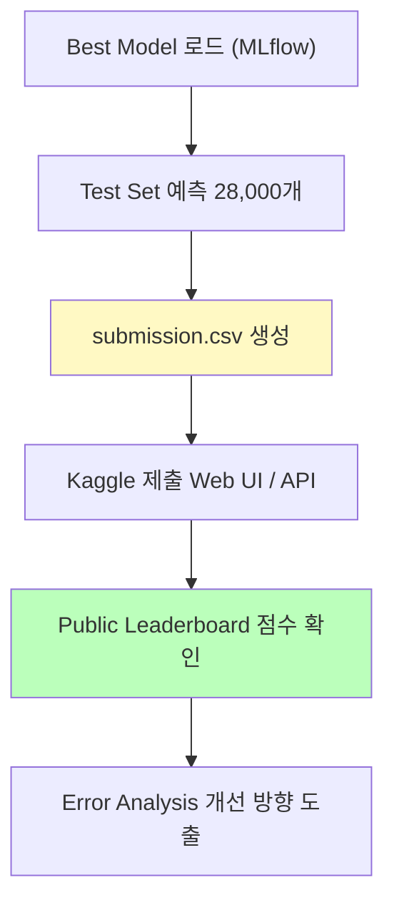
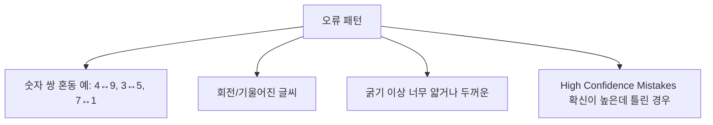

# Day 3-4: Kaggle 제출 & 결과 분석

Best Model 실전 제출 & Error Analysis

---
layout: default
---

# 학습 목표

- 🚀 **Test Set 예측** & `submission.csv` 생성
- 📤 **Kaggle 제출** — Web UI 또는 API 두 가지 방법
- 🔍 **Error Analysis** — 왜 틀렸는지 분석
- 📊 **Confusion Matrix & High Confidence Mistakes** 해석
- 💡 **개선 방향 도출** — Day 3-5 고급 기법 연결

---
layout: default
---

# 🔧 노트북: 환경 설정

### 🔥 함께 작성해볼 부분

- **repo_owner**, **repo_name**을 본인의 Dagshub 정보로 채우기

```python
repo_owner = # 🔥 직접 작성이 필요합니다.
repo_name  = # 🔥 직접 작성이 필요합니다.
```

---
layout: center
class: text-center
---

# Kaggle 제출 프로세스

---
layout: top_img-bottom_text
---

# 제출 전체 흐름

::top::



::bottom::

---
layout: default
---

# Best Model 로드 (MLflow)

Day 3-3에서 저장한 Best Custom Hybrid 모델을 불러옵니다.

```python
experiment = mlflow.get_experiment_by_name('day3-mnist-digit-recognizer')
runs = mlflow.search_runs(
    experiment_ids=[experiment.experiment_id],
    filter_string="params.model = 'Custom_Hybrid_Best'",
    order_by=["metrics.final_val_accuracy DESC"]
)
best_run_id = runs.iloc[0]['run_id']
best_model = mlflow.keras.load_model(f"runs:/{best_run_id}/model")
```

### 주의

Custom Layer(`SelfAttention`)가 포함된 모델은 로드 **전에 클래스 정의**가 필요합니다.

---
layout: default
---

# 🔧 노트북: 1. Test Set 예측 & 2. submission.csv 생성

### 🔥 함께 작성해볼 부분

**submission DataFrame 생성**

```python
submission = pd.DataFrame({
    'ImageId': # 🔥 직접 작성이 필요합니다. (range(1, len(test_labels) + 1))
    'Label':   # 🔥 직접 작성이 필요합니다. (test_labels)
})
```

**제출 형식 및 검증**

```python
# 검증 체크리스트
assert len(submission) == 28000               # 크기 확인
assert submission['Label'].between(0,9).all() # Label 범위 확인
assert submission.isnull().sum().sum() == 0   # 결측값 없음
```

---
layout: center
class: text-center
---

# Kaggle 제출

---
layout: default
---

# Option 1: Web UI (간단)


### 절차
1. `https://www.kaggle.com/c/digit-recognizer` 접속
2. **"Submit Prediction"** 클릭
3. `submission.csv` 업로드
4. 설명 입력 후 "Make Submission"
5. Public Leaderboard 점수 확인

---
layout: default
---

# Option 2: Kaggle API

### 1단계: API 토큰 발급


`https://www.kaggle.com/settings` → API 섹션 → **Generate New Token**

---
layout: default
---

# Option 2: Kaggle API (계속)

### 2단계: Colab 보안 비밀 설정


Colab 보안 비밀 탭에 `KAGGLE_USERNAME`, `KAGGLE_API_TOKEN` 저장

---
layout: default
---

# 🔧 노트북: 3. Kaggle 제출

### 🔥 함께 작성해볼 부분

API 제출 시 **message**를 채워주세요.

```python
api.competition_submit(
    file_name='submission.csv',
    message='',  # 🔥 직접 작성이 필요합니다. (제출 설명)
    competition='digit-recognizer'
)
```

---
layout: default
---

# 제출 결과 확인


```
Public Score: 0.98864  (상위 ~10% 수준)
Val Accuracy: 0.9881   (로컬 검증)
Val vs Public 차이: -0.002  → 정상 범위, Overfitting 없음
```

---
layout: center
class: text-center
---

# Error Analysis

---
layout: default
---

# 왜 Error Analysis인가?

좋은 성능을 넘어서 **왜 틀렸는지**를 분석하는 것이 실력을 키우는 핵심입니다.

```python
val_pred_labels = np.argmax(val_predictions, axis=1)   # 🔥 함께 작성
wrong_indices   = np.where(val_pred_labels != y_val)[0]
```

---
layout: default
---

# 🔧 노트북: 4. Error Analysis

### 🔥 함께 작성해볼 부분

**예측 레이블 추출**

```python
val_pred_labels = # 🔥 직접 작성이 필요합니다. (np.argmax(val_predictions, axis=1))
```

이어서 틀린 이미지 시각화, 클래스별 오류율, Confusion Matrix를 확인합니다.

---
layout: default
---

# 틀린 이미지 시각화


---
layout: default
---

# 클래스별 오류율


**숫자 5**의 오류율이 가장 높습니다. (2.6%)

---
layout: default
---

# 🔧 노트북: 5. Confusion Matrix


---
layout: default
---

# Confusion Matrix (Normalized)


---
layout: img_caption
---

# 오류 패턴 분석

::img-fit-width::



::caption::

---
layout: default
---

# High Confidence Mistakes


확신도 > 90%인데 틀린 케이스 — **특히 위험한 오류**

Data Augmentation이나 Ensemble로 줄일 수 있습니다.

---
layout: default
---

# 개선 방향 도출

| **개선 방법** | **대상 문제** | **예상 효과** | **난이도** |
|:---|:---|:---|:---|
| **Data Augmentation** | 회전/이동 변형 취약 | +0.2~0.5% | 낮음 |
| **Ensemble** | 개별 모델 오류 보정 | +0.3~0.7% | 중간 |
| **TTA** | 추론 시 안정성 | +0.1~0.3% | 낮음 |
| **더 많은 Epoch** | 수렴 부족 | +0.1~0.2% | 낮음 |

→ 모두 **Day 3-5**에서 실습합니다.

---
layout: default
---

# 🔧 노트북: 6. 심층 분석 & 7. 개선 방향 & 8. 최종 요약

### 이 구간에서 할 일

- High Confidence Mistakes 시각화
- 개선 계획 정리
- Day 3 전체 요약 출력

---
layout: default
---

# Day 3 전체 요약

```
Day 3-1  Simple CNN        : Val Acc 98.0%  Baseline
Day 3-2  ResNet-style      : Val Acc 99.1%  Best Architecture
Day 3-3  Custom (Tuned)    : Val Acc 98.8%  HPO 적용
Day 3-4  Kaggle Public     : Score  98.9%  실전 제출
```

---
layout: default
---

# ✅ 체크리스트

- [ ] MLflow에서 Best Model 로드 완료
- [ ] Test set 28,000개 예측 완료
- [ ] submission.csv 생성 및 검증 (크기, Label 범위, 결측값)
- [ ] Kaggle 제출 완료 (Web UI 또는 API)
- [ ] Public Score 확인 및 기록
- [ ] 틀린 이미지 시각화 분석
- [ ] 클래스별 오류율 분석
- [ ] Confusion Matrix 생성 및 혼동 쌍 파악
- [ ] High Confidence Mistakes 확인
- [ ] 개선 방향 3가지 이상 도출
