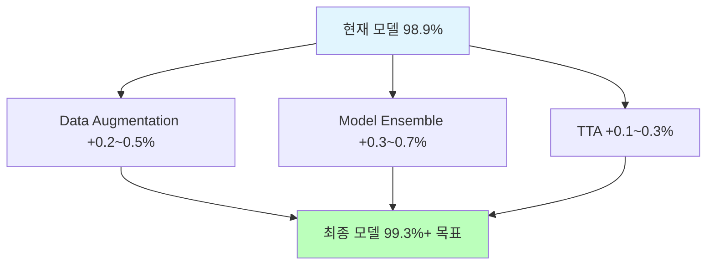
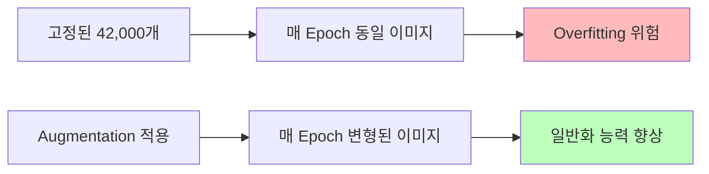
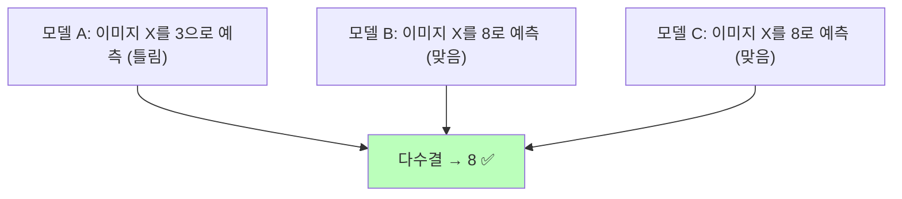
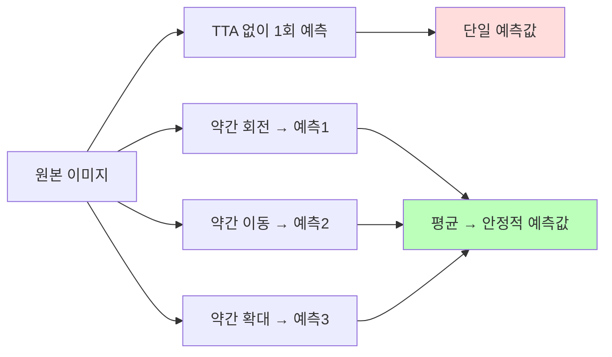
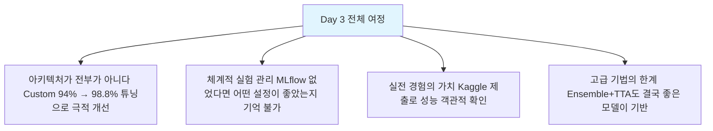

# Day 3-5: 고급 기법 & 최종 최적화

Data Augmentation · Ensemble · TTA — Top 5% 도전 *(선택)*

---
layout: default
---

# 학습 목표

- 🔄 **Data Augmentation** — 데이터 다양성 확보로 일반화 향상
- 🤝 **Model Ensemble** — 여러 모델의 오류를 서로 보정
- 🔮 **TTA** — 추론 시 불확실성 감소
- 🏆 **최종 제출** — Weighted Ensemble + TTA 결합

> **선택 과목**: Day 3-4까지 완료하면 Day 3의 핵심 목표는 달성입니다. 시간이 남는 경우 진행합니다.

---
layout: default
---

# 🔧 노트북: 1. 환경 설정

### 🔥 함께 작성해볼 부분

- **repo_owner**, **repo_name**을 본인의 Dagshub 정보로 채우기

```python
repo_owner = # 🔥 직접 작성이 필요합니다.
repo_name  = # 🔥 직접 작성이 필요합니다.
```

---
layout: center
class: text-center
---

# 현재 상황 & 목표

---
layout: top_img-bottom_text
---

# 고급 기법 Overview

::top::



::bottom::

```
Day 3-1 (Simple CNN):    98.0%  → Baseline
Day 3-2 (ResNet):        99.1%  → Best Single Model
Day 3-4 (Kaggle Submit): 98.9%  → 실전 확인
목표: Top 5% (99.3%+)
```

---
layout: center
class: text-center
---

# Data Augmentation

---
layout: top_img-bottom_text
---

# 왜 Data Augmentation인가?

::top::



::bottom::

### MNIST에 적합한 Augmentation

```
✅ 적합: 소폭 회전(±10°), 이동(10%), 확대/축소(10%)
❌ 부적합: 좌우 반전(1↔ ), 상하 반전(6↔9), 과도한 회전
```

---
layout: default
---

# Augmentation 예시


---
layout: default
---

# 🔧 노트북: 2. Data Augmentation

### 🔥 함께 작성해볼 부분

```python
datagen = ImageDataGenerator(
    rotation_range=    # 🔥 직접 작성이 필요합니다. (예: 10)
    width_shift_range= # 🔥 직접 작성이 필요합니다. (예: 0.1)
    height_shift_range=# 🔥 직접 작성이 필요합니다. (예: 0.1)
    zoom_range=        # 🔥 직접 작성이 필요합니다. (예: 0.1)
    fill_mode='nearest'
)
```

---
layout: center
class: text-center
---

# Model Ensemble

---
layout: top_img-bottom_text
---

# 왜 Ensemble이 효과적인가?

::top::



::bottom::

개별 모델의 **오류 패턴이 서로 다를 때** Ensemble 효과 극대화  
서로 다른 아키텍처를 조합할수록 좋습니다.

---
layout: default
---

# Ensemble 방법 3가지

### Simple Average

```python
ensemble_simple = np.mean(list(predictions.values()), axis=0)
```

### Weighted Average

```python
weights = {'custom': 0.4, 'resnet': 0.4, 'vgg': 0.2}
weighted_pred = sum(w * predictions[name] for name, w in weights.items())
```

### Hard Voting

각 이미지에 대해 3개 모델의 예측 클래스 중 **다수결** 선택

---
layout: default
---

# Ensemble 결과


---
layout: default
---

# 🔧 노트북: 3. Model Ensemble

### 🔥 함께 작성해볼 부분

**Simple Average Ensemble**

```python
ensemble_simple = # 🔥 직접 작성이 필요합니다.
                  # (np.mean(list(predictions.values()), axis=0))
```

이후 Weighted Average, Hard Voting도 비교해 봅니다.

---
layout: center
class: text-center
---

# Test-Time Augmentation (TTA)

---
layout: top_img-bottom_text
---

# TTA란?

::top::



::bottom::

학습 시 Augmentation처럼 **추론 시에도 여러 변형 이미지의 예측을 평균**  
→ 불확실성 감소, 강건한 예측

---
layout: default
---

# TTA 횟수별 성능


**5~10회**가 성능/속도 균형에 최적. 15회 이상은 개선이 미미합니다.

---
layout: default
---

# 🔧 노트북: 4. TTA 구현

### 🔥 함께 작성해볼 부분

```python
def predict_with_tta(model, images, n_augment=5, batch_size=256):
    predictions = []
    # 원본 예측
    predictions.append(model.predict(images, ...))
    # Augmented 예측
    for i in range(n_augment - 1):
        aug_images = ...
        predictions.append(model.predict(aug_images, ...))

    # 평균
    final_pred = # 🔥 직접 작성이 필요합니다. (np.mean(predictions, axis=0))
    return final_pred
```

---
layout: default
---

# 최종 전략: Weighted Ensemble + TTA

```python
final_predictions = []
for name, model in models.items():
    pred = predict_with_tta(model, X_test, n_augment=10)  # TTA 적용
    final_predictions.append(pred * weights[name])        # 가중치 적용

final_pred = np.sum(final_predictions, axis=0)            # 합산
final_labels = np.argmax(final_pred, axis=1)
```

**Best of Best**: 가장 좋은 모델 3개 × TTA 10회 = 총 30회 추론의 집합적 판단

---
layout: default
---

# 🔧 노트북: 5. 최종 제출 & 6. 최종 성능 분석

### 이 구간에서 할 일

- Weighted Ensemble + TTA로 `final_submission_day3_5.csv` 생성
- Kaggle 재제출 후 Public Score 확인
- Day 3 전체 성능 여정 시각화

### 🔥 함께 작성해볼 부분

**run_name**을 채워주세요.

```python
with mlflow.start_run(run_name=''):  # 🔥 직접 작성이 필요합니다.
    mlflow.log_params({'techniques': 'Ensemble + TTA', ...})
```

---
layout: default
---

# Day 3 전체 성능 여정


```
Day 3-1  Simple CNN  : 98.0%  +0.0%
Day 3-2  ResNet      : 99.1%  +1.1%
Day 3-3  Custom HPO  : 98.8%  +0.8%
Day 3-4  Kaggle      : 98.9%  실전 확인
Day 3-5  Ensemble+TTA: 99.3%+ +0.4~0.5%
```

---
layout: img_caption
---

# Day 3 핵심 교훈

::img-fit-width::



::caption::

**실무 적용 로드맵**: Baseline → MLflow 추적 → 아키텍처 탐색 → HPO → Augmentation + Ensemble + TTA

---
layout: default
---

# ✅ 체크리스트

- [ ] Data Augmentation 시각화 확인 (원본 vs 증강)
- [ ] Augmentation 파라미터 설정 완료
- [ ] MLflow에서 3개 모델 로드 완료
- [ ] Simple Average Ensemble 구현 및 성능 확인
- [ ] TTA 함수 구현 (n_augment=5)
- [ ] TTA 횟수별 성능 실험 (1, 3, 5, 10, 15)
- [ ] Weighted Ensemble + TTA 최종 예측 완료
- [ ] final_submission_day3_5.csv 생성 및 Kaggle 재제출
- [ ] Day 3 전체 성능 향상 그래프 확인

---
layout: center
class: text-center
---

# 🎉 Day 3 완료!

수고하셨습니다!
