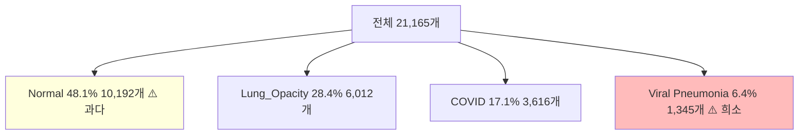
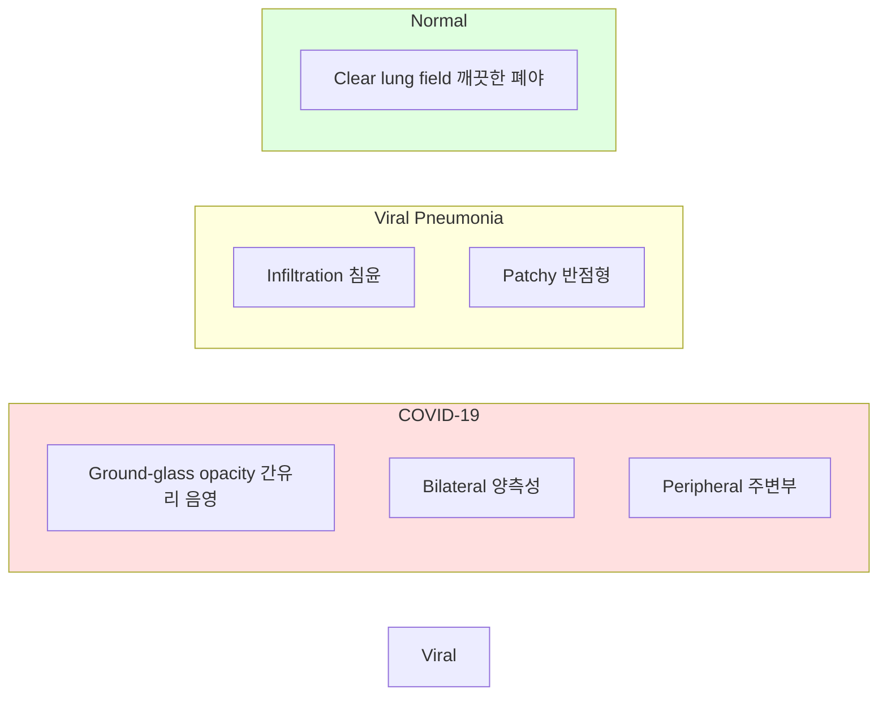
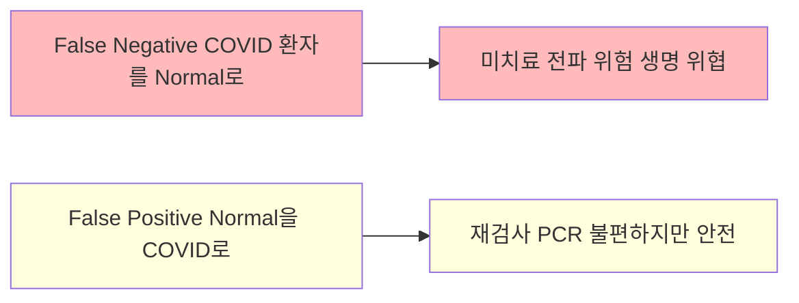
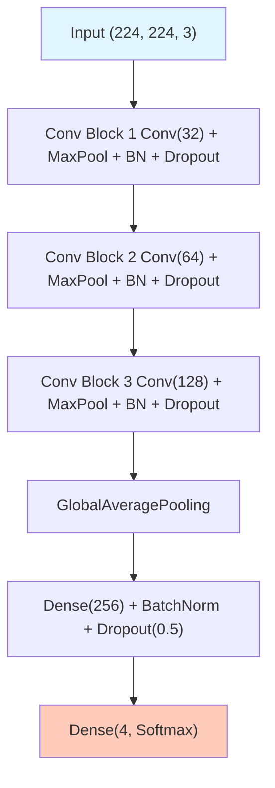

# Day 4-1: COVID-19 흉부 X-ray EDA

의료 이미지 분류 — COVID-19 Radiography Database

---
layout: default
---

# 학습 목표

- 🏥 **COVID-19 Radiography Database** 데이터셋 구조 이해
- ⚖️ **Class Imbalance** 문제 인식 — 의료 AI의 특수성
- 🖼️ **의료 이미지 특성** 파악 (Grayscale→RGB, tf.data 파이프라인)
- 📊 **Recall vs Accuracy** — 의료 AI 평가 지표
- 🏗️ **Baseline CNN** 구현 및 MLflow 기록

---
layout: default
---

# 🔧 노트북: 0. 환경 설정

### 🔥 함께 작성해볼 부분

- **repo_owner**, **repo_name**을 본인의 Dagshub 정보로 채우기

```python
repo_owner = # 🔥 직접 작성이 필요합니다.
repo_name  = # 🔥 직접 작성이 필요합니다.
```

---
layout: center
class: text-center
---

# COVID-19 Radiography Database

---
layout: default
---

# 데이터셋 소개

### 4가지 클래스

| **클래스** | **개수** | **비율** | **설명** |
|:---|:---:|:---:|:---|
| **Normal** | 10,192 | 48.1% | 정상 폐 |
| **Lung_Opacity** | 6,012 | 28.4% | 폐 혼탁 (비특이적) |
| **COVID-19** | 3,616 | 17.1% | SARS-CoV-2 감염 |
| **Viral Pneumonia** | 1,345 | 6.4% | 바이러스성 폐렴 |

### 데이터 구조

```
COVID-19_Radiography_Dataset/
├── COVID/images/           (3,616개)
├── Lung_Opacity/images/    (6,012개)
├── Normal/images/          (10,192개)
└── Viral Pneumonia/images/ (1,345개)
```

---
layout: center
class: text-center
---

# Class Imbalance 문제

---
layout: default
---

# Class Imbalance 확인


**비율 = Normal : Viral Pneumonia = 7.6 : 1**

---
layout: img_caption
---

# Class Imbalance가 위험한 이유

::img-fit-width::



::caption::

**Naive 모델의 함정**: 모두 "Normal"로 예측 → Accuracy = 48.1%  
하지만 COVID 환자를 **단 한 명도 탐지 못함!**

---
layout: center
class: text-center
---

# 의료 이미지 특성

---
layout: img_caption
---

# X-ray 소견 비교

::img-fit-width::



::caption::

---
layout: default
---

# Grayscale → RGB 변환

원본 X-ray는 **Grayscale(1채널)**, ImageNet 사전학습 모델은 **RGB(3채널)** 기대

```python
img = tf.image.decode_png(img, channels=1)   # Grayscale 읽기
img = tf.image.grayscale_to_rgb(img)          # (H, W, 1) → (H, W, 3)
img = preprocess_input(img)                   # ImageNet 정규화
```

같은 채널을 3번 복사하는 것이지만, Pretrained 모델 입력에 **반드시 필요**합니다.

---
layout: default
---

# 메모리 효율적 데이터 로딩

전체 이미지를 메모리에 올리면 **~13GB** 필요  
→ `tf.data.Dataset`으로 **배치 단위 스트리밍** 사용

```python
# 경로만 수집 (이미지는 학습 시 배치 단위로 로드)
train_dataset = tf.data.Dataset.from_tensor_slices((train_paths, train_labels))
train_dataset = train_dataset.map(load_and_preprocess, num_parallel_calls=AUTOTUNE)
train_dataset = train_dataset.shuffle(1000).batch(32).prefetch(AUTOTUNE)
```

### prefetch의 역할

GPU가 학습하는 동안 CPU가 **다음 배치를 미리 준비** → 병목 최소화

---
layout: default
---

# 🔧 노트북: 1. 데이터 다운로드 & 2. EDA & 3. 샘플 이미지

### 이 구간에서 할 일

- Kaggle API로 COVID-19 Radiography Database 다운로드
- 클래스 분포 시각화
- 클래스별 샘플 이미지 4×5 확인
- 픽셀 값 분포 분석

---
layout: center
class: text-center
---

# 평가 지표

---
layout: top_img-bottom_text
---

# 왜 Recall이 중요한가?

::top::



::bottom::

```
Recall (민감도) = TP / (TP + FN)  ← 실제 COVID 중 탐지한 비율
의료 AI 목표: Recall 최대화 (False Negative 최소화)
```

---
layout: default
---

# Balanced Accuracy

클래스 불균형 상황에서 Overall Accuracy를 보완합니다.

```
Balanced Accuracy = 클래스별 Recall의 산술 평균
= (Recall_COVID + Recall_Opacity + Recall_Normal + Recall_Viral) / 4
```

모든 클래스가 균등하게 잘 분류됐는지 확인하는 핵심 지표입니다.

---
layout: center
class: text-center
---

# Baseline CNN

---
layout: img_caption
---

# Baseline CNN 아키텍처

::img-fit-width::



::caption::

---
layout: default
---

# 🔧 노트북: 5. 데이터 전처리 & 7. Baseline CNN

### 🔥 함께 작성해볼 부분

**Train/Val Split**

```python
train_paths, val_paths, train_labels, val_labels = # 🔥 직접 작성이 필요합니다.
# train_test_split(..., test_size=0.2, stratify=labels, random_state=42)
```

**build_baseline_cnn()**

```python
model = keras.Sequential([
    # Conv Block 1~3: 🔥 직접 작성이 필요합니다.
    # Classifier:     🔥 직접 작성이 필요합니다.
])
```

---
layout: default
---

# 🔧 노트북: 8. Baseline 모델 학습

### 🔥 함께 작성해볼 부분

```python
with mlflow.start_run(run_name=''):  # 🔥 직접 작성이 필요합니다.
    mlflow.log_params({'model': 'Baseline_CNN', 'epochs': 20, ...})
    history = baseline_model.fit(train_dataset, epochs=20, ...)
```

⏱️ GPU에 따라 **15~30분** 소요

---
layout: default
---

# 학습 곡선


### 주목할 점
- Val Loss가 불안정하게 진동 → **Class Imbalance + 작은 모델**
- Day 4-2에서 Pretrained 모델로 해결

---
layout: default
---

# 🔧 노트북: 9. 모델 평가

### 이 구간에서 할 일

- 학습 곡선 시각화
- Confusion Matrix 확인

---
layout: default
---

# Confusion Matrix


---
layout: default
---

# 결과 분석

```
Overall Accuracy: 85.42%

COVID          : Recall=95.71% ✅  (잘 탐지)
Lung_Opacity   : Recall=85.60% ✅
Normal         : Recall=79.70% ⚠️  (정상을 병으로 오인)
Viral Pneumonia: Precision=60.59% ⚠️  (데이터 부족 → 과탐지)
```

Viral Pneumonia의 낮은 Precision은 **데이터 부족(1,345개)** 으로 인한 문제  
→ Day 4-3에서 **Class Weights + Focal Loss**로 해결

---
layout: default
---

# 의료 AI 윤리

### AI는 진단 보조 도구 (CAD: Computer-Aided Diagnosis)

```
AI 예측 → 방사선과 의사 확인 → 최종 진단 → 치료 결정
```

### 설명 가능성 (Explainability)

높은 정확도만으로는 의사가 신뢰하기 어렵습니다.  
Day 4-4의 **Grad-CAM**으로 "모델이 어디를 보고 판단했는지" 시각화해야  
임상 현장에서 수용 가능한 시스템이 됩니다.

---
layout: default
---

# ✅ 체크리스트

- [ ] COVID-19 Radiography Database 다운로드 (Kaggle API)
- [ ] 클래스별 이미지 수 확인 및 분포 시각화
- [ ] 클래스별 샘플 이미지 4×5 시각화
- [ ] 픽셀 값 분포 클래스별 비교
- [ ] tf.data.Dataset 파이프라인 구축 (train/val split, stratify)
- [ ] Baseline CNN 구현 및 MLflow 기록
- [ ] 학습 곡선 확인 (overfitting 여부)
- [ ] Confusion Matrix + Per-class Recall 확인
- [ ] Val Accuracy ~85%, COVID Recall ~95% 확인
