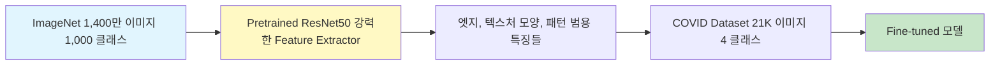
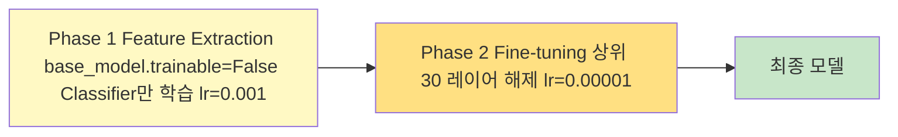
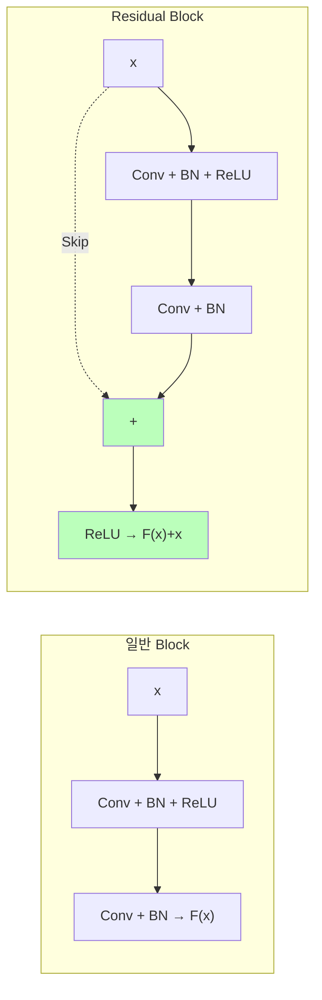
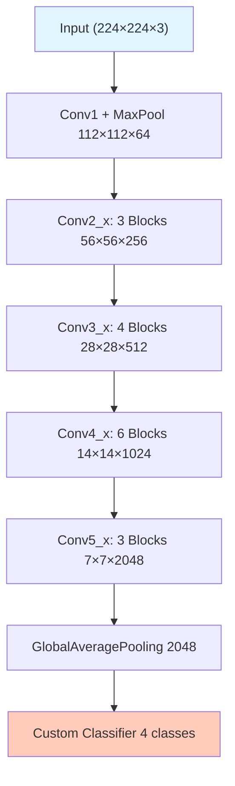

# Day 4-2: Transfer Learning with ResNet50

ImageNet 사전학습 모델로 COVID-19 분류 90%+ 달성

---
layout: default
---

# 학습 목표

- 🔄 **Transfer Learning** 핵심 아이디어 이해
- 🏗️ **ResNet50** 아키텍처 & Skip Connection 원리
- 📌 **Phase 1** Feature Extraction (base_model 동결)
- 🔧 **Phase 2** Fine-tuning (상위 레이어 해제)
- 📊 Baseline CNN vs ResNet50 성능 비교

---
layout: default
---

# 🔧 노트북: 0. 환경 설정

### 🔥 함께 작성해볼 부분

```python
repo_owner = # 🔥 직접 작성이 필요합니다.
repo_name  = # 🔥 직접 작성이 필요합니다.
```

---
layout: center
class: text-center
---

# Day 4-1 결과 & 개선 방향

---
layout: default
---

# Day 4-1 결과 복기

```
Baseline CNN 결과:
  Overall Accuracy: 85.42%
  COVID Recall:     95.71% ✅
  Viral Precision:  60.59% ⚠️  (데이터 부족)
  Normal Recall:    79.70% ⚠️  (다른 클래스와 혼동)

문제 원인:
  → 21K 이미지로 처음부터 학습 → 표현력 부족
  → Viral Pneumonia 1,345개 → 특징 학습 불충분
```

---
layout: center
class: text-center
---

# Transfer Learning

---
layout: top_img-bottom_text
---

# Transfer Learning 핵심 아이디어

::top::



::bottom::

ImageNet Low-level 특징(엣지, 텍스처)은 X-ray에도 그대로 적용됩니다.  
21K 이미지로 처음부터 학습하는 것보다 훨씬 강력한 Feature Extractor를 **즉시 확보**

---
layout: default
---

# Feature Extraction vs Fine-tuning

| **방법** | **Pretrained 가중치** | **학습 속도** | **언제 사용?** |
|:---|:---|:---|:---|
| **Feature Extraction** | 완전 동결 | 빠름 | 데이터 적음, 빠른 실험 |
| **Fine-tuning** | 상위 레이어만 업데이트 | 느림 | 데이터 충분, 최고 성능 |

---
layout: top_img-bottom_text
---

# 2단계 학습 전략

::top::



::bottom::

---
layout: center
class: text-center
---

# ResNet50 아키텍처

---
layout: img_caption
---

# Skip Connection (핵심)

::img-fit-width::



::caption::

50개 레이어를 쌓아도 Gradient가 사라지지 않습니다.  
`F(x)=0`이면 입력 그대로 통과 → 깊게 쌓을수록 손해 없는 구조

---
layout: img_caption
---

# ResNet50 전체 구조

::img-fit-width::



::caption::

`include_top=False`로 ImageNet Classifier 제거 → COVID 4-class Classifier 추가

---
layout: default
---

# 의료 이미지 Augmentation 주의사항

| **변환** | **허용** | **이유** |
|:---|:---:|:---|
| 좌우 반전 | ✅ | 촬영 방향 차이 |
| 소폭 회전 (±15°) | ✅ | 환자 자세 |
| 이동/확대 | ✅ | 촬영 거리 |
| **상하 반전** | ❌ | 비현실적 (폐가 위에 있음) |
| **극단적 회전** | ❌ | 병변 패턴 왜곡 |

### ImageNet 정규화 (`preprocess_input`)

```python
img = img - [103.939, 116.779, 123.68]   # RGB 채널별 ImageNet 평균 빼기
```

ResNet50은 이 정규화를 가정하고 학습됐으므로 **반드시 적용**해야 합니다.

---
layout: default
---

# 🔧 노트북: 1. 데이터 로드 & 2. Data Augmentation

### 이 구간에서 할 일

- Kaggle API로 데이터 로드 (Day 4-1 재사용)
- `load_and_preprocess()` 함수에 ImageNet 정규화 및 Augmentation 적용
- `tf.data.Dataset` 생성

---
layout: default
---

# Phase 1: Feature Extraction

```python
# Pretrained ResNet50 (Classifier 제거)
base_model = ResNet50(
    weights='imagenet',
    include_top=False,
    input_shape=(224, 224, 3)
)
base_model.trainable = False   # 완전 동결 — 149개 레이어 모두 고정
```

`training=False`: BatchNorm이 학습 통계 대신 **ImageNet 통계** 사용 (중요!)

---
layout: default
---

# 🔧 노트북: 3. ResNet50 Transfer Learning — Phase 1

### 🔥 함께 작성해볼 부분

**Custom Classifier 구성**

```python
x = base_model(inputs, training=False)
x = layers.GlobalAveragePooling2D()(x)
x = # 🔥 직접 작성이 필요합니다. (Dense(512) + BN + Dropout(0.5))
x = # 🔥 직접 작성이 필요합니다. (Dense(256) + BN + Dropout(0.3))
outputs = # 🔥 직접 작성이 필요합니다. (Dense(4, softmax))
```

---
layout: default
---

# 🔧 노트북: 4. Phase 1 학습

### 🔥 함께 작성해볼 부분

**Phase 1 run_name** 채우기

```python
with mlflow.start_run(run_name=''):  # 🔥 직접 작성이 필요합니다.
    # Feature Extraction 학습 (EarlyStopping 포함)
    # ⏱️ GPU에 따라 10~20분 소요
```

---
layout: default
---

# Phase 2: Fine-tuning

```python
# 상위 30개 레이어만 학습 가능하게 해제
base_model.trainable = True
for layer in base_model.layers[:-30]:
    layer.trainable = False   # 하위 119개 레이어 계속 동결

# 매우 낮은 LR — Pretrained 가중치를 조금씩만 수정
model.compile(optimizer=Adam(1e-5), ...)
```

### 왜 LR을 작게 쓰는가?

큰 LR로 업데이트하면 **ImageNet에서 학습한 좋은 초기값을 망가뜨립니다.**

### ReduceLROnPlateau

```python
reduce_lr = ReduceLROnPlateau(monitor='val_loss', factor=0.5, patience=3, min_lr=1e-7)
```

---
layout: default
---

# 🔧 노트북: 5. Phase 2: Fine-tuning

### 🔥 함께 작성해볼 부분

**해제할 레이어 수** & **Phase 2 run_name** 채우기

```python
for layer in base_model.layers[:-# 🔥 직접 작성이 필요합니다.]:  # 권장: 30
    layer.trainable = False

with mlflow.start_run(run_name=''):  # 🔥 직접 작성이 필요합니다.
    # Fine-tuning 학습
    # ⏱️ GPU에 따라 5~10분 소요
```

---
layout: default
---

# 🔧 노트북: 6. 성능 평가 & 7. Baseline vs ResNet50 비교

### 이 구간에서 할 일

- Phase 1 + Phase 2 학습 곡선 4개 그래프
- Confusion Matrix
- Baseline CNN vs ResNet50 비교 시각화

---
layout: default
---

# 학습 곡선


---
layout: default
---

# Confusion Matrix — ResNet50


---
layout: default
---

# Baseline vs ResNet50 비교


```
Overall Accuracy: 85.42% → 90.67%  (+5.25%p) ✅
COVID Recall:     95.71% → 88.93%  (하락!)   ⚠️
Viral Precision:  60.59% → 95.49%  (크게 향상) ✅
```

---
layout: default
---

# COVID Recall 하락 — Day 4-3의 동기

### 왜 하락했는가?

Normal이 **48%** 로 압도적으로 많아 모델이 Normal에 **bias** 됩니다.  
정확도는 올랐지만 의료 AI에서 가장 중요한 **COVID Recall이 오히려 떨어졌습니다.**

### 해결책 → Day 4-3

**Class Weights + Focal Loss**로 소수 클래스를 더 중요하게 학습

---
layout: default
---

# ✅ 체크리스트

- [ ] Transfer Learning 개념 (Feature Extraction vs Fine-tuning) 이해
- [ ] ResNet50 Skip Connection 원리 이해
- [ ] Phase 1: base_model.trainable=False → Custom Classifier 학습
- [ ] Data Augmentation 적용 (의료 이미지 제약 준수)
- [ ] Phase 2: 상위 30개 레이어 해제 → lr=1e-5 Fine-tuning
- [ ] ReduceLROnPlateau Callback 적용
- [ ] 두 Phase 학습 곡선 비교
- [ ] Val Accuracy 90%+ 달성
- [ ] MLflow에 Phase 1, Phase 2 각각 기록
- [ ] COVID Recall 하락 원인 파악 → Day 4-3 준비
