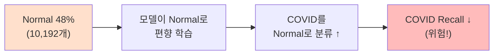
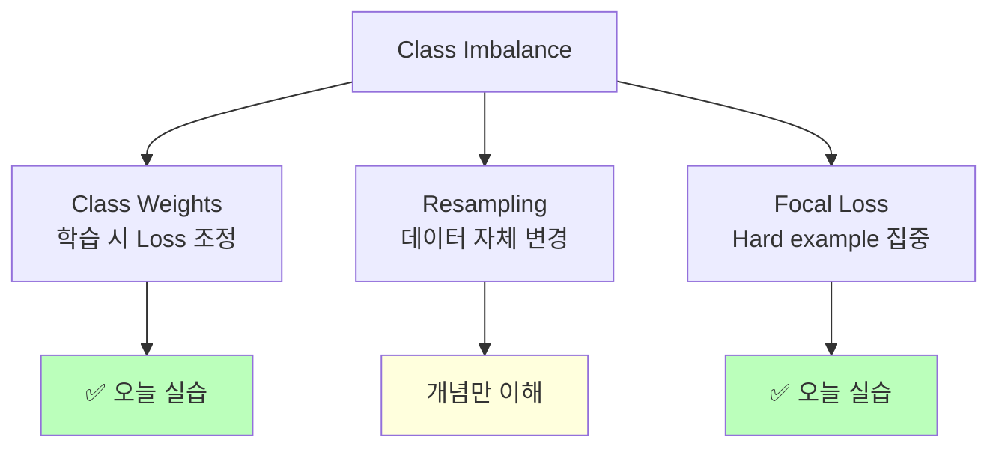
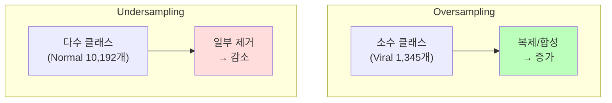
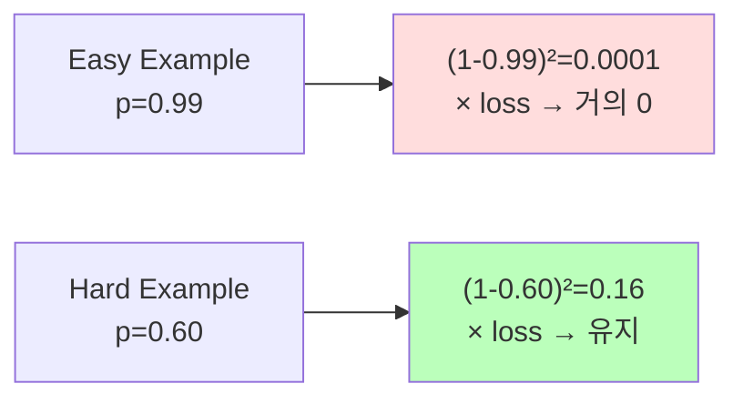
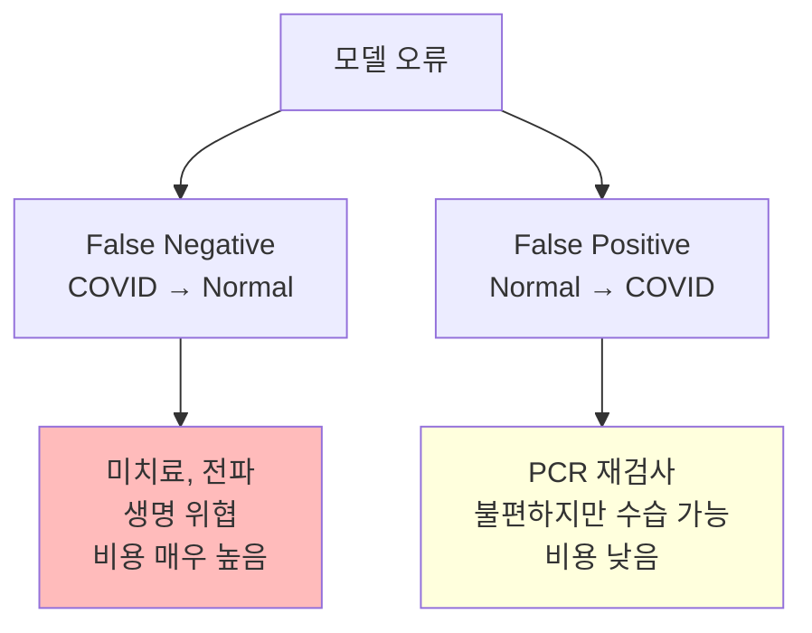

# Day 4-3: Class Imbalance 처리

Class Weights & Focal Loss로 의료 AI 성능 균형 잡기

---
layout: default
---

# 학습 목표

- ⚖️ **Class Imbalance** 원인과 영향 이해
- 🔢 **Class Weights** 계산 및 적용
- 🎯 **Focal Loss** 구현 원리 이해
- 📊 Balanced Accuracy & COVID Recall 복원
- 🏆 3가지 전략 비교 & Best 모델 선정

---
layout: default
---

# 🔧 노트북: 0. 환경 설정

### 🔥 함께 작성해볼 부분

```python
repo_owner = # 🔥 직접 작성이 필요합니다.
repo_name  = # 🔥 직접 작성이 필요합니다.
```

---
layout: center
class: text-center
---

# Day 4-2 결과 & 문제

---
layout: default
---

# Day 4-2 결과 복기

```
ResNet50 Transfer Learning 결과:
  Overall Accuracy:  90.67%  ✅ (향상)
  COVID Recall:      88.93%  ❌ (95.71% → 88.93% 하락)
  Balanced Accuracy: 90.35%

COVID 환자 80명 중 7명을 놓침.
정확도는 올랐지만 의료 AI에서 가장 위험한 실패.
```

### 원인

Normal이 **48%** 로 압도적으로 많아 모델이 "Normal로 예측"하는 것이
Loss를 줄이는 가장 쉬운 방법이 됩니다.

---
layout: top_img-bottom_text
---

# Class Imbalance → COVID Recall 하락

::top::



::bottom::

Viral Pneumonia는 **6%** (1,345개) — Normal의 1/7 수준

단순히 Loss를 최소화하면 소수 클래스를 **포기**하는 방향으로 수렴

---
layout: center
class: text-center
---

# 해결 전략 Overview

---
layout: top_img-bottom_text
---

# 3가지 해결 전략

::top::



::bottom::

오늘은 **Class Weights**와 **Focal Loss** 두 가지를 직접 구현하고 비교합니다.

---
layout: center
class: text-center
---

# Class Weights

---
layout: default
---

# Class Weights 원리

### 희소 클래스를 틀렸을 때 Loss를 더 크게 반영

```
Loss (일반)      = cross_entropy(pred, true)
Loss (가중치 적용) = weight[true_class] × cross_entropy(pred, true)
```

Viral Pneumonia를 틀리면 Normal을 틀린 것보다 **6배** 강한 패널티를 줍니다.

모델이 희소 클래스를 "포기"하지 않도록 강제합니다.

### 모델 구조나 데이터를 바꾸지 않고 **파라미터 한 줄**로 적용

```python
model.fit(..., class_weight=class_weights)   # ← 이 한 줄
```

---
layout: default
---

# Class Weights 계산

### 수식

`weight_c = N_total / (N_classes × N_c)`

```python
from sklearn.utils.class_weight import compute_class_weight

class_weights_array = compute_class_weight(
    class_weight='balanced',    # n_samples / (n_classes × n_samples_per_class)
    classes=np.unique(train_labels),
    y=train_labels
)
class_weights = {i: w for i, w in enumerate(class_weights_array)}
# 예: {0: 1.17, 1: 0.88, 2: 0.52, 3: 3.14}
#      COVID    Opacity  Normal   Viral
```

- 클래스, 샘플 수, Weight 및 해석
    - Normal: 10,192 / **0.52** / 가장 많음 → 낮은 페널티
    - Lung_Opacity: 6,012 / 0.88 / 중간
    - COVID: 3,616 / 1.17 / 중간
    - Viral Pneumonia: 1,345 / **3.14** / 가장 희소 → 높은 페널티

---
layout: default
---

# 🔧 노트북: 2. Class Weights 계산

### 🔥 함께 작성해볼 부분

```python
class_weights_array = # 🔥 직접 작성이 필요합니다.
#   compute_class_weight(
#       class_weight='balanced',
#       classes=np.unique(train_labels),
#       y=train_labels
#   )
```

계산 결과를 확인하고 Viral Pneumonia의 가중치가 가장 높은지 검증해보세요.

---
layout: default
---

# 🔧 노트북: 3. Dataset & 4. 모델 구축

### 이 구간에서 할 일

- `load_and_preprocess()` 함수로 ImageNet 전처리 (Day 4-2와 동일)
- `tf.data.Dataset` 생성 (Augmentation 없이 단순 전처리)
- `build_resnet50_model()` 함수로 모델 구축

### 실험 설계

| 실험 | 변경사항 | 비교 기준 |
|:---|:---|:---|
| Baseline | 없음 (Day 4-2) | COVID Recall 88.93% |
| Class Weights | `class_weight` 파라미터 | COVID Recall 95%+ 목표 |
| Focal Loss | Loss 함수 교체 | Hard example 집중 |

---
layout: default
---

# 🔧 노트북: 5. Experiment 1 — Class Weights 학습

### 🔥 함께 작성해볼 부분

```python
with mlflow.start_run(run_name=''):  # 🔥 직접 작성이 필요합니다.
    history_weighted = model_weighted.fit(
        train_dataset,
        epochs=15,
        validation_data=val_dataset,
        class_weight=# 🔥 직접 작성이 필요합니다.,  # ← 핵심!
        callbacks=[early_stop, reduce_lr]
    )
```

⏱️ GPU에 따라 15~25분 소요

---
layout: center
class: text-center
---

# Resampling (개념 이해)

---
layout: default
---

# Resampling 전략

<div style="text-align: center;">



</div>

| **방법** | **장점** | **단점** | **의료 이미지** |
|:---|:---|:---|:---:|
| Random Oversampling | 간단 | Overfitting (동일 샘플 반복) | ⚠️ |
| SMOTE | 합성 샘플 생성 | 이미지 특징 공간에 부적합 | ❌ |
| Undersampling | 학습 빠름 | Normal 정보 손실 | ⚠️ |

**결론**: 의료 이미지에는 Class Weights + Augmentation 조합이 가장 실용적

---
layout: center
class: text-center
---

# Focal Loss

---
layout: default
---

# Cross Entropy의 문제

### Easy examples가 Loss를 지배한다

```
Easy example: pred=0.99 (정상을 정상으로, 확신) → loss=0.01  (작음)
Hard example: pred=0.60 (COVID인데 불확실)    → loss=0.51  (큼)

하지만 Easy examples가 수천 배 많아 Loss 전체를 지배
→ 모델이 Hard example(희소 클래스)을 충분히 학습 못함
```

### Imbalanced dataset에서의 패턴

Normal(Easy): 10,192개 × loss≈0.01 = **101.92**
Viral(Hard):   1,345개 × loss≈0.51 =  **685.95**

Total loss 중 Normal의 비중이 **훨씬** 크므로 모델은 Normal에 집중 학습

---
layout: default
---

# Focal Loss 수식

<div style="text-align:center;">



</div>

```
FL(p_t) = -α × (1 - p_t)^γ × log(p_t)

p_t:           정답 클래스 예측 확률
γ (gamma=2):   Focusing parameter — 클수록 Easy 억제 강도 증가
α (alpha=0.25): Class balance factor

Modulating Factor (1 - p_t)^γ:
  Easy (p_t=0.99): (0.01)² = 0.0001  → Loss 거의 0으로 감소
  Hard (p_t=0.60): (0.40)² = 0.16    → Loss 유지
```

---
layout: default
---

# Focal Loss 구현

```python
def focal_loss(gamma=2., alpha=0.25):
    def focal_loss_fixed(y_true, y_pred):
        y_true_oh = tf.one_hot(tf.cast(y_true, tf.int32), depth=y_pred.shape[-1])
        y_pred = tf.clip_by_value(y_pred, epsilon, 1. - epsilon)

        ce = -y_true_oh * tf.math.log(y_pred)             # Cross Entropy
        p_t = tf.reduce_sum(y_true_oh * y_pred, axis=-1)  # 정답 클래스 확률
        focal_term = tf.pow(1. - p_t, gamma)               # Modulating Factor

        loss = alpha * focal_term * tf.reduce_sum(ce, axis=-1)
        return tf.reduce_mean(loss)
    return focal_loss_fixed

model_focal.compile(optimizer='adam', loss=focal_loss(gamma=2.0, alpha=0.25), ...)
```

---
layout: default
---

# 🔧 노트북: 6. Experiment 2 — Focal Loss

### 🔥 함께 작성해볼 부분

**focal_term**과 **loss** 두 줄을 직접 작성해보세요

```python
p_t = tf.reduce_sum(y_true_one_hot * y_pred, axis=-1, keepdims=True)
focal_term = # 🔥 직접 작성이 필요합니다. (tf.pow(1. - p_t, gamma))
loss       = # 🔥 직접 작성이 필요합니다. (alpha * focal_term * tf.reduce_sum(ce, axis=-1))
```

**run_name**도 채워주세요

```python
with mlflow.start_run(run_name=''):  # 🔥 직접 작성이 필요합니다.
```

⏱️ GPU에 따라 15~25분 소요

---
layout: center
class: text-center
---

# 실험 결과

---
layout: default
---

# 🔧 노트북: 7. 성능 비교 & 8. Best 모델 선정

### 이 구간에서 할 일

- 3가지 전략 Accuracy / Balanced Acc / COVID Recall / Macro F1 비교
- COVID Recall 기준으로 Best 모델 자동 선정
- Best 모델 Confusion Matrix 및 Classification Report 확인

### 핵심 평가 지표

```python
from sklearn.metrics import balanced_accuracy_score, recall_score

balanced_acc = balanced_accuracy_score(y_true, y_pred)
recall_per_class = recall_score(y_true, y_pred, average=None)
# recall_per_class[0] = COVID Recall ← 가장 중요
```

**목표**: Overall Accuracy 90%+ / Balanced Accuracy 92%+ / COVID Recall **95%+**

---
layout: default
---

# 실험 결과


---
layout: default
---

# Confusion Matrix — Class Weights


---
layout: default
---

# 실제 결과 수치

```
============================================================
  Class Weights 결과 (Best)
============================================================
                 precision    recall  f1-score   support

          COVID     0.9272    0.9696    0.9479       723
   Lung_Opacity     0.8855    0.8811    0.8833      1203
         Normal     0.9280    0.9176    0.9228      2038
Viral Pneumonia     0.9585    0.9442    0.9513       269
============================================================

Overall Accuracy:    91.78%  (+1.11%p vs Baseline)
Balanced Accuracy:   92.81%
COVID Recall:        96.96%  ✅  (88.93% → 96.96%)
Macro F1:            0.9263

→ 단 한 줄(class_weight=class_weights)로 COVID Recall 8%p 회복!
```

---
layout: top_img-bottom_text
---

# 의료 AI 관점: 비용 비대칭

::top::



::bottom::

FN과 FP의 비용이 **비대칭**입니다.
단순 Loss 최소화 ≠ 최선의 의료 AI
Class Weights는 이 **비용 비대칭을 학습에 직접 반영**합니다.

---
layout: default
---

# ✅ 체크리스트

- [ ] Class Imbalance 원인 분석 (Normal 48% bias)
- [ ] `compute_class_weight`로 가중치 계산
- [ ] Class Weights 적용 학습 완료
- [ ] Focal Loss `focal_term`, `loss` 직접 구현
- [ ] Focal Loss 학습 완료
- [ ] Balanced Accuracy 계산 및 비교
- [ ] COVID Recall 95%+ 달성 확인
- [ ] 3가지 전략 성능 비교 시각화
- [ ] Best 모델 선정 (COVID Recall 기준)
- [ ] MLflow에 모든 실험 기록
