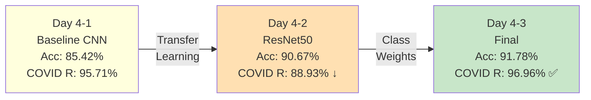
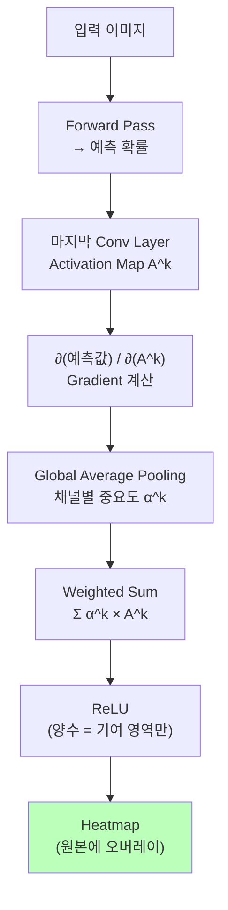
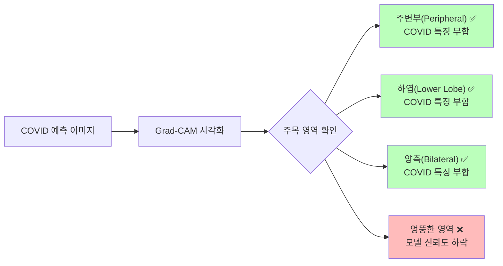
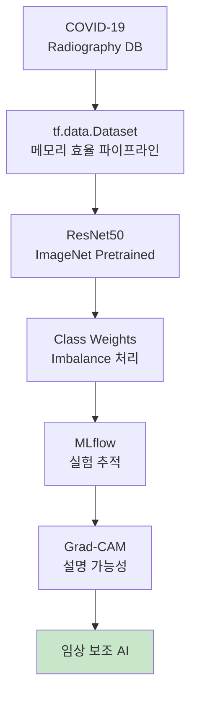

# Day 4-4: Grad-CAM & 최종 평가

모델이 어디를 보는지 시각화하고 Day 4 여정을 마무리합니다

---
layout: default
---

# 학습 목표

- 🗺️ **Day 4 전체 여정** 요약 & 성능 개선 흐름 파악
- 🔍 **Grad-CAM** 원리 이해 및 구현
- 🖼️ 클래스별 Heatmap 시각화 & 의학적 해석
- ❌ **FP/FN 분석**으로 모델 실패 패턴 파악
- 📈 **ROC-AUC** & **Precision-Recall Curve** 해석
- 🏆 Day 4 최종 종합 평가

---
layout: default
---

# 🔧 노트북: 0. 환경 설정

### 🔥 함께 작성해볼 부분

```python
repo_owner = # 🔥 직접 작성이 필요합니다.
repo_name  = # 🔥 직접 작성이 필요합니다.
```

---
layout: center
class: text-center
---

# Day 4 전체 여정

---
layout: default
---

# Day 4 성능 개선 흐름

<div style="text-align: center;">



</div>

| **단계** | **Accuracy** | **COVID Recall** | **핵심 기법** |
|:---|:---:|:---:|:---|
| Baseline CNN | 85.42% | 95.71% | Simple CNN |
| ResNet50 | 90.67% | 88.93% ↓ | Transfer Learning |
| + Class Weights | **91.78%** | **96.96% ✅** | Imbalance 처리 |

---
layout: center
class: text-center
---

# Grad-CAM

---
layout: default
---

# Grad-CAM이 필요한 이유

```
모델 출력: "COVID (97% 확률)"

의사의 질문:
  "어디를 보고 판단했나요?"
  "해부학적으로 맞는 위치를 봤나요?"

→ 설명 없이는 신뢰 불가
→ Explainability가 임상 수용의 전제 조건
```

### Grad-CAM이 하는 일

입력 이미지의 어떤 공간 영역이 예측 클래스에 **가장 크게 기여**했는지를 Heatmap으로 시각화합니다.

높은 성능만으로는 부족합니다. 의사가 **왜 그런 판단을 내렸는지** 확인할 수 있어야 임상에서 신뢰할 수 있습니다.

---
layout: img_caption
---

# Grad-CAM 알고리즘 흐름

::img-fit-width::



::caption::

ReLU를 씌우는 이유: 예측 클래스에 **긍정적으로 기여**하는 영역만 강조합니다.

---
layout: default
---

# Grad-CAM 핵심 수식

```
α^c_k = (1/Z) Σ_i Σ_j  ∂y^c / ∂A^k_ij   (채널 k의 중요도)
L^c   = ReLU( Σ_k  α^c_k × A^k )         (Grad-CAM 맵)
```

- **α^c_k**: 클래스 c 예측에 대한 채널 k의 중요도 → Gradient를 공간 평균한 값
- **A^k**: 마지막 Conv Layer의 k번째 채널 Activation Map
- **ReLU**: 음수 제거 → 예측에 긍정적으로 기여하는 영역만 남김

### conv5_block3_out (ResNet50 마지막 Conv)

ResNet50의 마지막 Conv Layer `conv5_block3_out`은 **7×7×2048** 크기입니다.
가장 추상적인 고수준 특징을 담고 있어 Grad-CAM에 가장 적합합니다.

---
layout: default
---

# Grad-CAM 구현 1

```python
def make_gradcam_heatmap(model, img_array, pred_index=None):
    base_model = next(l for l in model.layers if 'resnet' in l.name.lower())

    # Grad 모델: [입력] → [마지막 Conv 출력, 최종 예측]
    grad_model = tf.keras.Model(
        inputs=base_model.input,
        outputs=[base_model.get_layer('conv5_block3_out').output,
                 model.output]
    )

    with tf.GradientTape() as tape:
        conv_outputs, predictions = grad_model(img_array)
        if pred_index is None:
            pred_index = tf.argmax(predictions[0])
        loss = predictions[:, pred_index]

    grads = tape.gradient(loss, conv_outputs)   # ∂loss / ∂conv_outputs
```

---
layout: default
---

# Grad-CAM 구현 2

```python
    # 채널별 중요도 (Global Average Pooling)
    pooled_grads = tf.reduce_mean(grads, axis=(0, 1, 2))

    # Weighted Sum + ReLU + Normalize
    heatmap = conv_outputs[0] @ pooled_grads[..., tf.newaxis]
    heatmap = tf.squeeze(heatmap)
    heatmap = tf.maximum(heatmap, 0) / tf.math.reduce_max(heatmap)
    return heatmap.numpy()
```

---
layout: default
---

# 🔧 노트북: 2. Grad-CAM 구현

### 🔥 함께 작성해볼 부분

**채널별 중요도 계산**과 **Weighted Sum + ReLU** 세 줄을 직접 작성해보세요

```python
grads = tape.gradient(loss, conv_outputs)

pooled_grads = # 🔥 직접 작성이 필요합니다. (tf.reduce_mean(grads, axis=(0, 1, 2)))

heatmap = # 🔥 직접 작성이 필요합니다. (last_conv_layer_output @ pooled_grads[..., tf.newaxis])
heatmap = tf.squeeze(heatmap)
heatmap = # 🔥 직접 작성이 필요합니다. (tf.maximum(heatmap, 0) / (tf.math.reduce_max(heatmap) + 1e-10))
```

`axis=(0, 1, 2)`: 공간 차원(Height, Width) + 배치 차원 → 채널별 스칼라로 압축

---
layout: default
---

# 🔧 노트북: 3. 클래스별 Grad-CAM 시각화

### 이 구간에서 할 일

- `overlay_heatmap()` 함수로 원본 이미지에 Heatmap 오버레이
- 4개 클래스 × 4개 샘플 → 4×4 시각화
- JET colormap: 파랑(낮은 기여) → 초록 → **빨강(높은 기여)**

```python
def overlay_heatmap(img, heatmap, alpha=0.4):
    heatmap = cv2.resize(heatmap, (img.shape[1], img.shape[0]))
    heatmap = np.uint8(255 * heatmap)
    heatmap = cv2.applyColorMap(heatmap, cv2.COLORMAP_JET)
    if len(img.shape) == 2:
        img = cv2.cvtColor(img, cv2.COLOR_GRAY2RGB)
    img = np.uint8(255 * img)
    return cv2.addWeighted(img, 1 - alpha, heatmap, alpha, 0)
```

---
layout: default
---

# 클래스별 Grad-CAM 결과


---
layout: top_img-bottom_text
---

# COVID 소견과 Grad-CAM 대조

::top::



::bottom::

Grad-CAM 결과가 X-ray 의학 지식(간유리 음영, 주변부, 하엽)과 일치할 때만 의사가 신뢰할 수 있습니다.

---
layout: center
class: text-center
---

# 잘못된 예측 분석

---
layout: default
---

# 🔧 노트북: 4. FP/FN 분석

### 이 구간에서 할 일

```python
# COVID False Negative: 실제 COVID인데 다른 클래스로 예측
covid_fn = np.where((y_true == 0) & (y_pred != 0))[0]
print(f"COVID False Negative: {len(covid_fn)}개")

# FN 케이스 Grad-CAM 분석
for idx in covid_fn[:4]:
    heatmap = make_gradcam_heatmap(model, img_array)
    # ... 시각화
```

**FN 분석의 목적**: 모델이 어떤 패턴을 보고 틀렸는지를 파악 → 데이터 수집 방향 및 추가 학습 전략 결정

---
layout: default
---

# COVID False Negative Grad-CAM


96.96% Recall → FN은 약 22개 (723 × 0.03). 틀린 케이스에서 모델이 어떤 영역을 봤는지 확인합니다.

---
layout: center
class: text-center
---

# ROC-AUC & Precision-Recall

---
layout: default
---

# ROC-AUC

### One-vs-Rest 방식으로 4개 클래스별 AUC 계산

```python
from sklearn.preprocessing import label_binarize
from sklearn.metrics import roc_curve, auc

y_true_binary = label_binarize(y_true, classes=[0, 1, 2, 3])

for i, class_name in enumerate(class_names):
    fpr, tpr, _ = roc_curve(y_true_binary[:, i], y_pred_proba[:, i])
    roc_auc = auc(fpr, tpr)
    plt.plot(fpr, tpr, label=f'{class_name} (AUC={roc_auc:.3f})')
```

AUC가 1.0에 가까울수록 완벽. 0.5는 랜덤 분류기와 같습니다. **COVID AUC > 0.99가 목표**입니다.

---
layout: default
---

# ROC-AUC 결과


---
layout: default
---

# Precision-Recall Curve

```python
from sklearn.metrics import precision_recall_curve, average_precision_score

for i, class_name in enumerate(class_names):
    precision, recall, _ = precision_recall_curve(
        y_true_binary[:, i], y_pred_proba[:, i]
    )
    ap = average_precision_score(y_true_binary[:, i], y_pred_proba[:, i])
    plt.plot(recall, precision, label=f'{class_name} (AP={ap:.3f})')
```

PR Curve는 Imbalanced 데이터에서 ROC보다 **더 정보량이 많습니다**.
특히 Viral Pneumonia(6%)처럼 희소 클래스의 실질적 성능을 더 잘 보여줍니다.

---
layout: default
---

# Precision-Recall Curve 결과


---
layout: default
---

# 🔧 노트북: 7. Day 4 최종 종합 평가

### 이 구간에서 할 일

- Day 4-1 → 4-2 → 4-3 성능 여정 그래프 (Accuracy + COVID Recall)
- Balanced Accuracy & Macro F1 최종 집계
- 임상 적용 가능성 및 한계 정리

---
layout: default
---

# Day 4 최종 성능 여정


---
layout: default
---

# 최종 성능 수치

```
============================================================
  최종 성능 (Class Weights 모델)
============================================================
Overall Accuracy:      91.78%
Balanced Accuracy:     92.81%
Macro F1:              0.9263
COVID-19 Recall:       96.96% ✅

Per-class:
  COVID  : P=0.9272, R=0.9696, F1=0.9479
  Opacity: P=0.8855, R=0.8811, F1=0.8833
  Normal : P=0.9280, R=0.9176, F1=0.9228
  Viral  : P=0.9585, R=0.9442, F1=0.9513
```

**모든 목표 달성**: Overall 90%+ / Balanced 92%+ / COVID Recall **95%+**

---
layout: default
---

# 기술 스택 요약

<div style="text-align: center;"> 



</div>

단순히 높은 정확도를 넘어 **설명 가능한 AI** — 의사가 신뢰하고 사용할 수 있는 모델

---
layout: default
---

# 임상 적용 가능성

### 강점

```
✅ COVID Recall 96.96%: False Negative 최소화 (100명 중 3명 미만 놓침)
✅ 모든 클래스 F1 > 0.88: 특정 클래스 편향 없음
✅ Grad-CAM: 의사가 판단 근거 확인 가능
```

### 한계 및 다음 단계

```
⚠️ 단일 병원/데이터 출처 → 다양한 병원 검증 필요
⚠️ External Validation 미수행 → 실제 임상 환경 테스트 필요
⚠️ 복합 질환 미지원 → Multi-label로 확장 가능
```

### 권장 활용 방식: 1차 스크리닝 보조 도구

```
대량 X-ray 입력 → AI 이상 소견 우선순위 지정 → 방사선과 의사 확인 → 최종 진단
```

---
layout: default
---

# ✅ 체크리스트

- [ ] MLflow에서 Best 모델 로드 (Day 4-3 Class Weights)
- [ ] Grad-CAM `make_gradcam_heatmap` 구현
  - [ ] `pooled_grads`: `tf.reduce_mean(grads, axis=(0, 1, 2))`
  - [ ] `heatmap`: Weighted Sum (`@ pooled_grads[..., tf.newaxis]`)
  - [ ] `heatmap`: ReLU + Normalize
- [ ] `overlay_heatmap` 구현
- [ ] 클래스별 Grad-CAM 4×4 시각화
- [ ] COVID Heatmap이 주변부/하엽에 집중하는지 확인
- [ ] COVID False Negative 케이스 Grad-CAM 분석
- [ ] ROC-AUC 4개 클래스별 계산 및 시각화
- [ ] Precision-Recall Curve 4개 클래스별
- [ ] Day 4 전체 여정 그래프 (Acc + COVID Recall)
- [ ] 최종 성능 종합 (Balanced Accuracy, Macro F1)
- [ ] 임상 적용 가능성 및 한계 정리
