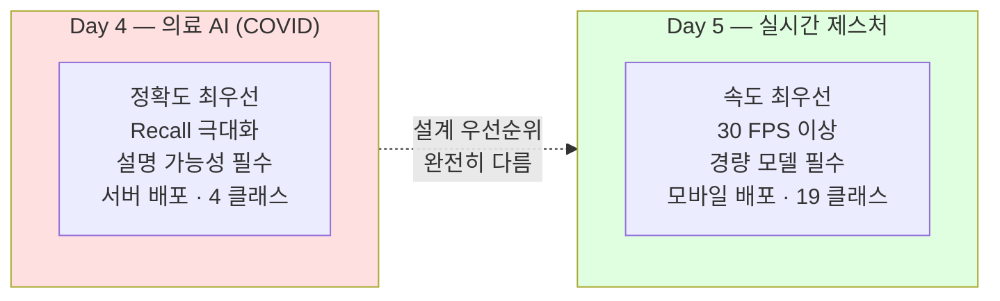
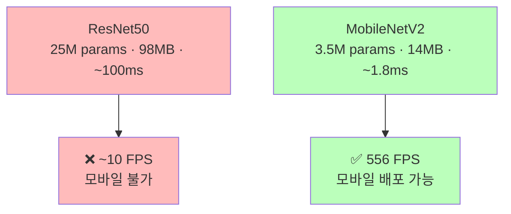
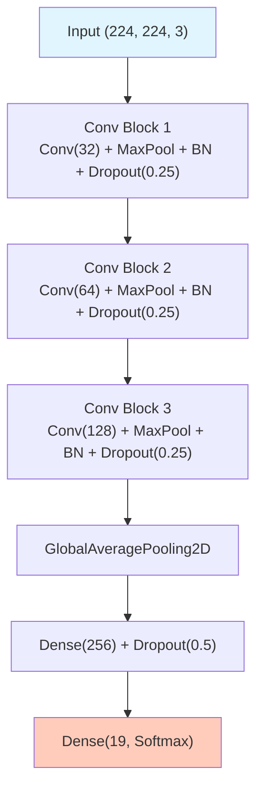
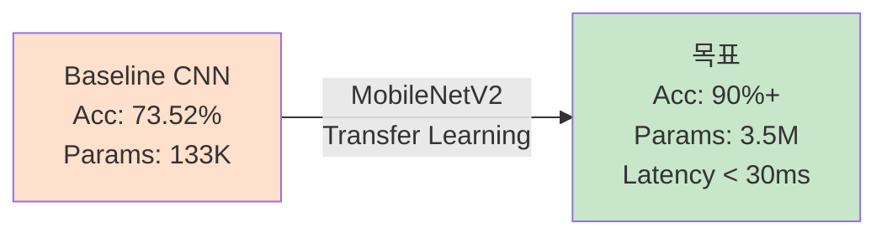

# Day 5-1: HaGRID 손 제스처 데이터 EDA

19개 제스처 탐색 & 경량 모델의 필요성 이해

---
layout: default
---

# 학습 목표

- 🤚 **HaGRID** 데이터셋 구조 & 19개 제스처 이해
- ⚡ **실시간 인식** 요구사항 (30 FPS) 이해
- 📊 클래스 분포 탐색 & **균형 잡힌 데이터** 확인
- 🏗️ **Baseline CNN** 구현 (3개 Conv Block, 19 클래스)
- 📏 모델 크기 & 추론 속도 측정

---
layout: default
---

# 🔧 노트북: 0. 환경 설정

### 🔥 함께 작성해볼 부분

```python
repo_owner = # 🔥 직접 작성이 필요합니다.
repo_name  = # 🔥 직접 작성이 필요합니다.
```

---
layout: center
class: text-center
---

# HaGRID 데이터셋

---
layout: default
---

# HaGRID 데이터셋 소개

- **출처**: Sber AI (Russia), 2022년 공개 / **라이센스**: CC BY 4.0
- **Kaggle**: `innominate817/hagrid-classification-512p-no-gesture-150k`
- **규모**: 153,735개 JPEG · 512×512 · **19 클래스**

| **카테고리** | **제스처** |
|:---|:---|
| **의사소통** | like 👍, dislike 👎, ok 👌, stop ✋, mute |
| **숫자** | one ☝️, four, three, three2, two_up, two_up_inverted |
| **기능** | call 📞, fist ✊, palm, rock 🤘, peace ✌️, peace_inverted, stop_inverted |
| **기타** | no_gesture |

```
hagrid-classification-512p-no-gesture-150k/
├── call/           (~8,530개)
├── dislike/        (~8,505개)
│   ...             (총 19개 폴더)
└── deleted_img_ids.txt
```

---
layout: default
---

# Day 4 vs Day 5: 설계 우선순위

<div style="text-align: center;"> 



</div>

| **항목** | **COVID (Day 4)** | **HaGRID (Day 5)** |
|:---|:---:|:---:|
| **모델** | ResNet50 (25M params) | MobileNetV2 (3.5M params) |
| **속도** | 무관 | < 33ms (30 FPS) |
| **클래스** | 4개 | **19개** |
| **Imbalance** | 심각 (48% vs 6%) | **없음** (~8,500개/클래스) |

---
layout: top_img-bottom_text
---

# 경량 모델의 필요성

::top::



::bottom::

30 FPS(33ms/frame)를 위해 모델 추론은 **10ms 이내**여야 합니다.

ResNet50으로는 불가능하고, **MobileNetV2**가 정확도와 속도를 모두 잡는 선택입니다.

---
layout: center
class: text-center
---

# 데이터 탐색

---
layout: default
---

# 🔧 노트북: 1. HaGRID 데이터 다운로드 & 2. 구조 탐색

### 이 구간에서 할 일

- Kaggle API로 `innominate817/hagrid-classification-512p-no-gesture-150k` 다운로드 (~3.8GB)
- 19개 제스처 폴더 확인
- 클래스별 이미지 수 집계

```python
# 80% Train / 20% Val (stratify 적용)
train_paths, temp_paths, train_labels, temp_labels = train_test_split(
    all_paths, all_labels, test_size=0.3, stratify=all_labels, random_state=42
)
val_paths, test_paths, val_labels, test_labels = train_test_split(
    temp_paths, temp_labels, test_size=0.5, stratify=temp_labels, random_state=42
)
```

---
layout: default
---

# 클래스 분포


클래스당 ~8,500개로 **균형 잡힌 데이터**입니다. Day 4와 달리 Class Weights나 Focal Loss가 필요하지 않습니다.

---
layout: default
---

# 제스처 샘플 이미지


---
layout: center
class: text-center
---

# tf.data 파이프라인 & Baseline CNN

---
layout: default
---

# tf.data 파이프라인

### 153K 이미지를 한 번에 올리면 ~60GB — 배치 스트리밍 사용

```python
def load_and_preprocess(path, label, target_size=(224, 224)):
    img = tf.io.read_file(path)
    img = tf.image.decode_jpeg(img, channels=3)   # JPEG, RGB 3채널
    img = tf.image.resize(img, target_size)        # 512×512 → 224×224
    img = img / 255.0                              # 0~1 정규화
    return img, label

train_dataset = (
    tf.data.Dataset.from_tensor_slices((train_paths, train_labels))
    .map(load_and_preprocess, num_parallel_calls=AUTOTUNE)
    .shuffle(1000).batch(32).prefetch(AUTOTUNE)
)
```

Day 4(PNG, Grayscale)와 달리 **JPEG + RGB** → `decode_jpeg` + `channels=3` 사용

---
layout: img_caption
---

# Baseline CNN 아키텍처

::img-fit-width::



::caption::

파라미터 ~133K · 크기 ~1.6MB. Day 5-2 MobileNetV2와 비교 기준이 됩니다.

---
layout: default
---

# 🔧 노트북: 6. Baseline CNN 구현

### 🔥 함께 작성해볼 부분

**3개 Conv Block**을 직접 작성해보세요

```python
model = keras.Sequential([
    # Conv Block 1: Conv(32) + MaxPool + BN + Dropout(0.25)
    # 🔥 직접 작성이 필요합니다.

    # Conv Block 2: Conv(64) + MaxPool + BN + Dropout(0.25)
    # 🔥 직접 작성이 필요합니다.

    # Conv Block 3: Conv(128) + MaxPool + BN + Dropout(0.25)
    # 🔥 직접 작성이 필요합니다.

    # Classifier (주어짐)
    layers.GlobalAveragePooling2D(),
    layers.Dense(256, activation='relu'),
    layers.Dropout(0.5),
    layers.Dense(19, activation='softmax')
], name='Baseline_CNN')
```

---
layout: default
---

# 🔧 노트북: 7. Baseline 모델 학습

### 🔥 함께 작성해볼 부분

```python
with mlflow.start_run(run_name=''):  # 🔥 직접 작성이 필요합니다.
    history = baseline_model.fit(
        train_dataset,
        epochs=15,
        validation_data=val_dataset,
        callbacks=[early_stop, reduce_lr]
    )
```

⏱️ GPU에 따라 20~30분 소요

---
layout: center
class: text-center
---

# 실험 결과

---
layout: default
---

# 학습 곡선


---
layout: default
---

# Confusion Matrix — Baseline CNN


---
layout: default
---

# Baseline 결과 & Day 5-2 예고

```
Val Accuracy:  73.52%
Model Size:    ~1.6 MB
Latency:       ~2 ms/image
```

`peace` vs `peace_inverted`, `stop` vs `stop_inverted`처럼 **유사 제스처 쌍에서 혼동**이 많습니다.

### Day 5-2에서 할 일

<div style="text-align: center;">



</div>

ImageNet으로 사전학습된 **MobileNetV2** — Depthwise Separable Conv로 속도와 정확도를 동시에

---
layout: default
---

# ✅ 체크리스트

- [ ] HaGRID 데이터 다운로드 (Kaggle API, ~3.8GB)
- [ ] 19개 클래스 폴더 구조 확인
- [ ] 클래스 분포 시각화 (균형 확인 ~8,500개/클래스)
- [ ] 제스처별 샘플 이미지 시각화 (5×4 그리드)
- [ ] Train/Val/Test Split 70/15/15 (stratify 적용)
- [ ] tf.data.Dataset 파이프라인 구축
- [ ] Baseline CNN 3개 Conv Block 직접 구현
- [ ] MLflow run_name 채우고 학습 완료
- [ ] Confusion Matrix 확인 (유사 제스처 혼동 패턴)
- [ ] 모델 크기 & 추론 속도 측정
- [ ] MLflow에 실험 기록 확인
