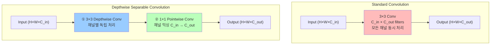
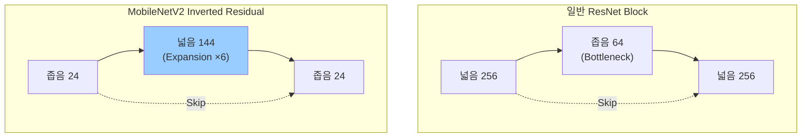
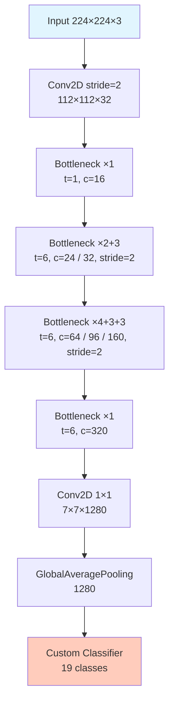
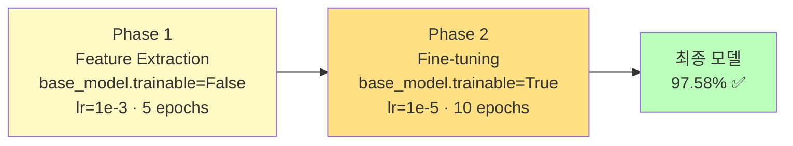

# Day 5-2: MobileNetV2<br>Transfer Learning

경량 모델로 19개 제스처 97%+ 달성

---
layout: default
---

# 학습 목표

- 🔬 **Depthwise Separable Conv** 원리 & ~1/7 연산량 감소 이해
- 🔁 **Inverted Residual Block** 이해 (Narrow→Wide→Narrow)
- 🎨 **Data Augmentation** 4가지 적용
- 📌 **Phase 1** Feature Extraction (base frozen)
- 🔧 **Phase 2** Fine-tuning (base unfrozen, lr=1e-5)
- 🏆 Baseline 73.52% → MobileNetV2 **97.58%**

---
layout: default
---

# 🔧 노트북: 0. 환경 설정

### 🔥 함께 작성해볼 부분

```python
repo_owner = # 🔥 직접 작성이 필요합니다.
repo_name  = # 🔥 직접 작성이 필요합니다.
```

---
layout: center
class: text-center
---

# MobileNetV2 아키텍처

---
layout: default
---

# Depthwise Separable Convolution



| | **Standard Conv** | **Depthwise Separable** |
|:---|:---:|:---:|
| **연산량** | 43,614,208 | 6,171,648 |
| **파라미터** | 864 | 123 |
| **비율** | 1× | **약 1/7** |

---
layout: top_img-bottom_text
---

# Inverted Residual Block

::top::



::bottom::

- **ResNet**: Wide → Narrow → Wide (중간이 좁은 Bottleneck)
- **MobileNetV2**: Narrow → Wide → Narrow (중간을 넓혀 표현력 확보)
- 마지막 1×1 Conv에 **ReLU 없음** (Linear Bottleneck) — 저차원에서 정보 손실 방지

---
layout: img_caption
---

# MobileNetV2 전체 구조

::img-fit-width::



::caption::

총 파라미터 **3.5M** · 크기 **~14MB** (FP32) · 추론 **~1.8ms**

---
layout: center
class: text-center
---

# Data Augmentation & 전처리

---
layout: default
---

# Data Augmentation

```python
data_augmentation = keras.Sequential([
    layers.RandomFlip('horizontal'),        # 좌우 반전 ✅ (손 방향 다양화)
    layers.RandomRotation(0.1),             # ±10도 회전 ✅
    layers.RandomZoom(0.1),                 # ±10% 확대/축소 ✅
    layers.RandomTranslation(0.1, 0.1),     # ±10% 이동 ✅
])
```

구현 포인트: `shuffle → batch → augment` 순서로 배치를 먼저 만든 뒤 `augment_batch`를 map합니다.

---
layout: default
---

# Data Augmentation 예시


---
layout: default
---

# 🔧 노트북: 2. Data Augmentation

### 🔥 함께 작성해볼 부분

**4가지 Augmentation 레이어**를 직접 채워보세요

```python
data_augmentation = keras.Sequential([
    # 🔥 직접 작성이 필요합니다. (layers.RandomFlip('horizontal'))
    # 🔥 직접 작성이 필요합니다. (layers.RandomRotation(0.1))
    # 🔥 직접 작성이 필요합니다. (layers.RandomZoom(0.1))
    # 🔥 직접 작성이 필요합니다. (layers.RandomTranslation(0.1, 0.1))
], name='data_augmentation')
```

---
layout: default
---

# MobileNetV2용 전처리

### Baseline CNN과의 핵심 차이

```python
# ❌ Baseline CNN (Day 5-1)
img = img / 255.0           # [0, 1] 범위

# ✅ MobileNetV2
from tensorflow.keras.applications.mobilenet_v2 import preprocess_input
img = preprocess_input(img) # [0, 255] → [-1, 1] 범위
```

`preprocess_input`을 사용하는 이유: ImageNet으로 학습된 MobileNetV2 가중치가 **[-1, 1] 범위**를 가정합니다.

### 🔥 노트북에서 직접 채울 부분

```python
def load_and_preprocess_mobilenet(path, label):
    img = tf.io.read_file(path)
    img = tf.image.decode_jpeg(img, channels=3)
    img = tf.image.resize(img, (224, 224))
    img = # 🔥 직접 작성이 필요합니다. (preprocess_input(img))
    return img, label
```

---
layout: center
class: text-center
---

# 2단계 Transfer Learning

---
layout: top_img-bottom_text
---

# 2단계 학습 전략

::top::



::bottom::

Phase 2에서 LR을 **1/100**으로 줄이는 이유: 큰 LR로 업데이트하면 ImageNet에서 학습한 좋은 특징을 망가뜨립니다.

---
layout: default
---

# Phase 1: Feature Extraction

```python
base_model = MobileNetV2(weights='imagenet', include_top=False,
                          input_shape=(224, 224, 3))
base_model.trainable = False   # 완전 동결 ❄️

inputs = keras.Input(shape=(224, 224, 3))
x = base_model(inputs, training=False)   # BN이 ImageNet 통계 사용
x = layers.GlobalAveragePooling2D()(x)
x = layers.Dense(128, activation='relu')(x)
x = layers.Dropout(0.3)(x)
outputs = layers.Dense(len(gesture_names), activation='softmax')(x)
model = Model(inputs, outputs)

model.compile(optimizer=Adam(1e-3), ...)
```

`training=False`: BatchNorm이 학습 통계 대신 **ImageNet 통계** 사용

---
layout: default
---

# 🔧 노트북: 5. Phase 1 학습

### 🔥 함께 작성해볼 부분

```python
with mlflow.start_run(run_name=''):  # 🔥 직접 작성이 필요합니다.
    history_phase1 = model.fit(
        train_dataset,
        epochs=5,
        validation_data=val_dataset,
        callbacks=[early_stop, reduce_lr]
    )
```

⏱️ GPU에 따라 5~10분 소요

---
layout: default
---

# 🔧 노트북: 6. Phase 2 Fine-tuning

### 🔥 함께 작성해볼 부분

```python
# Base model 해제 — 전체 가중치 업데이트
base_model.trainable = # 🔥 직접 작성이 필요합니다.

# LR을 1/100로 줄여서 재컴파일
model.compile(
    optimizer=Adam(learning_rate=# 🔥 직접 작성이 필요합니다.),  # 1e-5
    ...
)

with mlflow.start_run(run_name=''):  # 🔥 직접 작성이 필요합니다.
    history_phase2 = model.fit(train_dataset, epochs=10, ...)
```

⏱️ GPU에 따라 20~30분 소요

---
layout: center
class: text-center
---

# 실험 결과

---
layout: default
---

# 학습 곡선 — Phase 1 + Phase 2


Phase 1→2 전환 시점에서 Val Accuracy가 급격히 향상됩니다.

---
layout: default
---

# Confusion Matrix — MobileNetV2


---
layout: default
---

# Baseline vs MobileNetV2 비교

```
================================================================================
  Baseline CNN vs MobileNetV2
================================================================================
       Model   Parameters   Size(MB)   Val Accuracy   Latency(ms)   FPS
Baseline CNN       ~133K      ~1.6MB      73.52%         ~2ms        498
 MobileNetV2       ~2.4M     ~28MB       97.58%        ~1.8ms        556
================================================================================

개선:
  Accuracy: +24.06%p  ✅
  Latency: 유사 (~1.8ms)  ✅
  FPS: 556 (30 FPS 목표 달성)  ✅
```

크기는 커졌지만 Day 5-3 **Quantization**으로 ~7MB까지 줄입니다.

---
layout: default
---

# ✅ 체크리스트

- [ ] Depthwise Separable Conv 원리 이해 (~1/7 연산량)
- [ ] Inverted Residual Block 개념 이해 (Narrow→Wide→Narrow)
- [ ] Data Augmentation 4가지 직접 구현
  - [ ] RandomFlip / RandomRotation / RandomZoom / RandomTranslation
- [ ] MobileNetV2용 `preprocess_input` 적용 ([-1, 1] 범위)
- [ ] Phase 1: Feature Extraction (lr=1e-3, 5 epochs, base frozen)
- [ ] Phase 2: `base_model.trainable = True` 설정
- [ ] Phase 2: lr=1e-5로 컴파일 (이유 이해)
- [ ] Phase 2: Fine-tuning (10 epochs)
- [ ] Phase 1+2 결합 학습 곡선 시각화
- [ ] Val Accuracy 97%+ 달성
- [ ] Latency ~1.8ms, FPS ~556 확인
- [ ] MLflow에 Phase 1, Phase 2 각각 기록
