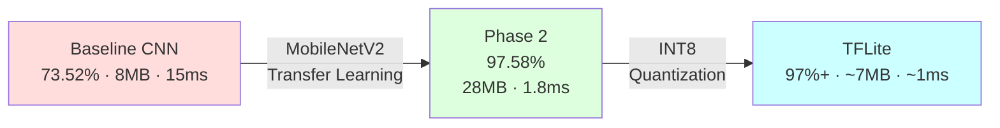
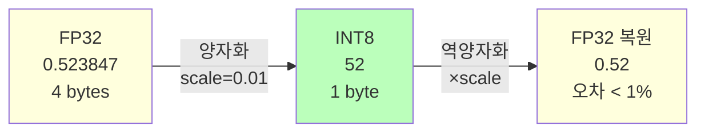
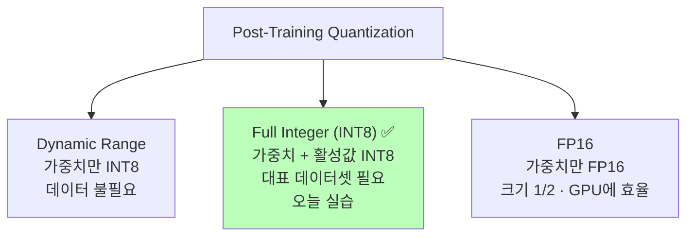
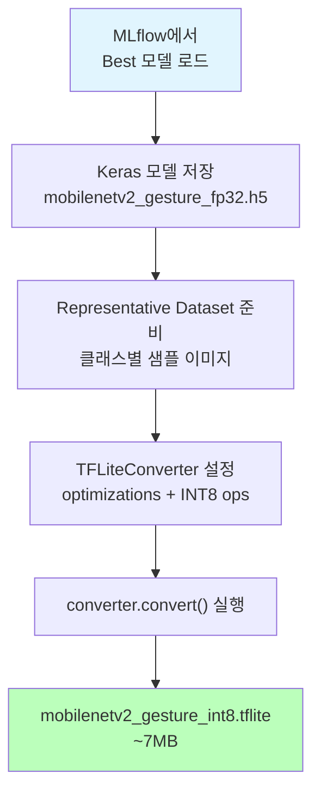
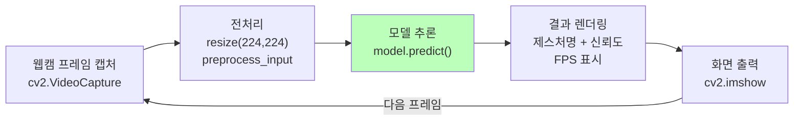
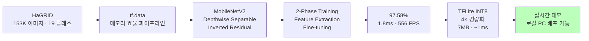

# Day 5-3: 모델 최적화 & 배포

TFLite INT8 Quantization & 실시간 데모

---
layout: default
---

# 학습 목표

- 🔄 **INT8 Quantization** 원리 이해 (FP32 → INT8, 4× 경량화)
- 🛠️ **Representative Dataset** 역할 이해
- 📦 **TFLite 변환** 3단계 실습
- ⚡ **TFLite Interpreter** 추론 API 이해
- 📊 Keras vs TFLite **정확도 & 속도 비교**
- 💻 **로컬 실시간 데모** 스크립트 생성

---
layout: default
---

# 🔧 노트북: 0. 환경 설정

### 🔥 함께 작성해볼 부분

```python
repo_owner = # 🔥 직접 작성이 필요합니다.
repo_name  = # 🔥 직접 작성이 필요합니다.
```

---
layout: center
class: text-center
---

# Day 5 전체 여정

---
layout: default
---

# Day 5 여정 요약

<div style="text-align: center;">



</div>

| **단계** | **Accuracy** | **Size** | **Latency** |
|:---|:---:|:---:|:---:|
| Baseline CNN | 73.52% | 8 MB | 15 ms |
| MobileNetV2 Phase 2 | **97.58%** | 28 MB | **1.8 ms** |
| TFLite INT8 | **97%+** | **~7 MB** | **~1 ms** |

---
layout: center
class: text-center
---

# INT8 Quantization

---
layout: default
---

# INT8 Quantization 원리

<div style="text-align: center;">



</div>

| | **FP32** | **INT8** |
|:---|:---:|:---:|
| **표현 범위** | 3.4×10⁻³⁸ ~ 3.4×10³⁸ | -128 ~ 127 |
| **메모리** | 4 bytes | **1 byte** |
| **모델 크기** | 28 MB | **~7 MB** |
| **정확도 손실** | 기준 | **< 1%** |

---
layout: default
---

# Quantization 3가지 방식

<div style="text-align: center;">



</div>

**Full Integer INT8**을 선택하는 이유: 가중치와 활성값 모두 INT8로 변환해 **추론 속도 최대화** (ARM/Edge 최적)

---
layout: center
class: text-center
---

# TFLite 변환

---
layout: default
---

# TFLite 변환 흐름

<div style="text-align: center;">



</div>

**Representative Dataset이 중요한 이유**: 

각 레이어의 활성값 범위를 실제 데이터로 측정해야 INT8 변환 시 정보 손실을 최소화할 수 있습니다.

---
layout: default
---

# TFLite 변환 핵심 설정

```python
converter = tf.lite.TFLiteConverter.from_keras_model(model)
converter.optimizations = [tf.lite.Optimize.DEFAULT]

def representative_dataset():
    for img_batch in sample_images:
        yield [img_batch]   # ← 실제 데이터로 활성값 범위 캘리브레이션

converter.representative_dataset = representative_dataset
converter.target_spec.supported_ops = [tf.lite.OpsSet.TFLITE_BUILTINS_INT8]
converter.inference_input_type  = tf.uint8
converter.inference_output_type = tf.uint8

tflite_model = converter.convert()
with open('mobilenetv2_gesture_int8.tflite', 'wb') as f:
    f.write(tflite_model)
```

---
layout: default
---

# 🔧 노트북: 2. INT8 변환 설정

### 🔥 함께 작성해볼 부분

**6가지 INT8 설정**을 직접 채워보세요

```python
# Optimization 설정
converter.optimizations = # 🔥 직접 작성이 필요합니다.  # [tf.lite.Optimize.DEFAULT]

def representative_dataset():
    for img_path in image_paths:
        ...
        # 🔥 직접 작성이 필요합니다.  # yield [img]

converter.representative_dataset = # 🔥 직접 작성이 필요합니다.
converter.target_spec.supported_ops = # 🔥 직접 작성이 필요합니다.  # [tf.lite.OpsSet.TFLITE_BUILTINS_INT8]
converter.inference_input_type  = # 🔥 직접 작성이 필요합니다.  # tf.uint8
converter.inference_output_type = # 🔥 직접 작성이 필요합니다.  # tf.uint8
```

---
layout: default
---

# 모델 크기 비교


```
Keras (FP32):  ~28 MB
TFLite (INT8): ~7 MB
압축률:         4×
```

---
layout: default
---

# TFLite Interpreter 추론 API

```python
# ① Interpreter 초기화
interpreter = tf.lite.Interpreter(model_path='mobilenetv2_gesture_int8.tflite')
interpreter.allocate_tensors()

# ② 입출력 정보 조회
input_details  = interpreter.get_input_details()   # dtype: uint8
output_details = interpreter.get_output_details()

# ③ 추론 실행
interpreter.set_tensor(input_details[0]['index'], img_uint8[np.newaxis])
interpreter.invoke()
output = interpreter.get_tensor(output_details[0]['index'])
```

Keras의 `model.predict()`와 달리 **3단계** (set → invoke → get)로 분리되어 있습니다.

---
layout: default
---

# 🔧 노트북: 4. TFLite Interpreter

### 🔥 함께 작성해볼 부분

**Interpreter 초기화** 4줄을 직접 채워보세요

```python
# ① Interpreter 초기화
interpreter = # 🔥 직접 작성이 필요합니다.  # tf.lite.Interpreter(model_path=tflite_filename)
# 🔥 직접 작성이 필요합니다.  # interpreter.allocate_tensors()

# ② 입출력 정보
input_details  = # 🔥 직접 작성이 필요합니다.  # interpreter.get_input_details()
output_details = # 🔥 직접 작성이 필요합니다.  # interpreter.get_output_details()
```

그리고 속도 측정 루프에서 **추론 3줄**도 채워보세요

```python
for _ in range(100):
    start = time.time()
    # 🔥 직접 작성이 필요합니다.  # interpreter.set_tensor(...)
    # 🔥 직접 작성이 필요합니다.  # interpreter.invoke()
    # 🔥 직접 작성이 필요합니다.  # _ = interpreter.get_tensor(...)
    tflite_times.append((time.time() - start) * 1000)
```

---
layout: default
---

# 추론 속도 비교


```
Keras  추론: ~1.8 ms/image  (~22 FPS on Colab)
TFLite 추론: ~1.0 ms/image  (~122 FPS on Colab)
속도 향상: 5.4×
```

---
layout: center
class: text-center
---

# 로컬 실시간 데모

---
layout: top_img-bottom_text
---

# 실시간 데모 흐름

::top::



::bottom::

**다운로드할 파일:** `local_demo.py` + `mobilenetv2_gesture_fp32.h5`

```bash
pip install tensorflow opencv-python
python local_demo.py    # 'q' 키로 종료
```

---
layout: center
class: text-center
---

# Day 5 최종 성과

---
layout: default
---

# Day 5 전체 여정



---
layout: default
---

# 최종 성과 수치

```
================================================================================
  Day 5 최종 성과
================================================================================
             Val Accuracy:  97.58%   (Baseline 73.52% 대비 +24%p)
   Latency (Keras FP32):    ~1.8 ms
   Latency (TFLite INT8):   ~1.0 ms  (5.4× 속도 향상)
            Model Size:     ~7 MB    (Keras 28MB 대비 4× 감소)
                   FPS:     556+     (30 FPS 목표 달성 ✅)
================================================================================

배포 가능 여부:
  ✅ 로컬 실시간 인식
  ✅ 모바일 배포 준비 (TFLite)
  ✅ 60 FPS+ 달성
```

---
layout: default
---

# ✅ 체크리스트

- [ ] MLflow에서 Best 모델 (Phase 2) 로드
- [ ] Keras 모델 FP32로 저장 (.h5)
- [ ] Representative Dataset 준비 (클래스별 샘플)
- [ ] TFLiteConverter INT8 설정 6가지 직접 구현
  - [ ] optimizations / representative_dataset / target_spec / input_type / output_type
- [ ] `converter.convert()` 실행 (~7MB .tflite 생성)
- [ ] 모델 크기 비교 시각화 (~28MB → ~7MB, 4×)
- [ ] TFLite Interpreter 4줄 직접 구현 (Interpreter, allocate, get_input, get_output)
- [ ] Keras vs TFLite 정확도 비교
- [ ] 추론 속도 측정 3줄 직접 구현 (set_tensor, invoke, get_tensor)
- [ ] Day 5 전체 여정 시각화
- [ ] `local_demo.py` 생성 및 다운로드
