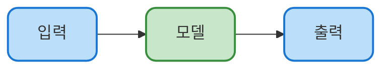

<style>
#slidev-goto-dialog { display: none !important; }
</style>

# Example Slide Deck

slidev-theme-codecompose 템플릿 예시

---
layout: table-of-contents
hideInToc: true
---

---
layout: section
hideInToc: false
---

# Part 1 — 기본 슬라이드

`layout:`을 생략하면 default 레이아웃이 적용됩니다

---

# 기본 슬라이드
## 부제목은 `##`로

본문 시작. 슬라이드는 `---`로 구분합니다.

- 항목 A
- 항목 B
- 항목 C

> 인용 블록은 보조 설명에 어울립니다.

---

# 코드 블록

```python
def hello(name: str) -> str:
    return f"Hello, {name}!"

print(hello("Slidev"))
```

```javascript
const sum = (a, b) => a + b;
```

---

# 표

| 항목         | 설명                          |
| ------------ | ----------------------------- |
| Slidev       | 마크다운 기반 프레젠테이션    |
| codecompose  | 슬라이드 테마 (npm 패키지)    |
| Docker       | 실행 환경 격리                |

---
layout: section
hideInToc: false
---

# Part 2 — 레이아웃

cols · bullets · statement · outro

---
layout: cols
---

# 좌우 분할 (cols)

::left::

### 왼쪽 칸

- 항목 A
- 항목 B
- 항목 C

::right::

### 오른쪽 칸

- 항목 D
- 항목 E
- 항목 F

---

# Mermaid 다이어그램



크기는 ` ```mermaid {scale: 0.8} ` 처럼 옵션으로 조절합니다.

---
layout: bullets
---

# 불릿 강조 (bullets)

- 핵심 메시지를 큰 글씨로 보여줄 때
- 항목당 한 줄로 압축
- 너무 많이 넣지 말기

---
layout: statement
---

https://sli.dev

링크나 한 줄 강조 문구를 큰 글씨로

---
layout: outro
---

# 감사합니다

질문이 있으신가요?

[Your Name](https://example.com)
