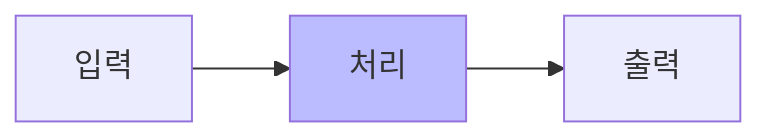

# Example Slide Deck

부제 또는 한 줄 설명

---
layout: default
---

# 기본 슬라이드 (default)

### 소제목

- 첫 번째 항목
- 두 번째 항목
- 세 번째 항목

`# 제목` 바로 다음 줄은 일부 테마에서 부제처럼 렌더링됩니다. 본문이 부제처럼 보이지 않도록 `### 소제목`을 넣어 구조를 잡으세요.

---
layout: center
class: text-center
---

# 섹션 구분 슬라이드 (center)

---
layout: two-cols-header
---

# 좌우 분할 (two-cols-header)

::left::

### 왼쪽 칸

- 항목 A
- 항목 B

::right::

### 오른쪽 칸

- 항목 C
- 항목 D

---
layout: top_img-bottom_text
---

# 다이어그램 + 설명 (top_img-bottom_text)

::top::



::bottom::

위에는 다이어그램, 아래에는 한 줄 설명을 배치합니다.

---
layout: default
---

# 코드 블록

```python
def hello(name: str) -> str:
    return f"Hello, {name}!"

print(hello("Slidev"))
```

`---` 으로 슬라이드를 구분하고, 각 슬라이드 앞에 `layout:` 프론트매터를 명시하세요.

---
layout: default
---

# 표

| 항목 | 설명 |
| :--- | :--- |
| theme-cnu | 로컬 커스텀 테마 |
| Slidev | 마크다운 기반 프레젠테이션 |
| Docker | 실행 환경 격리 |

---
layout: center
class: text-center
---

# 끝

새 슬라이드는 이 파일을 복사해서 시작하세요.
