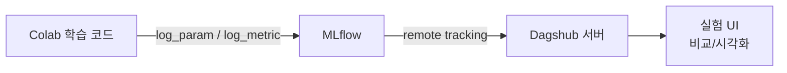

# 환경 설정 & MLflow 세팅

ID: 1-1
일차: 1
순서: 1
상태: Active

## **🎯 학습 목표**

- Google Colab Pro에서 GPU를 확인하고 환경을 구성한다
- Dagshub 계정을 생성하고 MLflow와 연동한다
- 체계적인 실험 관리의 중요성을 이해한다
- Dacon 데이터를 다운로드하고 Colab에 로드한다

## **1. Google Colab 환경 확인**

### **1.1 GPU 확인**

가장 먼저 GPU가 제대로 할당되어 있는지 확인합니다.

```python
import torch

if torch.cuda.is_available():
    print(f"GPU 이름: {torch.cuda.get_device_name(0)}")
    print(f"GPU 메모리: {torch.cuda.get_device_properties(0).total_memory / 1e9:.2f} GB")
else:
    print("❌ GPU 사용 불가 - 런타임 > 런타임 유형 변경 > GPU(T4) 선택")
```

GPU가 없다면: **런타임 > 런타임 유형 변경 > GPU(T4)** 선택 후 재연결

### **1.2 Google Drive 연동 (선택사항)**

데이터를 Drive에 보관하면 런타임이 초기화되어도 재다운로드가 필요 없습니다. 단, 이번 실습에서는 **직접 업로드 방식**을 기본으로 합니다.

## **2. Dagshub & MLflow 설정**

### **2.1 Dagshub란?**

ML 실험을 체계적으로 관리할 수 있는 플랫폼입니다. MLflow UI를 제공하여 실험 결과를 시각적으로 비교할 수 있으며, GitHub 계정으로 간편하게 가입 가능합니다.

**왜 실험을 기록해야 할까?**

딥러닝 연구에서 흔히 겪는 문제:

```
실험 1: F1 = 0.82  → 어떤 설정이었지...?
실험 2: F1 = 0.85  → 뭘 바꿨더라...?
실험 3: F1 = 0.79  → 왜 떨어졌지...?
```

MLflow로 모든 실험의 하이퍼파라미터와 결과를 자동으로 기록하면 이런 혼란을 방지할 수 있습니다.

**MLflow + Dagshub 연동 구조**:



### **2.2 Dagshub 계정 생성**

1. [https://dagshub.com](https://dagshub.com/) 접속
2. GitHub 또는 Google 계정으로 가입/로그인
3. `Create +` > `New Repository` > `Create blank repository` 클릭
4. Repository 정보 입력:
5. **Repository name**: `deeplearning-bootcamp` (원하는 이름 가능)
6. **Visibility**: Public 권장
7. `Create Repository` 클릭
8. 생성 후 `repo_owner`(username)와 `repo_name` 기억해두기

### **2.3 라이브러리 설치 및 연동**

```python
%pip install -q dagshub 'mlflow>=2,<3'
```

```python
import dagshub

# 🔥 본인의 정보로 수정!
repo_owner = 'your_username'       # Dagshub username
repo_name  = 'deeplearning-bootcamp'  # 생성한 repository 이름

dagshub.init(repo_owner=repo_owner, repo_name=repo_name, mlflow=True)
print(f"🌐 Dagshub UI: https://dagshub.com/{repo_owner}/{repo_name}")
```

실행 후 출력 예시:

```
Accessing as your_username
Initialized MLflow to track repo "your_username/deeplearning-bootcamp"
Repository your_username/deeplearning-bootcamp initialized!
```

## **3. MLflow 첫 실험 로깅**

### **3.1 기본 로깅**

```python
import mlflow

with mlflow.start_run(run_name="test_connection"):
    mlflow.log_param('test_param', 'hello_mlflow')
    mlflow.log_metric('test_accuracy', 0.99)
    print("✅ 첫 MLflow 실험 기록 완료!")
```

### **3.2 여러 실험 시뮬레이션**

실제 학습처럼 여러 하이퍼파라미터 조합을 실험하는 패턴을 익힙니다.

```python
import random

for i in range(5):
    with mlflow.start_run(run_name=f"experiment_{i+1}"):
        lr = random.choice([0.001, 0.01, 0.1])
        batch_size = random.choice([16, 32, 64])

        mlflow.log_param('learning_rate', lr)
        mlflow.log_param('batch_size', batch_size)

        accuracy = random.uniform(0.7, 0.95)
        loss = random.uniform(0.1, 0.5)

        mlflow.log_metric('accuracy', accuracy)
        mlflow.log_metric('loss', loss)

        print(f"✅ Experiment {i+1} - LR: {lr}, Batch: {batch_size}, Acc: {accuracy:.3f}")
```

### **3.3 Dagshub UI에서 결과 확인**

1. Dagshub 프로젝트 페이지 이동
2. 좌측 메뉴 **“Experiments”** 클릭
3. 6개 실험(test_connection + experiment_1~5) 확인
4. 각 실험의 Parameters, Metrics 비교

**핵심 기능**: 여러 실험을 체크박스로 선택 → “Compare” → Parallel Coordinates로 최적 하이퍼파라미터 시각화

## **4. Dacon 데이터 다운로드**

### **4.1 Dacon 계정 생성 및 데이터 다운로드**

1. [https://dacon.io](https://dacon.io/) 접속 후 회원가입
2. 대회 페이지 접속: [월간 데이콘 뉴스 토픽 분류](https://dacon.io/competitions/official/235747)
3. **데이터 탭** > 아래 4개 파일 다운로드:
4. `train_data.csv`
5. `test_data.csv`
6. `topic_dict.csv`
7. `sample_submission.csv`
8. 4개 파일을 **ZIP으로 압축** (파일명 무관)

### **4.2 Colab에 데이터 업로드**

```python
import os, zipfile
from google.colab import files

# 저장 경로 설정
data_path = '/content/data/dacon_data'
os.makedirs(data_path, exist_ok=True)

# ZIP 파일 업로드 (파일 선택 창이 나타남)
uploaded = files.upload()

# 자동 압축 해제
for fname in uploaded:
    if fname.endswith('.zip'):
        with zipfile.ZipFile(fname, 'r') as z:
            z.extractall(data_path)
        print(f"✅ 압축 해제 완료: {fname}")
```

### **4.3 데이터 확인**

```python
import pandas as pd

train_df = pd.read_csv(os.path.join(data_path, 'train_data.csv'))
test_df  = pd.read_csv(os.path.join(data_path, 'test_data.csv'))

print(f"Train: {len(train_df):,}개 / Test: {len(test_df):,}개")
train_df.head()
```

## **5. 정리**

### **오늘 배운 것**

| **내용** | **도구** |
| --- | --- |
| GPU 환경 확인 | PyTorch |
| 실험 기록 플랫폼 | Dagshub |
| 실험 추적 라이브러리 | MLflow |
| 데이터 로드 | Pandas |

### **체계적 실험 관리가 중요한 이유**

- **재현성**: 어떤 설정으로 좋은 결과를 냈는지 정확히 알 수 있음
- **비교**: 수십, 수백 개의 실험을 체계적으로 비교 가능
- **협업**: 팀원들과 실험 결과를 쉽게 공유 가능

## **✅ 체크리스트**

- [ ]  GPU 사용 가능 확인 (T4 또는 다른 GPU)
- [ ]  Dagshub 계정 생성 및 Repository 생성
- [ ]  Colab에서 Dagshub MLflow 연동 성공
- [ ]  첫 실험 로깅 및 Dagshub UI에서 확인
- [ ]  Dacon 계정 생성 및 데이터 다운로드
- [ ]  데이터 Colab 업로드 및 로드 확인

## **🔧 트러블슈팅**

**Q. GPU가 할당되지 않았어요**

런타임 > 런타임 유형 변경 > GPU(T4) 선택. Colab Pro가 활성화되어 있는지 확인.

**Q. `dagshub.init()` 실행 시 에러가 발생해요**

`repo_owner`와 `repo_name`의 대소문자를 정확히 입력했는지 확인. Dagshub 프로필 URL에서 username 복사 권장.

**Q. MLflow UI에 실험이 안 보여요**

페이지를 새로고침하거나 10~30초 기다린 후 다시 확인. 동기화에 시간이 걸릴 수 있음.

**Q. 런타임이 끊어지면 기록이 사라지나요?**

걱정 없음. MLflow 기록은 Dagshub 서버에 저장되므로 런타임이 끊어져도 유지됨.