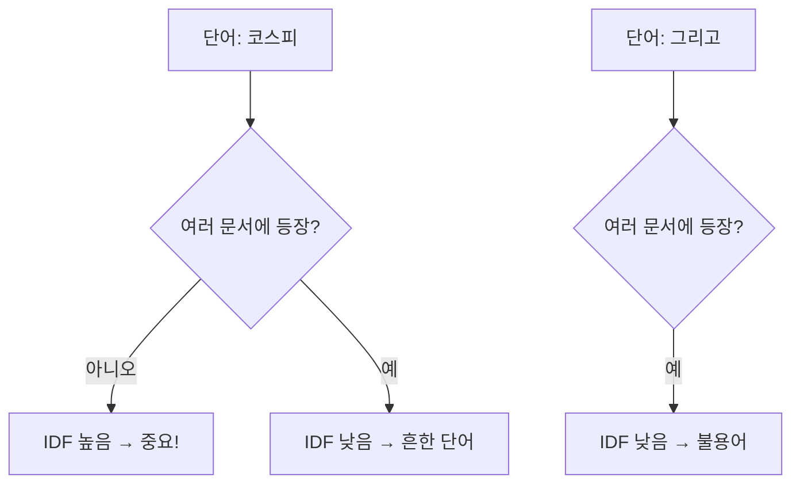
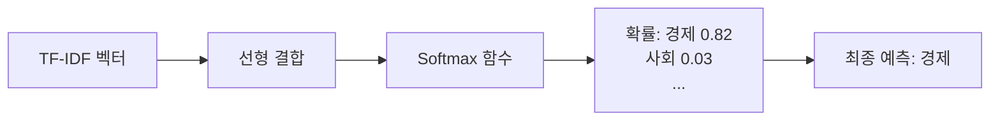
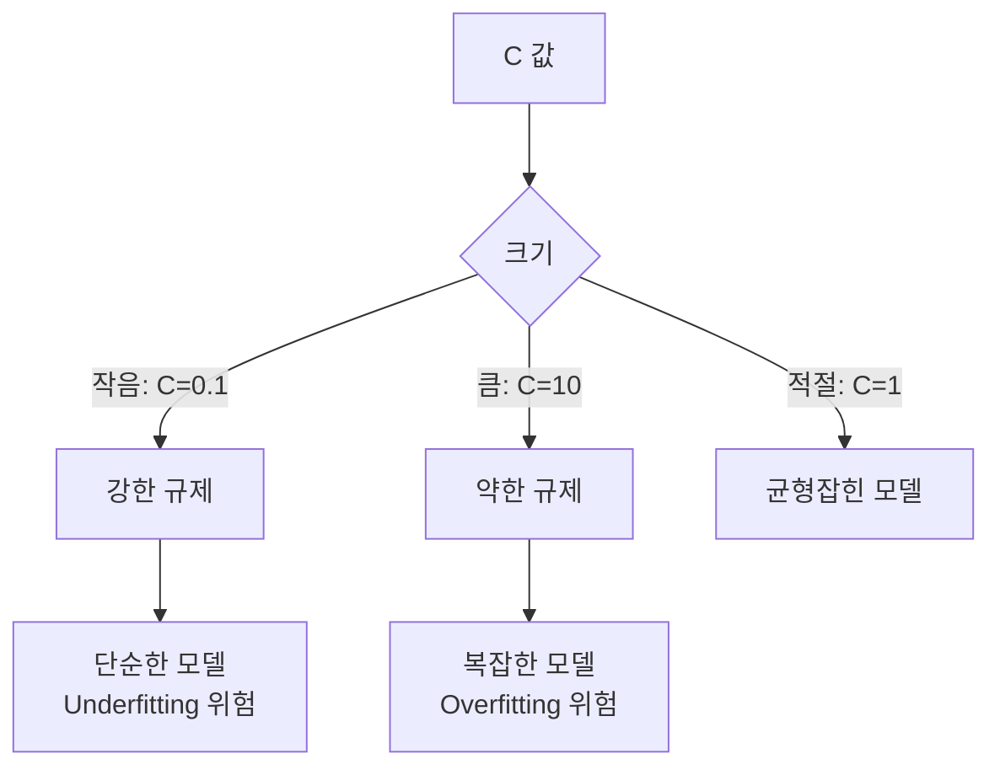
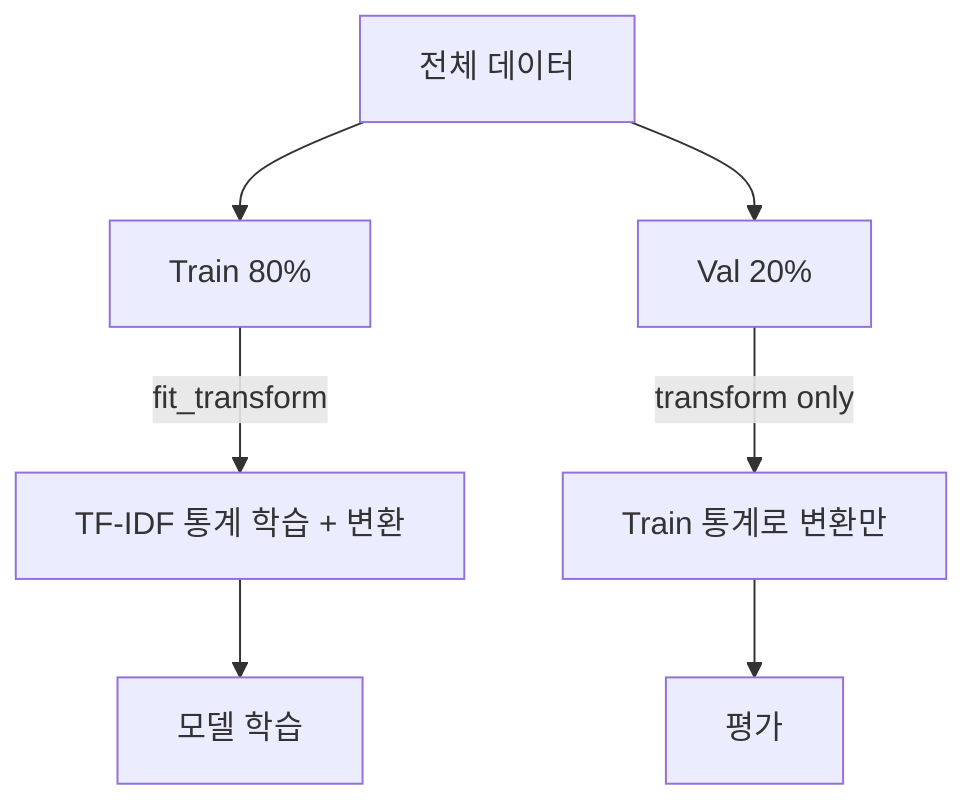
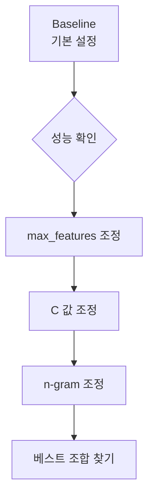
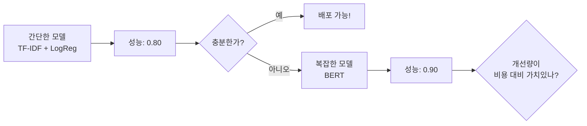

# 문제 이해와 베이스라인

ID: 1-2
일차: 1
순서: 2
상태: Active

**목표**: 뉴스 토픽 분류 문제를 이해하고, TF-IDF + Logistic Regression 베이스라인을 구축한다

## **1. 데이터 이해**

### **1.1 문제 정의**

뉴스 헤드라인을 읽고 7개 토픽 중 하나로 분류하는 멀티클래스 분류 문제입니다.

| **토픽 인덱스** | **토픽 이름** |
| --- | --- |
| 0 | 정치 |
| 1 | 경제 |
| 2 | 사회 |
| 3 | 생활/문화 |
| 4 | 세계 |
| 5 | IT/과학 |
| 6 | 스포츠 |

**평가 지표**: Macro F1-Score (모든 토픽을 동등하게 평가)

### **1.2 탐색적 데이터 분석 (EDA)**

데이터를 로드하면 가장 먼저 확인할 것들:

- **토픽별 분포**: 클래스 불균형이 있는가?
- **텍스트 길이**: 뉴스 헤드라인의 평균 길이는?
- **샘플 확인**: 각 토픽의 실제 헤드라인 예시

```python
# 토픽별 분포 확인
topic_counts = train_df['topic_idx'].value_counts().sort_index()
for idx, name in topic_names.items():
    count = topic_counts.get(idx, 0)
    print(f"  {idx}: {name} - {count:,}개 ({count/len(train_df)*100:.1f}%)")
```

```python
# 텍스트 길이 분포
train_df['title_length'] = train_df['title'].str.len()
print(train_df['title_length'].describe())
```

**주목할 점**: 뉴스 헤드라인은 대부분 짧고 키워드 중심 → TF-IDF가 의외로 잘 동작할 수 있음

## **2. 텍스트를 숫자로: TF-IDF**

### **2.1 왜 텍스트를 숫자로 바꾸나?**

머신러닝 모델은 숫자만 이해합니다. 텍스트를 수치 벡터로 변환해야 합니다.


### **2.2 Bag-of-Words (BoW)**

가장 단순한 방법: 각 단어의 등장 횟수를 세는 것

```
단어 사전: [코스피, 상승, 하락, 환율]

"코스피 상승" → [1, 1, 0, 0]
"코스피 하락" → [1, 0, 1, 0]
"환율 상승"   → [0, 1, 0, 1]
```

**문제점**: 모든 단어를 동등하게 취급. “코스피”와 “그리고”를 같은 비중으로 취급.

### **2.3 TF-IDF: 중요한 단어에 가중치**

**TF (Term Frequency)**: 문서 내 단어 빈도

```
TF = (해당 단어 등장 횟수) / (문서의 전체 단어 수)
```

**IDF (Inverse Document Frequency)**: 단어의 희귀성 (많은 문서에 등장할수록 낮음)

```lisp
IDF = log((전체 문서 수) / (해당 단어가 등장한 문서 수))
```

**TF-IDF = TF × IDF**

직관: 이 문서에서 자주 나오면서 (TF↑), 다른 문서에는 잘 안 나오는 단어 (IDF↑) → 이 문서를 특징짓는 중요한 단어

| **단어** | **여러 문서 등장** | **IDF** | **중요도** |
| --- | --- | --- | --- |
| 코스피 | 드묾 | 높음 ↑ | ⭐ 중요 |
| 상승 | 빈번 | 낮음 ↓ | 덜 중요 |
| 그리고 | 매우 빈번 | 매우 낮음 | 불용어 |



### **2.4 한국어에서의 특이점: Character n-gram**

**한국어 교착어 문제**:

```
"경제가", "경제는", "경제의" → TF-IDF는 이를 모두 다른 단어로 취급!
```

**해결책**: `analyzer='char'` (문자 단위 분석)

```python
"코스피" → ["코", "스", "피", "코스", "스피", "코스피"]
```

장점: 형태소 분석기 없이도 한국어 처리 가능, 띄어쓰기 오류에 강건

이번 실습에서 `analyzer='char'`를 사용하는 핵심 이유입니다.

## **3. Logistic Regression: 확률 기반 분류**

### **3.1 원리**

```
점수 = w₁×특성₁ + w₂×특성₂ + ... + wₙ×특성ₙ + b
확률 = Softmax(점수)  # 7개 토픽 각각의 확률
```

TF-IDF 벡터(특성)를 입력받아 각 토픽의 확률을 출력:

```
IT/과학: 0.05
경제:     0.82  ← 최고 확률 → 이 토픽으로 예측
사회:     0.03
...
```



### **3.2 C 파라미터 (Regularization)**

과적합을 방지하는 규제의 강도를 조절합니다.



실험 전략: C=1.0 (기본값)으로 시작 → C=0.1, C=10.0 비교 → 최적값 탐색

## **4. 평가 지표: Accuracy vs F1-Score**

### **4.1 Accuracy의 함정**

```
데이터: 정치 90%, 나머지 10%
모델:   무조건 "정치" 예측
Accuracy: 90%  → 높아 보이지만 쓸모없는 모델!
```

### **4.2 F1-Score**

**Precision (정밀도)**: “경제”라고 예측한 것 중 실제로 경제인 비율

**Recall (재현율)**: 실제 경제 중에서 찾아낸 비율

```fortran
F1 = 2 × (Precision × Recall) / (Precision + Recall)
```

**Macro F1**: 각 클래스의 F1을 단순 평균 → **모든 토픽을 동등하게 평가**

이 대회는 Macro F1을 사용합니다. 소수 토픽에서 성능이 낮으면 전체 점수가 크게 낮아집니다.

## **5. 베이스라인 구현**

### **5.1 데이터 준비 & TF-IDF 변환**

Train/Validation 분리 시 데이터 누수에 주의해야 합니다. TF-IDF의 통계(단어 빈도)는 반드시 Train 데이터만으로 계산해야 합니다.



```python
from sklearn.model_selection import train_test_split
from sklearn.feature_extraction.text import TfidfVectorizer

X = train_df['title']
y = train_df['topic_idx']

X_train, X_val, y_train, y_val = train_test_split(X, y, test_size=0.2, random_state=42, stratify=y)

# TF-IDF 설정
tfidf = TfidfVectorizer(
    max_features=5000,   # 상위 5000개 특성
    ngram_range=(1, 1),  # unigram
    analyzer='char',     # ← 한국어 핵심! 문자 단위
    min_df=2,            # 최소 2개 문서에 등장
    max_df=0.9,          # 90% 이상 문서에 등장하면 제외
    sublinear_tf=True    # TF에 log 스케일 적용
)

X_train_tfidf = tfidf.fit_transform(X_train)
X_val_tfidf   = tfidf.transform(X_val)   # Validation은 transform만!
```

> *⚠️ `fit_transform`은 train에만, `transform`은 val/test에. 데이터 누수 방지!*
> 

### **5.2 모델 학습 & 평가**

```python
from sklearn.linear_model import LogisticRegression
from sklearn.metrics import accuracy_score, f1_score, classification_report

model = LogisticRegression(C=1.0, max_iter=1000, random_state=42, n_jobs=-1)
model.fit(X_train_tfidf, y_train)

y_val_pred = model.predict(X_val_tfidf)
val_f1  = f1_score(y_val, y_val_pred, average='macro')
val_acc = accuracy_score(y_val, y_val_pred)

print(f"Validation F1 (Macro): {val_f1:.4f}")
print(f"Validation Accuracy:   {val_acc:.4f}")
```

### **5.3 MLflow 실험 기록**

```python
with mlflow.start_run(run_name="baseline-tfidf-C1.0-maxfeat5000"):
    mlflow.log_param('model_type', 'TF-IDF + LogisticRegression')
    mlflow.log_param('max_features', 5000)
    mlflow.log_param('C', 1.0)
    mlflow.log_param('analyzer', 'char')
    mlflow.log_param('ngram_range', '(1,1)')

    mlflow.log_metric('val_f1_macro', val_f1)
    mlflow.log_metric('val_accuracy', val_acc)
```

## **6. 성능 개선 실험**

### **6.1 실험 설계 원칙**

**한 번에 하나의 파라미터만 변경!** 그래야 어떤 변화가 효과적인지 알 수 있습니다.



```
실험 방향:
1. max_features 조정 (3000 / 5000 / 10000)
2. C 값 조정      (0.1 / 1.0 / 10.0)
3. ngram_range 조정 ((1,1) / (1,2) / (2,3))
```

### **6.2 실험 명명 규칙**

```python
# run_name에 설정을 명시해두면 나중에 구분이 쉬움
mlflow.start_run(run_name="tfidf-maxfeat3000-C1.0-unigram")
mlflow.start_run(run_name="tfidf-maxfeat5000-C0.1-unigram")
mlflow.start_run(run_name="tfidf-maxfeat5000-C1.0-bigram")
```

### **6.3 예상 결과 패턴**

```
max_features ↑  → F1 ↑ (일정 수준까지, 이후 정체)
C = 0.1         → 규제 강해서 Underfitting 가능
C = 10.0        → 규제 약해서 Overfitting 가능
ngram (1,2)     → 약간의 성능 향상 기대
```

## **7. 베이스라인의 의미**

### **왜 간단한 모델부터 시작하나?**



베이스라인의 역할:

1. **빠른 검증**: 데이터에 문제가 없는지 빠르게 확인
2. **비교 기준**: BERT가 얼마나 더 나은지 측정
3. **실용성**: 때로는 이것만으로도 충분

### **TF-IDF vs BERT 비교**

| **특성** | **TF-IDF + LogReg** | **BERT** |
| --- | --- | --- |
| 학습 시간 | ~1분 | ~10분 |
| GPU 필요 | ❌ | ✅ |
| 예상 F1 | ~0.80 | ~0.90 |
| 해석 가능성 | 높음 | 낮음 |
| 메모리 | 적음 | 많음 |

## **✅ 체크리스트**

- [ ]  데이터 로드 및 기본 정보 확인 (shape, columns)
- [ ]  EDA 완료 (토픽 분포, 텍스트 길이, 샘플 확인)
- [ ]  Train/Validation 분리 (80/20, stratify 적용)
- [ ]  TF-IDF 변환 완료 (`analyzer='char'` 이유 이해)
- [ ]  베이스라인 F1-Score 확인
- [ ]  Confusion Matrix 해석 (어느 토픽끼리 혼동?)
- [ ]  최소 3개 이상 실험 + MLflow 기록
- [ ]  Dagshub에서 실험 비교 확인