# Transformer 모델

ID: 1-3
일차: 1
순서: 3
상태: Active

**목표**: BERT의 핵심 개념을 이해하고, Hugging Face Transformers를 활용해 뉴스 토픽 분류를 Fine-tuning한다

## **1. TF-IDF의 한계와 딥러닝의 접근**

### **1.1 TF-IDF가 못하는 것**

```groovy
"배가 고프다"  → TF-IDF: "배" = 숫자 하나
"배로 떠났다" → TF-IDF: "배" = 같은 숫자 (의미 구분 불가!)
```

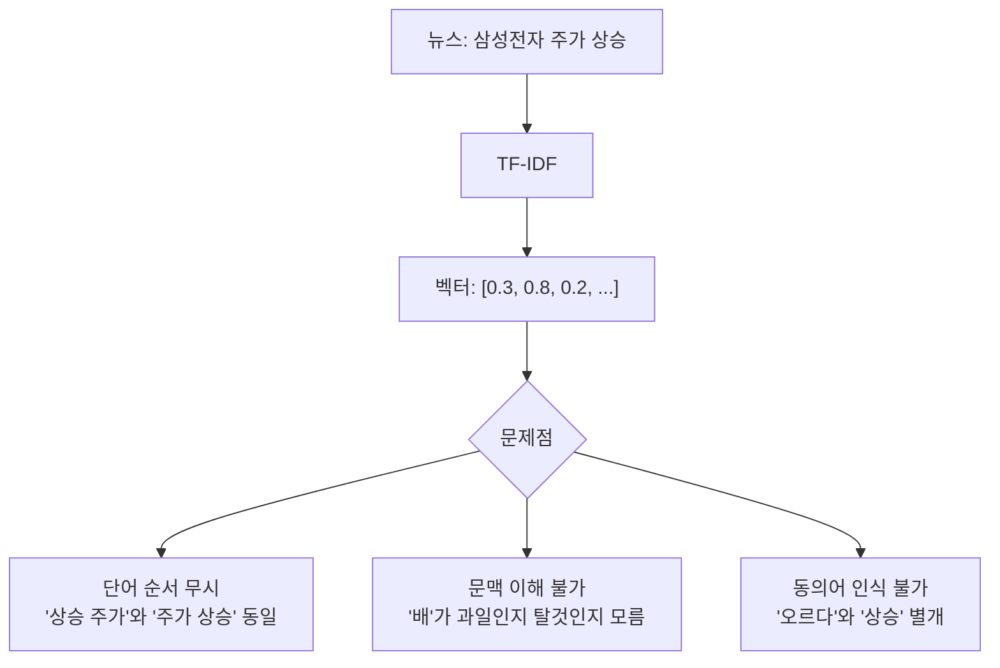

TF-IDF의 근본적 한계:

- **단어 순서 무시**: “주가 상승”과 “상승 주가” 동일 취급
- **문맥 이해 불가**: 동음이의어 구분 불가
- **동의어 인식 불가**: “오르다”와 “상승”을 별개 단어로 처리

### **1.2 딥러닝의 접근: 의미 벡터**

```python
# TF-IDF: 단어 = 숫자 하나
"경제" → 0.82

# BERT: 단어 = 768차원 의미 벡터
"배가 고프다" 에서 "배" → [0.23, -0.45, ...]   # 음식 관련 방향
"배로 떠났다" 에서 "배" → [-0.11, 0.78, ...]   # 교통수단 관련 방향
```

같은 단어라도 문맥에 따라 다른 벡터로 표현됩니다.

## **2. Transformer 아키텍처**

### **2.1 RNN/LSTM의 문제점**

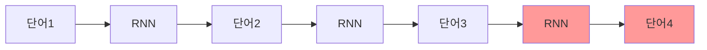

- **순차적 처리** → 병렬화 불가 → 느림
- **긴 문장** → 앞부분 정보 손실 (Vanishing Gradient)

### **2.2 Attention 메커니즘**

**핵심 아이디어**: 모든 단어를 동시에 보면서, 현재 단어와 관련 있는 단어에 집중하자!

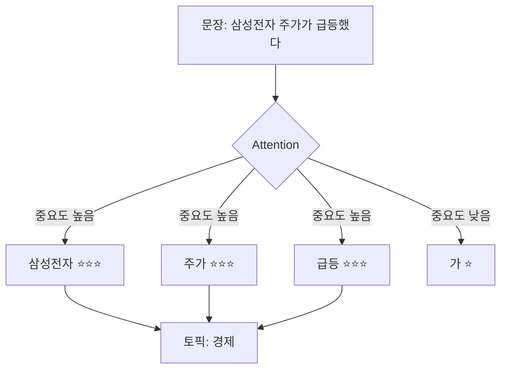

Query(현재 단어) × Key(각 단어 특성) → Attention 가중치 → Value(각 단어 정보) 가중합

### **2.3 Multi-Head Attention**

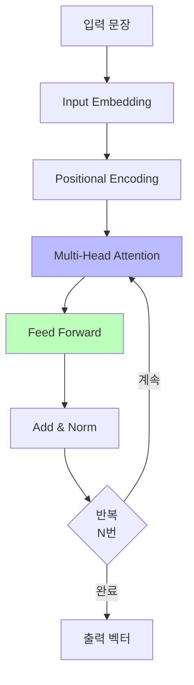

여러 Head가 서로 다른 관점에서 동시에 Attention을 계산합니다:

```
Head 1: 문법적 관계 (주어-동사)
Head 2: 의미적 관계 (원인-결과)
Head 3: 주제 관련성
...
```

이를 합쳐서 풍부한 문맥 표현을 만들어냅니다.

## **3. BERT: 사전학습 + Fine-tuning**

### **3.1 사전학습 (Pre-training)**

대량의 텍스트(위키피디아, 뉴스 등)로 두 가지 태스크를 학습합니다.

**Masked Language Model (MLM)**:

```
원본:   "삼성전자가 신제품을 출시했다"
마스킹: "삼성전자가 [MASK]을 출시했다"
학습:   [MASK]에 "신제품" 예측
```

**Next Sentence Prediction (NSP)**:

```
A: "애플이 아이폰을 출시했다"
B:"주가가 상승했다"
→ B가A의 다음 문장인가? YES
```

결과: 한국어의 일반적인 패턴과 의미를 이해하는 모델이 완성됩니다.

### **3.2 Fine-tuning (미세조정)**

사전학습된 지식을 우리 문제에 적용합니다.


**비유**: 사전학습 = 대학 교육(일반 지식), Fine-tuning = 직무 교육(특화 지식)

**왜 효과적인가?**

```python
# ❌ 처음부터 학습 (From Scratch)
데이터: 뉴스 45,000개만
결과:   F1 ~0.75

# ✅ BERT Fine-tuning (전이학습)
데이터: 뉴스 45,000개 + BERT의 한국어 지식
결과:   F1 ~0.90
```

BERT는 이미 “주가”, “급등” 같은 단어 의미를 알고 있습니다. 우리는 “이런 단어들이 나오면 경제 토픽”이라는 연결만 추가로 가르치면 됩니다.

### **3.3 한국어 BERT 모델 선택**

| **모델** | **개발** | **특징** | **추천 상황** |
| --- | --- | --- | --- |
| `klue/bert-base` | KLUE | 범용, 안정적 | 뉴스, 공식 문서 |
| `klue/roberta-base` | KLUE | BERT 개선 버전, 성능 ↑ | 성능 우선 |
| `beomi/kcbert-base` | 이기창 | 댓글/구어체 특화 | SNS, 댓글 |

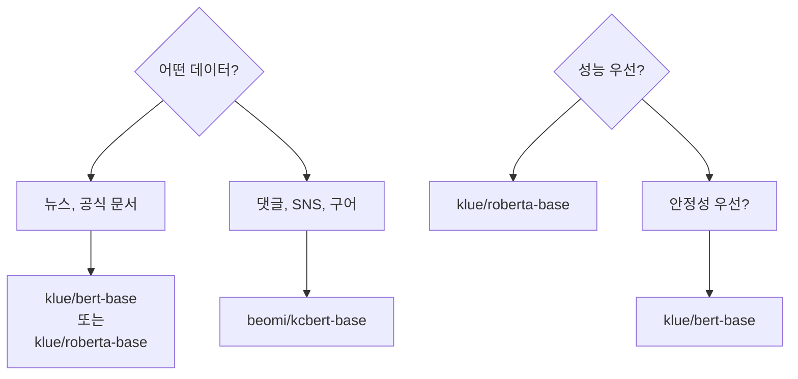

이번 실습: 뉴스 헤드라인 → `klue/bert-base`부터 시작

### **3.4 커스텀 모델 vs 사전학습 모델**

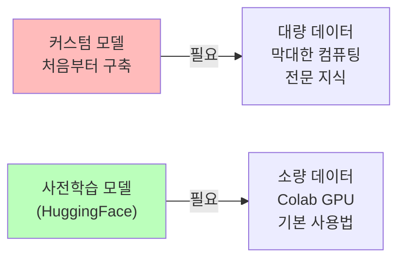

**현실적 선택**: HuggingFace 사전학습 모델 활용 — 이미 검증됨, 시간과 비용 절약

## **4. Fine-tuning 과정**

### **4.1 Tokenization**

BERT는 텍스트를 처리하기 전에 토큰으로 분해합니다.


특수 토큰의 역할:

- `[CLS]`: 문장 전체의 의미를 압축 (분류에 사용)
- `[SEP]`: 문장 구분
- `[PAD]`: 길이를 맞추기 위한 패딩

```python
from transformers import AutoTokenizer

tokenizer = AutoTokenizer.from_pretrained("klue/bert-base")

def tokenize_function(examples):
    return tokenizer(
        examples['title'],
        padding='max_length',
        truncation=True,
        max_length=128       # 뉴스 헤드라인은 128이면 충분
    )
```

### **4.2 BERT 출력 → 분류**

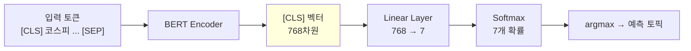

`[CLS]` 토큰의 출력 벡터가 문장 전체의 의미를 담고 있으며, 이를 분류 레이어에 통과시켜 최종 토픽을 예측합니다.

### **4.3 모델 로드 & Fine-tuning 설정**

```python
from transformers import AutoModelForSequenceClassification, TrainingArguments, Trainer

model = AutoModelForSequenceClassification.from_pretrained(
    "klue/bert-base",
    num_labels=7   # 7개 토픽
)

training_args = TrainingArguments(
    output_dir='./results',
    num_train_epochs=3,
    per_device_train_batch_size=16,
    per_device_eval_batch_size=32,
    learning_rate=2e-5,              # BERT Fine-tuning 권장값
    warmup_steps=500,
    weight_decay=0.01,
    eval_strategy="epoch",
    save_strategy="epoch",
    load_best_model_at_end=True,     # 최고 성능 모델 자동 복원
    metric_for_best_model="f1",
    fp16=True,                       # 속도 향상 (GPU 필요)
)
```

### **4.4 Trainer API**

Hugging Face의 Trainer는 학습 루프를 추상화합니다.

```python
def compute_metrics(eval_pred):
    predictions, labels = eval_pred
    predictions = predictions.argmax(axis=-1)
    return {
        'accuracy': accuracy_score(labels, predictions),
        'f1': f1_score(labels, predictions, average='macro')
    }

trainer = Trainer(
    model=model,
    args=training_args,
    train_dataset=train_tokenized,
    eval_dataset=val_tokenized,
    compute_metrics=compute_metrics
)

trainer.train()
```

## **5. 핵심 하이퍼파라미터**

### **5.1 Learning Rate**

한 번에 얼마나 많이 가중치를 업데이트할지 결정합니다.

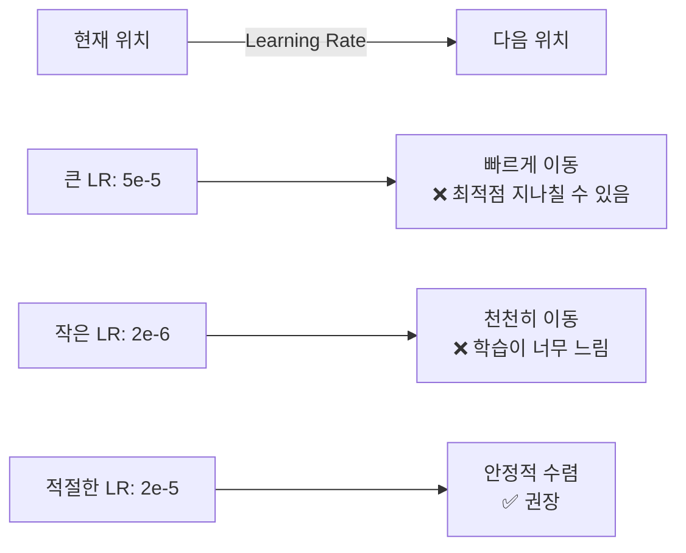

**실험 결과 예시**:

```
LR = 2e-5: F1 = 0.901  (기본값)
LR = 3e-5: F1 = 0.905  ← Best!
LR = 5e-5: F1 = 0.897
```

### **5.2 Epochs**

전체 데이터를 몇 번 반복 학습할지 결정합니다.

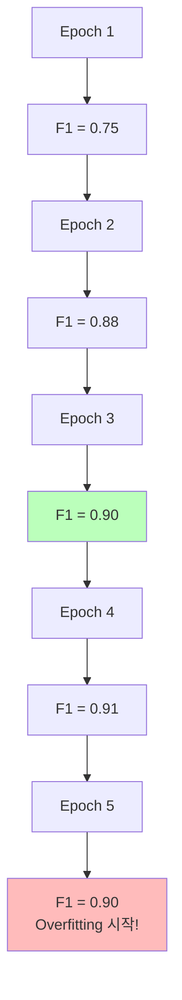

`load_best_model_at_end=True`를 사용하면 Validation F1이 가장 높은 시점의 모델을 자동으로 사용합니다.

### **5.3 Warmup Steps**

학습 초반에 Learning Rate를 작은 값부터 점진적으로 증가시킵니다. 처음부터 큰 LR을 사용하면 사전학습된 가중치가 무너질 수 있기 때문입니다.

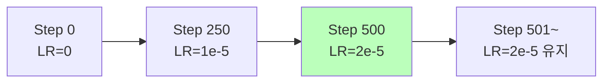

### **5.4 Batch Size**

Colab T4 GPU: `per_device_train_batch_size=16` 권장

메모리 부족 시 8로 줄이거나, `gradient_accumulation_steps=2`로 실질적 배치 크기를 유지

## **6. 학습 과정 모니터링**

### **6.1 주목해야 할 출력**

```nix
Epoch 1: train_loss=0.234  val_loss=0.189  val_f1=0.881
Epoch 2: train_loss=0.098  val_loss=0.156  val_f1=0.901
Epoch 3: train_loss=0.045  val_loss=0.178  val_f1=0.895  ← val_loss 증가 = Overfitting 시작!
                              ↑ 증가
```

`train_loss`는 계속 감소하는데 `val_loss`가 증가한다면 Overfitting.

### **6.2 MLflow 실험 기록**

```python
with mlflow.start_run(run_name="bert-klue-lr2e5-ep3"):
    mlflow.log_param('model_name', 'klue/bert-base')
    mlflow.log_param('learning_rate', 2e-5)
    mlflow.log_param('num_epochs', 3)
    mlflow.log_param('batch_size', 16)
    mlflow.log_param('max_length', 128)
    mlflow.log_param('warmup_steps', 500)

    mlflow.log_metric('val_f1_macro', eval_result['eval_f1'])
    mlflow.log_metric('val_accuracy', eval_result['eval_accuracy'])
```

## **7. 성능 개선 실험**

### **실험 1: Learning Rate 조정**

`2e-5` 기본값에서 `3e-5`, `5e-5`로 변경해 비교

> *⚠️ 모델을 재로드하지 않으면 이전 학습의 영향이 남습니다. 매 실험마다 `AutoModelForSequenceClassification.from_pretrained()`로 새로 로드!*
> 

### **실험 2: Epochs 조정**

5 Epochs로 늘려보기. Validation F1이 개선되는지, Overfitting이 시작되는지 확인.

### **실험 3: 다른 한국어 BERT 모델**

```
klue/bert-base   → 기본값
klue/roberta-base→ RoBERTa 기반, 일반적으로 성능 ↑
beomi/kcbert-base→ 댓글 특화, 뉴스에서는 성능 ↓ 예상
```

각 모델은 토크나이저도 다르므로, 데이터를 다시 토큰화해야 합니다.

## **8. TF-IDF vs BERT 비교**

```
TF-IDF + LogReg:  Val F1 ≈ 0.82,  학습 ~1분
BERTFine-tuning: Val F1 ≈ 0.90+, 학습 ~10분

성능 향상: +8~10% (F1 절댓값)
```

### **언제 어떤 모델을?**

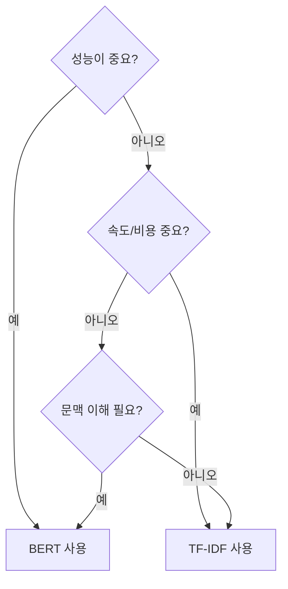

## **✅ 체크리스트**

- [ ]  BERT가 RNN보다 나은 이유 (Attention 메커니즘) 이해
- [ ]  사전학습의 두 가지 방법 (MLM, NSP) 이해
- [ ]  Fine-tuning vs 처음부터 학습의 차이 이해
- [ ]  Tokenizer 로드 및 토큰화 완료
- [ ]  `[CLS]`, `[SEP]`, `[PAD]` 역할 이해
- [ ]  TrainingArguments 하이퍼파라미터 의미 이해
- [ ]  BERT 학습 완료 및 MLflow 기록
- [ ]  TF-IDF 대비 BERT 성능 향상 확인
- [ ]  최소 2개 이상 추가 실험 (LR 또는 Epoch 변경)

## **🔧 트러블슈팅**

**GPU Out of Memory**

`per_device_train_batch_size`를 16 → 8로 줄이거나, `fp16=False`로 변경

**학습이 너무 느려요**

`torch.cuda.is_available()`로 GPU 확인. `fp16=True` 활성화. Batch size 증가.

**F1이 낮아요**

Learning rate 낮추기 (`1e-5`). Epoch 늘리기. 데이터 label 매핑 오류 확인.