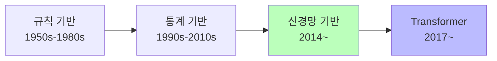
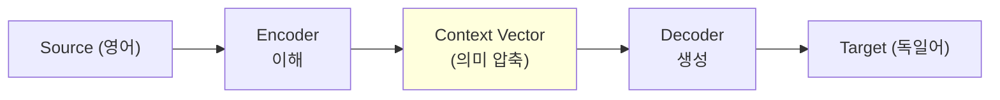
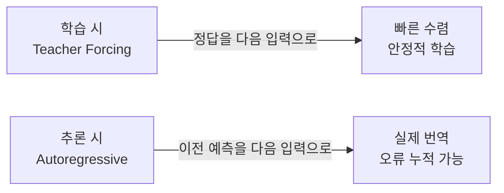
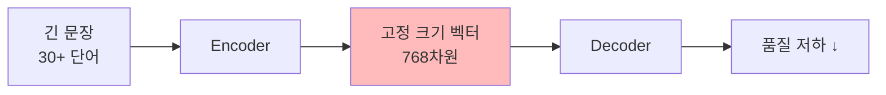
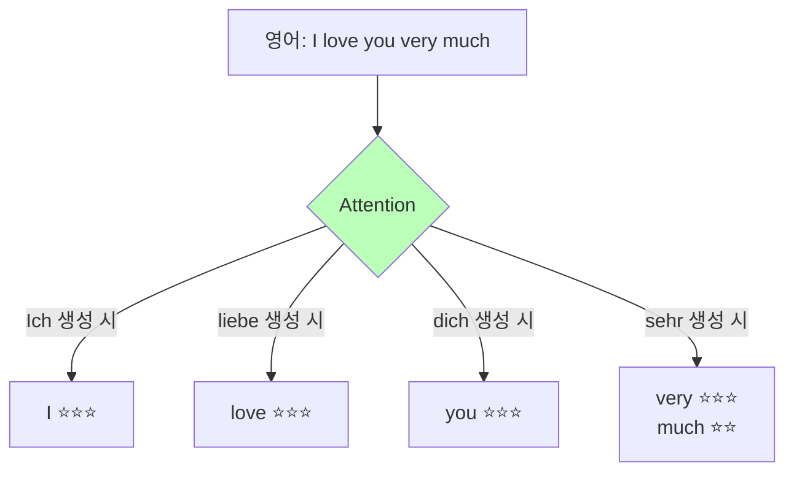
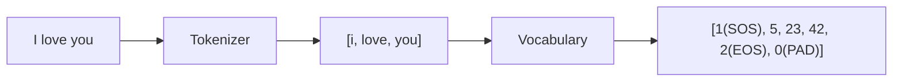
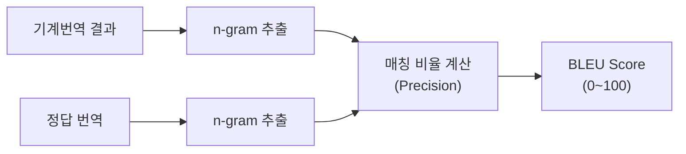
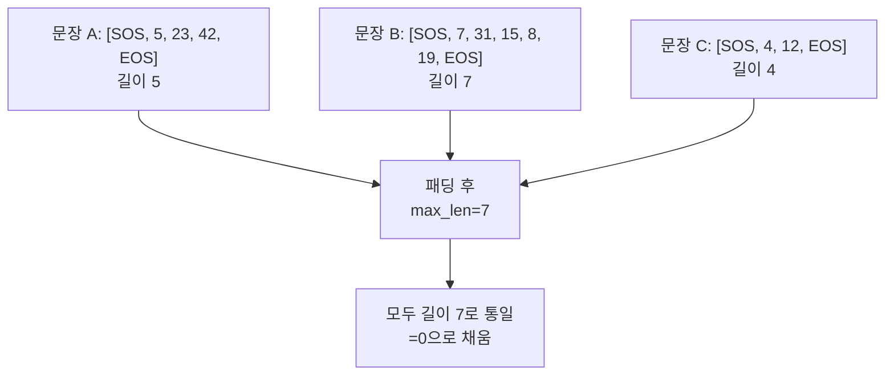

# Seq2Seq 기초 — 데이터 탐색 & BLEU Score

ID: 2-1
일차: 2
순서: 1
상태: Active

**목표**: 병렬 코퍼스의 구조를 이해하고, 토큰화·Vocabulary·BLEU Score를 실습하며 Seq2Seq 모델의 입력 데이터를 준비한다

## **1. 기계번역이란?**

### **1.1 기계번역의 역사**



규칙 기반은 단어 사전 + 문법 규칙으로 번역했지만 예외 처리와 확장성 문제가 있었습니다. 통계 기반은 병렬 코퍼스에서 확률을 학습했으나 긴 문장에서 품질이 저하됩니다. 신경망 기반은 End-to-end 학습으로 이를 해결했고, Transformer가 현재 표준입니다.

### **1.2 기계번역의 어려움**

단어 중의성, 관용 표현, 문화적 차이, 그리고 언어마다 다른 단어 순서가 번역을 어렵게 만듭니다.

```
단어 순서 예시:
영어: Subject- Verb - Object → "I love you"
한국어: Subject- Object - Verb → "나는 너를 사랑해"
독일어: "Ich liebe dich" (동사 위치가 맥락에 따라 달라짐)
```

## **2. Encoder-Decoder 구조**

### **2.1 핵심 아이디어**

**“번역 = 이해(Encoder) + 생성(Decoder)”**



Encoder는 입력 문장을 순차적으로 처리해 하나의 고정 크기 벡터(Context Vector)로 압축합니다. Decoder는 이 벡터로부터 타겟 언어의 단어를 하나씩 생성합니다.

### **2.2 학습 방식: Teacher Forcing**



Teacher Forcing Ratio = 0.5이면 학습 중 50% 확률로 정답을, 50% 확률로 예측값을 다음 입력으로 사용합니다.

### **2.3 Context Vector의 한계**



모든 정보를 하나의 벡터에 담아야 하므로 문장이 길어질수록 앞부분 정보가 손실됩니다. 이를 해결한 것이 **Attention 메커니즘**입니다.

## **3. Attention 메커니즘**

### **3.1 핵심 아이디어**

Encoder의 **모든 시점 hidden state를 저장**해두고, Decoder가 각 단어를 생성할 때 가장 관련 있는 부분에 집중합니다.



### **3.2 Attention 계산 과정**

```
1. Encoder: 각 단어의 hidden state 저장
   h1("I"), h2("love"), h3("you"), h4("very"), h5("much")

2. Score: 현재 Decoder state와 각 Encoder state의 유사도
   score(s_dec, h1) = 0.05  score(s_dec, h2) = 0.85 ← "love"와 관련!

3. Softmax → Attention Weights (합 = 1.0)

4. Weighted Sum → Context Vector
   context = 0.85 × h2 + ...

5. Context + Decoder state → 다음 단어 생성
```

**Attention의 효과**:

```
Seq2Seq without Attention: 짧은 문장 BLEU~0.38 / 긴 문장 BLEU~0.15
Seq2Seq with Attention:    짧은 문장 BLEU~0.48 / 긴 문장 BLEU~0.35
```

## **4. 데이터 로드**

### **4.1 Tatoeba 데이터셋**

[Tatoeba](https://tatoeba.org/)는 자원봉사자들이 구축한 다국어 문장 데이터베이스로, CC BY 2.0 라이선스로 제공됩니다.

실습에서는 `kagglehub`를 통해 Tatoeba EN-DE 데이터를 로드합니다.

```python
import kagglehub

# 데이터 다운로드
path = kagglehub.dataset_download("...")

# 교육용 서브셋: 짧은 문장(단어 3~12개) 위주로 5,000개 샘플링
df = df[(df['en_word_count'] >= 3) & (df['en_word_count'] <= 12)]
df = df.sample(n=5000, random_state=42).reset_index(drop=True)
```

샘플링 이유: 학습 속도 확보 + 짧은 문장으로 패턴 학습에 집중

## **5. 탐색적 데이터 분석 (EDA)**

### **5.1 문장 길이 분포**


주목할 포인트:

- 영어와 독일어의 평균 단어 수 차이 (독일어 복합어로 인한 차이)
- `max_len` 설정 기준: 90 percentile 권장
    
    95
    

### **5.2 어휘 분포 — Zipf’s Law**

```
📊 영어 고유 단어 수  : 4,754
📊 독일어 고유 단어 수: 6,503

[영어 Top-20]
  you              1199  ██████████████████████████████
  tom              1108  ██████████████████████████████
  i                1092  ██████████████████████████████
  to               1088  ██████████████████████████████
  the              1063  ██████████████████████████████
  a                 650  ██████████████████████████████
  is                507  █████████████████████████
  do                374  ██████████████████
  that              327  ████████████████
  in                311  ███████████████
  have              294  ██████████████
  of                291  ██████████████
  don't             289  ██████████████
  was               275  █████████████
  he                252  ████████████
  what              230  ███████████
  it                219  ██████████
  for               218  ██████████
  this              217  ██████████
  are               212  ██████████

[독일어 Top-20]
  ich                   1372  ██████████████████████████████
  tom                   1158  ██████████████████████████████
  du                     618  ██████████████████████████████
  das                    609  ██████████████████████████████
  nicht                  593  █████████████████████████████
  sie                    573  ████████████████████████████
  ist                    555  ███████████████████████████
  zu                     482  ████████████████████████
  die                    428  █████████████████████
  es                     396  ███████████████████
  der                    279  █████████████
  er                     276  █████████████
  in                     259  ████████████
  hat                    248  ████████████
  wir                    243  ████████████
  was                    241  ████████████
  ihr                    240  ████████████
  habe                   224  ███████████
  ein                    222  ███████████
  mir                    212  ██████████
```


**Zipf’s Law**: 빈도 순위 r인 단어의 빈도 ∝ 1/r

```smalltalk
영어 1위 단어: "the" → 수천 번 등장
영어 2위 단어: "a" → 절반 등장
영어 3위 단어: "i" → 1/3 등장
...
```

이 법칙에 따라 상위 소수 단어가 전체 빈도의 대부분을 차지합니다. 따라서 `freq_threshold=2`로 희귀 단어를 `<UNK>`으로 처리해도 큰 정보 손실이 없습니다.

## **6. 토큰화 & Vocabulary**

### **6.1 왜 토큰화가 중요한가?**

신경망은 숫자만 처리할 수 있습니다. 문자 → 숫자 변환 과정이 토큰화입니다.



특수 토큰의 역할:

| **토큰** | **인덱스** | **역할** |
| --- | --- | --- |
| `<PAD>` | 0 | 배치 처리를 위한 길이 통일 |
| `<SOS>` | 1 | Decoder 생성 시작 신호 |
| `<EOS>` | 2 | 생성 종료 신호 |
| `<UNK>` | 3 | 사전에 없는 단어 대체 |

### **6.2 Vocabulary 클래스**

```python
class Vocabulary:
    PAD, SOS, EOS, UNK = 0, 1, 2, 3

    def __init__(self, freq_threshold=2):
        self.stoi = {"<PAD>": 0, "<SOS>": 1, "<EOS>": 2, "<UNK>": 3}
        self.itos = {v: k for k, v in self.stoi.items()}
        self.freq_threshold = freq_threshold

    def build_vocabulary(self, sentence_list):
        freq = Counter()
        for sentence in sentence_list:
            freq.update(sentence)
        for word, cnt in freq.items():
            if cnt >= self.freq_threshold:
                idx = len(self.stoi)
                self.stoi[word] = idx
                self.itos[idx] = word
```

`freq_threshold=2`의 의미: 2회 미만 등장한 단어는 `<UNK>`로 처리 → 모델 일반화 성능 향상

> *⚠️ Vocabulary는 **Train 데이터만**으로 구축해야 합니다. Validation/Test 데이터의 단어를 미리 알면 데이터 누수(Data Leakage)가 발생합니다.*
> 

## **7. BLEU Score**

### **7.1 BLEU란?**

**BLEU (Bilingual Evaluation Understudy)**: 기계번역 품질을 n-gram 매칭으로 자동 평가하는 지표 (Papineni et al., 2002)



| **BLEU** | **품질 수준** |
| --- | --- |
| < 10 | 거의 쓸 수 없는 번역 |
| 10–19 | 어느 정도 이해 가능 |
| 20–29 | 이해 가능, 오류 많음 |
| 30–49 | 충분히 이해 가능 |
| 50+ | 전문가 수준 번역 |

### **7.2 n-gram이란?**

```smalltalk
문장: "I love you"

1-gram: ["I", "love", "you"]                → 3개
2-gram: ["I love", "love you"]              → 2개
3-gram: ["I love you"]                       → 1개
```

n이 커질수록 단어 순서와 문맥까지 요구 → 더 엄격한 평가

### **7.3 BLEU 계산 예시**

```python
ref  = "The cat is on the mat"
cand = "The cat is on a rug"

# 1-gram: 4/6 = 67%  ("a", "rug" 불일치)
# 2-gram: 3/5 = 60%
# 3-gram: 2/4 = 50%
# 4-gram: 1/3 = 33%

BLEU ≈ 51
```

**Modified Precision**: 같은 단어 반복으로 점수 부풀리기 방지

```smalltalk
ref  = "The cat"  →  "the/The" 최대 2번
cand = "the the the the"  →  Count_clip = min(4, 2) = 2만 인정
```

```
Reference: "The cat is sitting on the mat"

번역 유형                번역문                                             BLEU
---------------------------------------------------------------------------
완벽한 번역               The cat is sitting on the mat                 100.0  ▓▓▓▓▓▓▓▓▓▓▓▓▓▓▓▓▓▓▓▓▓▓▓▓▓▓▓▓▓▓▓▓▓
단어 1개 삭제             The cat is on the mat                          43.0  ▓▓▓▓▓▓▓▓▓▓▓▓▓▓
관사 변경                A cat is sitting on a mat                      43.5  ▓▓▓▓▓▓▓▓▓▓▓▓▓▓
핵심 단어 오류             The dog is sitting on the mat                  64.3  ▓▓▓▓▓▓▓▓▓▓▓▓▓▓▓▓▓▓▓▓▓
순서 뒤섞임               Cat mat sitting the on is                      10.3  ▓▓▓
매우 짧은 번역             The cat                                         8.2  ▓▓
```


```
pairs_for_viz = [
    ("Ich liebe dich",            "I love you",               "I love you"),
    ("Das Wetter ist schön",      "The weather is beautiful",  "The weather is nice"),
    ("Wie geht es dir?",          "How are you?",              "How do you do?"),
    ("Guten Morgen, wie geht es?","Good morning, how are you?","Good morning"),
    ("Ich gehe in die Schule",    "I go to school",            "I am going somewhere"),
]
```

### **7.4 BLEU의 한계**

- 동의어 인식 불가: “adore”와 “love”는 의미가 같지만 다른 단어로 취급
- 여러 정답 가능: 정답이 하나일 때 불리
- 문법 체크 불가: 단어는 맞지만 순서가 틀려도 일정 점수

결론: BLEU는 참고용 지표이며, 최근에는 BERTScore 등 의미론적 지표와 함께 사용합니다.

## **8. Seq2Seq 입력 데이터 준비**

### **8.1 패딩(Padding)**

GPU는 배치 단위로 병렬 처리합니다. 문장마다 길이가 다르면 행렬을 만들 수 없으므로 `max_len`으로 통일합니다.



> *⚠️ `<PAD>` 토큰은 Loss 계산에서 무시해야 합니다. `CrossEntropyLoss(ignore_index=0)` 설정 필수.*
> 


💡 녹색: 실제 단어 / 노란색: 특수 토큰(SOS/EOS) / 빨간색: PAD
→ 오른쪽으로 갈수록 PAD가 많아지는 것을 확인!

## **9. MLflow 실험 기록**

데이터 탐색 결과와 전처리 설정을 MLflow에 기록해 이후 모델 실험과 함께 추적합니다.

```python
with mlflow.start_run(run_name="data_prep_v1"):
    mlflow.log_param("vocab_freq_threshold", 2)
    mlflow.log_param("max_len", 25)
    mlflow.log_param("train_size", len(train_df))
    mlflow.log_metric("en_vocab_size", len(en_vocab))
    mlflow.log_metric("de_vocab_size", len(de_vocab))
    mlflow.log_metric("en_coverage", en_coverage)
    mlflow.log_metric("de_coverage", de_coverage)
```

Vocab Coverage: Train 단어 중 사전에 등록된 비율. 90% 이상이 적정 수준입니다.

## **✅ 체크리스트**

- [ ]  Tatoeba EN-DE 데이터 다운로드 및 로드
- [ ]  샘플링 필터 (단어 수 3, 5,000개) 설정 완료
    
    12개
    
- [ ]  EDA 완료 (문장 길이 분포, Zipf’s Law)
- [ ]  토큰화 함수 구현 (소문자 변환, 구두점 분리)
- [ ]  Vocabulary 구축 (Train 데이터만, freq_threshold=2)
- [ ]  특수 토큰 역할 이해 (`<PAD>`, `<SOS>`, `<EOS>`, `<UNK>`)
- [ ]  Train/Validation 분리 (80/20)
- [ ]  패딩 완료 (max_len 설정 이유 이해)
- [ ]  BLEU Score 계산 방법 이해
- [ ]  MLflow에 데이터 준비 결과 기록