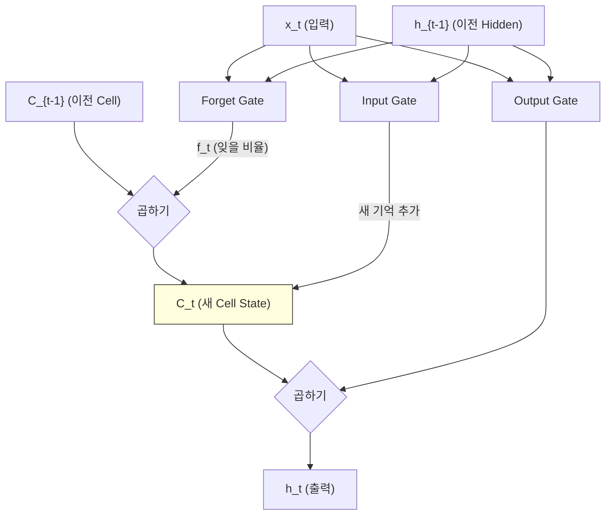
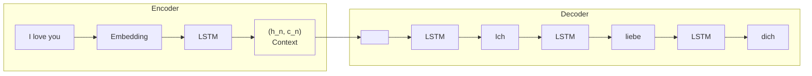
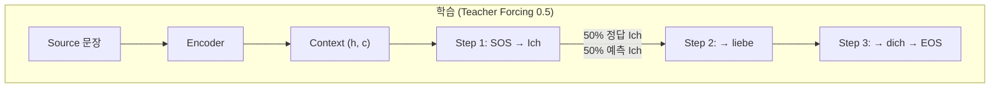
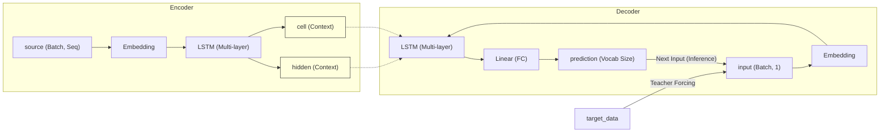
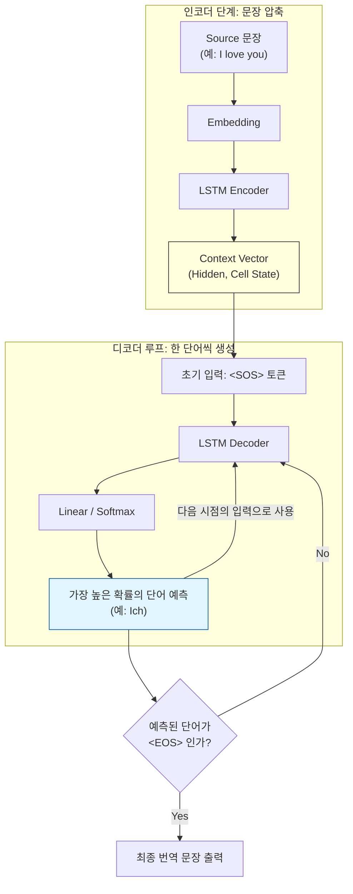
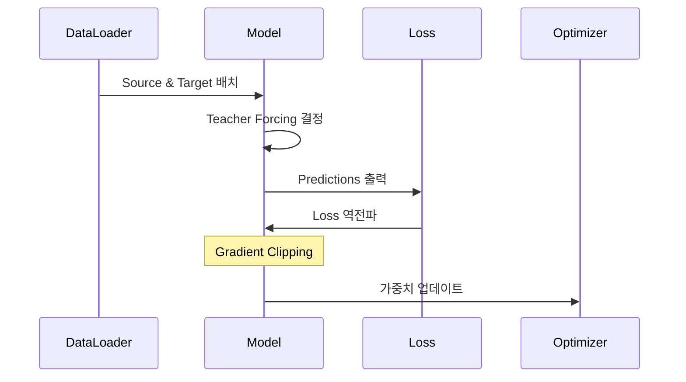
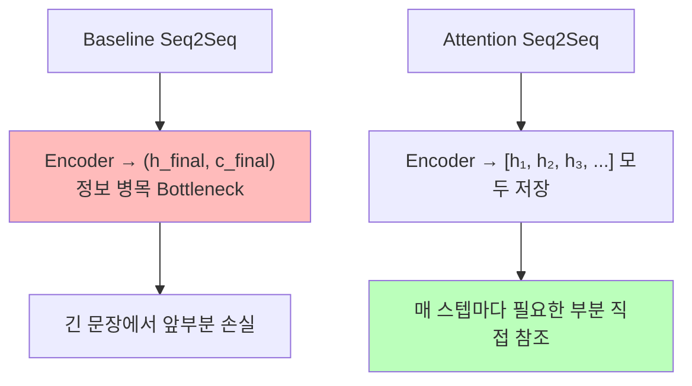
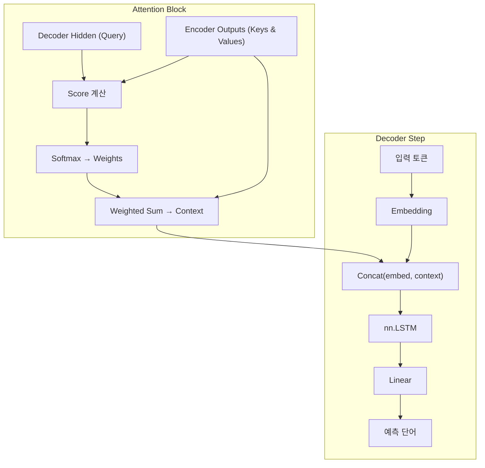
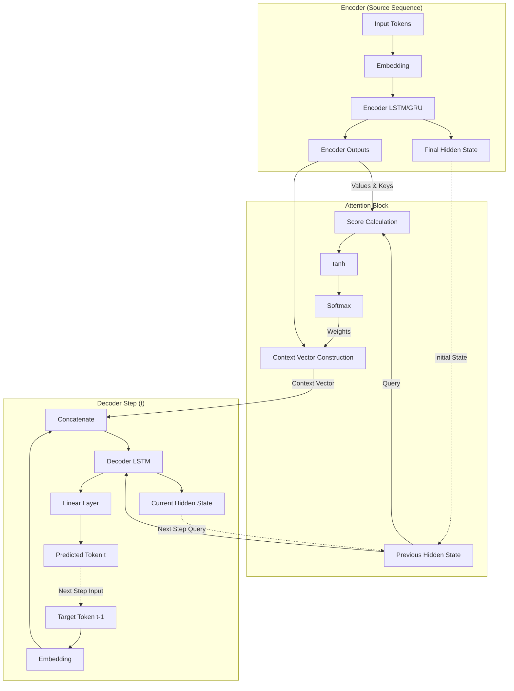
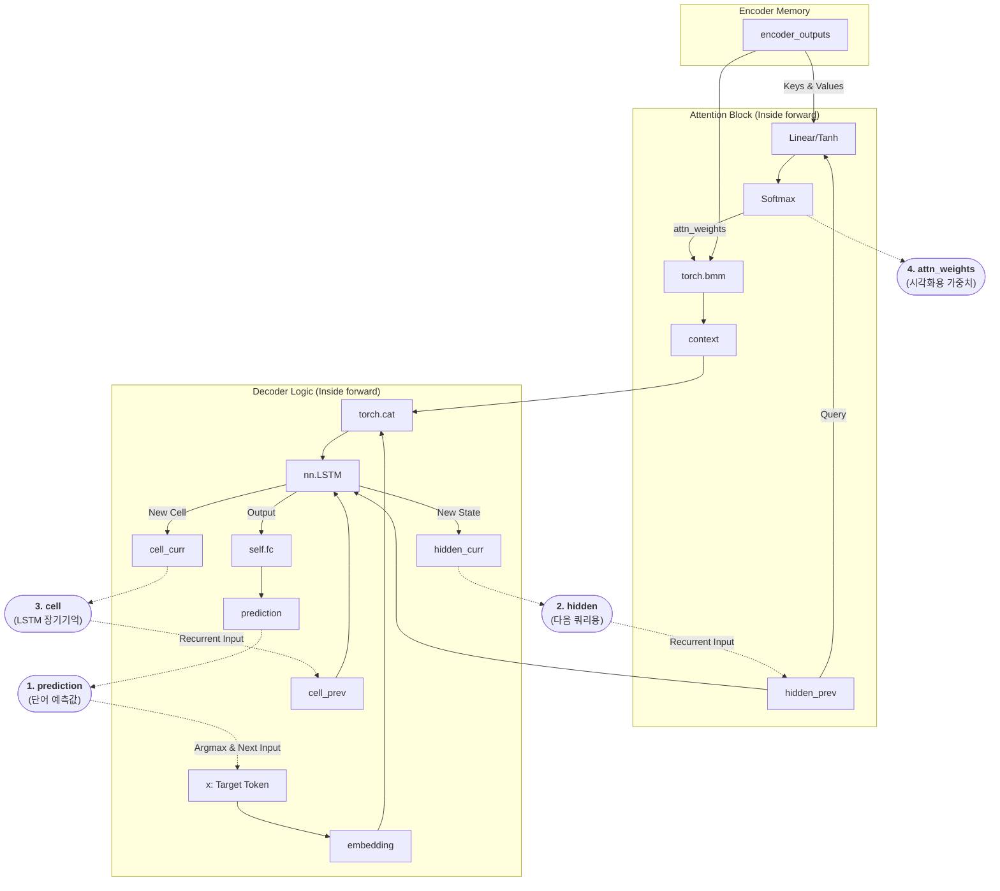

# LSTM 기반 Seq2Seq 모델

ID: 2-2
일차: 2
순서: 2
상태: Active

**목표**: LSTM 기반 Seq2Seq 모델을 직접 구현하고, Attention 메커니즘을 추가하여 성능 향상을 체험한다

## **1. LSTM (Long Short-Term Memory)**

### **1.1 왜 LSTM인가?**

기본 RNN은 긴 문장에서 앞부분 정보가 소실되는 **Vanishing Gradient** 문제가 있습니다.

```
문장: "The cat, which was very hungry and tired, ate the food"

RNN: h₁ → h₂ → h₃ → ... → h₁₀
     (cat)         (hungry)      (ate)

문제: h₁₀에서 "cat"의 정보가 희미함!
```

LSTM은 **Cell State**라는 별도 경로로 이를 해결합니다.

```mathematica
LSTM:
  C₁ → C₂ → C₃ → C₄ → C₅  (Cell State: 장기 기억 경로)
  h₁ → h₂ → h₃ → h₄ → h₅  (Hidden State: 단기 출력)
```

Cell State는 컨베이어 벨트처럼 정보를 보존하며 전달합니다.

### **1.2 LSTM의 4개 게이트**



| **게이트** | **역할** | **수식** |
| --- | --- | --- |
| **Forget Gate** | 이전 Cell State에서 무엇을 잊을까? | `f_t = σ(W_f · [h_{t-1}, x_t])` |
| **Input Gate** | 무엇을 새로 기억할까? | `i_t = σ(W_i · [h_{t-1}, x_t])` |
| **Cell Update** | 새 Cell State 계산 | `C_t = f_t ⊙ C_{t-1} + i_t ⊙ C̃_t` |
| **Output Gate** | 무엇을 출력할까? | `h_t = o_t ⊙ tanh(C_t)` |

## **2. LSTM Seq2Seq 구조**

### **2.1 전체 흐름**



### **2.2 Encoder**

입력 문장 전체를 읽고 `(hidden, cell)` Context를 생성합니다.

```python
class Encoder(nn.Module):
    def __init__(self, input_size, embedding_size, hidden_size, num_layers):
        self.embedding = nn.Embedding(input_size, embedding_size)
        self.lstm = nn.LSTM(embedding_size, hidden_size, num_layers, batch_first=True)

    def forward(self, x):
        embedded = self.embedding(x)              # (batch, seq, embed)
        outputs, (hidden, cell) = self.lstm(embedded)
        return hidden, cell                        # Context만 반환
```

### **2.3 Decoder**

Context를 초기 상태로 받아 단어를 하나씩 생성합니다.

```python
class Decoder(nn.Module):
    def forward(self, x, hidden, cell):
        x = x.unsqueeze(1)                         # (batch, 1)
        embedded = self.embedding(x)
        output, (hidden, cell) = self.lstm(embedded, (hidden, cell))
        prediction = self.fc(output.squeeze(1))    # (batch, vocab_size)
        return prediction, hidden, cell
```

### **2.4 Seq2Seq: Encoder + Decoder 통합**



Teacher Forcing Ratio의 트레이드오프:

```css
높음 (1.0) → 빠른 수렴, Exposure Bias 위험
낮음 (0.0) → 느린 수렴, 실제 추론에 가까움
권장값 0.5 → 절충안
```

### 2.5 모델 구조도





## **3. Dataset & DataLoader**

```python
class TranslationDataset(Dataset):
    def __init__(self, src_data, tgt_data):
        self.src = torch.LongTensor(src_data)
        self.tgt = torch.LongTensor(tgt_data)

    def __len__(self):
        return len(self.src)

    def __getitem__(self, idx):
        return self.src[idx], self.tgt[idx]

train_loader = DataLoader(train_dataset, batch_size=64, shuffle=True)
```

## **4. 학습 루프**

### **4.1 Loss Function**

```python
# PAD 토큰(index=0)은 Loss 계산에서 제외
criterion = nn.CrossEntropyLoss(ignore_index=0)
```

### **4.2 Gradient Clipping**

LSTM은 Gradient Exploding 문제가 발생할 수 있습니다.

```python
loss.backward()
torch.nn.utils.clip_grad_norm_(model.parameters(), max_norm=1.0)
optimizer.step()
```

```groovy
Without clipping: gradient = 1000 → 모델 파라미터 폭발 → 학습 불안정
With clipping:    gradient = 1000 → 1.0으로 제한 → 안정적 학습
```

### **4.3 학습 흐름**



## **5. 실험 1: Baseline (Attention 없음)**

### **5.1 하이퍼파라미터**

```python
EMBEDDING_SIZE = 256
HIDDEN_SIZE    = 512
NUM_LAYERS     = 2
LEARNING_RATE  = 0.001
BATCH_SIZE     = 64
NUM_EPOCHS     = 20
```

### **5.2 MLflow 기록**

```python
with mlflow.start_run(run_name="Seq2Seq_LSTM_Baseline"):
    mlflow.log_params({
        "hidden_size": 512, "num_layers": 2,
        "learning_rate": 0.001, "teacher_forcing_ratio": 0.5
    })
    # 학습 루프 내에서
    mlflow.log_metric("train_loss", train_loss, step=epoch)
    mlflow.log_metric("val_bleu", val_bleu, step=epoch)
```

### **5.3 학습 곡선**


**예상 결과**:

```css
Epoch  1: train_loss ~4.2  val_bleu ~3
Epoch  5: train_loss ~2.8  val_bleu ~8
Epoch 10: train_loss ~2.1  val_bleu ~11
Epoch 20: train_loss ~1.6  val_bleu ~13
```

## **6. Attention 메커니즘 추가 (선택)**

### **6.1 Attention의 필요성**



| **구분** | **Baseline** | **Attention** |
| --- | --- | --- |
| 인코더 정보 전달 | 마지막 hidden state만 | 모든 시점의 hidden states |
| 디코더 시야 | 고정 Context Vector | 매 스텝 동적 Context |
| 긴 문장 성능 | 급격히 저하 | 유지됨 |

### **6.2 Bahdanau Attention 계산**

```python
# 1. Score: 현재 Decoder state vs 각 Encoder output
energy = tanh(W · [h_dec, h_enc_i])       # Alignment score

# 2. Weights: Softmax 정규화
attn_weights = softmax(V · energy)         # (batch, src_len)

# 3. Context: 가중 합산
context = bmm(attn_weights, encoder_outputs)  # (batch, 1, hidden)

# 4. Decoder 입력 = embedding + context 결합
lstm_input = cat([embedded, context], dim=2)
```

### **6.3 Attention Decoder 구조**



### 6.4 구조도





| 구분 | 일반 Seq2Seq (Context Vector) | Attention Seq2Seq |
| --- | --- | --- |
| **인코더 정보 전달** | 마지막 Hidden State 하나만 전달 | **모든 시점의 Hidden State** 전체 전달 |
| **디코더의 시야** | 고정된 하나의 벡터만 봄 | 매 순간 인코더의 **전체 문장**을 다시 봄 |
| **정보 손실** | 문장이 길어지면 앞부분을 잊음 (Bottleneck) | 필요한 정보를 직접 찾으므로 **망각 최소화** |
| **코드상 특징** | `hidden`만 다음 단계로 넘김 | `encoder_outputs`를 `bmm` 연산에 사용 |

## **7. 실험 2: Attention 추가 (선택)**


**예상 결과**:

```
BaselineBLEU: ~8–15
Attention BLEU:~12–22  (+40% 향상)
```

Attention의 효과는 특히 긴 문장(15단어 이상)에서 두드러집니다.

## **8. Greedy Decoding (추론)**

```python
def translate_sentence(model, sentence_ids, src_vocab, tgt_vocab, max_len=50):
    model.eval()
    with torch.no_grad():
        hidden, cell = model.encoder(src_tensor)
        input = torch.LongTensor([tgt_vocab.SOS])

        translation = []
        for _ in range(max_len):
            output, hidden, cell = model.decoder(input, hidden, cell)
            pred = output.argmax(1).item()
            if pred == tgt_vocab.EOS:
                break
            translation.append(tgt_vocab.itos[pred])
            input = torch.LongTensor([pred])

    return ' '.join(translation)
```

매 스텝마다 가장 높은 확률의 단어 하나를 선택하는 방식입니다. 빠르지만 최적 번역이 아닐 수 있습니다 (Day 2–3의 Beam Search와 비교).

## **✅ 체크리스트**

- [ ]  LSTM의 4개 게이트 역할 이해
- [ ]  Cell State vs Hidden State 차이 이해
- [ ]  Encoder 클래스 구현 (Embedding → LSTM → context)
- [ ]  Decoder 클래스 구현 (한 단어씩 생성)
- [ ]  Seq2Seq 통합 모델 구현
- [ ]  Teacher Forcing 원리 이해 및 적용
- [ ]  Gradient Clipping으로 학습 안정화 (`max_norm=1.0`)
- [ ]  `CrossEntropyLoss(ignore_index=0)` 적용 이유 이해
- [ ]  실험 1: Baseline 학습 완료 (BLEU ~8–15)
- [ ]  MLflow로 실험 기록 (params, metrics)
- [ ]  Dagshub UI에서 학습 곡선 확인
- [ ]  [선택] Attention 메커니즘 구현
- [ ]  [선택] 실험 2: Attention 모델 학습 (BLEU ~12–22)