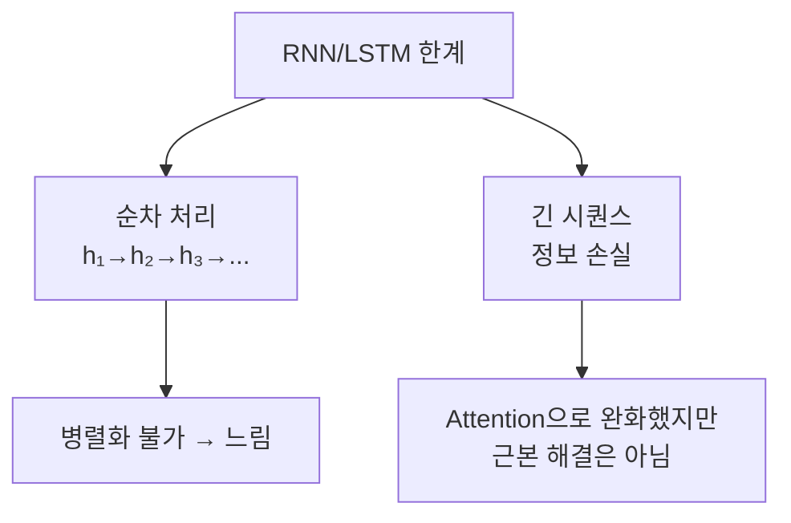
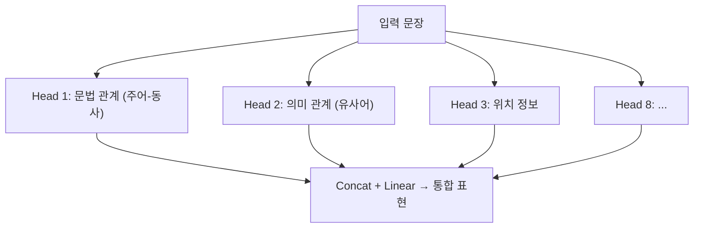
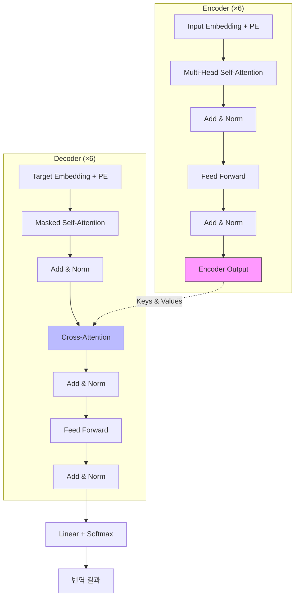
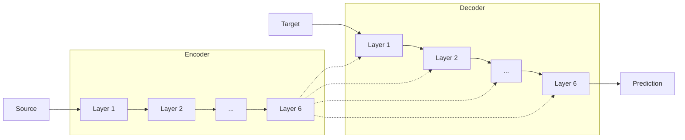
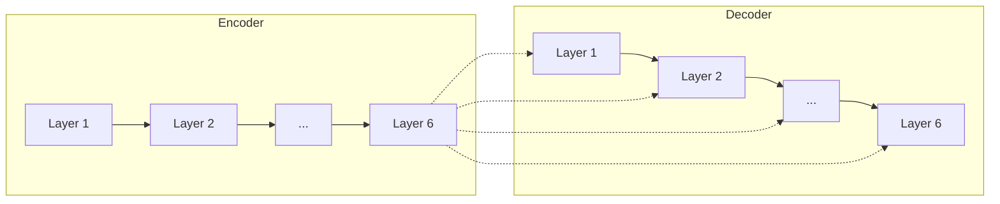
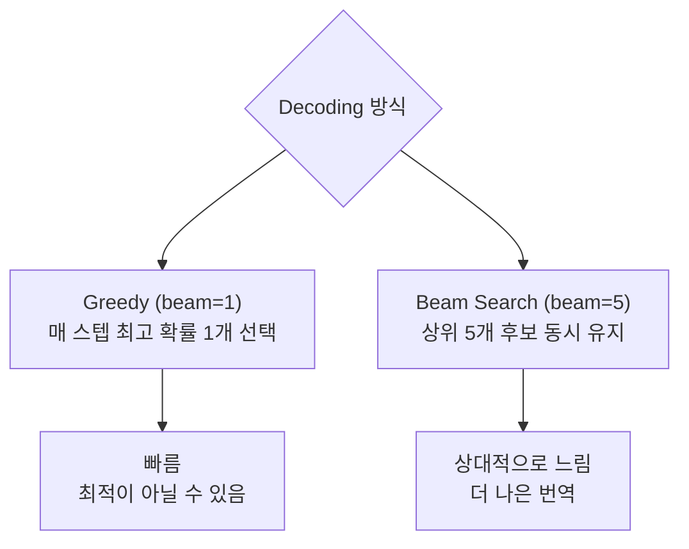
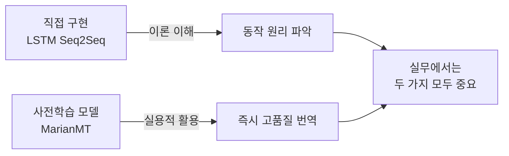

# Transformer와 MarianMT

ID: 2-3
일차: 2
순서: 3
상태: Active

**목표**: Transformer 아키텍처를 이해하고, 사전학습 모델(MarianMT)을 활용한 기계번역 시스템을 구축한다

## **1. Transformer: Attention Is All You Need**

### **1.1 RNN/LSTM의 근본적 한계**



Transformer는 RNN을 완전히 제거하고, **Attention만으로** 모든 단어 관계를 병렬로 처리합니다.

### **1.2 Self-Attention**

**핵심 아이디어**: 문장 내 모든 단어가 서로를 직접 참조합니다.

```
문장: "The cat sat on the mat"

"sat"에 대한 Self-Attention 가중치:
  The: 0.05  cat: 0.40 ← 주어  sat: 0.20
  on: 0.10   the: 0.05  mat: 0.20 ← 장소
```

수식: `Attention(Q, K, V) = softmax(QK^T / √d_k) × V`

- **Query (Q)**: 현재 단어 — “무엇을 찾고 있는가?”
- **Key (K)**: 각 단어의 특성 — “나는 이런 정보를 가지고 있다”
- **Value (V)**: 실제로 가져올 정보

### **1.3 Multi-Head Attention**

여러 Head가 서로 다른 관점에서 동시에 Attention을 계산합니다.



각 Head는 독립적으로 Q, K, V를 계산하고, 결과를 합쳐 풍부한 문맥 표현을 만듭니다.

### **1.4 Positional Encoding**

**문제**: Self-Attention은 단어 순서 정보가 없습니다.

```smalltalk
"The cat ate the mouse" ≈ "The mouse ate the cat"  (Attention 입장에서 동일!)
```

**해결**: 위치 정보를 Embedding에 더해줍니다.

```python
PE(pos, 2i)   = sin(pos / 10000^(2i/d_model))
PE(pos, 2i+1) = cos(pos / 10000^(2i/d_model))

Final Input = Token Embedding + Positional Encoding
```

## **2. Transformer 전체 구조**

```mermaid
graph TB
    subgraph "Encoder Stack (x6)"
        E_In[Input Embedding + PE] --> E_Fork1{ }
        
        %% Self-Attention Block
        E_Fork1 --> E_SA[Multi-Head Self-Attention]
        E_Fork1 -->|Residual| E_Add1[Add]
        E_SA --> E_Add1
        E_Add1 --> E_Norm1[Layer Norm]
        
        %% Feed Forward Block
        E_Norm1 --> E_Fork2{ }
        E_Fork2 --> E_FF[Position-wise Feed Forward]
        E_Fork2 -->|Residual| E_Add2[Add]
        E_FF --> E_Add2
        E_Add2 --> E_Norm2[Layer Norm]
        E_Norm2 --> E_Out[Encoder Output]
    end

    subgraph "Decoder Stack (x6)"
        D_In[Target Embedding + PE] --> D_Fork1{ }
        
        %% Masked Self-Attention
        D_Fork1 --> D_MSA[Masked Self-Attention]
        D_Fork1 -->|Residual| D_Add1[Add]
        D_MSA --> D_Add1
        D_Add1 --> D_Norm1[Layer Norm]
        
        %% Cross-Attention
        D_Norm1 --> D_Fork2{ }
        D_Fork2 --> D_CA[Cross-Attention]
        D_Fork2 -->|Residual| D_Add2[Add]
        E_Out -.->|Keys & Values| D_CA
        D_CA --> D_Add2
        D_Add2 --> D_Norm2[Layer Norm]
        
        %% Feed Forward Block
        D_Norm2 --> D_Fork3{ }
        D_Fork3 --> D_FF[Position-wise Feed Forward]
        D_Fork3 -->|Residual| D_Add3[Add]
        D_FF --> D_Add3
        D_Add3 --> D_Norm3[Layer Norm]
        D_Norm3 --> D_Out[Decoder Output]
    end

    %% Inputs and Outputs
    Src[Source Tokens] --> E_In
    Tgt[Target Tokens] --> D_In
    D_Out --> FC[Linear + Softmax]
    FC --> Final[Next Token Probabilities]

    %% Styling
    style E_Fork1 fill:#333,width:5px,height:5px
    style E_Fork2 fill:#333,width:5px,height:5px
    style D_Fork1 fill:#333,width:5px,height:5px
    style D_Fork2 fill:#333,width:5px,height:5px
    style D_Fork3 fill:#333,width:5px,height:5px
    style E_Out fill:#f9f,stroke:#333
```







### **2.1 Encoder Layer**

```python
class EncoderLayer(nn.Module):
    def forward(self, x):
        # 1. Multi-Head Self-Attention + Residual
        x = self.norm1(x + self.multi_head_attention(x, x, x))
        # 2. Feed Forward + Residual
        x = self.norm2(x + self.feed_forward(x))
        return x
```

**Residual Connection**: 각 서브레이어의 입력을 출력에 더함 → Gradient Vanishing 방지

### **2.2 Decoder Layer**

Encoder와의 차이점:

```groovy
Masked Self-Attention: 미래 단어를 볼 수 없도록 마스킹
  → "Ich"를 생성할 때 "liebe", "dich"를 미리 보면 안 됨!

Cross-Attention: Decoder Query가 Encoder 전체 출력을 참조
  → LSTM Seq2Seq의 Attention과 동일한 역할
```

### **2.3 Encoder가 모든 Decoder Layer에 연결**



Encoder 최종 출력이 **Decoder의 모든 층** Cross-Attention으로 연결됩니다.

## **3. MarianMT: 사전학습 번역 모델**

### **3.1 MarianMT란?**

Helsinki-NLP가 공개한 오픈소스 번역 모델로, HuggingFace에서 간편하게 사용할 수 있습니다.


**주요 특징**:

- 바닐라 Transformer 구조 (Encoder 6층, Decoder 6층)
- **공유 임베딩 (Shared Embeddings)**: Source/Target 임베딩 레이어를 공유 → 언어 간 의미 공간 통일
- **BPE 토큰화**: 미등록 단어(OOV)도 subword 단위로 처리

**왜 MarianMT를 쓰나?**

|  | **처음부터 학습** | **MarianMT Fine-tuning** |
| --- | --- | --- |
| 필요 데이터 | 수백만 문장 | 수천 문장 |
| 학습 시간 | 수일수주 | 수시간 |
| 예상 BLEU | ~25 | ~40+ |

### **3.2 Zero-Shot 번역 (학습 없이 바로 사용)**

```python
from transformers import MarianMTModel, MarianTokenizer

model_name = "Helsinki-NLP/opus-mt-en-de"
tokenizer = MarianTokenizer.from_pretrained(model_name)
model = MarianMTModel.from_pretrained(model_name)

def translate(text, beam_size=5):
    inputs = tokenizer(text, return_tensors="pt", padding=True)
    outputs = model.generate(**inputs, num_beams=beam_size)
    return tokenizer.decode(outputs[0], skip_special_tokens=True)

translate("I love machine learning")
# → "Ich liebe maschinelles Lernen"
```

## **4. Beam Search**

### **4.1 Greedy vs Beam Search**



### **4.2 Beam Search 예시 (beam_size=3)**

```
Input: "I love you"

Step 1: <SOS> →
  Beam 1: "Ich"   (0.60)
  Beam 2: "I"     (0.30)
  Beam 3: "Ik"    (0.10)

Step 2:
  "Ich"  → "liebe" (0.60×0.50 = 0.30) ← 누적 확률
  "Ich"  → "mag"   (0.60×0.40 = 0.24)
  "I"    → "love"  (0.30×0.60 = 0.18)

Step 3:
  "Ich liebe" → "dich" (0.30×0.70 = 0.21) ← Best!
```

**왜 Beam Search가 더 나은가?**: 첫 단어 확률이 낮아도 문장 전체의 완성도(확률의 곱)가 높을 수 있기 때문입니다.

번역은 단어 하나하나의 정답보다 **문장 전체의 응집력**이 중요하기 때문입니다.

- **Greedy**: "나는(0.9) 학교(0.1) 간다(0.2)" → 0.9 × 0.1 × 0.2 = **0.018**
- **Beam**: "나(0.4)는 학교(0.8)에 간다(0.9)" → 0.4 × 0.8 × 0.9 = **0.288**

보시다시피 첫 단어 확률은 Greedy가 높았지만, 전체 문장의 완성도(확률의 곱)는 Beam Search가 훨씬 높을 수 있습니다.

## **5. BLEU Score 평가**

```python
def calculate_bleu_marianmt(model, df, beam_size=5, max_samples=500):
    hypotheses, references = [], []
    for _, row in df.sample(max_samples).iterrows():
        hyp = translate(row['english'], beam_size=beam_size)
        hypotheses.append(hyp)
        references.append(row['german'])
    return sacrebleu.corpus_bleu(hypotheses, [references]).score
```

### **Beam Size 실험**

```
BeamSize= 1 (Greedy): BLEU~58,  속도 가장 빠름
BeamSize= 3:          BLEU~62
BeamSize= 5:          BLEU~64  ← 최적 (품질/속도 균형)
BeamSize= 10:         BLEU~64  (개선 미미, 시간↑)
```

```
Input: I love machine learning and artificial intelligence

======================================================================
Beam Size    Translation                                        Time (ms)
======================================================================
1            Ich liebe maschinelles Lernen und künstliche Intelligenz   135.8
3            Ich liebe maschinelles Lernen und künstliche Intelligenz    90.8
5            Ich liebe maschinelles Lernen und künstliche Intelligenz    80.2
10           Ich liebe maschinelles Lernen und künstliche Intelligenz    81.8
======================================================================

💡 관찰:
  - Beam Size ↑ → 품질 ↑ (어느 시점까지)
  - Beam Size ↑ → 속도 ↓
  - 실무 권장: beam_size=5 (품질/속도 균형)
```

## **6. MLflow 실험 기록**

```python
with mlflow.start_run(run_name="MarianMT_ZeroShot_beam5"):
    mlflow.log_param("model_name", "Helsinki-NLP/opus-mt-en-de")
    mlflow.log_param("beam_size", 5)
    mlflow.log_metric("val_bleu", bleu_score)
```

## **7. Day 2 전체 모델 비교**


```
LSTM Baseline:    BLEU~10.5  (~2M 파라미터)
LSTM + Attention:  BLEU~14.2  (~2.5M 파라미터)
MarianMTZero-Shot:BLEU~60+   (~74M 파라미터, 사전학습)
```

**핵심 교훈**:



직접 구현으로 원리를 이해하고, 실제 서비스에서는 사전학습 모델을 활용하는 것이 현실적입니다.

## **✅ 체크리스트**

- [ ]  Self-Attention 계산 과정 이해 (Q, K, V)
- [ ]  Multi-Head Attention의 역할 파악
- [ ]  Positional Encoding의 필요성 이해
- [ ]  Encoder Layer 구조 (Self-Attention + FFN + Residual)
- [ ]  Decoder Layer 구조 (Masked SA + Cross-Attention + FFN)
- [ ]  Encoder가 Decoder 모든 층에 연결되는 이유 이해
- [ ]  MarianMT 모델 로드 및 Zero-Shot 번역 완료
- [ ]  Beam Search 원리 이해
- [ ]  Beam Size 실험 완료
- [ ]  BLEU Score 계산 및 MLflow 기록
- [ ]  Day 2 전체 모델 성능 비교

🎉 Day 2 전체 완료!