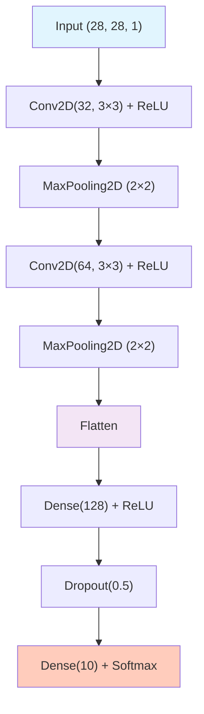

# MNIST 데이터 탐색 & 베이스라인 모델

ID: 3-1
일차: 3
순서: 1
상태: Active

**목표**: Kaggle 플랫폼 이해 및 첫 CNN 베이스라인 구축

## **1. Kaggle 플랫폼 소개**

### **1.1 Kaggle이란?**

2010년 설립, 2017년 Google 인수. 전 세계 1,000만+ 데이터 과학자가 활동하는 ML 경진대회 플랫폼입니다.

**왜 Kaggle을 사용하는가?**

```
✅ 실전 경험: 실제 데이터로 End-to-End 모델 개발
✅ 벤치마킹: 리더보드로 객관적 성능 비교
✅ 커뮤니티: 최신 기법 공유 (Notebooks, Discussions)
✅ 포트폴리오: 취업/대학원 지원에 활용
```

### **1.2 Digit Recognizer 대회**


- **평가 지표**: Accuracy
- **데이터**: MNIST 기반 (train 42,000개 / test 28,000개)
- **특징**: 무제한 제출, 초보자 입문 대회

### **1.3 Public vs Private Leaderboard**

```
Public Leaderboard:  제출 즉시 확인, Test의 30%로 계산
Private Leaderboard: 대회 종료 후 공개, Test의 70%로 계산 (최종 순위)
```

Public에서 과적합되지 않도록 주의해야 합니다. Public Score가 높더라도 Private에서 떨어지는 경우가 있습니다.

## **2. MNIST 데이터셋**

### **2.1 데이터 개요**

- 1998년 Yann LeCun이 공개한 딥러닝 “Hello World” 데이터셋
- 미국 우체국 손글씨 숫자에서 유래
- **28×28 픽셀, Grayscale (1채널), 10개 클래스 (09)**
- Kaggle 버전: Train 42,000개 / Test 28,000개 (원본 MNIST보다 적음)

### **2.2 데이터 로드**

```python
train = pd.read_csv('train.csv')  # (42000, 785) = label + 784 pixels
test  = pd.read_csv('test.csv')   # (28000, 784)

y_train = train['label'].values
X_train = train.drop('label', axis=1).values
X_test  = test.values
```

## **3. 탐색적 데이터 분석 (EDA)**


### **3.1 주요 관찰 포인트**

클래스 분포는 비교적 균형 잡혀 있습니다 (각 ~4,200개). 픽셀 값은 0(배경)에 집중되고 일부 높은 값(획)으로 이루어진 이중 분포를 보입니다.

### **3.2 혼동하기 쉬운 숫자 쌍**

```basic
7 vs 1: 가로획이 짧으면 구분 어려움
4 vs 9: 윗부분이 닫히면 혼동
3 vs 8: 중간 부분이 겹치면 혼동
5 vs 6: 회전되어 있으면 혼동
```


이 혼동 쌍은 Day 3–4의 Error Analysis에서 다시 확인하게 됩니다.

## **4. 데이터 전처리**

### **4.1 정규화**

```python
X_train = X_train / 255.0   # 0~255 → 0.0~1.0
X_test  = X_test / 255.0
```

값을 01로 줄이면 Gradient 폭발을 방지하고 학습 안정성이 높아집니다.

### **4.2 Reshape (CNN 입력 형식)**

CNN은 `(N, H, W, C)` 형태의 입력을 요구합니다.

```python
X_train = X_train.reshape(-1, 28, 28, 1)   # (42000, 784) → (42000, 28, 28, 1)
X_test  = X_test.reshape(-1, 28, 28, 1)
```

### **4.3 Train/Validation Split**

```python
X_train_sub, X_val, y_train_sub, y_val = train_test_split(
    X_train, y_train,
    test_size=0.1,       # 10% Validation
    stratify=y_train,    # 클래스 비율 유지
    random_state=42
)
# Train: 37,800개 / Val: 4,200개
```

`stratify` 옵션으로 클래스 불균형 없이 분리합니다.

## **5. Simple CNN 베이스라인**

### **5.1 아키텍처**



파라미터 수: ~225K (가볍고 빠름)

### **5.2 구현**

```python
def build_simple_cnn():
    model = Sequential([
        Conv2D(32, (3, 3), activation='relu', input_shape=(28, 28, 1)),
        MaxPooling2D((2, 2)),
        Conv2D(64, (3, 3), activation='relu'),
        MaxPooling2D((2, 2)),
        Flatten(),
        Dense(128, activation='relu'),
        Dropout(0.5),
        Dense(10, activation='softmax')
    ])
    return model
```

### **5.3 학습 & MLflow 기록**

```python
with mlflow.start_run(run_name='Simple_CNN_Baseline'):
    mlflow.log_params({
        'model': 'Simple_CNN',
        'conv_filters': '32,64',
        'dense_units': 128,
        'dropout': 0.5,
        'batch_size': 128,
        'epochs': 10,
    })

    history = model.fit(
        X_train_sub, y_train_sub,
        batch_size=128, epochs=10,
        validation_data=(X_val, y_val)
    )

    # Epoch별 메트릭 기록
    for epoch in range(10):
        mlflow.log_metrics({
            'train_loss': history.history['loss'][epoch],
            'val_acc':    history.history['val_accuracy'][epoch],
        }, step=epoch)

    mlflow.keras.log_model(model, 'model')
```

## **6. 결과 분석**


**예상 결과**: Val Accuracy ~98.0%

베이스라인이지만 이미 98%로, MNIST의 난이도를 실감할 수 있습니다. Day 3–2에서 5가지 아키텍처로 99%+ 달성을 목표로 합니다.

## **✅ 체크리스트**

- [ ]  Kaggle 계정 생성 및 Digit Recognizer 대회 참여
- [ ]  train.csv, test.csv 다운로드
- [ ]  EDA: 클래스 분포, 샘플 이미지, 픽셀 분포, 혼동 쌍 확인
- [ ]  전처리: 정규화 / Reshape / Train·Val Split
- [ ]  Simple CNN 구현 및 학습 완료
- [ ]  MLflow 실험 기록 (params, metrics, model)
- [ ]  Val Accuracy ~98% 달성