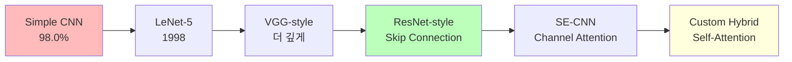
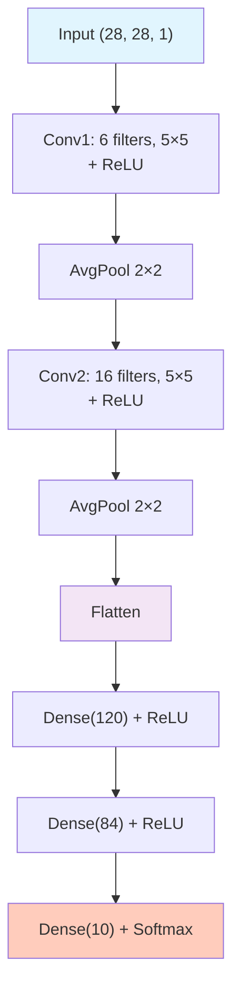
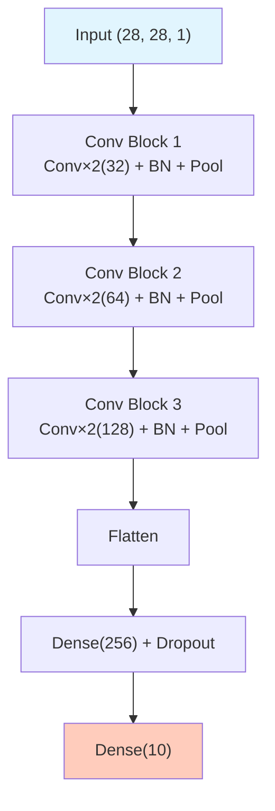
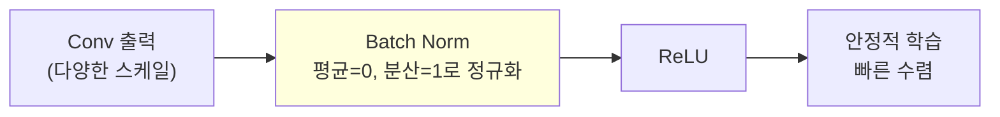
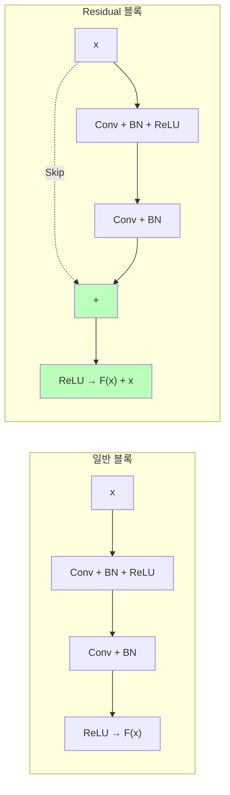
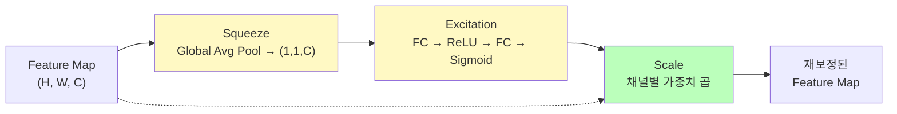
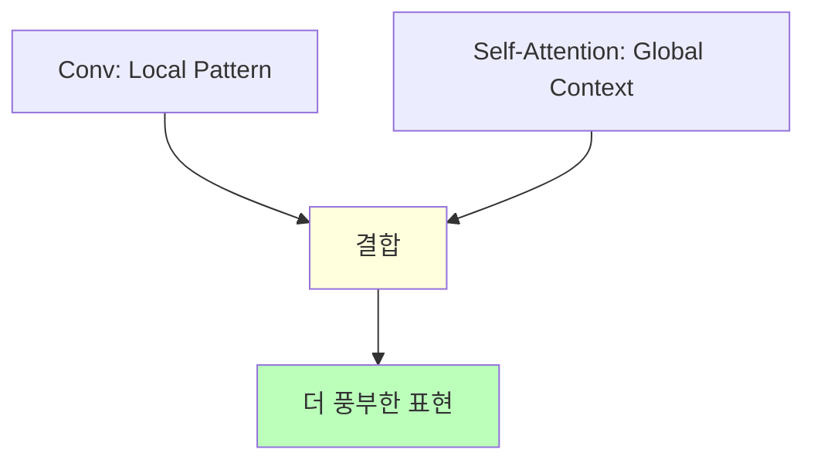
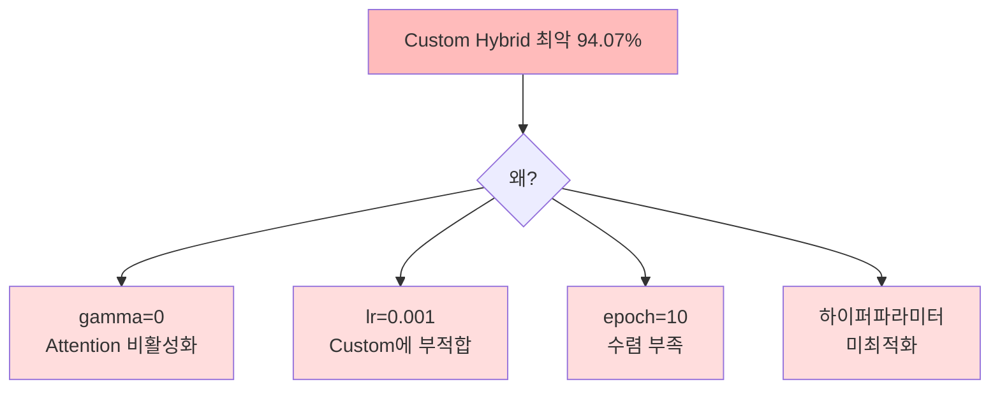

# 다양한 CNN 아키텍처 비교

ID: 3-2
일차: 3
순서: 2
상태: Active

**목표**: 5가지 CNN 아키텍처를 구현하고 성능을 비교한다

## **1. CNN 아키텍처 진화**

### **1.1 Simple CNN의 한계**

```less
Simple CNN (Day 3-1):
  얕은 구조 (Conv 2개) → 복잡한 패턴 학습 한계
  고정 구조             → 최적화 여지 없음
  Val Accuracy: ~98.0%
```

오늘의 목표는 이 베이스라인을 5가지 방법으로 개선하며 각 아키텍처의 핵심 아이디어를 이해하는 것입니다.

### **1.2 오늘의 아키텍처 로드맵**



### **1.3 핵심 기법 미리 보기**

| **기법** | **역할** | **적용 모델** |
| --- | --- | --- |
| **Batch Normalization** | 학습 안정화, 수렴 가속 | VGG, ResNet, SE |
| **Skip Connection** | Gradient Vanishing 방지 | ResNet |
| **Channel Attention** | 중요한 채널 강조 | SE-CNN |
| **Self-Attention** | Global context 포착 | Custom Hybrid |

## **2. 아키텍처 1: LeNet–5 (1998)**

### **2.1 역사적 의미**

Yann LeCun이 1998년 발표한 최초의 성공적인 CNN으로, 미국 우체국 우편번호 자동 인식에 사용되었습니다. 현대 CNN의 원형입니다.

### **2.2 구조**



파라미터 ~60K. 현대 기준으로는 작고 얕지만 당시로서는 혁신적이었습니다.

**현대와의 차이점**: 5×5 커널(현대는 3×3 선호), Average Pooling(현대는 Max Pooling 선호), Tanh 활성화(현대는 ReLU)

### **2.3 구현**

```python
def build_lenet5():
    model = Sequential([
        Conv2D(6, (5, 5), activation='relu', padding='same', input_shape=(28, 28, 1)),
        AveragePooling2D((2, 2), strides=2),
        Conv2D(16, (5, 5), activation='relu'),
        AveragePooling2D((2, 2), strides=2),
        Flatten(),
        Dense(120, activation='relu'),
        Dense(84, activation='relu'),
        Dense(10, activation='softmax')
    ])
    return model
```

## **3. 아키텍처 2: VGG-style (깊은 네트워크)**

### **3.1 VGG의 철학**

**“Deeper is Better” + “Small Kernels”**

```
Why 3×3 커널 여러 개?

5×5 커널 1개 = receptive field 25, 파라미터 25C²
3×3 커널 2개 = receptive field 25, 파라미터 18C²

→ 같은 receptive field, 더 적은 파라미터 + 더 많은 비선형성
```

### **3.2 구조**



### **3.3 핵심: Batch Normalization**



BN은 각 미니배치마다 활성화를 정규화해 내부 공변량 변화(Internal Covariate Shift)를 줄입니다. Learning Rate를 높여도 안정적으로 학습할 수 있게 해줍니다.

### **3.4 구현 핵심**

```python
def build_vgg_style():
    model = Sequential([
        # Conv Block 1
        Conv2D(32, (3, 3), activation='relu', padding='same', input_shape=(28, 28, 1)),
        Conv2D(32, (3, 3), activation='relu', padding='same'),
        BatchNormalization(),
        MaxPooling2D((2, 2)),
        Dropout(0.25),
        # Conv Block 2, 3 동일 패턴...
        Flatten(),
        Dense(256, activation='relu'),
        Dropout(0.5),
        Dense(10, activation='softmax')
    ])
    return model
```

## **4. 아키텍처 3: ResNet-style (Skip Connection)**

### **4.1 Skip Connection의 힘**

깊은 네트워크는 Gradient Vanishing 문제로 오히려 성능이 떨어지는 역설이 있습니다. ResNet은 Skip Connection으로 이를 해결합니다.



**핵심 아이디어**: 모델이 `F(x)` (잔차)만 학습하면 됩니다. 아무것도 학습하지 않아도 `F(x)=0`이면 입력을 그대로 통과시킬 수 있어 깊게 쌓아도 성능이 유지됩니다.

### **4.2 구현**

```python
def residual_block(x, filters):
    # Main path
    fx = Conv2D(filters, (3, 3), padding='same')(x)
    fx = BatchNormalization()(fx)
    fx = Activation('relu')(fx)
    fx = Conv2D(filters, (3, 3), padding='same')(fx)
    fx = BatchNormalization()(fx)
    # Skip connection
    out = Add()([x, fx])
    return Activation('relu')(out)
```

`Add()([x, fx])` 한 줄이 핵심입니다. 입력과 출력의 채널 수가 같아야 하며, 다를 경우 1×1 Conv로 맞춰줍니다.

## **5. 아키텍처 4: SE-CNN (Channel Attention)**

### **5.1 Squeeze-and-Excitation Block**

**“어떤 채널이 중요한가?”** 에 집중합니다.



Squeeze로 공간 정보를 압축하고, Excitation으로 채널 중요도를 학습합니다. 중요한 채널은 증폭, 불필요한 채널은 억제합니다.

### **5.2 구현**

```python
def se_block(input_tensor, ratio=16):
    channels = input_tensor.shape[-1]
    # Squeeze
    se = GlobalAveragePooling2D()(input_tensor)
    # Excitation
    se = Dense(channels // ratio, activation='relu')(se)
    se = Dense(channels, activation='sigmoid')(se)
    se = Reshape((1, 1, channels))(se)
    # Scale
    return Multiply()([input_tensor, se])
```

`ratio=16`은 병목 비율로, 파라미터를 줄이면서 채널 간 상호작용을 학습합니다.

## **6. 아키텍처 5: Custom Hybrid (Self-Attention)**

### **6.1 설계 철학**



CNN은 커널 크기 내의 지역 패턴만 보지만, Self-Attention은 이미지 전체의 모든 위치를 동시에 참조합니다. 예를 들어 숫자 “8”을 인식할 때 위쪽 원과 아래쪽 원의 관계를 직접 연결할 수 있습니다.

### **6.2 Self-Attention Layer**

```python
class SelfAttention(Layer):
    def __init__(self, channels, gamma_init=0.0, **kwargs):
        super().__init__(**kwargs)
        self.channels = channels

    def build(self, input_shape):
        C = input_shape[-1]
        self.query = Conv2D(C // 8, 1)
        self.key   = Conv2D(C // 8, 1)
        self.value = Conv2D(C, 1)
        self.gamma = self.add_weight(
            initializer=tf.keras.initializers.Constant(self.gamma_init)
        )

    def call(self, x):
        Q = self.query(x)
        K = self.key(x)
        V = self.value(x)
        # Attention map
        attn = tf.nn.softmax(tf.matmul(
            tf.reshape(Q, [tf.shape(Q)[0], -1, Q.shape[-1]]),
            tf.reshape(K, [tf.shape(K)[0], -1, K.shape[-1]]), transpose_b=True
        ))
        out = tf.matmul(attn, tf.reshape(V, [tf.shape(V)[0], -1, V.shape[-1]]))
        out = tf.reshape(out, tf.shape(x))
        return self.gamma * out + x   # Residual
```

`gamma`는 학습 가능한 스케일 파라미터로, 초기에 0으로 설정하면 처음에는 Attention을 무시하고 점차 활성화됩니다. 이것이 Day 3–3 튜닝의 핵심 포인트가 됩니다.

## **7. 모델 성능 비교**

모든 모델을 같은 조건 (optimizer=Adam, epochs=10, batch=128)으로 학습합니다.


**실제 실험 결과:**

```
ResNet_style   : 99.12% ✅ 최고
Simple_CNN     : 99.07%
VGG_style      : 98.67%
LeNet5         : 98.50%
SE_CNN         : 96.45%
Custom_Hybrid  : 94.07% ❌ 최악!
```

### **7.1 예상 밖의 결과 분석**



**핵심 교훈**: 복잡한 모델 ≠ 좋은 성능. **하이퍼파라미터 최적화 없이는 복잡한 모델이 오히려 역효과**를 낼 수 있습니다.

이것이 Day 3–3의 시작점입니다. Custom Hybrid를 94% → 99%+ 로 끌어올리는 과정을 통해 하이퍼파라미터 튜닝의 위력을 체험합니다.

### **7.2 MLflow 실험 비교**

```python
runs = mlflow.search_runs(
    experiment_ids=[exp_id],
    order_by=["metrics.final_val_accuracy DESC"]
)
comparison_df = runs[['params.model', 'metrics.final_val_accuracy']]
```

Dagshub UI에서 모든 실험을 한눈에 비교할 수 있습니다.

## **✅ 체크리스트**

- [ ]  LeNet–5 구현 및 학습 완료 (~98.5%)
- [ ]  VGG-style 구현 (BatchNorm + Dropout 패턴)
- [ ]  ResNet-style 구현 (residual_block 함수)
- [ ]  SE-CNN 구현 (se_block 함수)
- [ ]  Custom Hybrid 구현 (SelfAttention 클래스)
- [ ]  5개 모델 모두 MLflow에 기록
- [ ]  ResNet_style 최고 성능 확인 (~99.1%)
- [ ]  Custom_Hybrid 최저 성능 이유 분석
- [ ]  Dagshub UI에서 실험 비교 확인