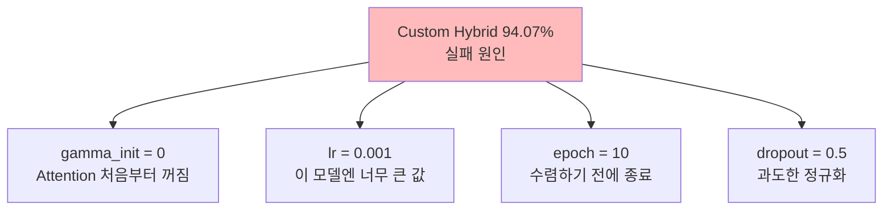
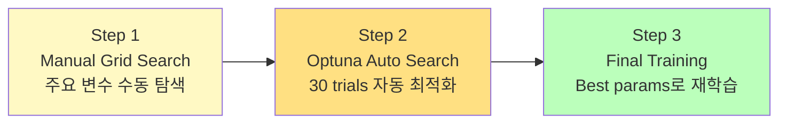
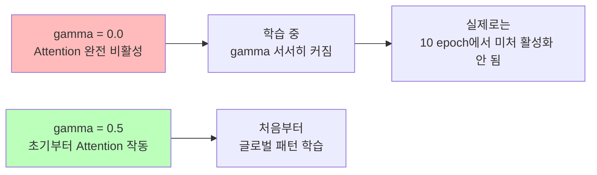
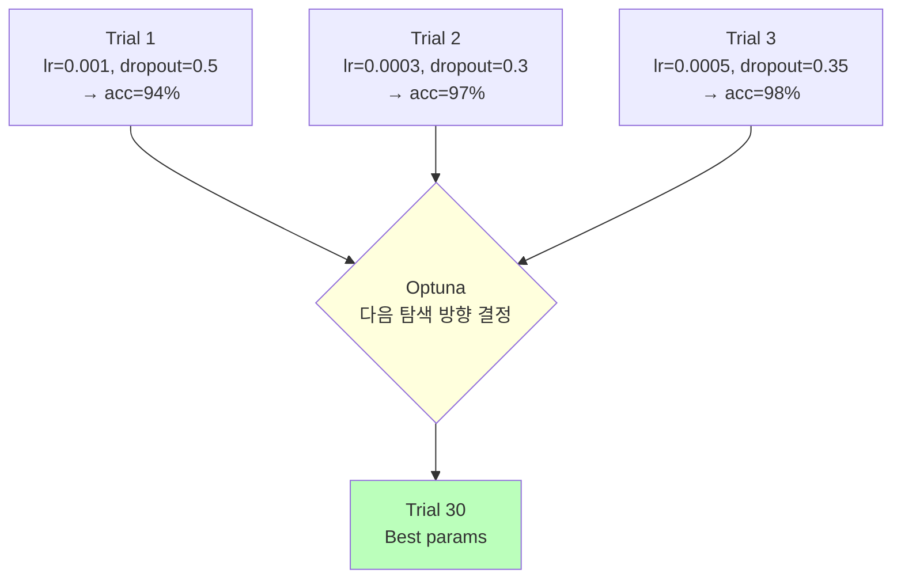
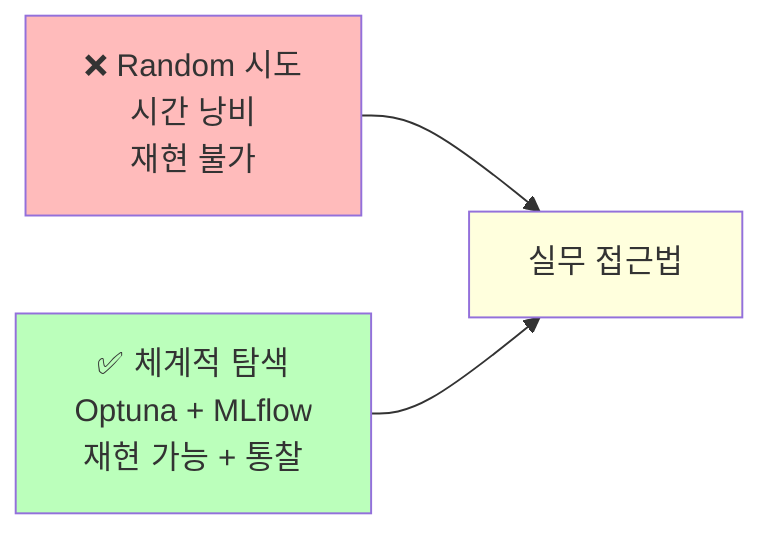

# 하이퍼파라미터 튜닝 with Optuna & MLflow

ID: 3-3
일차: 3
순서: 3
상태: Active

# **하이퍼파라미터 튜닝 with Optuna & MLflow**

**목표**: Custom Hybrid 모델을 체계적으로 개선하여 94.07% → 99%+ 달성

## **1. 왜 하이퍼파라미터 튜닝인가?**

### **1.1 Day 3–2의 교훈**

```
Day 3-2 실험 결과:
  ResNet_style   : 99.12% ✅
  Simple_CNN     : 99.07%
  VGG_style      : 98.67%
  LeNet5         : 98.50%
  SE_CNN         : 96.45%
  Custom_Hybrid  : 94.07% ❌
```

Custom Hybrid는 이론적으로 가장 강력한 구조(Conv + Self-Attention)인데 왜 최악일까요?



### **1.2 왜 ResNet이 아닌 Custom Hybrid를 튜닝하는가?**

```
ResNet (99.12%):
  ✅ 이미 좋은 성능
  ❌ 개선 여지 적음 (0.3% 미만)
  ❌ 학습 경험 적음

Custom Hybrid (94.07%):
  ✅ 개선 여지 큼 (94% → 99%+ 극적 변화)
  ✅ 실패 원인 분석 경험
  ✅ 튜닝의 위력을 몸으로 느낄 수 있음
```

실무에서도 “가장 성능 좋은 모델”보다 “이 모델의 잠재력을 끌어내는 과정”이 더 중요한 경우가 많습니다.

### **1.3 튜닝 전략**



## **2. Manual Grid Search**

수동 탐색으로 먼저 가장 영향이 큰 변수를 파악합니다.

### **2.1 Learning Rate 탐색**

```python
lr_candidates = [0.0001, 0.0005, 0.001, 0.002]

for lr in lr_candidates:
    model = build_custom_hybrid()
    model.compile(optimizer=Adam(lr=lr), ...)
    with mlflow.start_run(run_name=f'Manual_LR_{lr}'):
        mlflow.log_param('lr', lr)
        history = model.fit(...)
        mlflow.log_metric('val_acc', max(history.history['val_accuracy']))
```

**예상 결과:**

```
lr = 0.0001: ~95% (너무 느림, 미수렴)
lr = 0.0005: ~97% ← Good
lr = 0.001:  94%  (원래 값, 너무 빠름)
lr = 0.002:  ~92% (발산)
```

결과:

```
============================================================
Testing lr=0.0001
============================================================
Val Accuracy: 0.9490
🏃 View run Manual_LR_0.0001 at: https://dagshub.com/dev.codecompose/deeplearning-bootcamp.mlflow/#/experiments/4/runs/770389fc20eb4323a63596684be80a86
🧪 View experiment at: https://dagshub.com/dev.codecompose/deeplearning-bootcamp.mlflow/#/experiments/4

============================================================
Testing lr=0.0005
============================================================
Val Accuracy: 0.9664
🏃 View run Manual_LR_0.0005 at: https://dagshub.com/dev.codecompose/deeplearning-bootcamp.mlflow/#/experiments/4/runs/776423294469439c861454bc7d3f04b2
🧪 View experiment at: https://dagshub.com/dev.codecompose/deeplearning-bootcamp.mlflow/#/experiments/4

============================================================
Testing lr=0.001
============================================================
Val Accuracy: 0.9669
🏃 View run Manual_LR_0.001 at: https://dagshub.com/dev.codecompose/deeplearning-bootcamp.mlflow/#/experiments/4/runs/dbe178b84d9b455e9ebc164dbf864f71
🧪 View experiment at: https://dagshub.com/dev.codecompose/deeplearning-bootcamp.mlflow/#/experiments/4

============================================================
Testing lr=0.002
============================================================
Val Accuracy: 0.9750
🏃 View run Manual_LR_0.002 at: https://dagshub.com/dev.codecompose/deeplearning-bootcamp.mlflow/#/experiments/4/runs/bdf418944bc144c4bc0dbca87a820537
🧪 View experiment at: https://dagshub.com/dev.codecompose/deeplearning-bootcamp.mlflow/#/experiments/4

============================================================
Learning Rate Grid Search Results
============================================================
    lr  val_acc
0.0001 0.949048
0.0005 0.966429
0.0010 0.966905
0.0020 0.975000
============================================================

✅ Best Learning Rate: 0.002
```

### **2.2 Gamma 초기화 탐색**

`gamma=0`이면 Self-Attention이 완전히 꺼진 상태로 시작합니다.



```python
gamma_candidates = [0.0, 0.3, 0.5, 0.7, 1.0]

for gamma_init in gamma_candidates:
    model = build_custom_hybrid(gamma_init=gamma_init)
    with mlflow.start_run(run_name=f'Manual_Gamma_{gamma_init}'):
        mlflow.log_param('gamma_init', gamma_init)
        # 학습 및 기록 ...
```

**예상 결과:**

```
gamma = 0.0: 94%  (원래 값)
gamma = 0.3: ~96%
gamma = 0.5: ~97% ← Good
gamma = 1.0: ~96% (너무 강한 Attention)
```

결과:

```
============================================================
Testing gamma_init=0.0
============================================================
Val Accuracy: 0.9600
🏃 View run Manual_Gamma_0.0 at: https://dagshub.com/dev.codecompose/deeplearning-bootcamp.mlflow/#/experiments/4/runs/6b78808875c04de0a9d5c12356fe0b85
🧪 View experiment at: https://dagshub.com/dev.codecompose/deeplearning-bootcamp.mlflow/#/experiments/4

============================================================
Testing gamma_init=0.3
============================================================
Val Accuracy: 0.9540
🏃 View run Manual_Gamma_0.3 at: https://dagshub.com/dev.codecompose/deeplearning-bootcamp.mlflow/#/experiments/4/runs/272e4a2ae1494b2fb8f4b690c139b029
🧪 View experiment at: https://dagshub.com/dev.codecompose/deeplearning-bootcamp.mlflow/#/experiments/4

============================================================
Testing gamma_init=0.5
============================================================
Val Accuracy: 0.9688
🏃 View run Manual_Gamma_0.5 at: https://dagshub.com/dev.codecompose/deeplearning-bootcamp.mlflow/#/experiments/4/runs/444438b4d47d4512bddc76b18822088d
🧪 View experiment at: https://dagshub.com/dev.codecompose/deeplearning-bootcamp.mlflow/#/experiments/4

============================================================
Testing gamma_init=0.7
============================================================
Val Accuracy: 0.9567
🏃 View run Manual_Gamma_0.7 at: https://dagshub.com/dev.codecompose/deeplearning-bootcamp.mlflow/#/experiments/4/runs/dd07375caea740bba1202a392b1d7b8b
🧪 View experiment at: https://dagshub.com/dev.codecompose/deeplearning-bootcamp.mlflow/#/experiments/4

============================================================
Testing gamma_init=1.0
============================================================
Val Accuracy: 0.9669
🏃 View run Manual_Gamma_1.0 at: https://dagshub.com/dev.codecompose/deeplearning-bootcamp.mlflow/#/experiments/4/runs/c398e4ae2fef4d71bfe1ef2b76f299ce
🧪 View experiment at: https://dagshub.com/dev.codecompose/deeplearning-bootcamp.mlflow/#/experiments/4

============================================================
Gamma Initialization Grid Search Results
============================================================
 gamma_init  val_acc
        0.0 0.960000
        0.3 0.954048
        0.5 0.968810
        0.7 0.956667
        1.0 0.966905
============================================================

✅ Best Gamma Init: 0.5
```

## **3. Optuna 자동 탐색**

### **3.1 Optuna란?**



Random Search와 달리 이전 trial 결과를 바탕으로 다음 탐색 방향을 결정합니다 (Bayesian Optimization 기반).

### **3.2 탐색 공간 정의**

```python
def objective(trial):
    # 하이퍼파라미터 샘플링
    lr         = trial.suggest_loguniform('lr', 1e-5, 1e-2)
    dropout    = trial.suggest_uniform('dropout', 0.2, 0.6)
    gamma_init = trial.suggest_uniform('gamma_init', 0.3, 1.0)
    batch_size = trial.suggest_categorical('batch_size', [64, 128, 256])
    epochs     = trial.suggest_int('epochs', 15, 30)
    filter_idx = trial.suggest_categorical('filter_idx', [0, 1, 2])
    conv_filters = [[32, 64, 128], [64, 128, 256], [32, 64, 128, 256]][filter_idx]

    # 모델 생성 & 학습
    model = build_custom_hybrid(dropout=dropout, gamma_init=gamma_init,
                                conv_filters=conv_filters)
    model.compile(optimizer=Adam(lr=lr), ...)
    history = model.fit(X_train_sub, y_train_sub, batch_size=batch_size,
                        epochs=epochs, validation_data=(X_val, y_val), ...)

    return max(history.history['val_accuracy'])
```

| **파라미터** | **탐색 방법** | **탐색 범위** |
| --- | --- | --- |
| Learning Rate | `loguniform` | 1e–5 ~ 1e–2 |
| Dropout | `uniform` | 0.2 ~ 0.6 |
| Gamma Init | `uniform` | 0.3 ~ 1.0 |
| Batch Size | `categorical` | 64, 128, 256 |
| Epochs | `int` | 15 ~ 30 |
| Conv Filters | `categorical` | 3가지 조합 |

`loguniform`은 로그 스케일로 샘플링하므로 0.000010.01 같은 넓은 범위를 효율적으로 탐색합니다.

### **3.3 Optuna + MLflow 통합**

```python
from optuna_integration import MLflowCallback

mlflc = MLflowCallback(
    tracking_uri=mlflow.get_tracking_uri(),
    metric_name='val_accuracy'
)

study = optuna.create_study(direction='maximize')
study.optimize(objective, n_trials=30, callbacks=[mlflc])

print(f"Best Score:  {study.best_value:.4f}")
print(f"Best Params: {study.best_params}")
```

MLflowCallback이 모든 trial을 자동으로 MLflow에 기록합니다. 30번의 실험이 Dagshub UI에서 한눈에 비교됩니다.

## **4. Optuna 결과 시각화**

```python
# 1. 탐색 히스토리
optuna.visualization.plot_optimization_history(study)

# 2. 파라미터 중요도
optuna.visualization.plot_param_importances(study)

# 3. Parallel Coordinate (파라미터 조합 시각화)
optuna.visualization.plot_parallel_coordinate(study)
```

**예상 중요도 순위:**

```markdown
1.Learning Rate  ← 가장 큰 영향
2.Gamma Init     ← Attention 활성화 핵심
3.Epochs         ← 수렴 완성도
4.Dropout        ← Overfitting 방지
5.Batch Size     ← 미미한 영향
```


***Optuna Optimization History** — trial별 최고 성능 추이*

.png)

.png)

***Parameter Importances** — 각 파라미터의 성능 영향도*

.png)


## **5. Best Model 재학습**

### **5.1 Best params 추출 및 재학습**

```python
best_params = study.best_params

best_model = build_custom_hybrid(
    dropout=best_params['dropout'],
    gamma_init=best_params['gamma_init'],
    conv_filters=filter_options[best_params['filter_idx']]
)
best_model.compile(optimizer=Adam(lr=best_params['lr']), ...)

with mlflow.start_run(run_name='Best_Custom_Hybrid_Final'):
    mlflow.log_params(best_params)
    history = best_model.fit(
        X_train_sub, y_train_sub,
        batch_size=best_params['batch_size'],
        epochs=best_params['epochs'],
        validation_data=(X_val, y_val),
        callbacks=[EarlyStopping(patience=5, restore_best_weights=True)]
    )
    mlflow.keras.log_model(best_model, 'model')
```

### **5.2 Before vs After 비교**


***Hyperparameter Tuning Impact** — Custom Hybrid Before(94.07%) vs After(98.8%) vs ResNet(99.12%) vs Simple(99.07%) 바 차트*

**실제 결과:**

```
Before (Day 3-2): Custom Hybrid 94.07%
After  (Day 3-3): Custom Hybrid 98.81%

개선폭: +4.74%  → 하이퍼파라미터 튜닝의 위력!
```

여전히 ResNet(99.12%)보다 낮지만, 올바른 튜닝으로 거의 따라잡을 수 있었습니다.

## **6. 주요 교훈**



**실무 HPO 템플릿:**

1. Baseline 구축 → 2. Manual Tuning (주요 파라미터 파악) → 3. Optuna Auto Search → 4. Best Model 재학습 → 5. 앙상블 (시간 있으면)

## **✅ 체크리스트**

- [ ]  Custom Hybrid 실패 원인 분석 (gamma=0, lr 문제)
- [ ]  Learning Rate Grid Search 완료 및 MLflow 기록
- [ ]  Gamma Init Grid Search 완료 및 MLflow 기록
- [ ]  Optuna objective 함수 작성 (6개 파라미터 탐색 공간)
- [ ]  30 trials 자동 탐색 완료
- [ ]  Optuna 시각화 3종 확인 (History, Importance, Parallel)
- [ ]  Best params 추출 및 최종 모델 재학습
- [ ]  Final Val Accuracy 98%+ 달성
- [ ]  Before/After 비교 시각화 확인