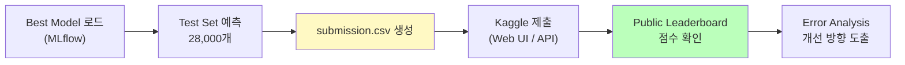
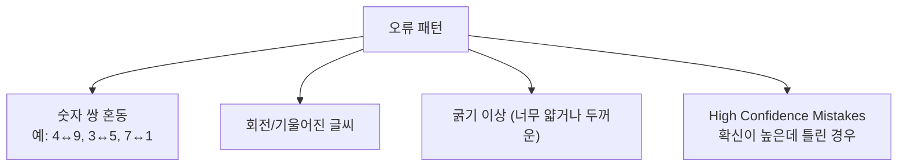

# Kaggle 제출 & 결과 분석

ID: 3-4
일차: 3
순서: 4
상태: Active

**목표**: 최적 모델로 Kaggle 제출하고 Error Analysis로 개선 방향을 도출한다

## **1. Kaggle 제출 프로세스**



## **2. Best Model 로드**

Day 3–3에서 MLflow에 저장한 Best Custom Hybrid 모델을 불러옵니다.

```python
# Custom Layer 재정의 필요 (MLflow 로드 시)
class SelfAttention(Layer):
    ...  # Day 3-3과 동일

# MLflow에서 모델 로드
experiment = mlflow.get_experiment_by_name('day3-mnist-digit-recognizer')
runs = mlflow.search_runs(
    experiment_ids=[experiment.experiment_id],
    filter_string="params.model = 'Custom_Hybrid_Best'",
    order_by=["metrics.final_val_accuracy DESC"]
)
best_run_id = runs.iloc[0]['run_id']
best_model = mlflow.keras.load_model(f"runs:/{best_run_id}/model")
```

> *⚠️ Custom Layer(`SelfAttention`)가 포함된 모델은 로드 전에 클래스 정의가 필요합니다.*
> 

## **3. Test Set 예측 & submission.csv 생성**

### **3.1 예측**

```python
test_predictions = best_model.predict(X_test, batch_size=256)
test_labels = np.argmax(test_predictions, axis=1)
```

### **3.2 submission.csv 생성 및 검증**

```python
submission = pd.DataFrame({
    'ImageId': range(1, len(test_labels) + 1),
    'Label': test_labels
})

# 검증 체크리스트
assert len(submission) == 28000              # 크기 확인
assert submission['Label'].between(0,9).all() # Label 범위 확인
assert submission.isnull().sum().sum() == 0    # 결측값 없음

submission.to_csv('submission.csv', index=False)
```

**제출 형식:**

```
ImageId,Label
1,2
2,0
3,9
...
28000,8
```

## **4. Kaggle 제출**

두 가지 방법 중 선택합니다.

### **4.1 Option 1: Web UI (간단)**


1. `https://www.kaggle.com/c/digit-recognizer` 접속
2. “Submit Prediction” 클릭
3. `submission.csv` 업로드
4. 설명 입력 후 “Make Submission”
5. Public Leaderboard 점수 확인

### **4.2 Option 2: Kaggle API (Colab에서 직접 제출)**

### **Kaggle API 토큰 발급**

 Kaggle Settings → API 섹션 (Generate New Token 버튼)](Kaggle%20%EC%A0%9C%EC%B6%9C%20&%20%EA%B2%B0%EA%B3%BC%20%EB%B6%84%EC%84%9D/CleanShot_2026-02-19_at_20.02.56.png)

[https://www.kaggle.com/settings](https://www.kaggle.com/settings) Kaggle Settings → API 섹션 (Generate New Token 버튼)


API Token 발급 완료 화면


### **Colab 보안 비밀 설정**


```python
import os
from google.colab import userdata

# Colab '보안 비밀' 탭에서 미리 설정 필요
os.environ['KAGGLE_USERNAME'] = userdata.get('KAGGLE_USERNAME')
os.environ['KAGGLE_API_TOKEN'] = userdata.get('KAGGLE_API_TOKEN')

from kaggle.api.kaggle_api_extended import KaggleApi
api = KaggleApi()
api.authenticate()

api.competition_submit(
    file_name='submission.csv',
    message='Best Custom Hybrid + Optuna Tuning',
    competition='digit-recognizer'
)
```

### **4.3 제출 결과 확인**


```css
Public Score: 0.98864  (상위 ~10% 수준)
Val Accuracy: 0.9881   (로컬 검증)

Val vs Public 차이: -0.002
→ 정상 범위. Overfitting 없음.
```

## **5. Error Analysis**

좋은 성능을 넘어서 **왜 틀렸는지** 를 분석하는 것이 실력을 키우는 핵심입니다.

### **5.1 틀린 이미지 시각화**

```python
val_pred = np.argmax(best_model.predict(X_val), axis=1)
wrong_indices = np.where(val_pred != y_val)[0]

# 틀린 이미지 시각화
fig, axes = plt.subplots(4, 4, figsize=(12, 12))
for i, idx in enumerate(wrong_indices[:16]):
    axes[i//4, i%4].imshow(X_val[idx, :, :, 0], cmap='gray')
    axes[i//4, i%4].set_title(
        f'True: {y_val[idx]}  Pred: {val_pred[idx]}', color='red'
    )
```


### **5.2 클래스별 오류율**

```python
for digit in range(10):
    total  = np.sum(y_val == digit)
    errors = np.sum((y_val == digit) & (val_pred != y_val))
    error_rate = errors / total * 100
    print(f"  {digit}: {error_rate:.1f}% ({errors}/{total})")
```


### **5.3 Confusion Matrix**

```python
cm = confusion_matrix(y_val, val_pred)

sns.heatmap(cm, annot=True, fmt='d', cmap='Blues',
            xticklabels=range(10), yticklabels=range(10))
plt.xlabel('Predicted')
plt.ylabel('True')
```


Confusion Matrix에서 자주 혼동되는 쌍을 찾습니다.



### **5.4 High Confidence Mistakes**

```python
confidences = np.max(val_predictions, axis=1)
# 확신도 > 90%인데 틀린 경우
high_conf_wrong = np.where((val_pred != y_val) & (confidences > 0.9))[0]
print(f"High Confidence Mistakes: {len(high_conf_wrong)}")
```


High Confidence Mistakes는 특히 위험합니다. 이런 케이스들은 Data Augmentation이나 Ensemble로 줄일 수 있습니다.

## **6. 개선 방향 도출**

Error Analysis 결과를 바탕으로 체계적인 개선 계획을 세웁니다.

| **개선 방법** | **대상 문제** | **예상 효과** | **난이도** |
| --- | --- | --- | --- |
| **Data Augmentation** | 회전/이동 변형 취약 | +0.20.5% | 낮음 |
| **Ensemble** | 개별 모델 오류 보정 | +0.30.7% | 중간 |
| **TTA** | 추론 시 안정성 | +0.10.3% | 낮음 |
| **더 많은 Epoch** | 수렴 부족 | +0.10.2% | 낮음 |

이 방법들은 모두 Day 3–5에서 실습합니다.

## **7. Day 3–4 최종 요약**

```
Day 3-1 Simple CNN:          98.0%  Baseline
Day 3-2 ResNet-style:        99.1%  Best Architecture
Day 3-3 Custom (Tuned):      98.8%  HPO 적용
Day 3-4 Kaggle Public Score: 98.9%  실전 제출
```

```
======================================================================
  Day 3 전체 요약
======================================================================
                  Model Val Acc               Note
Day 3-1      Simple CNN   98.0%           Baseline
Day 3-2    ResNet-style   99.1%  Best Architecture
Day 3-3  Custom (Tuned)   98.5%        HPO Success
Day 3-4      Best Model   98.8%      Kaggle Submit
======================================================================

✅ Kaggle Submission 완료!
   Val Accuracy: 0.9881
   Expected Test: ~98.3-98.7%
   Target Rank: Top 30%

   Public Leaderboard에서 점수를 확인하세요!
```

## **✅ 체크리스트**

- [ ]  MLflow에서 Best Model 로드 완료
- [ ]  Test set 28,000개 예측 완료
- [ ]  submission.csv 생성 및 검증 (크기, Label 범위, 결측값)
- [ ]  Kaggle 제출 완료 (Web UI 또는 API)
- [ ]  Public Score 확인 및 기록
- [ ]  틀린 이미지 시각화 분석
- [ ]  클래스별 오류율 분석
- [ ]  Confusion Matrix 생성 및 혼동 쌍 파악
- [ ]  High Confidence Mistakes 확인
- [ ]  개선 방향 3가지 이상 도출