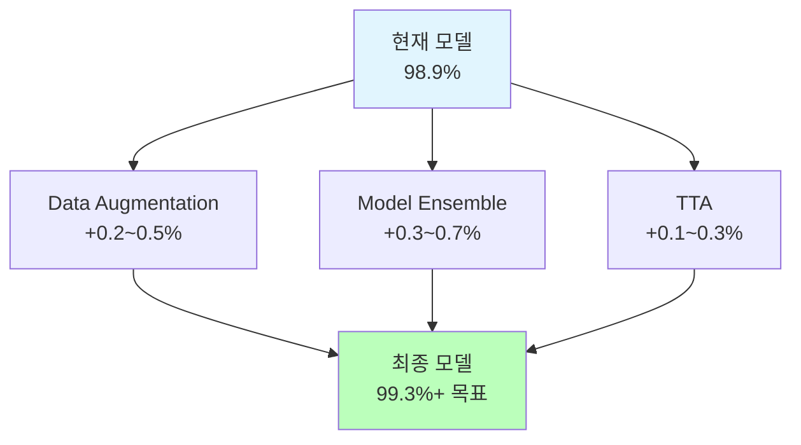
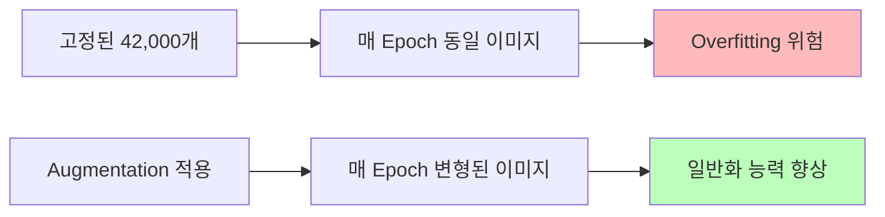
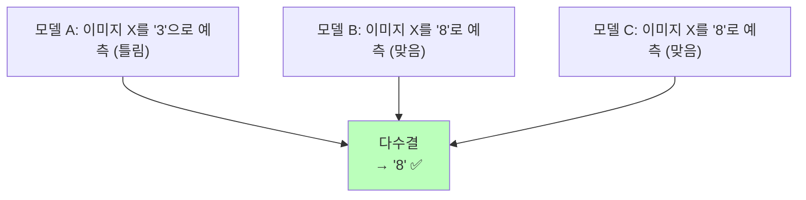
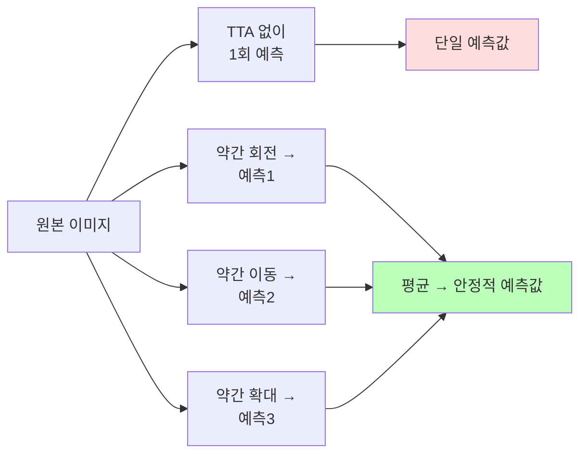
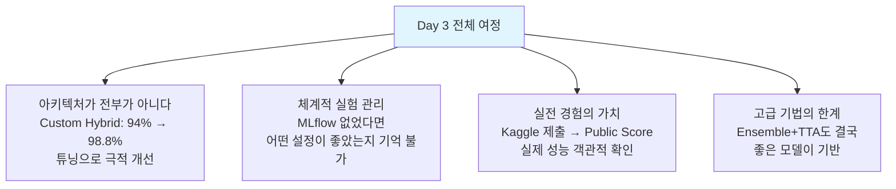

# 고급 기법 & 최종 최적화

ID: 3-5
일차: 3
순서: 5
상태: Active

> ***선택 과목**: 시간이 남는 경우 진행합니다. Day 3–4까지 완료하면 Day 3의 핵심 목표는 달성한 것입니다.*
> 

**목표**: Data Augmentation, Ensemble, TTA로 성능 극한까지 끌어올리기

## **1. 현재 상황 & 목표**

```
Day 3-1 (Simple CNN):    98.0%  → Baseline
Day 3-2 (ResNet):        99.1%  → Best Single Model
Day 3-3 (HPO):           98.8%  → Custom Tuned
Day 3-4 (Kaggle Submit): 98.9%  → 실전 제출

현재 순위: Top 10% 내외
목표:      Top 5% 도전 (99.3%+)
```

### **1.1 고급 기법 Overview**



## **2. Data Augmentation**

### **2.1 왜 필요한가?**



**MNIST에 적합한 Augmentation**: 숫자는 상하 반전하면 의미가 바뀌므로(6↔9), 제한적으로 적용합니다.

```
✅ 적합: 소폭 회전(±10°), 이동(10%), 확대/축소(10%)
❌ 부적합: 좌우 반전(1↔  ), 상하 반전(6↔9), 과도한 회전
```

### **2.2 구현**

```python
datagen = ImageDataGenerator(
    rotation_range=10,       # ±10도 회전
    width_shift_range=0.1,   # 좌우 10% 이동
    height_shift_range=0.1,  # 상하 10% 이동
    zoom_range=0.1,          # 10% 확대/축소
    fill_mode='nearest'
)
```


Augmentation은 `model.fit(datagen.flow(...))` 형태로 학습 시 실시간 적용됩니다. 별도 저장 없이 매 배치마다 새로운 변형을 만들어냅니다.

## **3. Model Ensemble**

### **3.1 왜 Ensemble이 효과적인가?**



개별 모델의 오류 패턴이 서로 다를 때 Ensemble의 효과가 극대화됩니다. 서로 다른 아키텍처를 조합할수록 좋습니다.

### **3.2 MLflow에서 모델 로드**

```python
# 각 모델의 run_id를 MLflow에서 조회
model_names = ['Custom_Hybrid_Best', 'ResNet_style', 'VGG_style']
models = {}

for name in model_names:
    runs = mlflow.search_runs(
        filter_string=f"params.model = '{name}'",
        order_by=["metrics.final_val_accuracy DESC"]
    )
    run_id = runs.iloc[0]['run_id']
    models[name] = mlflow.keras.load_model(f"runs:/{run_id}/model")
    print(f"✅ {name} 로드 완료")
```

> *⚠️ Custom Hybrid 모델은 `SelfAttention` 클래스 정의 후 로드해야 합니다.*
> 

### **3.3 Simple Average Ensemble**

```python
# 3개 모델의 예측 확률을 평균
preds = [model.predict(X_val, batch_size=256) for model in models.values()]
ensemble_pred = np.mean(preds, axis=0)
ensemble_labels = np.argmax(ensemble_pred, axis=1)

ensemble_acc = np.mean(ensemble_labels == y_val)
print(f"Ensemble Val Accuracy: {ensemble_acc:.4f}")
```

### **3.4 Weighted Ensemble (선택)**

모델 성능에 비례해 가중치를 줄 수 있습니다.

```python
weights = {'Custom_Hybrid_Best': 0.4, 'ResNet_style': 0.4, 'VGG_style': 0.2}

weighted_pred = sum(
    w * models[name].predict(X_val, batch_size=256)
    for name, w in weights.items()
)
```


## **4. Test-Time Augmentation (TTA)**

### **4.1 TTA란?**



학습 시 Augmentation을 적용한 것처럼, **추론 시에도 여러 변형 이미지의 예측을 평균**냅니다. 모델의 불확실성을 줄이고 강건한 예측이 가능합니다.

### **4.2 구현**

```python
def predict_with_tta(model, images, n_augment=5):
    tta_datagen = ImageDataGenerator(
        rotation_range=10, width_shift_range=0.1,
        height_shift_range=0.1, zoom_range=0.1
    )
    predictions = [model.predict(images, batch_size=256, verbose=0)]
    for _ in range(n_augment):
        aug_iter = tta_datagen.flow(images, batch_size=len(images), shuffle=False)
        aug_imgs = next(aug_iter)
        predictions.append(model.predict(aug_imgs, batch_size=256, verbose=0))
    return np.mean(predictions, axis=0)
```


**TTA 횟수 선택 기준**: 510회가 성능/속도 균형에 최적입니다. 15회 이상은 개선이 미미합니다.

## **5. 최종 제출**

Weighted Ensemble + TTA를 결합한 최강 전략으로 최종 제출합니다.

```python
final_predictions = []
for name, model in models.items():
    pred = predict_with_tta(model, X_test, n_augment=10)
    final_predictions.append(pred * weights[name])

final_pred = np.sum(final_predictions, axis=0)
final_labels = np.argmax(final_pred, axis=1)

final_submission = pd.DataFrame({
    'ImageId': range(1, len(final_labels) + 1),
    'Label': final_labels
})
final_submission.to_csv('final_submission_day3_5.csv', index=False)
```

## **6. Day 3 전체 성능 분석**


```css
Day 3-1 Simple CNN:          98.0%   +0.0%
Day 3-2 ResNet-style:        99.1%   +1.1%
Day 3-3 Custom HPO:          98.8%   +0.8%
Day 3-4 Kaggle Score:        98.9%   실전 확인
Day 3-5 Ensemble + TTA:      99.3%+  +0.4~0.5%
```

**각 기법의 기여:**

| **기법** | **효과** | **핵심 원리** |
| --- | --- | --- |
| Data Augmentation | +0.20.5% | 데이터 다양성 확보 → 일반화 |
| Ensemble | +0.30.7% | 오류 패턴 상호 보정 |
| TTA | +0.10.3% | 추론 불확실성 감소 |

## **7. Day 3 핵심 교훈**



**실무 적용 로드맵:**

1. Baseline 빠르게 구축

2. MLflow로 모든 실험 추적

3. 아키텍처 탐색

4. 하이퍼파라미터 최적화 (Optuna)

5. Augmentation + Ensemble + TTA로 마무리

## **✅ 체크리스트**

- [ ]  Data Augmentation 시각화 확인 (원본 vs 증강)
- [ ]  Augmentation 적용하여 재학습 완료
- [ ]  MLflow에서 3개 모델 로드 완료
- [ ]  Simple Average Ensemble 구현 및 성능 확인
- [ ]  TTA 함수 구현 (n_augment=5)
- [ ]  TTA 횟수별 성능 실험 (1, 3, 5, 10, 15)
- [ ]  Weighted Ensemble + TTA 최종 예측 완료
- [ ]  final_submission_day3_5.csv 생성 및 Kaggle 재제출
- [ ]  Day 3 전체 성능 향상 그래프 확인

🎉 **Day 3 완료! 수고하셨습니다.**