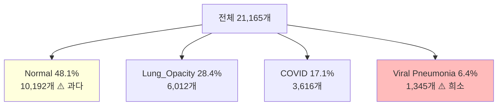
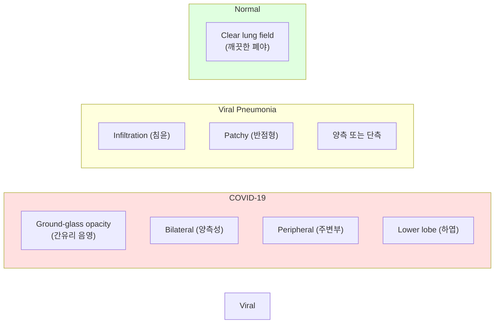
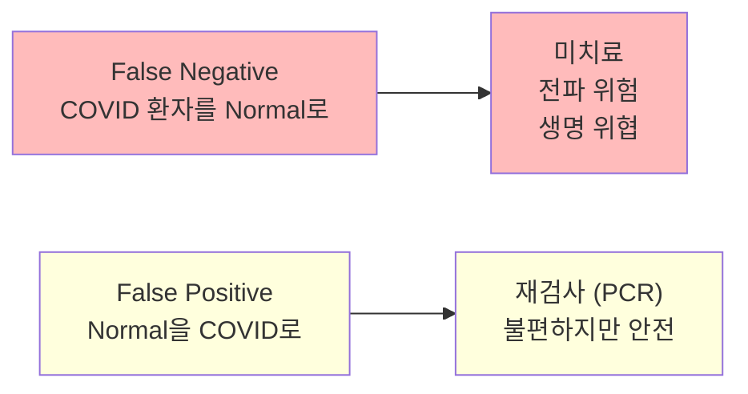
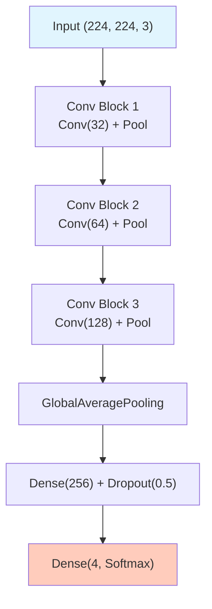

# COVID–19 흉부 X-ray EDA

ID: 4-1
일차: 4
순서: 1
상태: Active

**목표**: COVID–19 Radiography Database를 이해하고 의료 이미지 분류 베이스라인 구축

> ***데이터셋 변경 안내**: 원래 ChestX-ray8(42GB)을 사용하려 했으나 용량 문제로 COVID–19 Radiography Database(~1GB)로 대체합니다.*
> 

## **1. COVID–19 Radiography Database**

### **1.1 데이터셋 소개**

- **출처**: Kaggle (카타르, 방글라데시, 파키스탄 병원 컨소시엄)
- **규모**: 21,165개 흉부 X-ray PNG 이미지 (224×224 또는 299×299)
- **라이센스**: CC BY 4.0

**4가지 클래스:**

| **클래스** | **개수** | **비율** | **설명** |
| --- | --- | --- | --- |
| **Normal** | 10,192 | 48.1% | 정상 폐 |
| **Lung_Opacity** | 6,012 | 28.4% | 폐 혼탁 (비특이적) |
| **COVID–19** | 3,616 | 17.1% | SARS-CoV–2 감염 |
| **Viral Pneumonia** | 1,345 | 6.4% | 바이러스성 폐렴 (비COVID) |

### **1.2 데이터 구조**

```
COVID-19_Radiography_Dataset/
├── COVID/images/       (3,616개)
├── Lung_Opacity/images/ (6,012개)
├── Normal/images/      (10,192개)
└── Viral Pneumonia/images/ (1,345개)
```

## **2. Class Imbalance 문제**




**비율 = Normal : Viral = 7.6 : 1**

**Naive 모델의 함정:**

```
모든 이미지를 "Normal"로 예측 → Accuracy = 48.1%
하지만 COVID 환자를 단 한 명도 탐지하지 못함!
```

이것이 Accuracy만으로 의료 AI를 평가할 수 없는 이유입니다. Day 4–3에서 Class Weights와 Focal Loss로 해결합니다.

## **3. 의료 이미지 특성**

### **3.1 X-ray 소견 비교**



### **3.2 Grayscale → RGB 변환**

원본 X-ray는 Grayscale(1채널)이지만, ImageNet Pretrained 모델은 RGB(3채널)를 기대합니다.

```python
# tf.data 파이프라인에서 변환
img = tf.image.decode_png(img, channels=1)   # Grayscale 읽기
img = tf.image.grayscale_to_rgb(img)          # (H, W, 1) → (H, W, 3)
img = preprocess_input(img)                   # ImageNet 정규화
```

단순히 같은 채널을 3번 복사하는 것이지만, Pretrained 모델이 기대하는 입력 형식에 맞추는 데 반드시 필요합니다.

### **3.3 메모리 효율적 데이터 로딩**

전체 이미지를 메모리에 한 번에 올리면 ~13GB가 필요합니다. `tf.data.Dataset`으로 배치 단위 스트리밍을 사용합니다.

```python
# 경로만 수집 (이미지는 학습 시 배치 단위로 로드)
train_dataset = tf.data.Dataset.from_tensor_slices((train_paths, train_labels))
train_dataset = train_dataset.map(load_and_preprocess, num_parallel_calls=AUTOTUNE)
train_dataset = train_dataset.shuffle(1000).batch(32).prefetch(AUTOTUNE)
```

`prefetch`는 GPU가 학습하는 동안 CPU가 다음 배치를 미리 준비해 병목을 줄입니다.

## **4. 평가 지표**

### **4.1 왜 Recall이 중요한가?**



```mathematica
Recall (민감도) = TP / (TP + FN)  ← 실제 COVID 중 탐지한 비율
Precision      = TP / (TP + FP)  ← 예측한 것 중 실제 COVID 비율

의료 AI 목표: Recall 최대화 (False Negative 최소화)
```

### **4.2 Balanced Accuracy**

클래스 불균형 상황에서 Overall Accuracy를 보완합니다.

```
BalancedAccuracy = 클래스별 Recall의 산술 평균
                  = (Recall_COVID + Recall_Opacity + Recall_Normal + Recall_Viral) / 4
```

모든 클래스가 균등하게 잘 분류됐는지 확인하는 핵심 지표입니다.

## **5. Baseline CNN**

### **5.1 아키텍처**



### **5.2 학습 & MLflow**

```python
with mlflow.start_run(run_name='Baseline_CNN'):
    mlflow.log_params({'model': 'Baseline_CNN', 'epochs': 20, 'batch_size': 32})

    history = baseline_model.fit(
        train_dataset, epochs=20,
        validation_data=val_dataset,
        callbacks=[EarlyStopping(patience=5, restore_best_weights=True)]
    )

    mlflow.keras.log_model(baseline_model, 'model')
```

## **6. 결과 분석**


```
============================================================
  Classification Report
============================================================
                 precision    recall  f1-score   support

          COVID     0.8491    0.9571    0.8999       723
   Lung_Opacity     0.8320    0.8562    0.8439      1203
         Normal     0.9361    0.7974    0.8612      2038
Viral Pneumonia     0.6059    1.0000    0.7546       269

       accuracy                         0.8542      4233
      macro avg     0.8057    0.9027    0.8399      4233
   weighted avg     0.8706    0.8542    0.8561      4233

============================================================

클래스별 성능:
------------------------------------------------------------
COVID               : Precision=0.8491, Recall=0.9571, F1=0.8999
Lung_Opacity        : Precision=0.8320, Recall=0.8562, F1=0.8439
Normal              : Precision=0.9361, Recall=0.7974, F1=0.8612
Viral Pneumonia     : Precision=0.6059, Recall=1.0000, F1=0.7546
------------------------------------------------------------

⚠️ COVID-19 Recall: 0.9571 (95.71%)
   → 692/723 COVID 환자 탐지
```

**예상 결과:**

```
Overall Accuracy: 85.42%

COVID          : Recall=95.71% ✅  (잘 탐지)
Lung_Opacity   : Recall=85.60% ✅
Normal         : Recall=79.70% ⚠️  (정상을 병으로 오인)
Viral Pneumonia: Precision=60.59% ⚠️  (데이터 부족)
```

Viral Pneumonia의 낮은 Precision(60.6%)은 데이터 부족(1,345개)으로 인한 과탐지 문제입니다. Day 4–3에서 해결합니다.

## **7. 의료 AI 윤리**

AI는 **진단 보조 도구(CAD: Computer-Aided Diagnosis)**입니다. 최종 판단은 반드시 의사가 합니다.

```
AI 예측 → 방사선과 의사 확인 → 최종 진단 → 치료 결정
```

**설명 가능성(Explainability)의 중요성**: 높은 정확도만으로는 의사가 신뢰하기 어렵습니다. Day 4–4의 Grad-CAM으로 “모델이 어디를 보고 판단했는지”를 시각화해야 임상 현장에서 수용 가능한 시스템이 됩니다.

## **✅ 체크리스트**

- [ ]  COVID–19 Radiography Database 다운로드 (Kaggle API)
- [ ]  클래스별 이미지 수 확인 및 분포 시각화
- [ ]  클래스별 샘플 이미지 4×5 시각화
- [ ]  픽셀 값 분포 클래스별 비교
- [ ]  tf.data.Dataset 파이프라인 구축 (train/val split, stratify)
- [ ]  Baseline CNN 구현 및 MLflow 기록
- [ ]  학습 곡선 확인 (overfitting 여부)
- [ ]  Confusion Matrix + Per-class Recall 확인
- [ ]  Val Accuracy ~85%, COVID Recall ~95% 확인