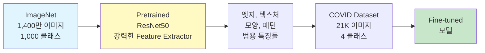
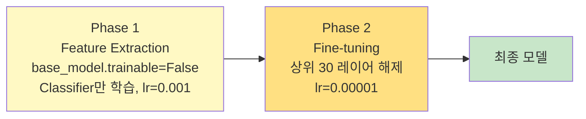
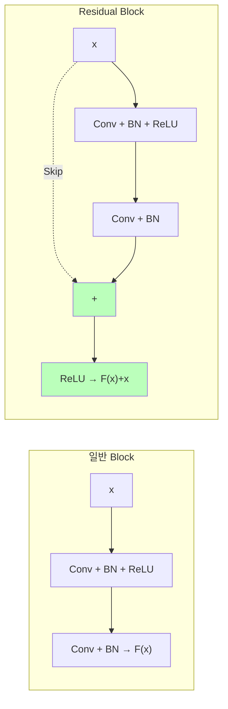
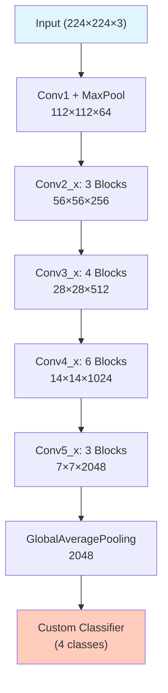

# Transfer Learning with ResNet50

ID: 4-2
일차: 4
순서: 2
상태: Active

**목표**: ImageNet Pretrained ResNet50으로 COVID–19 분류 성능 90%+ 달성

## **1. Day 4–1 결과 & 개선 방향**

```mathematica
Baseline CNN 결과:
  Overall Accuracy:    85.42%
  COVID Recall:        95.71% ✅
  Viral Precision:     60.59% ⚠️ (데이터 부족)
  Normal Recall:       79.70% ⚠️ (다른 클래스와 혼동)

문제 원인:
  → 21K 이미지로 처음부터 학습 → 표현력 부족
  → Viral Pneumonia 1,345개 → 특징 학습 불충분
```

## **2. Transfer Learning**

### **2.1 핵심 아이디어**



**왜 효과적인가?** ImageNet에서 학습한 Low-level 특징(엣지, 텍스처)은 X-ray에도 그대로 적용됩니다. 21K 이미지로 처음부터 학습하는 것보다 훨씬 강력한 Feature Extractor를 즉시 확보할 수 있습니다.

### **2.2 Feature Extraction vs Fine-tuning**

| **방법** | **Pretrained 가중치** | **학습 속도** | **언제 사용?** |
| --- | --- | --- | --- |
| **Feature Extraction** | 완전 동결 | 빠름 | 데이터 적음, 빠른 실험 |
| **Fine-tuning** | 상위 레이어만 업데이트 | 느림 | 데이터 충분, 최고 성능 |

두 단계를 순서대로 적용합니다 (Phase 1 → Phase 2).



## **3. ResNet50 아키텍처**

### **3.1 Skip Connection (핵심)**



50개 레이어를 쌓아도 Skip Connection 덕분에 Gradient가 사라지지 않습니다. `F(x) = 0`이면 입력을 그대로 통과시키므로, 깊게 쌓을수록 손해가 없는 구조입니다.

### **3.2 ResNet50 전체 구조**



`include_top=False`로 마지막 Classifier(ImageNet 1000 클래스용)를 제거하고, COVID 4-class용 Classifier를 새로 붙입니다.

## **4. Phase 1: Feature Extraction**

```python
# Pretrained ResNet50 (Classifier 제거)
base_model = ResNet50(weights='imagenet', include_top=False, input_shape=(224, 224, 3))
base_model.trainable = False   # 완전 동결 — 149개 레이어 모두 고정

# Custom Classifier
inputs = keras.Input(shape=(224, 224, 3))
x = base_model(inputs, training=False)
x = layers.GlobalAveragePooling2D()(x)
x = layers.Dense(512, activation='relu')(x)
x = layers.BatchNormalization()(x)
x = layers.Dropout(0.5)(x)
x = layers.Dense(256, activation='relu')(x)
x = layers.Dropout(0.3)(x)
outputs = layers.Dense(4, activation='softmax')(x)
model = keras.Model(inputs, outputs)
```

`training=False`는 추론 모드 강제 적용입니다. BatchNorm이 학습 통계 대신 ImageNet 통계를 사용하도록 합니다.

## **5. Data Augmentation**

### **5.1 의료 이미지 주의사항**

```python
def load_and_preprocess(path, label, augment=False):
    img = tf.io.read_file(path)
    img = tf.image.decode_png(img, channels=1)
    img = tf.image.resize(img, (224, 224))
    img = tf.image.grayscale_to_rgb(img)

    if augment:
        img = tf.image.random_flip_left_right(img)    # ✅ 좌우 반전 (가능)
        img = tf.image.rot90(img, k=tf.random.uniform(shape=[], maxval=1, dtype=tf.int32))
        # ❌ 상하 반전, 극단적 회전 금지 — 해부학적 구조 왜곡

    img = preprocess_input(img)   # ImageNet 정규화 (Zero-center by mean)
    return img, label
```

| **변환** | **허용** | **이유** |
| --- | --- | --- |
| 좌우 반전 | ✅ | 촬영 방향 차이 |
| 소폭 회전 (±15°) | ✅ | 환자 자세 |
| 이동/확대 | ✅ | 촬영 거리 |
| 상하 반전 | ❌ | 비현실적 (폐가 위에 있음) |
| 극단적 회전 | ❌ | 병변 패턴 왜곡 |

### **5.2 ImageNet 정규화 (`preprocess_input`)**

```
img = img - [103.939, 116.779, 123.68]   # RGB 채널별 ImageNet 평균 빼기
# (Grayscale이지만 3채널로 복사했으므로 동일하게 적용)
```

ResNet50은 이 정규화를 가정하고 학습됐으므로 반드시 적용해야 합니다.

## **6. Phase 2: Fine-tuning**

```python
# 상위 30개 레이어만 학습 가능하게 해제
base_model.trainable = True
for layer in base_model.layers[:-30]:
    layer.trainable = False   # 하위 119개 레이어는 계속 동결

# 매우 낮은 LR — Pretrained 가중치를 조금씩만 수정
model.compile(optimizer=Adam(1e-5), loss='sparse_categorical_crossentropy', metrics=['accuracy'])
```

Fine-tuning에서 LR을 작게 쓰는 이유: 큰 LR로 업데이트하면 ImageNet에서 학습한 좋은 초기값을 망가뜨립니다.

### **6.1 Learning Rate Scheduling**

```python
reduce_lr = ReduceLROnPlateau(
    monitor='val_loss',
    factor=0.5,     # 개선 없으면 LR × 0.5
    patience=3,     # 3 epoch 동안 개선 없으면 발동
    min_lr=1e-7
)
```

## **7. 결과**


```
============================================================
  Classification Report — ResNet50
============================================================
                 precision    recall  f1-score   support

          COVID     0.9554    0.8893    0.9212       723
   Lung_Opacity     0.8612    0.8820    0.8715      1203
         Normal     0.9117    0.9225    0.9171      2038
Viral Pneumonia     0.9549    0.9442    0.9495       269

       accuracy                         0.9067      4233
      macro avg     0.9208    0.9095    0.9148      4233
   weighted avg     0.9076    0.9067    0.9069      4233

============================================================

클래스별 성능:
------------------------------------------------------------
COVID               : Precision=0.9554, Recall=0.8893, F1=0.9212
Lung_Opacity        : Precision=0.8612, Recall=0.8820, F1=0.8715
Normal              : Precision=0.9117, Recall=0.9225, F1=0.9171
Viral Pneumonia     : Precision=0.9549, Recall=0.9442, F1=0.9495
------------------------------------------------------------

⚠️ COVID-19 Recall: 0.8893 (88.93%)
   → 643/723 COVID 환자 탐지
```


**실제 결과:**

```css
Overall Accuracy:    90.67%  (+5.25%p vs Baseline)
COVID Recall:        88.93%  ⚠️ 하락! (95.71% → 88.93%)
Viral Precision:     향상됨
```

**COVID Recall 하락의 원인**: Normal이 48%로 압도적으로 많아 모델이 Normal에 bias됩니다. 정확도는 올랐지만 의료 AI에서 가장 중요한 COVID Recall이 오히려 떨어졌습니다. → **Day 4–3의 동기 부여**

## **✅ 체크리스트**

- [ ]  Transfer Learning 개념 (Feature Extraction vs Fine-tuning) 이해
- [ ]  ResNet50 Skip Connection 원리 이해
- [ ]  Phase 1: base_model.trainable=False → Classifier 학습
- [ ]  Data Augmentation 적용 (의료 이미지 제약 준수)
- [ ]  Phase 2: 상위 30개 레이어 해제 → lr=1e–5 Fine-tuning
- [ ]  ReduceLROnPlateau Callback 적용
- [ ]  두 Phase 학습 곡선 비교
- [ ]  Val Accuracy 90%+ 달성
- [ ]  MLflow에 Phase 1, Phase 2 각각 기록
- [ ]  COVID Recall 하락 원인 파악 → Day 4–3 준비