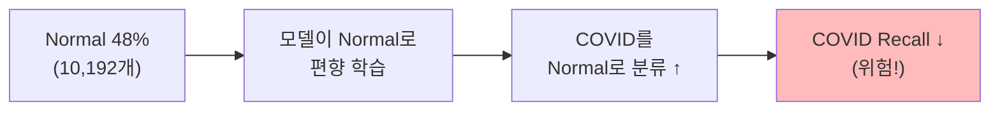
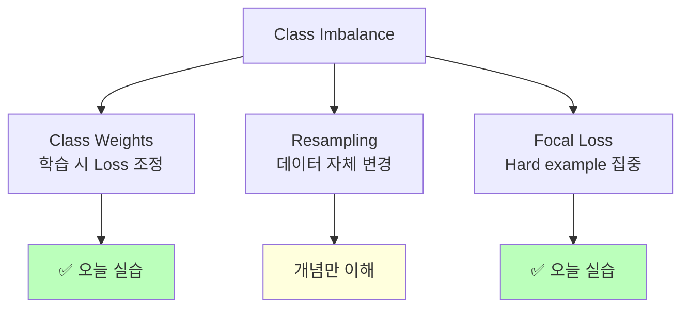
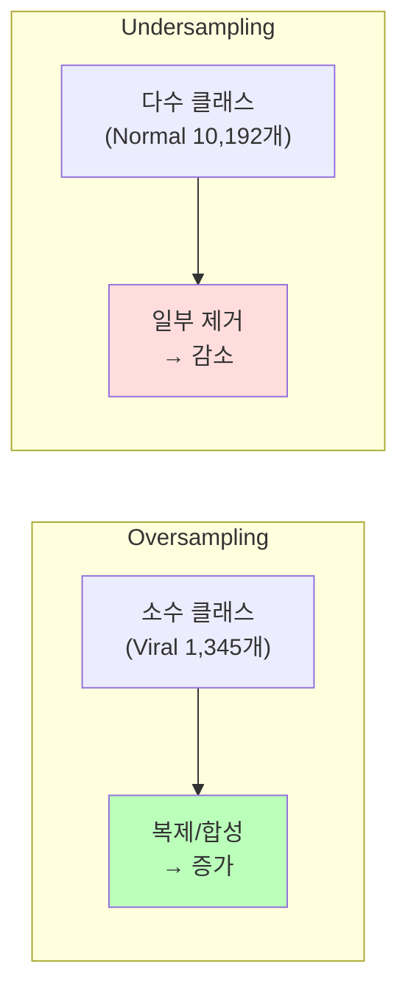
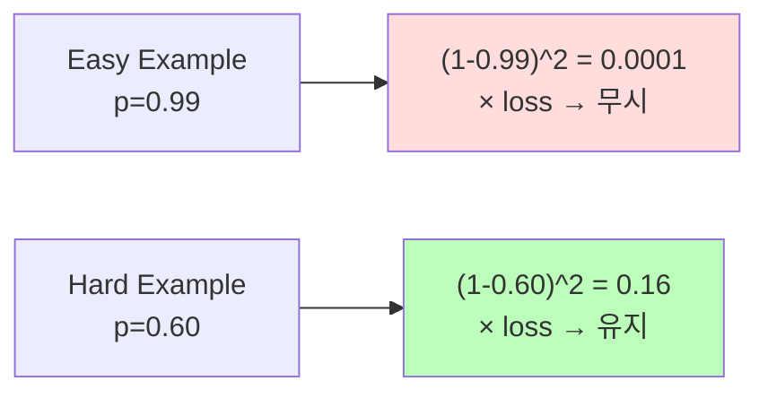
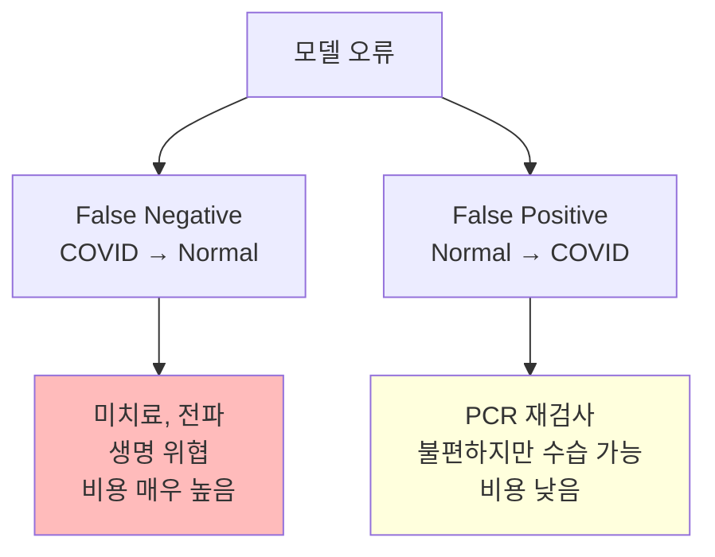

# Class Imbalance 처리

ID: 4-3
일차: 4
순서: 3
상태: Active

**목표**: Class Imbalance를 해결해 COVID Recall 95%+ 복원 + 균형 잡힌 성능 달성

## **1. 현재 상황 & 문제**

```css
Day 4-2 ResNet50 결과:
  Overall Accuracy:  90.67%  ✅ (향상)
  COVID Recall:      88.93%  ❌ (95.71% → 88.93% 하락)
  Balanced Accuracy: 90.35%

COVID 환자 80명 중 7명을 놓침.
정확도는 올랐지만 의료 AI에서 가장 위험한 실패.
```

**원인**: Normal(48%)에 bias된 모델. Loss를 최소화하는 가장 쉬운 방법이 “Normal로 예측”이기 때문입니다.



## **2. 해결 전략 Overview**



## **3. Class Weights**

### **3.1 원리**

희소 클래스를 틀렸을 때 Loss를 더 크게 반영합니다.

```
Loss (일반)      = cross_entropy(pred, true)
Loss (가중치 적용) = weight[true_class] × cross_entropy(pred, true)
```

Viral Pneumonia를 틀리면 Baseline보다 3배 강한 패널티를 줍니다. 모델이 희소 클래스를 “포기”하지 않게 강제합니다.

### **3.2 가중치 계산**

```python
from sklearn.utils.class_weight import compute_class_weight

class_weights_array = compute_class_weight(
    class_weight='balanced',    # n_samples / (n_classes × n_samples_per_class)
    classes=np.unique(train_labels),
    y=train_labels
)
class_weights = {i: w for i, w in enumerate(class_weights_array)}
# 예: {0: 1.17, 1: 0.88, 2: 0.52, 3: 3.14}
#      COVID    Opacity  Normal   Viral
```

**수식**: `weight_c = N_total / (N_classes × N_c)`

Normal(가장 많음)은 0.52로 낮고, Viral(가장 적음)은 3.14로 높습니다. Viral을 1번 틀리면 Normal을 6배 틀린 것과 같은 Loss가 됩니다.

### **3.3 적용**

```python
history = model.fit(
    train_dataset,
    validation_data=val_dataset,
    class_weight=class_weights,   # ← 이 한 줄
    epochs=15,
    callbacks=[early_stop, reduce_lr]
)
```

모델 구조나 데이터를 바꾸지 않고 `class_weight` 파라미터 하나로 적용됩니다.

## **4. Resampling (개념 이해)**

Class Weights가 Loss를 조정한다면, Resampling은 데이터 자체를 균형 잡습니다.



| **방법** | **장점** | **단점** | **의료 이미지 적합성** |
| --- | --- | --- | --- |
| Random Oversampling | 간단 | Overfitting (동일 샘플 반복) | ⚠️ |
| SMOTE | 합성 샘플 생성 | 이미지 특징 공간에 부적합 | ❌ |
| Undersampling | 학습 빠름 | Normal 정보 손실 | ⚠️ |

**결론**: 의료 이미지에서는 Class Weights + Augmentation 조합이 가장 실용적입니다.

## **5. Focal Loss**

### **5.1 Cross Entropy의 문제**

```
Easy example: pred=0.99 (정상을 정상으로, 확신) → loss=0.01  (작음)
Hard example: pred=0.60 (COVID인데 불확실)    → loss=0.51  (큼)

하지만 Easy examples가 수천 배 많아 Loss 전체를 지배
→ 모델이 Hard example(희소 클래스)을 충분히 학습 못함
```

### **5.2 Focal Loss 수식**

```cpp
FL(p_t) = -α × (1 - p_t)^γ × log(p_t)

p_t:           정답 클래스 예측 확률
γ (gamma=2):   Focusing parameter
α (alpha=0.25): Class balance factor

Modulating Factor (1 - p_t)^γ:
  Easy (p_t=0.99): (0.01)^2 = 0.0001  → Loss 거의 0으로 감소
  Hard (p_t=0.60): (0.40)^2 = 0.16    → Loss 유지
```

Easy example의 영향을 억제해 Hard example에 집중하게 만듭니다.



### **5.3 구현**

```python
def focal_loss(gamma=2., alpha=0.25):
    def focal_loss_fixed(y_true, y_pred):
        y_true_oh = tf.one_hot(tf.cast(y_true, tf.int32), depth=y_pred.shape[-1])
        epsilon = tf.keras.backend.epsilon()
        y_pred = tf.clip_by_value(y_pred, epsilon, 1. - epsilon)

        ce = -y_true_oh * tf.math.log(y_pred)             # Cross Entropy
        p_t = tf.reduce_sum(y_true_oh * y_pred, axis=-1)  # 정답 클래스 확률
        focal_term = tf.pow(1. - p_t, gamma)               # Modulating Factor

        loss = alpha * focal_term * tf.reduce_sum(ce, axis=-1)
        return tf.reduce_mean(loss)
    return focal_loss_fixed

model_focal.compile(optimizer='adam', loss=focal_loss(gamma=2.0, alpha=0.25), ...)
```

## **6. 실험 설계 & 평가**

### **6.1 3가지 전략 비교**

| **전략** | **변경사항** | **기대 효과** |
| --- | --- | --- |
| **Baseline** (Day 4–2) | 없음 | COVID Recall 88.93% |
| **Class Weights** | loss 가중치 | COVID Recall 95%+ |
| **Focal Loss** | loss 함수 교체 | Hard example 집중 |

### **6.2 핵심 평가 지표**

```python
from sklearn.metrics import balanced_accuracy_score, recall_score

balanced_acc = balanced_accuracy_score(y_true, y_pred)
recall_per_class = recall_score(y_true, y_pred, average=None)
# recall_per_class[0] = COVID Recall ← 가장 중요
```

**목표:**

```
Overall Accuracy:   90%+ (유지)
Balanced Accuracy:  92%+
COVID Recall:       95%+ (복원!)
모든 클래스 Recall: 85%+
```

## **7. 의료 AI 관점: 비용 비대칭**



FN과 FP의 비용이 다르므로, 단순히 Loss를 최소화하는 것이 최선이 아닙니다. Class Weights는 이 비대칭 비용을 학습에 반영하는 직접적인 방법입니다.

## **8. 결과**


```
============================================================
  Classification Report — Class Weights
============================================================
                 precision    recall  f1-score   support

          COVID     0.9272    0.9696    0.9479       723
   Lung_Opacity     0.8855    0.8811    0.8833      1203
         Normal     0.9280    0.9176    0.9228      2038
Viral Pneumonia     0.9585    0.9442    0.9513       269

       accuracy                         0.9178      4233
      macro avg     0.9248    0.9281    0.9263      4233
   weighted avg     0.9178    0.9178    0.9177      4233

============================================================

클래스별 성능:
------------------------------------------------------------
COVID               : Precision=0.9272, Recall=0.9696, F1=0.9479
Lung_Opacity        : Precision=0.8855, Recall=0.8811, F1=0.8833
Normal              : Precision=0.9280, Recall=0.9176, F1=0.9228
Viral Pneumonia     : Precision=0.9585, Recall=0.9442, F1=0.9513
------------------------------------------------------------

⚠️ COVID-19 Recall: 0.9696 (96.96%)
   → 701/723 COVID 환자 탐지

🎉 목표 달성! COVID Recall 95%+ 성공!
```

**실제 결과 (Class Weights 적용):**

```nix
Overall Accuracy:    91.78%  (+1.11%p)
Balanced Accuracy:   92.81%
COVID Recall:        96.96%  ✅ (88.93% → 96.96%)
Macro F1:            0.9263

COVID  : P=0.9272, R=0.9696, F1=0.9479
Opacity: P=0.8855, R=0.8811, F1=0.8833
Normal : P=0.9280, R=0.9176, F1=0.9228
Viral  : P=0.9585, R=0.9442, F1=0.9513
```

단 한 줄(`class_weight=class_weights`)로 COVID Recall을 8%p 회복했습니다.

## **✅ 체크리스트**

- [ ]  Class Imbalance 원인 분석 (Normal 48% bias)
- [ ]  `compute_class_weight`로 가중치 계산
- [ ]  Class Weights 적용 학습 완료
- [ ]  Focal Loss 구현 및 학습 완료
- [ ]  Balanced Accuracy 계산 및 비교
- [ ]  COVID Recall 95%+ 달성 확인
- [ ]  3가지 전략 성능 비교 시각화
- [ ]  Best 모델 선정 (COVID Recall 기준)
- [ ]  MLflow에 모든 실험 기록