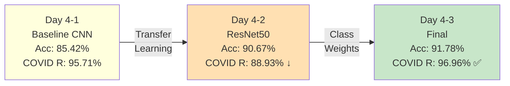
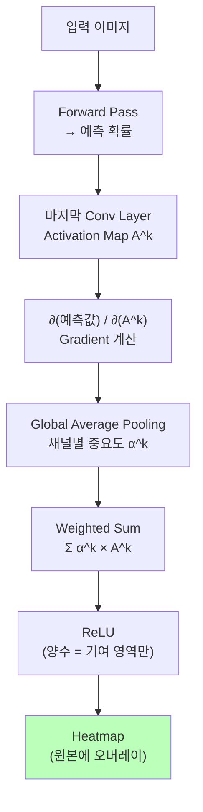
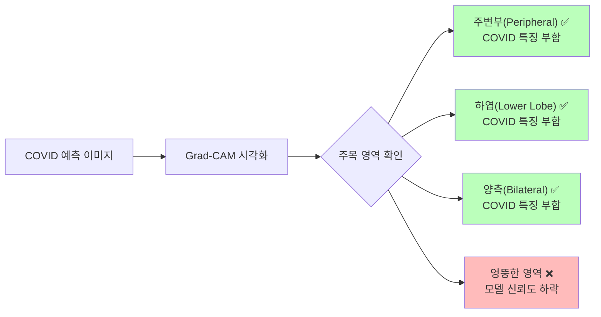
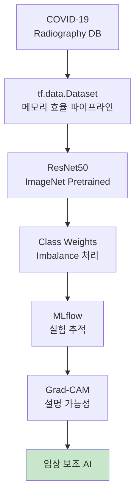

# Grad-CAM & 최종 평가

ID: 4-4
일차: 4
순서: 4
상태: Active

**목표**: Grad-CAM으로 모델 해석 가능성 확보 + Day 4 종합 평가

## **1. Day 4 전체 여정 요약**



| **단계** | **Accuracy** | **COVID Recall** | **핵심 기법** |
| --- | --- | --- | --- |
| Baseline CNN | 85.42% | 95.71% | Simple CNN |
| ResNet50 | 90.67% | 88.93% ↓ | Transfer Learning |
| + Class Weights | **91.78%** | **96.96% ✅** | Imbalance 처리 |

Accuracy와 Recall이 동시에 개선된 최종 모델로 Grad-CAM을 수행합니다.

## **2. Grad-CAM (Gradient-weighted Class Activation Mapping)**

### **2.1 왜 필요한가?**

```
모델 출력: "COVID (97% 확률)"

의사의 질문:
  "어디를 보고 판단했나요?"
  "해부학적으로 맞는 위치를 봤나요?"

→ 설명 없이는 신뢰 불가
→ Explainability가 임상 수용의 전제 조건
```

**Grad-CAM이 하는 일**: 입력 이미지의 어떤 공간 영역이 예측 클래스에 가장 크게 기여했는지를 Heatmap으로 시각화합니다.

### **2.2 알고리즘 흐름**



**핵심 수식:**

```
α^c_k = (1/Z) Σ_i Σ_j  ∂y^c / ∂A^k_ij   (채널 k의 중요도)
L^c   = ReLU( Σ_k  α^c_k × A^k )         (Grad-CAM 맵)
```

ReLU를 씌우는 이유: 예측 클래스에 긍정적으로 기여하는 영역만 강조합니다. 음수(억제) 영역은 제거합니다.

## **3. Grad-CAM 구현**

### **3.1 Heatmap 생성**

```python
def make_gradcam_heatmap(model, img_array, pred_index=None):
    # ResNet50 base model 찾기
    base_model = next(l for l in model.layers if 'resnet' in l.name.lower())

    # Grad 모델: [입력] → [마지막 Conv 출력, 최종 예측]
    grad_model = tf.keras.Model(
        inputs=base_model.input,
        outputs=[base_model.get_layer('conv5_block3_out').output,
                 model.output]
    )

    with tf.GradientTape() as tape:
        conv_outputs, predictions = grad_model(img_array)
        if pred_index is None:
            pred_index = tf.argmax(predictions[0])
        loss = predictions[:, pred_index]

    # ∂loss / ∂conv_outputs
    grads = tape.gradient(loss, conv_outputs)

    # 채널별 중요도 (Global Average Pooling)
    pooled_grads = tf.reduce_mean(grads, axis=(0, 1, 2))

    # Weighted Sum + ReLU + Normalize
    heatmap = conv_outputs[0] @ pooled_grads[..., tf.newaxis]
    heatmap = tf.squeeze(heatmap)
    heatmap = tf.maximum(heatmap, 0) / tf.math.reduce_max(heatmap)

    return heatmap.numpy()
```

### **3.2 원본 이미지에 오버레이**

```python
import cv2

def overlay_heatmap(img, heatmap, alpha=0.4):
    # Heatmap을 원본 크기로 리사이즈
    heatmap = cv2.resize(heatmap, (img.shape[1], img.shape[0]))
    heatmap = np.uint8(255 * heatmap)
    heatmap = cv2.applyColorMap(heatmap, cv2.COLORMAP_JET)  # 파랑→빨강 색상

    if len(img.shape) == 2:   # Grayscale → RGB
        img = cv2.cvtColor(img, cv2.COLOR_GRAY2RGB)

    img = np.uint8(255 * img)
    return cv2.addWeighted(img, 1 - alpha, heatmap, alpha, 0)
```

JET colormap: 파랑(낮은 기여) → 초록 → 빨강(높은 기여). 빨간 영역이 모델이 주목한 곳입니다.

## **4. 클래스별 Grad-CAM 시각화**


### **4.1 COVID 소견과 Grad-CAM 대조**



Grad-CAM 결과가 X-ray 의학 지식(간유리 음영, 주변부, 하엽)과 일치할 때만 의사가 신뢰할 수 있습니다.

## **5. 잘못된 예측 분석 (FP/FN)**

```
잘못된 예측: 226개 (5.34%)
COVID False Negative: 8개
```


```python
# COVID False Negative: 실제 COVID인데 다른 클래스로 예측
covid_fn = np.where((y_true == 0) & (y_pred != 0))[0]
print(f"COVID False Negative: {len(covid_fn)}개")
# 96.96% Recall → FN = 약 22개 (723 × 0.03)

# FN 케이스 Grad-CAM 분석
for idx in covid_fn[:4]:
    img_path = val_paths[idx]
    img = cv2.imread(img_path, cv2.IMREAD_GRAYSCALE) / 255.0
    # ...heatmap 생성 및 시각화
```

**FN 분석의 목적**: 모델이 어떤 패턴을 보고 틀렸는지를 파악해 데이터 수집 방향이나 추가 학습 전략을 결정합니다.

## **6. ROC-AUC & Precision-Recall Curve**

### **6.1 ROC-AUC**

```python
from sklearn.preprocessing import label_binarize
from sklearn.metrics import roc_curve, auc

y_true_binary = label_binarize(y_true, classes=[0, 1, 2, 3])  # One-vs-Rest

for i, class_name in enumerate(class_names):
    fpr, tpr, _ = roc_curve(y_true_binary[:, i], y_pred_proba[:, i])
    roc_auc = auc(fpr, tpr)
    plt.plot(fpr, tpr, label=f'{class_name} (AUC={roc_auc:.3f})')
```


AUC가 1.0에 가까울수록 완벽. 0.5는 랜덤 분류기와 같습니다. COVID AUC > 0.99가 목표입니다.

### **6.2 Precision-Recall Curve**

```python
from sklearn.metrics import precision_recall_curve, average_precision_score

for i, class_name in enumerate(class_names):
    precision, recall, _ = precision_recall_curve(y_true_binary[:, i], y_pred_proba[:, i])
    ap = average_precision_score(y_true_binary[:, i], y_pred_proba[:, i])
    plt.plot(recall, precision, label=f'{class_name} (AP={ap:.3f})')
```


PR Curve는 Imbalanced 데이터에서 ROC보다 더 정보량이 많습니다. 특히 Viral Pneumonia(6%)처럼 희소 클래스의 실질적 성능을 더 잘 보여줍니다.

## **7. Day 4 최종 종합 평가**


**최종 성능 (Class Weights 모델):**

```nix
Overall Accuracy:      91.78%
Balanced Accuracy:     92.81%
Macro F1:              0.9263
COVID-19 Recall:       96.96% ✅

Per-class:
  COVID  : P=0.9272, R=0.9696, F1=0.9479
  Opacity: P=0.8855, R=0.8811, F1=0.8833
  Normal : P=0.9280, R=0.9176, F1=0.9228
  Viral  : P=0.9585, R=0.9442, F1=0.9513
```

### **7.1 임상 적용 가능성**

**강점:**

```mathematica
✅ COVID Recall 96.96%: False Negative 최소화 (100명 중 3명 미만 놓침)
✅ 모든 클래스 F1 > 0.88: 특정 클래스 편향 없음
✅ Grad-CAM: 의사가 판단 근거 확인 가능
```

**한계 및 다음 단계:**

```
⚠️ 단일 병원/데이터 출처 → 다양한 병원 검증 필요
⚠️ External Validation 미수행 → 실제 임상 환경 테스트 필요
⚠️ 복합 질환 미지원 → Multi-label로 확장 가능
```

**권장 활용 방식**: 1차 스크리닝 보조 도구

```
대량 X-ray 입력 → AI 이상 소견 우선순위 지정 → 방사선과 의사 확인 → 최종 진단
```

### **7.2 기술 스택 요약**



## **✅ 체크리스트**

- [ ]  MLflow에서 Best 모델 로드 (Day 4–3 Class Weights)
- [ ]  Grad-CAM `make_gradcam_heatmap` 구현
- [ ]  `overlay_heatmap` 구현
- [ ]  클래스별 Grad-CAM 4×4 시각화
- [ ]  COVID Heatmap이 주변부/하엽에 집중하는지 확인
- [ ]  COVID False Negative 케이스 Grad-CAM 분석
- [ ]  ROC-AUC 4개 클래스별 계산 및 시각화
- [ ]  Precision-Recall Curve 4개 클래스별
- [ ]  Day 4 전체 여정 그래프 (Acc + COVID Recall)
- [ ]  최종 성능 종합 (Balanced Accuracy, Macro F1)
- [ ]  임상 적용 가능성 및 한계 정리

## **🎉 Day 4 완료!**

```
Day 4-1: EDA & Baseline     → 데이터 이해, 85.42%
Day 4-2: Transfer Learning  → ResNet50 활용, 90.67%
Day 4-3: Class Imbalance    → COVID Recall 96.96% ✅
Day 4-4: Grad-CAM & 평가    → 설명 가능성, 임상 준비 완료
```