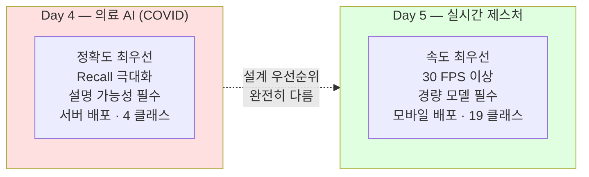
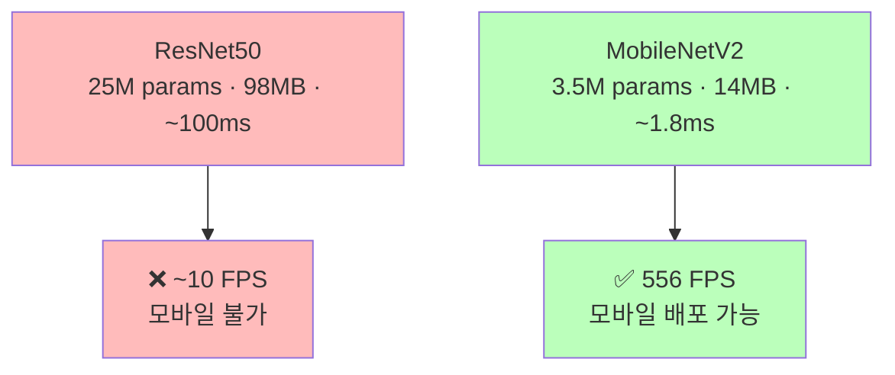
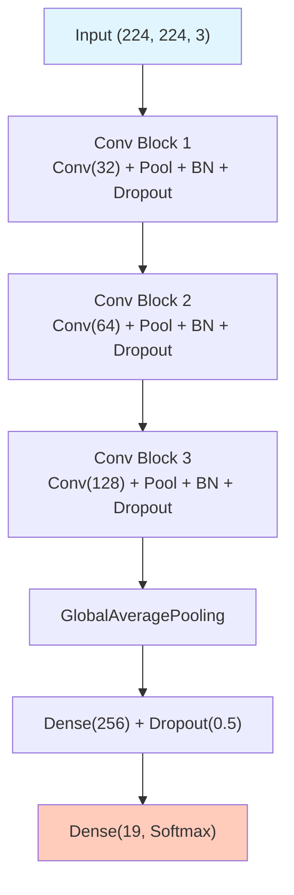

# HaGRID 손 제스처 데이터 EDA

ID: 5-1
일차: 5
순서: 1
상태: Active

# **HaGRID 손 제스처 데이터 EDA**

**목표**: HaGRID 데이터셋을 탐색하고 경량 모델의 필요성을 이해한다

## **1. HaGRID 데이터셋**

- **출처**: Sber AI (Russia), 2022년 공개 / **라이센스**: CC BY 4.0
- **Kaggle**: `innominate817/hagrid-classification-512p-no-gesture-150k` (~3.8GB)
- **규모**: 153,735개 JPEG · 512×512 · **19 클래스** (18개 제스처 + no_gesture)

**19가지 클래스:**

| **카테고리** | **제스처** |
| --- | --- |
| **의사소통** | like 👍, dislike 👎, ok 👌, stop ✋, mute |
| **숫자** | one ☝️, four, three, three2, two_up, two_up_inverted |
| **기능** | call 📞, fist ✊, palm, rock 🤘, peace ✌️, peace_inverted, stop_inverted |
| **기타** | no_gesture |

**데이터 구조:**

```
hagrid-classification-512p-no-gesture-150k/
├── call/           (~8,530개)
├── dislike/        (~8,505개)
│   ...             (총 19개 폴더)
└── deleted_img_ids.txt
```

Train/Val split이 없으므로 직접 분리합니다.

```python
# 80% Train / 20% Val (stratify 적용)
train_paths, val_paths, train_labels, val_labels = train_test_split(
    all_paths, all_labels, test_size=0.2, stratify=all_labels, random_state=42
)
```

## **2. Day 4와의 근본적 차이**



| **항목** | **COVID (Day 4)** | **HaGRID (Day 5)** |
| --- | --- | --- |
| **모델** | ResNet50 (25M params) | MobileNetV2 (3.5M params) |
| **속도** | 무관 | < 33ms (30 FPS) |
| **클래스** | 4개 | 19개 |
| **Imbalance** | 심각 (48% vs 6%) | **없음** (~8,500개/클래스) |
| **배포** | 서버 | 모바일/엣지 |

---

## **3. 경량 모델의 필요성**



30 FPS(33ms/frame)를 위해 모델 추론은 10ms 이내여야 합니다. ResNet50으로는 불가능하고, MobileNetV2가 정확도와 속도를 모두 잡는 선택입니다.

## **4. 데이터 탐색**


_2.jpeg)

클래스당 ~8,500개로 **균형 잡힌 데이터**입니다. Day 4와 달리 Class Weights나 Focal Loss가 필요하지 않습니다.

## **5. tf.data 파이프라인**

153K 이미지를 한 번에 올리면 ~60GB. 배치 스트리밍을 사용합니다.

```python
def load_and_preprocess(path, label, target_size=(224, 224)):
    img = tf.io.read_file(path)
    img = tf.image.decode_jpeg(img, channels=3)   # JPEG, RGB 3채널
    img = tf.image.resize(img, target_size)        # 512×512 → 224×224
    img = img / 255.0                              # 0~1 정규화
    return img, label

train_dataset = (
    tf.data.Dataset.from_tensor_slices((train_paths, train_labels))
    .map(load_and_preprocess, num_parallel_calls=AUTOTUNE)
    .shuffle(1000).batch(32).prefetch(AUTOTUNE)
)
```

> *📌 Day 4(PNG, Grayscale)와 달리 JPEG + RGB입니다. `decode_jpeg` + `channels=3`을 사용합니다.*
> 

## **6. Baseline CNN**



파라미터 ~2M · 크기 ~8MB. Day 5–2 MobileNetV2와 비교 기준이 됩니다.

```python
with mlflow.start_run(run_name='Baseline_CNN_HaGRID'):
    mlflow.log_params({'model': 'Baseline_CNN', 'num_classes': 19,
                       'epochs': 15, 'batch_size': 32})
    history = baseline_model.fit(train_dataset, epochs=15,
                                  validation_data=val_dataset,
                                  callbacks=[EarlyStopping(patience=5),
                                             ReduceLROnPlateau(patience=3)])
    mlflow.keras.log_model(baseline_model, 'model')
```

## **7. 결과 & 모델 성능 측정**


```groovy
Val Accuracy:  73.52%
Model Size:    ~8 MB
Latency:       ~15 ms/image
```

peace vs peace_inverted, stop vs stop_inverted처럼 **유사 제스처 쌍에서 혼동**이 많습니다. Day 5–2에서 MobileNetV2로 97%+ 달성이 목표입니다.

## **✅ 체크리스트**

- [ ]  HaGRID 데이터 다운로드 (Kaggle API, ~3.8GB)
- [ ]  19개 클래스 폴더 구조 확인
- [ ]  클래스 분포 시각화 (균형 확인 ~8,500개/클래스)
- [ ]  제스처별 샘플 이미지 시각화 (5×4 그리드)
- [ ]  Train/Val Split 80/20 (stratify 적용)
- [ ]  tf.data.Dataset 파이프라인 구축
- [ ]  Baseline CNN 구현 및 MLflow 기록
- [ ]  Val Accuracy ~73%, 크기 ~8MB, Latency ~15ms 확인