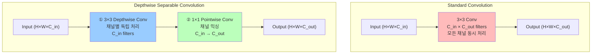
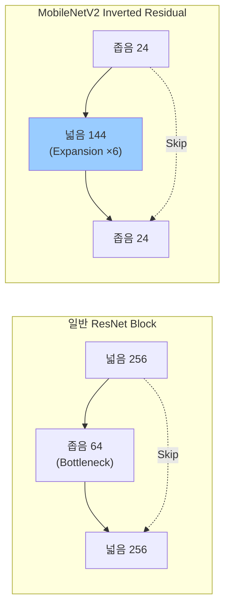
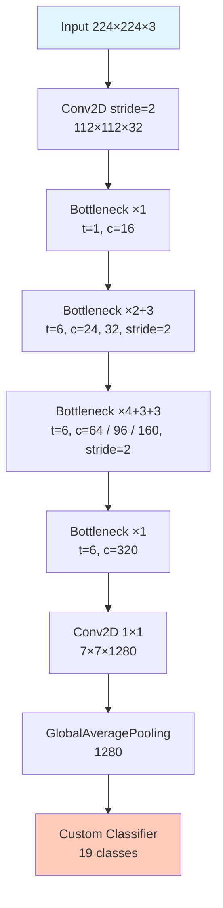
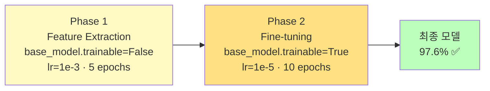

# MobileNetV2 Transfer Learning

ID: 5-2
일차: 5
순서: 2
상태: Active

**목표**: MobileNetV2 Transfer Learning으로 경량 제스처 인식 모델 97%+ 달성

## **1. Depthwise Separable Convolution**

MobileNetV2의 핵심: 연산을 두 단계로 분리해 계산량을 ~7배 줄입니다.



**연산량 비교** (224×224, 3→32채널, 3×3 kernel):

|  | **Standard Conv** | **Depthwise Separable** |
| --- | --- | --- |
| **연산량** | 43,614,208 | 6,171,648 |
| **파라미터** | 864 | 123 |
| **비율** | 1× | **약 1/7** |

## **2. MobileNetV2 아키텍처**

### **2.1 Inverted Residual Block**



- **ResNet**: Wide → Narrow → Wide (중간이 좁은 Bottleneck)
- **MobileNetV2**: Narrow → Wide → Narrow (Expansion Factor=6으로 중간을 넓혀 표현력 확보)
- 마지막 1×1 Conv에 **ReLU 없음** (Linear Bottleneck) — 저차원에서 정보 손실 방지

### **2.2 전체 구조**



총 파라미터 **3.5M** · 크기 **~14MB** (FP32) · 추론 **~1.8ms**

## **3. Data Augmentation**

```python
data_augmentation = keras.Sequential([
    layers.RandomFlip('horizontal'),        # 좌우 반전 ✅ (손 방향 다양화)
    layers.RandomRotation(0.1),             # ±10도 회전 ✅
    layers.RandomZoom(0.1),                 # ±10% 확대/축소 ✅
    layers.RandomTranslation(0.1, 0.1),     # ±10% 이동 ✅
])
```


**구현 포인트**: `shuffle → batch → augment` 순서입니다. 배치를 먼저 만든 뒤 augment_batch를 map합니다.

## **4. MobileNetV2용 전처리**

Baseline CNN(01 정규화)과 달리 MobileNetV2는 **ImageNet 기준 전처리**가 필요합니다.

```python
from tensorflow.keras.applications.mobilenet_v2 import preprocess_input

def load_and_preprocess_mobilenet(path, label):
    img = tf.io.read_file(path)
    img = tf.image.decode_jpeg(img, channels=3)
    img = tf.image.resize(img, (224, 224))
    img = preprocess_input(img)   # [0,255] → [-1, 1]
    return img, label
```

`preprocess_input`은 `[0,255] → [-1, 1]`로 변환합니다. Pretrained 가중치가 이 범위를 가정하고 학습됐으므로 반드시 적용해야 합니다.

## **5. 모델 구축**

```python
base_model = MobileNetV2(weights='imagenet', include_top=False,
                          input_shape=(224, 224, 3))
base_model.trainable = False   # Phase 1: 완전 동결

inputs = keras.Input(shape=(224, 224, 3))
x = base_model(inputs, training=False)   # training=False → BN이 ImageNet 통계 사용
x = layers.GlobalAveragePooling2D()(x)
x = layers.Dense(128, activation='relu')(x)
x = layers.Dropout(0.3)(x)
outputs = layers.Dense(len(gesture_names), activation='softmax')(x)  # 19 classes
model = Model(inputs, outputs)
```

## **6. 2단계 Transfer Learning**



**Phase 1 — Feature Extraction:**

```python
model.compile(optimizer=Adam(learning_rate=1e-3), ...)
with mlflow.start_run(run_name='MobileNetV2_Phase1_FeatureExtraction'):
    mlflow.log_params({'phase': 'feature_extraction', 'base_trainable': False,
                       'learning_rate': 1e-3, 'epochs': 5})
    history_phase1 = model.fit(train_dataset, epochs=5, ...)
```

**Phase 2 — Fine-tuning:**

```python
base_model.trainable = True   # 전체 해제
model.compile(optimizer=Adam(learning_rate=1e-5), ...)  # LR 100배 감소!
with mlflow.start_run(run_name='MobileNetV2_Phase2_FineTuning'):
    mlflow.log_params({'phase': 'fine_tuning', 'base_trainable': True,
                       'learning_rate': 1e-5, 'epochs': 10})
    history_phase2 = model.fit(train_dataset, epochs=10, ...)
```

lr=1e–5(100배 감소)를 쓰는 이유: 큰 LR로 업데이트하면 ImageNet에서 학습한 특징을 망가뜨립니다.

## **7. 학습 결과 & 비교**


```
================================================================================
  Baseline CNN vs MobileNetV2
================================================================================
       Model Parameters  Size (MB)  Val Accuracy (%) Test Accuracy (%)  Latency (ms)        FPS
Baseline CNN         2M   8.000000         73.520000                 -     15.000000  67.000000
 MobileNetV2       3.5M  27.990143         97.580224         97.519622      1.798715 555.952422
================================================================================

개선:
  Accuracy: +24.06%p
  Model Size: +19.99MB
  Latency: +-13.20ms
```

```
                Baseline CNN    MobileNetV2
Val Accuracy:   73.52%          97.58%  (+24.06%p)
Model Size:     ~8 MB           ~28 MB
Latency:        ~15 ms          ~1.8 ms  (-88%)
FPS:            ~67             ~556
```

정확도는 크게 향상되고 추론 속도도 8배 이상 빨라졌습니다. 크기는 커졌지만 Day 5–3 Quantization으로 7MB까지 줄입니다.

## **✅ 체크리스트**

- [ ]  Depthwise Separable Conv 원리 이해 (~1/7 연산량)
- [ ]  Inverted Residual Block 개념 이해 (Narrow→Wide→Narrow)
- [ ]  Data Augmentation 4가지 적용 및 시각화
- [ ]  MobileNetV2용 `preprocess_input` 적용 ([–1,1] 범위)
- [ ]  Phase 1: Feature Extraction (lr=1e–3, 5 epochs, base frozen)
- [ ]  Phase 2: Fine-tuning (lr=1e–5, 10 epochs, base unfrozen)
- [ ]  Phase 1+2 결합 학습 곡선 시각화
- [ ]  Val Accuracy 97%+ 달성
- [ ]  Latency ~1.8ms, FPS ~556 확인
- [ ]  MLflow에 Phase 1, Phase 2 각각 기록