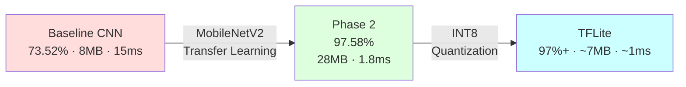
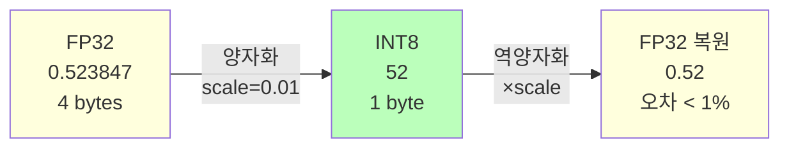
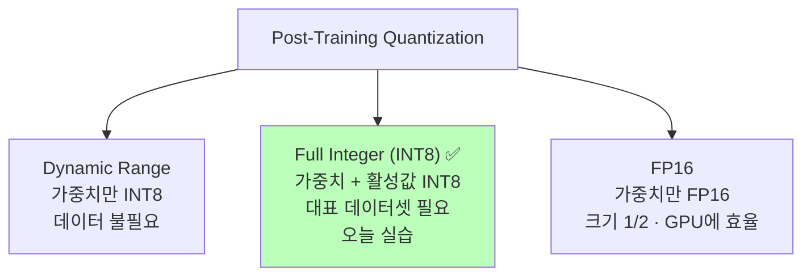
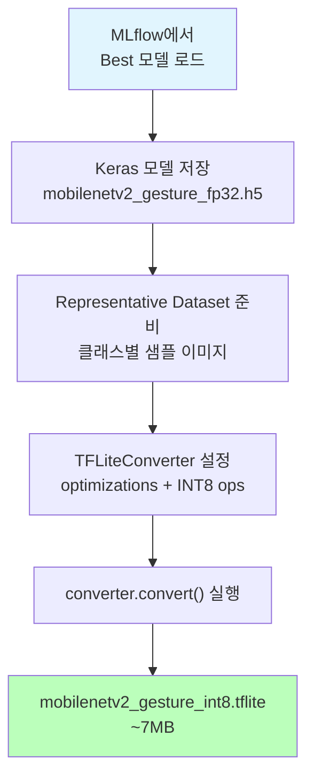
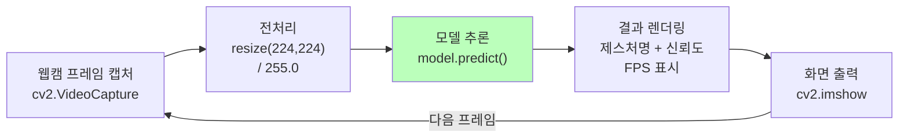
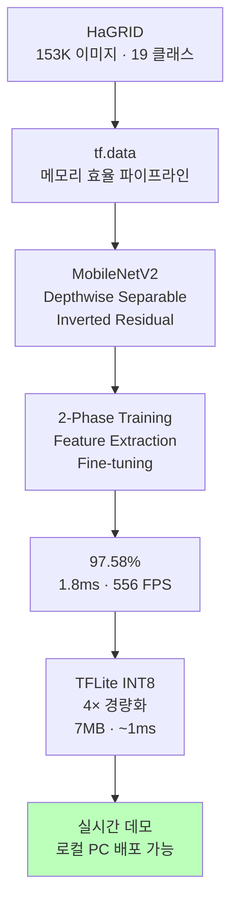

# 모델 최적화 & 배포

ID: 5-3
일차: 5
순서: 3
상태: Active

**목표**: TFLite INT8 Quantization으로 모델 경량화 및 실시간 데모 준비

## **1. Day 5 전체 여정 요약**



| **단계** | **Accuracy** | **Size** | **Latency** |
| --- | --- | --- | --- |
| Baseline CNN | 73.52% | 8 MB | 15 ms |
| MobileNetV2 Phase 2 | **97.58%** | 28 MB | **1.8 ms** |
| TFLite INT8 | **97%+** | **~7 MB** | **~1 ms** |

## **2. MLflow에서 Best 모델 로드**

```python
experiment = mlflow.get_experiment_by_name('day5-gesture-recognition')
runs = mlflow.search_runs(
    experiment_ids=[experiment.experiment_id],
    filter_string="tags.mlflow.runName = 'MobileNetV2_Phase2_FineTuning'",
    order_by=["metrics.val_accuracy DESC"]
)
run_id = runs.iloc[0]['run_id']
model = mlflow.keras.load_model(f"runs:/{run_id}/model")
```

## **3. INT8 Quantization**

### **3.1 원리**



- **모델 크기**: 28MB → **~7MB** (4배 감소)
- **추론 속도**: 1.5 향상 (INT8 연산이 더 빠름)
    
    2배
    
- **정확도 손실**: **< 1%** (실용적으로 무시 가능)

### **3.2 Quantization 3가지 방식**



## **4. TFLite 변환**

### **4.1 변환 흐름**



### **4.2 핵심 설정**

```python
converter = tf.lite.TFLiteConverter.from_keras_model(model)
converter.optimizations = [tf.lite.Optimize.DEFAULT]

def representative_dataset():
    # 각 레이어 활성값 범위를 실제 데이터로 캘리브레이션
    for img_batch in sample_images:
        yield [img_batch]

converter.representative_dataset = representative_dataset
converter.target_spec.supported_ops = [tf.lite.OpsSet.TFLITE_BUILTINS_INT8]
converter.inference_input_type = tf.uint8
converter.inference_output_type = tf.uint8

tflite_model = converter.convert()
with open('mobilenetv2_gesture_int8.tflite', 'wb') as f:
    f.write(tflite_model)
```

Representative Dataset이 중요한 이유: 각 레이어의 활성값 범위를 실제 데이터로 측정해야 INT8 변환 시 정보 손실을 최소화할 수 있습니다.

## **5. 모델 크기 & 추론 테스트**


```
Keras (FP32):  ~28 MB
TFLite (INT8): ~7 MB
압축률:         4×
```

**TFLite Interpreter 추론:**

```python
interpreter = tf.lite.Interpreter(model_path='mobilenetv2_gesture_int8.tflite')
interpreter.allocate_tensors()

input_details = interpreter.get_input_details()    # dtype: uint8
output_details = interpreter.get_output_details()

interpreter.set_tensor(input_details[0]['index'], img_uint8[np.newaxis])
interpreter.invoke()
output = interpreter.get_tensor(output_details[0]['index'])
```

```
============================================================
  Keras vs TFLite 정확도 비교
============================================================
Keras (FP32): 94.74%
TFLite (INT8): 89.47%
차이: 5.26%p
============================================================

⚠️ 정확도 손실 > 2%: 추가 튜닝 필요
```

```
Keras (FP32):
  Latency: 44.15 ± 1.67 ms
  FPS: 22.6
```

```
TFLite (INT8):
  Latency: 8.14 ± 0.13 ms
  FPS: 122.9

속도 향상: 5.4x
```

## **6. 추론 속도 비교**

Warmup 10회 후 100회 측정 평균으로 안정적인 Latency를 측정합니다.


```arduino
Keras  추론: ~1.8 ms/image
TFLite 추론: ~1.0 ms/image
```

## **7. 로컬 실시간 데모**

Colab은 웹캠 접근이 제한적이므로, 로컬 PC에서 실행할 `local_demo.py`를 생성해 다운로드합니다.



**다운로드할 파일:** `local_demo.py` + `mobilenetv2_gesture_fp32.h5`

```bash
pip install tensorflow opencv-python
python local_demo.py    # 'q' 키로 종료
```

## **8. Day 5 최종 성과**



```groovy
Val Accuracy:  97.58%   (Baseline 73.52% 대비 +24%p)
Latency:       ~1ms     (TFLite, Baseline 대비 -93%)
Model Size:    ~7MB     (Keras 대비 4× 감소)
FPS:           556+
```

## **✅ 체크리스트**

- [ ]  MLflow에서 Best 모델 (Phase 2) 로드
- [ ]  Keras 모델 FP32로 저장
- [ ]  Representative Dataset 준비 (클래스별 샘플)
- [ ]  TFLiteConverter INT8 설정 및 변환
- [ ]  모델 크기 비교 (~28MB → ~7MB)
- [ ]  TFLite Interpreter로 추론 테스트
- [ ]  Keras vs TFLite 정확도 비교 (< 1% 차이)
- [ ]  Keras vs TFLite 추론 속도 비교
- [ ]  Day 5 전체 여정 시각화
- [ ]  `local_demo.py` 생성 및 다운로드