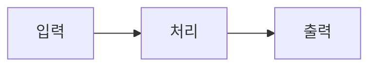
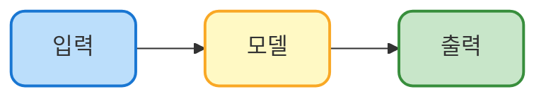
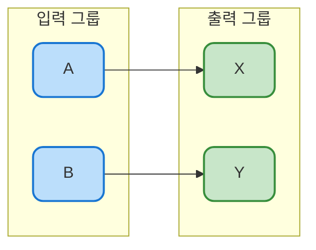
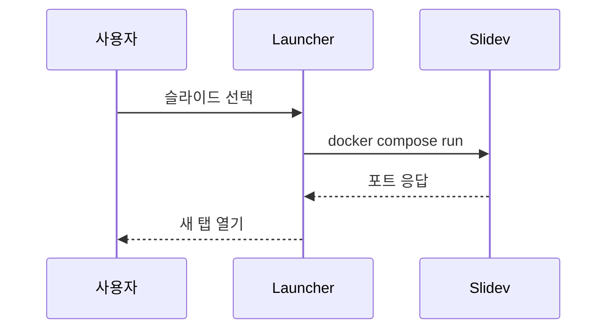

<style>
#slidev-goto-dialog { display: none !important; }
</style>

# Slidev 템플릿 둘러보기

slidev-theme-codecompose 로 만든 예시 덱

---
layout: table-of-contents
hideInToc: true
---

---
layout: section
hideInToc: false
---

# Part 1 — 기본 마크다운

제목·본문·리스트·표·코드·인용

---

# 제목과 부제
## `#` 바로 다음에 `##`을 두면 부제처럼 렌더링됩니다

여기서부터가 본문입니다. 일부 테마는 `# 제목` 다음 첫 줄을 부제로 스타일링하므로, 본문이 부제처럼 보이지 않게 하려면 위와 같이 `##` 부제를 명시적으로 넣는 것이 좋습니다.

- 구조: **제목 → (부제) → 본문**
- 짧은 한 줄 설명이 부제가 되고, 그 아래로 본문이 이어집니다

---

# 리스트

### 일반 리스트

- 첫 번째 항목 — **굵게**, *기울임*, `inline code`
- 중첩도 가능
  - 하위 항목 A
  - 하위 항목 B
- 마지막 항목

### 번호 리스트

1. 첫 단계
2. 두 단계
3. 마지막 단계

---

# 표 — 기본

| 이름 | 역할 | 비고 |
| --- | --- | --- |
| Slidev | 프레젠테이션 엔진 | Vite 기반 |
| codecompose | 슬라이드 테마 | npm 패키지 |
| Docker | 격리된 실행 환경 | 본 템플릿에 포함 |
| Mermaid | 다이어그램 렌더러 | 코드 블록으로 작성 |

---

# 표 — 정렬

| 항목 | 왼쪽 정렬 | 가운데 정렬 | 오른쪽 정렬 |
| :--- | :--- | :---: | ---: |
| A | 짧은 텍스트 | 중간 | 100 |
| B | 조금 더 긴 텍스트 | 가운데 | 2,500 |
| C | 가장 긴 설명 텍스트입니다 | 정렬 | 99,999 |

구분자 행의 `:` 위치로 정렬을 지정합니다 (`:---` 왼쪽, `:---:` 가운데, `---:` 오른쪽).

---

# 코드 블록

```python
def fibonacci(n: int) -> int:
    if n < 2:
        return n
    return fibonacci(n - 1) + fibonacci(n - 2)

print([fibonacci(i) for i in range(10)])
```

```javascript
const fib = (n) => (n < 2 ? n : fib(n - 1) + fib(n - 2));
console.log([...Array(10)].map((_, i) => fib(i)));
```

```bash
docker compose up -d launcher
```

언어를 명시하면 자동 syntax highlighting이 적용됩니다.

---

# 인용과 강조

> 인용 블록은 보조 설명, 발췌, 핵심 메시지 강조에 좋습니다.  
> 여러 줄에 걸쳐 작성해도 한 블록으로 묶입니다.

본문에서 **굵게**, *기울임*, `inline code`, ~~취소선~~ 사용 가능.

키워드 강조 예시: **핵심**, *주의*, `value`

---
layout: section
hideInToc: false
---

# Part 2 — 레이아웃

cover · cols · bullets · statement · outro 등

---

# default (`layout:` 생략)

`layout:` 을 명시하지 않으면 기본 레이아웃이 적용됩니다. 일반적인 제목 + 본문에 가장 많이 씁니다.

- 제목은 슬라이드 상단
- 본문은 그 아래로 좌측 정렬
- 가장 자주 쓰이는 패턴

---
layout: cols
---

# cols — 좌우 두 칸

::left::

### 왼쪽 칸

좌측에 표시할 내용을 정리합니다.

- 항목 A
- 항목 B
- 항목 C

```python
print("left side")
```

::right::

### 오른쪽 칸

우측에 비교할 내용을 둡니다.

| 키 | 값 |
| --- | --- |
| 좌 | A |
| 우 | B |

> 좌우 비교가 필요할 때 유용

---
layout: bullets
---

# bullets — 불릿 강조

- 핵심 메시지를 큰 글씨로 보여줄 때
- 한 줄에 하나씩, 요점만 간결하게
- 너무 많이 넣지 말고 4~6개 이내가 적당

---
layout: statement
---

# 한 줄로 강조

큰 글씨로 핵심 메시지를 전달하는 레이아웃

---
layout: statement
---

https://sli.dev/themes/gallery

링크나 URL을 강조하고 싶을 때

---
layout: section
hideInToc: false
---

# Part 3 — Mermaid 다이어그램

플로우차트·시퀀스·스타일링

---

# Mermaid — 기본



코드 블록을 ` ```mermaid ` 로 열면 자동으로 렌더링됩니다.

방향 옵션: `LR` (좌→우), `TB` (위→아래), `RL`, `BT`

---

# Mermaid — 스타일링



각 노드에 `style <id> fill:#...,stroke:#...,stroke-width:2px,rx:10,ry:10` 으로 색·테두리·둥근 모서리 지정.

---

# Mermaid — subgraph + scale



- `subgraph 이름["라벨"]` 로 노드 그룹화
- ` ```mermaid {scale: 0.8} ` 로 다이어그램 크기 조절

---

# Mermaid — 시퀀스 다이어그램



시간 흐름에 따른 상호작용을 표현할 때 적합.

---
layout: section
hideInToc: false
---

# Part 4 — LaTeX 수식

KaTeX 기반 수식 렌더링

---

# Inline 수식

본문 중간에 `$...$` 로 감싸면 inline 수식.

예: 에너지-질량 등가는 $E = mc^2$, 확률은 $p \in [0, 1]$, 인덱스 합은 $\sum_{i=1}^{n} x_i$.

조건도 자연스럽게: $\alpha \geq 0$ 이고 $\beta < 1$ 일 때 $\alpha + \beta \neq 1$.

---

# Block 수식

블록 수식은 `$$...$$` 로 감쌉니다.

$$\text{output} = f\left(\sum_{i=1}^{n} w_i \cdot x_i + b\right)$$

여러 줄 정렬은 `aligned` 환경으로:

$$
\begin{aligned}
y &= f(x) \\
  &= \sigma(Wx + b) \\
  &= \frac{1}{1 + e^{-(Wx + b)}}
\end{aligned}
$$

---
layout: section
hideInToc: false
---

# Part 5 — 이미지 & iframe

폴더 구조와 정적 자산 참조

---

# 폴더 구조

`slides/<deck>/index.md` 패턴에서는 같은 폴더의 `public/` 이 자산 루트가 됩니다.

```text
slides/example/
├── index.md
└── public/
    ├── img/
    │   └── logo.png
    └── demos/
        └── hello.html
```

슬라이드에서는 `/img/logo.png`, `/demos/hello.html` 처럼 **루트(`/`) 기준** 으로 참조합니다.

---

# 이미지 삽입

마크다운 문법:

```markdown

```

HTML로 크기·위치 조절:

```html

```

> Slidev는 [UnoCSS](https://unocss.dev) 유틸리티를 지원해서 `w-64`(폭 16rem), `mx-auto`(좌우 가운데), `rounded-lg`, `shadow-md` 같은 클래스를 바로 쓸 수 있습니다.

---

# iframe 임베드

`public/demos/hello.html` 같은 자체 데모를 끼워넣을 때:

```html
<iframe
    src="/demos/hello.html"
    class="w-full h-full" />
```

캡션 링크와 함께:

```html
<iframe src="/demos/hello.html" class="w-full h-full" />

<a href="/demos/hello.html" target="_blank">새 창에서 열기</a>
```

---
layout: section
hideInToc: false
---

# Part 6 — 테마 & 프론트매터

themeConfig 와 슬라이드별 옵션

---

# 덱 전체 설정 (첫 슬라이드 frontmatter)

```yaml
---
theme: codecompose
layout: cover
coverAuthor: Your Name
coverAuthorUrl: https://example.com
coverDate: "2026-01-01"
version: 1
title: '슬라이드 제목'
transition: slide-left
mdc: true

defaults:
  hideInToc: true          # 모든 슬라이드를 기본적으로 TOC에서 숨김

themeConfig:
  paginationX: r           # 페이지 번호 위치 (l/r)
  paginationY: b           # (t/b)
  paginationPagesDisabled: [1]  # 표지에는 번호 숨김
  brandColor: "#0891b2"    # 강조 색상
  sectionNav: true         # 섹션 자동 내비게이션
  logo: /img/logo.png      # 우상단 로고 (선택)
  logoSize: 2rem
---
```

---

# 슬라이드별 옵션

각 슬라이드 앞 frontmatter로 개별 옵션 지정:

```yaml
---
layout: cols
hideInToc: false      # 전역 defaults 오버라이드 (이 슬라이드는 TOC에 노출)
transition: fade      # 이 슬라이드만 다른 전환
class: text-center    # 추가 CSS 클래스
---
```

자주 쓰는 layout: `cover`, `section`, `cols`, `bullets`, `statement`, `outro`, `table-of-contents`

---

# 직접 HTML & CSS

`<style>` 블록과 HTML 태그를 그대로 쓸 수 있습니다.

```markdown
<style>
.highlight { color: #0891b2; font-weight: bold; }
</style>

<div class="highlight">강조 텍스트</div>
```

전역에서 특정 UI를 숨기는 트릭 (예: goto 다이얼로그):

```html
<style>
#slidev-goto-dialog { display: none !important; }
</style>
```

간격 조정: `<br>` 한 줄

---
layout: section
hideInToc: false
---

# Part 7 — 정리

핵심 요약과 다음 단계

---

# 자주 쓰는 레이아웃 정리

| 레이아웃 | 용도 |
| :--- | :--- |
| (생략) | 기본 제목 + 본문 |
| `cover` | 표지 (`coverAuthor`, `coverDate` 등 메타) |
| `table-of-contents` | 자동 목차 |
| `section` | 파트/섹션 구분 |
| `cols` | 좌우 두 칸 (`::left::` / `::right::`) |
| `bullets` | 큰 글씨 불릿 |
| `statement` | 큰 글씨 한 줄 |
| `outro` | 마무리 |

---
layout: bullets
---

# 다음 단계

- `slides/<my-deck>/index.md` 로 새 덱 시작
- 같은 폴더의 `public/` 에 이미지·HTML 자산 배치
- [Slidev 공식 문서](https://sli.dev/) 에서 더 많은 기능 확인
- [codecompose 테마](https://www.npmjs.com/package/slidev-theme-codecompose) 에서 추가 옵션 확인

---
layout: outro
---

# 끝

이 파일을 복사해서 새 덱을 시작하세요

[Slidev](https://sli.dev) · [codecompose](https://www.npmjs.com/package/slidev-theme-codecompose)
